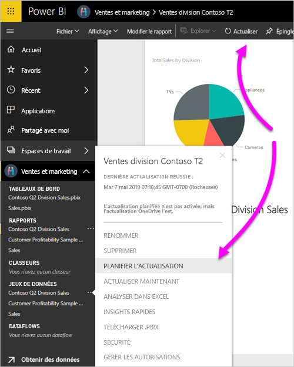

# Actualiser un jeu de données stocké sur OneDrive ou SharePoint Online
L’importation de fichiers à partir de OneDrive ou de SharePoint Online dans le service Power BI est un excellent moyen de s’assurer que le travail effectué dans Power BI Desktop reste synchronisé avec le service Power BI.

## Avantages du stockage d’un fichier Power BI Desktop sur OneDrive ou SharePoint Online
Quand vous stockez un fichier Power BI Desktop sur OneDrive ou SharePoint Online, toutes les données que vous avez chargées dans le modèle de votre fichier sont importées dans le jeu de données. Les rapports que vous avez créés dans le fichier sont chargés dans **Rapports** dans le service Power BI. Supposons que vous apportiez des modifications à votre fichier sur OneDrive ou SharePoint Online. Ces modifications peuvent inclure l’ajout de nouvelles mesures, la modification des noms de colonnes ou la modification de visualisations. Une fois que vous enregistrez le fichier, le service Power BI se synchronise avec ces modifications, généralement dans un délai d’une heure environ.

Vous pouvez effectuer une actualisation manuelle unique des données directement dans Power BI Desktop en sélectionnant **Actualiser** dans le ruban **Accueil**. Lorsque vous sélectionnez **Actualiser** ici, vous actualisez le modèle du fichier avec les données mises à jour provenant de la source de données d’origine. Ce type d’actualisation a entièrement lieu à partir de l’application Power BI Desktop elle-même. Il est différent d’une actualisation manuelle ou planifiée dans Power BI, et il est important de comprendre la différence.

Lorsque vous importez votre fichier Power BI Desktop à partir de OneDrive ou SharePoint Online, vous chargez des données et des informations sur le modèle dans un jeu de données dans Power BI. Vous souhaiterez actualiser le jeu de données dans le service Power BI parce que c’est sur cela que vos rapports sont basés. Étant donné que les sources de données sont externes, vous pouvez actualiser manuellement le jeu de données à l’aide de la commande **Actualiser maintenant**, ou configurer une planification de l’actualisation à l’aide de la commande **Planifier l’actualisation**. 

Lorsque vous actualisez le jeu de données, Power BI ne se connecte pas au fichier sur OneDrive ou SharePoint Online pour interroger les données mises à jour. Il utilise les informations du jeu de données pour se connecter directement aux sources de données et interroger des données mises à jour. Il charge ensuite ces données dans le jeu de données. Ces données actualisées dans le jeu de données ne sont pas re-synchronisées dans le fichier sur OneDrive ou SharePoint Online.

## Qu’est-ce qui est pris en charge ?
Power BI prend en charge les fonctionnalités **Actualiser maintenant** et **Planifier l’actualisation** pour des jeux de données créés à partir de fichiers Power BI Desktop importés d’un lecteur local où vous utilisez **Obtenir des données** ou **Éditeur de requête** pour vous connecter aux sources de données suivantes, à partir desquelles vous chargez des données.

> [!NOTE]
> L’actualisation OneDrive pour les jeux de données de connexion active est prise en charge. Toutefois, le fait de modifier le jeu de données de connexion active, d’un jeu de données à un autre dans un rapport déjà publié, n’est pas pris en charge dans le scénario d’actualisation OneDrive.

### Power BI Gateway - Personal
* Toutes les sources de données en ligne affichées sous **Obtenir des données** dans l’**éditeur de requête** et dans Power BI Desktop.
* Toutes les sources de données locales affichées dans l’**éditeur de requête** et la section **Obtenir des données** de Power BI Desktop, excepté pour HDFS et Microsoft Exchange.

<!-- Refresh Data sources-->
[!INCLUDE [refresh-datasources](./includes/refresh-datasources.md)]

> [!NOTE]
> Une passerelle doit être installée et en cours d’exécution pour que Power BI puisse se connecter aux sources de données locales et actualiser le jeu de données.
> 
> 

## OneDrive ou OneDrive Entreprise. Quelle est la différence ?
Si vous avez un compte OneDrive personnel et OneDrive Entreprise, vous devriez conserver dans OneDrive Entreprise tous les fichiers que vous souhaitez importer dans Power BI. Voici pourquoi : vous utilisez probablement deux comptes différents pour vous connecter à ces OneDrive.

Il est facile de vous connecter à OneDrive Entreprise dans Power BI, car votre compte Power BI est souvent le même que votre compte OneDrive Entreprise. Avec un OneDrive personnel, vous vous connectez habituellement avec un autre [compte Microsoft](https://account.microsoft.com).

Lorsque vous vous connectez avec votre compte Microsoft, veillez à activer l’option **Maintenir la connexion**. Power BI peut alors synchroniser les modifications que vous apportez au fichier dans Power BI Desktop avec des jeux de données dans Power BI.

Si vous avez modifié vos informations d’identification Microsoft, vous ne pouvez pas synchroniser les modifications entre votre fichier sur OneDrive et le jeu de données dans Power BI. Vous devez vous connecter à OneDrive pour importer à nouveau votre fichier.

## Comment planifier l’actualisation ?
Lorsque vous configurez une planification d’actualisation, Power BI se connecte directement aux sources de données. Power BI utilise les informations de connexion et les informations d’identification dans le jeu de données pour interroger les données mises à jour. Ensuite, Power BI charge les données mises à jour dans le jeu de données. Il met ensuite à jour les visualisations des rapports et les tableaux de bord sur la base de ce jeu de données dans le service Power BI.

Pour plus d’informations sur la configuration d’une actualisation planifiée, consultez [Configurer une actualisation planifiée](refresh-scheduled-refresh.md).

## Quand des problèmes apparaissent
Lorsque des problèmes surgissent, c’est généralement parce que Power BI ne peut pas se connecter à des sources de données. Les choses peuvent également mal se passer si le jeu de données tente de se connecter à une source de données locale, mais que la passerelle est hors connexion. Pour éviter ces problèmes, assurez-vous que Power BI peut se connecter à des sources de données. Essayez de vous connecter à vos sources de données dans **Informations d’identification de la source de données**. Parfois, le mot de passe que vous utilisez pour vous connecter à une source de données change, ou Power BI est déconnecté d’une source de données.

Lorsque vous enregistrez vos modifications au fichier Power BI Desktop sur OneDrive et que vous ne voyez pas ces modifications dans Power BI après environ une heure, cela peut être dû au fait que Power BI ne peut pas se connecter à votre OneDrive. Réessayez de vous connecter au fichier sur OneDrive. Si vous êtes invité à vous connecter, veillez à activer l’option **Maintenir la connexion**. Étant donné que Power BI n’a pas pu se connecter à votre OneDrive pour se synchroniser avec votre fichier, il se peut que vous deviez réimporter celui-ci.

Veillez à laisser l’option **M’envoyer une notification d’échec d’actualisation** activée. Vous voudrez en effet probablement être immédiatement informé en cas d’échec d’une actualisation planifiée.

## Résolution des problèmes
Parfois, l’actualisation des données peut ne pas fonctionner comme prévu. En règle générale, vous irez vers des problèmes d’actualisation des données si vous êtes connecté avec une passerelle. Consultez les articles de résolution des problèmes de passerelle qui présentent des outils et les problèmes connus.

[Résolution des problèmes de passerelle de données locale](service-gateway-onprem-tshoot.md)

[Résolution des problèmes liés à Power BI Gateway - Personal](service-admin-troubleshooting-power-bi-personal-gateway.md)

D’autres questions ? Essayez de d’interroger la [Communauté Power BI](https://community.powerbi.com/).

