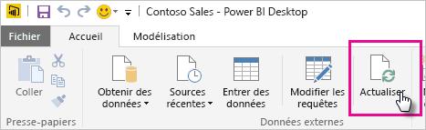
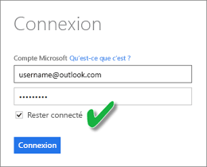

# Actualiser un jeu de données stocké sur OneDrive ou SharePoint Online
L’importation de fichiers à partir de OneDrive ou de SharePoint Online dans le service Power BI est un excellent moyen de s’assurer que le travail effectué dans **Power BI Desktop** reste synchronisé avec le service Power BI.

## Avantages du stockage d’un fichier Power BI Desktop sur OneDrive ou SharePoint Online
Quand vous stockez un fichier **Power BI Desktop** sur OneDrive ou SharePoint Online, toutes les données que vous avez chargées dans le modèle de votre fichier sont importées dans le jeu de données, et tous les rapports que vous avez créés dans le fichier sont chargés dans **Rapports** dans le service Power BI. Quand vous apportez des modifications à votre fichier sur OneDrive ou SharePoint Online, par exemple, en ajoutant de nouvelles mesures, en changeant des noms de colonne ou en éditant des visualisations, lors de l’enregistrement, ces modifications sont également mises à jour dans le service Power BI, généralement après environ une heure.

Vous pouvez effectuer une actualisation manuelle unique des données directement dans Power BI Desktop en sélectionnant Actualiser dans le ruban Accueil. Lorsque vous sélectionnez Actualiser ici, les données du modèle du *fichier* sont actualisées avec les données mises à jour à partir de la source de données d’origine. Ce type d’actualisation, entièrement à partir de l’application Power BI Desktop elle-même, diffère d’une actualisation manuelle ou planifiée dans Power BI et il est important de comprendre cette différence.

Lorsque vous importez votre fichier Power BI Desktop à partir de OneDrive ou SharePoint Online, les données et d’autres informations sur le modèle sont chargées dans un jeu de données dans Power BI. Dans le service Power BI (pas dans Power BI Desktop), vous actualisez les données du jeu de données parce qu’il s’agit de ce sur quoi vos rapports sont basés dans le service Power BI. Étant donné que les sources de données sont externes, vous pouvez actualiser manuellement le jeu de données à l’aide de la commande **Actualiser maintenant**, ou configurer une planification de l’actualisation à l’aide de la commande **Planifier l’actualisation**.

Lorsque vous actualisez le jeu de données, Power BI ne se connecte pas au fichier sur OneDrive ou SharePoint Online pour interroger les données mises à jour. Il utilise les informations du jeu de données pour se connecter directement aux sources de données afin d’interroger les données mises à jour qu’il charge ensuite dans le jeu de données. Ces données actualisées dans le jeu de données ne sont pas re-synchronisées dans le fichier sur OneDrive ou SharePoint Online.

## Qu’est-ce qui est pris en charge ?
Dans Power BI, les fonctionnalités Actualiser maintenant et Planifier l’actualisation sont prises en charge pour des jeux de données créés à partir de fichiers Power BI Desktop importés d’un lecteur local où Obtenir des données/Éditeur de requête est utilisé pour se connecter aux données des sources de données suivantes et pour les charger :

### Power BI Gateway - Personal
* Toutes les sources de données en ligne affichées dans l’éditeur de requête et Obtenir des données dans Power BI Desktop.
* Toutes les sources de données locales affichées dans l’éditeur de requête et Obtenir des données dans Power BI Desktop, excepté pour HDFS (Hadoop Distributed File System) et Microsoft Exchange.

<!-- Refresh Data sources-->
[!INCLUDE [refresh-datasources](./includes/refresh-datasources.md)]

> [!NOTE]
> Une passerelle doit être installée et en cours d’exécution pour que Power BI puisse se connecter aux sources de données locales et actualiser le jeu de données.
> 
> 

## OneDrive ou OneDrive Entreprise. Quelle est la différence ?
Si vous avez un compte OneDrive personnel et OneDrive Entreprise, il est recommandé de conserver dans OneDrive Entreprise tous les fichiers que vous souhaitez importer dans Power BI. Voici pourquoi : vous utilisez probablement deux comptes différents pour vous connecter à ces OneDrive.

La connexion à OneDrive Entreprise dans Power BI est généralement transparente, car le compte que vous utilisez pour vous connecter à Power BI est souvent le même que celui que vous utilisez pour vous connecter à OneDrive Entreprise. En revanche, avec un OneDrive personnel, il est probable que vous vous connectiez avec un autre [compte Microsoft](https://account.microsoft.com).

Lorsque vous vous connectez avec votre compte Microsoft, veillez à activer l’option Maintenir la connexion. Power BI peut alors synchroniser les modifications que vous apportez au fichier dans Power BI Desktop avec des jeux de données dans Power BI  
    

Si vous apportez à votre fichier sur OneDrive des modifications qui ne peuvent pas être synchronisées avec un jeu de données ou des rapports dans Power BI parce que les informations d’identification de votre compte Microsoft pourraient avoir changé, vous devez vous connecter à votre fichier et l’importer à nouveau à partir de votre OneDrive personnel.

## Comment planifier l’actualisation ?
Lorsque vous configurez une planification de l’actualisation, Power BI se connecte directement aux sources de données en utilisant les informations de connexion et les informations d’identification du jeu de données pour interroger les données mises à jour, puis charger les données actualisées dans le jeu de données. Les visualisations des rapports et tableaux de bord basés sur ce jeu de données dans le service Power BI sont également mises à jour.

Pour plus d’informations sur la façon de planifier l’actualisation, consultez [Planifier l’actualisation](refresh-scheduled-refresh.md).

## Quand des problèmes apparaissent
Quand des problèmes apparaissent, ceux-ci sont souvent dus au fait que Power BI ne parvient pas à se connecter aux sources de données ou, si le jeu de données se connecte à une source de données locale, que la passerelle est hors connexion. Veuillez donc vous assurer que Power BI peut se connecter aux sources de données. Si vous modifiez le mot de passe que vous utilisez pour vous connecter à une source de données ou que Power BI est déconnecté d’une source de données, essayez de vous reconnecter à vos sources de données dans Informations d’identification de la source de données.

Lorsque vous apportez des modifications au fichier Power BI Desktop sur OneDrive, puis les enregistrez, si ces modifications ne sont pas reflétées dans Power BI après environ une heure, cela peut être dû au fait que Power BI ne peut pas se connecter à votre OneDrive. Réessayez de vous connecter au fichier sur OneDrive. Si vous êtes invité à vous connecter, veillez à activer l’option Maintenir la connexion. Étant donné que Power BI n’a pas pu se connecter à votre OneDrive pour se synchroniser avec votre fichier, il se peut que vous deviez réimporter celui-ci.

Veillez à laisser l’option **M’envoyer une notification d’échec d’actualisation** activée. Vous voudrez en effet probablement être immédiatement informé en cas d’échec d’une actualisation planifiée.

## Résolution des problèmes
Parfois, l’actualisation des données peut ne pas fonctionner comme prévu. Cela est généralement dû à un problème avec une passerelle. Consultez les articles de résolution des problèmes de passerelle qui présentent des outils et les problèmes connus.

[Résolution des problèmes de passerelle de données locale](service-gateway-onprem-tshoot.md)

[Résolution des problèmes liés à Power BI Gateway - Personal](service-admin-troubleshooting-power-bi-personal-gateway.md)

D’autres questions ? [Essayez d’interroger la communauté Power BI](http://community.powerbi.com/)

