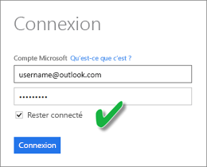
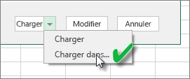
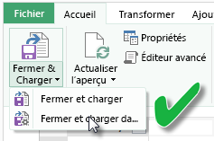
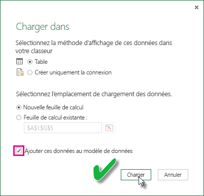

# Actualiser un jeu de données créé à partir d’un classeur Excel sur OneDrive ou SharePoint Online
Vous pouvez importer des classeurs Excel stockés sur votre ordinateur local ou dans le stockage cloud (OneDrive Entreprise ou SharePoint Online). Nous allons examiner les avantages de l’utilisation du stockage cloud pour vos fichiers Excel. Pour plus d’informations sur l’importation des fichiers Excel dans Power BI, consultez [Obtenir des données de classeurs Excel](service-excel-workbook-files.md).

## Quels sont les avantages ?
L’importation de fichiers à partir de OneDrive ou de SharePoint Online est un excellent moyen de s’assurer que le travail effectué dans Excel reste synchronisé avec le service Power BI. Toutes les données que vous avez chargées dans le modèle de votre fichier sont importées dans le jeu de données, et tous les rapports que vous avez créés dans le fichier sont chargés dans Rapports dans Power BI. Si vous apportez des modifications à votre fichier sur OneDrive ou SharePoint Online, par exemple, en ajoutant de nouvelles mesures, en changeant des noms de colonne ou en éditant des visualisations, lors de l’enregistrement, ces modifications sont également mises à jour dans Power BI, généralement après environ une heure.

Lorsque vous importez un classeur Excel à partir de votre compte OneDrive personnel, toutes les données du classeur, telles que les tables figurant dans les feuilles de calcul et/ou les données chargées dans le modèle de données Excel et dans la structure de celui-ci, sont importées dans un nouveau jeu de données dans Power BI. Toutes les visualisations de Power View sont recréées dans des rapports. Power BI se connecte automatiquement au classeur sur OneDrive ou SharePoint Online environ toutes les heures pour vérifier s’il y a des mises à jour. Si le classeur a été modifié, Power BI actualise le jeu de données et les rapports dans le service Power BI.

Vous pouvez actualiser le jeu de données dans le service Power BI. Lorsque vous actualisez manuellement ou planifiez une actualisation du jeu de données, Power BI se connecte directement aux sources de données externes pour interroger les données mises à jour qu’il charge ensuite dans le jeu de données. L’actualisation d’un jeu de données à partir de Power BI n’actualise pas les données du classeur sur OneDrive ou SharePoint Online. 

## Qu’est-ce qui est pris en charge ?
Dans Power BI, les fonctionnalités Actualiser maintenant et Planifier l’actualisation sont prises en charge pour des jeux de données créés à partir de fichiers Power BI Desktop importés d’un lecteur local où Obtenir des données/Éditeur de requête est utilisé pour se connecter aux données des sources de données suivantes et pour les charger :  

### Power BI Gateway - Personal
* Toutes les sources de données en ligne affichées dans l’éditeur de requête et Obtenir des données dans Power BI Desktop.
* Toutes les sources de données locales affichées dans l’éditeur de requête et Obtenir des données dans Power BI Desktop, excepté pour HDFS (Hadoop Distributed File System) et Microsoft Exchange.

<!-- Refresh Data sources-->
[!INCLUDE [refresh-datasources](./includes/refresh-datasources.md)]

> [!NOTE]
> Une passerelle doit être installée et en cours d’exécution pour que Power BI puisse se connecter aux sources de données locales et actualiser le jeu de données.
> 
> 

## OneDrive ou OneDrive Entreprise. Quelle est la différence ?
Si vous avez un compte OneDrive personnel et OneDrive Entreprise, il est recommandé de conserver dans OneDrive Entreprise tous les fichiers que vous souhaitez importer dans Power BI. Voici pourquoi : vous utilisez probablement deux comptes différents pour vous connecter à ces OneDrive.

La connexion à OneDrive Entreprise dans Power BI est généralement transparente, car le compte que vous utilisez pour vous connecter à Power BI est souvent le même que celui que vous utilisez pour vous connecter à OneDrive Entreprise. En revanche, avec un OneDrive personnel, il est probable que vous vous connectiez avec un autre [compte Microsoft](http://www.microsoft.com/account/default.aspx).

Lorsque vous vous connectez avec votre compte Microsoft, veillez à activer l’option Maintenir la connexion. Power BI peut alors synchroniser les modifications que vous apportez au fichier dans Power BI Desktop avec des jeux de données dans Power BI  
    

Si vous apportez à votre fichier sur OneDrive des modifications qui ne peuvent pas être synchronisées avec un jeu de données ou des rapports dans Power BI parce que les informations d’identification de votre compte Microsoft pourraient avoir changé, vous devez vous connecter à votre fichier et l’importer à nouveau à partir de votre OneDrive personnel.

## Options de connexion à un fichier Excel
Lorsque vous vous connectez à un classeur Excel dans OneDrive Entreprise ou SharePoint Online, vous pouvez récupérer le contenu du classeur dans Power BI de deux manières.

[**Importer des données Excel dans Power BI**](service-excel-workbook-files.md#import-or-connect-to-an-excel-workbook-from-power-bi) : lorsque vous importez un classeur Excel à partir de votre OneDrive Entreprise ou SharePoint Online, il fonctionne comme décrit ci-dessus.

[**Se connecter, gérer et afficher Excel dans Power BI**](service-excel-workbook-files.md#one-excel-workbook--two-ways-to-use-it) : lorsque vous utilisez cette option, vous créez une connexion directe de Power BI à votre classeur sur OneDrive Entreprise ou SharePoint Online.

Lorsque vous vous connectez à un classeur Excel de cette façon, aucun jeu de données n’est créé dans Power BI. Toutefois, le classeur s’affiche dans le service Power BI sous Rapports avec une icône Excel en regard de son nom. Contrairement à Excel Online, lorsque vous vous connectez à votre classeur à partir de Power BI, si votre classeur comprend des connexions à des sources de données externes qui chargent des données dans le modèle de données Excel, vous pouvez configurer une planification de l’actualisation.

Lorsque vous configurez une planification de l’actualisation de cette façon, la seule différence est que les données actualisées sont stockées dans le modèle de données du classeur sur OneDrive ou SharePoint Online, plutôt que dans un jeu de données dans Power BI.

## Comment m’assurer que les données ont été chargées dans le modèle de données Excel ?
Lorsque vous utilisez Power Query (Obtenir et Transformer les données dans Excel 2016) pour vous connecter à une source de données, vous pouvez charger les données dans plusieurs emplacements. Pour vous assurer que vous chargez les données dans le modèle de données, vous devez sélectionner l’option **Ajouter ces données au modèle de données** dans la boîte de dialogue **Charger dans** .

> [!NOTE]
> Les images présentées ici correspondent à Excel 2016.
> 
> 

Dans le **navigateur**, cliquez sur **Charger dans...**  
    

Vous pouvez aussi cliquer sur **Modifier** dans le navigateur pour ouvrir l’éditeur de requête. Dans celui-ci, vous pouvez cliquer sur **Fermer et charger dans...**  
    

Ensuite, dans la fenêtre **Charger dans**, veillez à sélectionner **Ajouter ces données au modèle de données**.  
    

### Que se passe-t-il si j’utilise l’option Données externes dans Power Pivot ?
Aucun problème. Lorsque vous utilisez Power Pivot pour vous connecter à des données et les interroger à partir d’une source de données locale ou en ligne, les données sont automatiquement chargées dans le modèle de données.

## Comment planifier l’actualisation ?
Lorsque vous configurez une planification de l’actualisation, Power BI se connecte directement aux sources de données en utilisant les informations de connexion et les informations d’identification du jeu de données pour interroger les données mises à jour, puis charger les données actualisées dans le jeu de données. Les visualisations des rapports et tableaux de bord basés sur ce jeu de données dans le service Power BI sont également mises à jour.

Pour plus d’informations sur la façon de planifier l’actualisation, consultez [Planifier l’actualisation](refresh-scheduled-refresh.md).

## Quand des problèmes apparaissent
Quand des problèmes apparaissent, ceux-ci sont souvent dus au fait que Power BI ne parvient pas à se connecter aux sources de données ou, si le jeu de données se connecte à une source de données locale, que la passerelle est hors connexion. Veuillez donc vous assurer que Power BI peut se connecter aux sources de données. Si vous modifiez le mot de passe que vous utilisez pour vous connecter à une source de données ou que Power BI est déconnecté d’une source de données, essayez de vous reconnecter à vos sources de données dans Informations d’identification de la source de données.

Veillez à laisser l’option **M’envoyer une notification d’échec d’actualisation**activée. Vous voudrez en effet probablement être immédiatement informé en cas d’échec d’une actualisation planifiée.

## Remarques importantes
\* L’actualisation n’est pas prise en charge pour les flux OData connectés à Power Pivot et interrogés à partir de Power Pivot. En cas d’utilisation d’un flux OData comme source de données, utilisez Power Query.

## Résolution des problèmes
Parfois, l’actualisation des données peut ne pas fonctionner comme prévu. Cela est généralement dû à un problème avec une passerelle. Consultez les articles de résolution des problèmes de passerelle qui présentent des outils et les problèmes connus.

[Résolution des problèmes de passerelle de données locale](service-gateway-onprem-tshoot.md)

[Résolution des problèmes liés à Power BI Gateway - Personal](service-admin-troubleshooting-power-bi-personal-gateway.md)

D’autres questions ? [Posez vos questions à la communauté Power BI](http://community.powerbi.com/)

