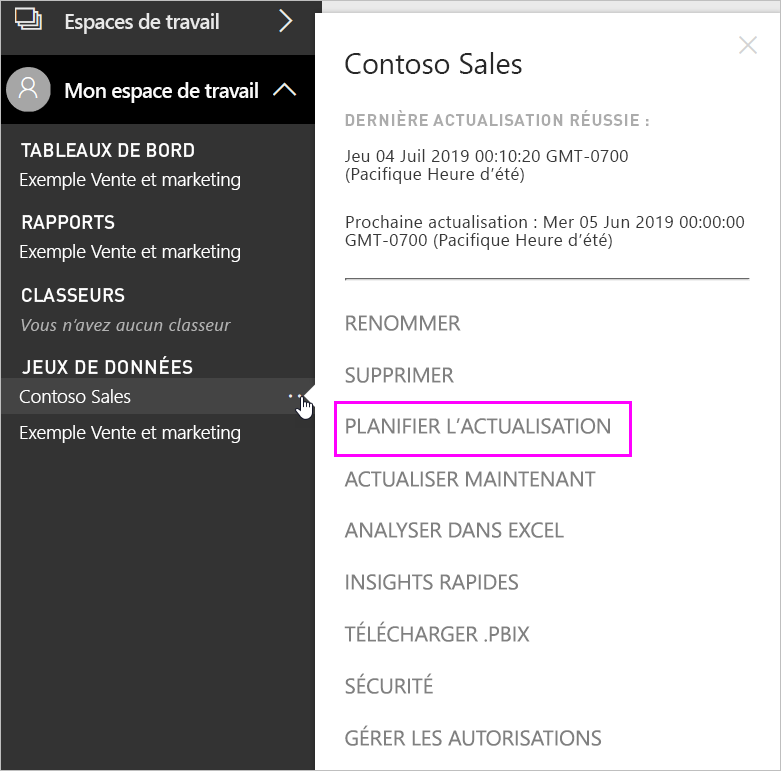
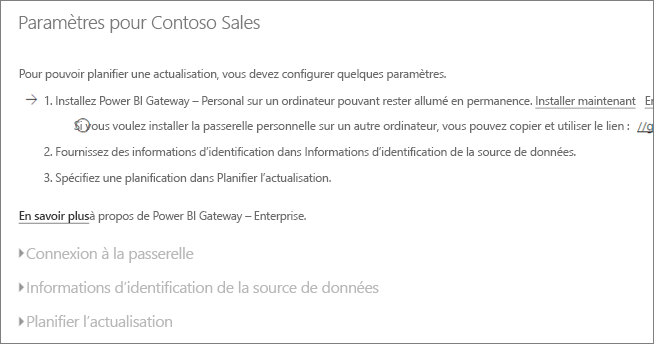
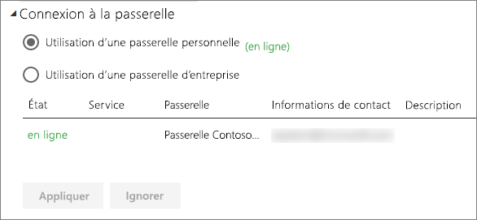
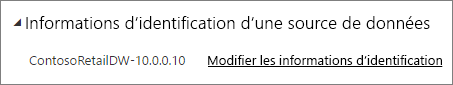
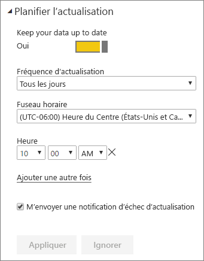

# Configurer une actualisation planifiée

>[!NOTE]
>Après deux mois d’inactivité, l’actualisation planifiée de votre jeu de données est suspendue. Pour plus d’informations, consultez [*Actualisation planifiée*](#scheduled-refresh) plus loin dans cet article.

Cet article décrit les options disponibles pour l’actualisation planifiée de la [passerelle de données locale (mode personnel)](service-gateway-personal-mode.md) et la [passerelle de données locale](service-gateway-onprem.md). Vous spécifiez les options d’actualisation dans les zones suivantes du service Power BI : **Connexion à la passerelle**, **Informations d’identification de la source de données** et **Actualisation planifiée**. Nous allons examiner chacune de ces options. Pour plus d’informations sur l’actualisation des données,notamment les limitations des planifications d’actualisation, consultez [Actualisation des données](refresh-data.md#data-refresh).

Pour accéder à l’écran **Actualisation planifiée** :

1. Dans le volet de navigation, sous **Jeux de données**, sélectionnez **Autres options** (...) en regard d’un jeu de données listé.
2. Sélectionnez **Planifier l’actualisation**.

    

## Connexion à la passerelle

Vous voyez ici différentes options, selon que vous disposez d’une passerelle personnelle ou d’entreprise, en ligne et disponible.

Si aucune passerelle n’est disponible, vous verrez que la **Connexion à la passerelle** est désactivée. Vous voyez également un message indiquant comment installer la passerelle personnelle.

Si vous avez configuré une passerelle personnelle, celle-ci sera disponible à la sélection si elle est en ligne. Si elle n’est pas disponible, elle apparaît hors connexion.

Vous pouvez également sélectionner la passerelle d’entreprise s’il y en a une disponible pour vous. La passerelle d’entreprise ne sera disponible que si votre compte figure sous l’onglet **Utilisateurs** de la source de données configurée pour une passerelle donnée.

## Informations d’identification de la source de données

### Power BI Gateway - Personal

Si vous utilisez la passerelle personnelle pour actualiser des données, vous devez fournir les informations d’identification utilisées pour la connexion à la source de données back-end. Si vous vous êtes connecté à un pack de contenu à partir d’un service en ligne, les informations d’identification que vous avez entrées pour vous connecter sont reportées pour l’actualisation planifiée.

Il vous est seulement demandé de vous connecter aux sources de données la première fois que vous utilisez l’actualisation sur ce jeu de données. Une fois vos informations d’identification entrées, celles-ci sont conservées avec le jeu de données.

> [!NOTE]
> Selon la méthode d’authentification employée, si le mot de passe que vous utilisez pour vous connecter à une source de données arrive à expiration ou est modifié, vous devez également le modifier pour la source de données dans **Informations d’identification de la source de données**.

Si des problèmes se présentent, il est fort probable que la passerelle soit hors connexion : soit parce qu’elle n’a pas pu se connecter à Windows et qu’elle n’a pas pu démarrer le service, soit parce que Power BI n’a pas pu se connecter aux sources de données pour lancer une requête sur des données mises à jour. En cas d’échec de l’actualisation, examinez les paramètres du jeu de données. Si le service de passerelle est hors connexion, l’erreur s’affiche sous **État**. Si Power BI ne parvient pas à se connecter aux sources de données, une erreur s’affiche dans Informations d’identification de la source de données.

### Passerelle de données locale

Si vous utilisez la passerelle de données locale pour actualiser des données, il est inutile de fournir des informations d’identification, car elles sont définies pour la source de données par l’administrateur de la passerelle.

> [!NOTE]
> Lors de la connexion à SharePoint en local pour l’actualisation des données, Power BI prend uniquement en charge les mécanismes d’authentification *Anonyme*, *De base* et *Windows* (Kerberos/NTLM). Power BI ne prend pas en charge les mécanismes *ADFS* ou l’*authentification basée sur les formulaires* pour actualiser les données des sources de données SharePoint en local.

## Actualisation planifiée

La section **Actualisation planifiée** est là où vous définissez la fréquence et les plages horaires pour l’actualisation du jeu de données. Certaines sources de données ne nécessitent pas qu’une passerelle soit configurable pour l’actualisation. D’autres sources de données nécessitent une passerelle.

Pour configurer les paramètres, vous devrez définir le curseur **Tenir vos données à jour** sur **Actif**.

> [!NOTE]
> L’objectif est de lancer l’actualisation dans les 15 minutes qui suivent l’intervalle de temps prévu, mais un délai pouvant aller jusqu’à une heure peut survenir si le service ne peut pas allouer les ressources nécessaires plus tôt.

> [!NOTE]
> Après deux mois d’inactivité, l’actualisation planifiée de votre jeu de données est suspendue. Un jeu de données est considéré comme inactif lorsque aucun utilisateur n’a visité un tableau de bord ou un rapport basé sur le jeu de données. À ce stade, le propriétaire du jeu de données reçoit un e-mail indiquant que l’actualisation planifiée est en pause. La planification de l’actualisation du jeu de données s’affiche alors comme étant **désactivée**. Pour reprendre l’actualisation planifiée, il vous suffit de revenir sur un tableau de bord ou un rapport basé sur le jeu de données.

## Qu’est-ce qui est pris en charge ?

Certains jeux de données sont pris en charge sur différentes passerelles pour l’actualisation planifiée. Voici une référence pour comprendre ce qui est disponible.

### Power BI Gateway - Personal

**Power BI Desktop**

* Toutes les sources de données en ligne affichées sous **Obtenir des données** dans l’éditeur de requête et dans Power BI Desktop.
* Toutes les sources de données locales affichées dans l’éditeur de requête et la section **Obtenir des données** de Power BI Desktop, excepté pour HDFS et Microsoft Exchange.

**Excel**

* Toutes les sources de données en ligne affichées dans Power Query.
* Toutes les sources de données locales affichées dans Power Query, excepté pour HDFS (Hadoop Distributed File System) et Microsoft Exchange.
* Toutes les sources de données en ligne affichées dans Power Pivot.
* Toutes les sources de données locales affichées dans Power Pivot, excepté pour HDFS (Hadoop Distributed File System) et Microsoft Exchange.

> [!NOTE]
> Dans Excel 2016 et versions ultérieures, Power Query est maintenant listé dans la section **Données** du ruban, sous **Obtenir et transformer des données**.

### Power BI Gateway

Pour plus d’informations sur les sources de données prises en charge, consultez [Sources de données Power BI](power-bi-data-sources.md).

## Résolution des problèmes
Parfois, l’actualisation des données peut ne pas fonctionner comme prévu. Cela est généralement dû à un problème avec une passerelle. Consultez les articles de résolution des problèmes de passerelle qui présentent des outils et les problèmes connus.

- [Résolution des problèmes de passerelle de données locale](service-gateway-onprem-tshoot.md)
- [Résolution des problèmes liés à Power BI Gateway - Personal](service-admin-troubleshooting-power-bi-personal-gateway.md)

## Étapes suivantes

- [Actualisation des données dans Power BI](refresh-data.md)  
- [Power BI Gateway - Personal](service-gateway-personal-mode.md)  
- [Passerelle de données locale (mode personnel)](service-gateway-onprem.md)  
- [Résolution des problèmes de passerelle de données locale](service-gateway-onprem-tshoot.md)  
- [Résolution des problèmes liés à Power BI Gateway - Personal](service-admin-troubleshooting-power-bi-personal-gateway.md)  

D’autres questions ? [Essayez d’interroger la communauté Power BI](https://community.powerbi.com/)