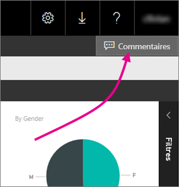
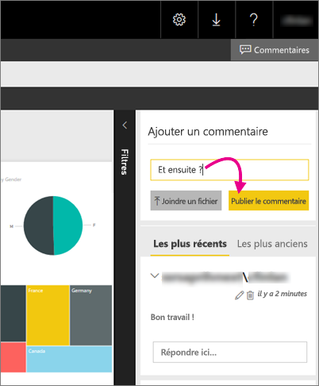

# Ajouter des commentaires à un rapport dans un serveur de rapports
Vous pouvez ajouter des commentaires aux rapports, y compris aux rapports Power BI, dans le portail web d’un serveur de rapports. Les commentaires sont intrinsèquement liés au rapport et toute personne munie des autorisations appropriées peut voir les commentaires associés au rapport. Pour plus d’informations, consultez la section [Autorisations](#permissions) ci-dessous.

## Ajouter ou afficher les commentaires
1. Ouvrez un rapport paginé ou Power BI sur un serveur de rapports.
2. Sélectionnez **Commentaires** dans le coin supérieur droit.
   
    
   
    Dans le volet de commentaires, vous pouvez voir les commentaires existants.
3. Écrivez le commentaire, puis sélectionnez **Publier un commentaire**.
   
    
   
    Votre commentaire s’affiche dans le volet sur le portail web avec tous les commentaires précédents. Ils n’apparaissent pas avec le rapport sur dans les applications mobiles Power BI.
   
   > [!TIP]
   > Saviez-vous ? Vous pouvez [annoter les rapports Power BI dans les applications mobiles Power BI](../mobile-annotate-and-share-a-tile-from-the-mobile-apps.md) et partager les rapports annotés avec d’autres utilisateurs.
   > 
   > 

## Autorisations
Selon vos autorisations, vous pouvez :

* ne pas voir les commentaires ;
* voir tous les commentaires et publier, modifier et supprimer vos propres commentaires ;
* afficher tous les commentaires, publier, modifier et supprimer vos propres commentaires, et supprimer les commentaires des autres utilisateurs.

## Étapes suivantes
* [Présentation de Power BI Report Server](get-started.md)  

D’autres questions ? [Essayez d’interroger la communauté Power BI](https://community.powerbi.com/)

