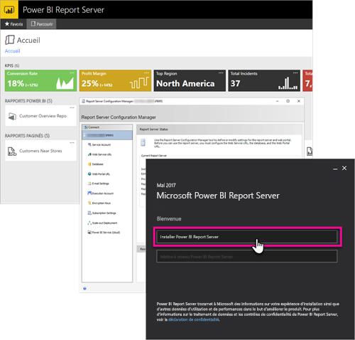

# Vue d’ensemble de l’administration, Power BI Report Server
Cet article fournit une vue d’ensemble de l’administration de Power BI Report Server, un emplacement local destiné au stockage et à la gestion de vos rapports Power BI, mobiles et paginés. Cet article présente les concepts permettant de planifier, déployer et gérer Power BI Report Server, avec des liens vers plus d’informations.

## Installation et migration
Vous devez installer Power BI Report Server pour pouvoir commencer à l’utiliser. Des articles existent qui expliquent comment gérer cette tâche.

Avant de d’installer, de mettre à niveau ou de migrer vers Power BI Report Server, examinez la [configuration système requise](system-requirements.md) pour le serveur de rapports.

### Installation
Si vous déployez un nouveau Power BI Report Server, le document suivant peut vous aider. 

[Installer Power BI Report Server](install-report-server.md)

### Migration
Il n’existe pas de mise à niveau sur place pour SQL Server Reporting Services. Si vous disposez d’une instance de SQL Server Reporting Services existante que vous voulez changer en Power BI Report Server, vous devez la migrer. Vous pouvez effectuer une migration pour d’autres raisons. Pour plus de détails, voir le document relatif à la migration.

[Migrer une installation de serveur de rapports](migrate-report-server.md)

## Configuration de votre serveur de rapports
Lors de la configuration de votre serveur de rapports, vous disposez de nombreuses options. Allez-vous utiliser SSL ? Configurez-vous un serveur de courrier ? Souhaitez-vous une intégration avec le service Power BI pour pouvoir épingler des visualisations ?

L’essentiel de la configuration doit s’effectuer dans le Gestionnaire de configuration du serveur de rapports. Pour plus de détails, voir la documentation du [Gestionnaire de configuration](https://docs.microsoft.com/sql/reporting-services/install-windows/reporting-services-configuration-manager-native-mode).

## Sécurité
La sécurité et la protection sont importantes pour toute organisation. Pour découvrir l’authentification, l’autorisation, les rôles et les permissions, voir la documentation relative à la [sécurité](https://docs.microsoft.com/sql/reporting-services/security/reporting-services-security-and-protection).

## Étapes suivantes
[Installer Power BI Report Server](install-report-server.md)  
[Trouver la clé de produit de votre serveur de rapports](find-product-key.md)  
[Installer Power BI Desktop optimisé pour Power BI Report Server](install-powerbi-desktop.md)  
[Installer le Générateur de rapports](https://docs.microsoft.com/sql/reporting-services/install-windows/install-report-builder)  
[Télécharger SQL Server Data Tools (SSDT)](http://go.microsoft.com/fwlink/?LinkID=616714)

D’autres questions ? [Essayez d’interroger la communauté Power BI](https://community.powerbi.com/)

