# <a name="configure-power-bi-report-server-with-azure-application-proxy"></a>Configurer Power BI Report Server avec le proxy d’application Azure

Cet article explique comment utiliser le proxy d’application Azure Active Directory pour se connecter à Power BI Report Server et SQL Server Reporting Services (SSRS) 2016 et versions ultérieures. Grâce à cette intégration, les utilisateurs qui se trouvent en dehors du réseau d’entreprise peuvent accéder à leurs rapports Power BI Report Server et Reporting Services depuis leurs navigateurs clients et être protégés par Azure Active Directory (AD). Consultez [Proxy d’application Azure Active Directory](/azure/active-directory/manage-apps/application-proxy) pour en savoir plus sur l’accès à distance aux applications locales.

## <a name="environment-details"></a>Détails de l'environnement

Nous avons utilisé ces valeurs dans l’exemple que nous avons créé. 

- Domaine : umacontoso.com
- Power BI Report Server : PBIRSAZUREAPP.umacontoso.com
- Source de données SQL Server : SQLSERVERAZURE.umacontoso.com

## <a name="configure-power-bi-report-server"></a>Configurer Power BI Report Server

Après l’installation de Power BI Report Server (sur une machine virtuelle Azure), configurez les URL du service web et du portail web Power BI Report Server en procédant comme suit :

1. Créez des règles de trafic entrant et sortant sur le pare-feu de machine virtuelle pour le port 80 (port 443 si vous avez configuré des URL https). Créez également des règles de trafic entrant et sortant pour la machine virtuelle Azure à partir du portail Azure pour le protocole TCP - Port 80.
2. Le nom DNS configuré pour la machine virtuelle dans notre environnement est `pbirsazureapp.eastus.cloudapp.azure.com`.
3. Configurez l’URL du portail web et du service web externe Power BI Report Server en sélectionnant l’onglet **Avancé** > bouton **Ajouter** > **Choisir le nom d’en-tête de l’hôte** et en ajoutant le nom d’hôte (nom DNS) comme indiqué ici.

    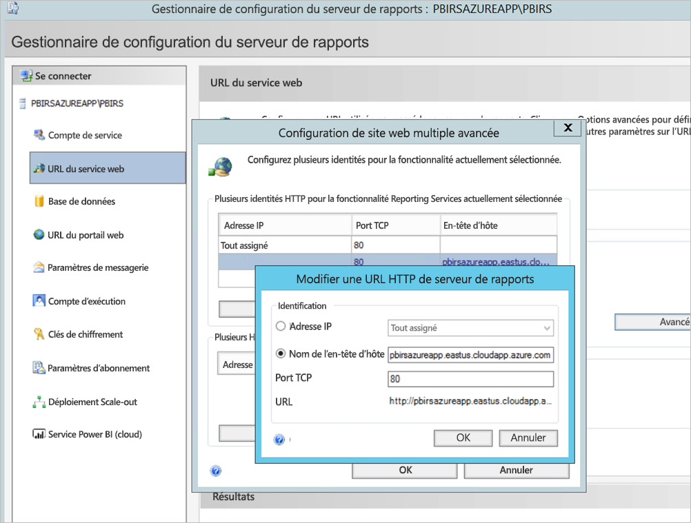

1. Nous avons effectué les étapes précédentes pour la section du service web et du portail web et avons obtenu l’enregistrement des URL sur Configuration Manager pour le rapport de serveurs :

    - `https://pbirsazureapp.eastus.cloudapp.azure.com/ReportServer`
    - `https://pbirsazureapp.eastus.cloudapp.azure.com/Reports`

2. Dans le portail Azure, nous voyons deux adresses IP pour la machine virtuelle dans la section de mise en réseau 

    - **IP publique**. 
    - **IP privée**. 
    
    L’adresse IP publique est utilisée pour l’accès en dehors de la machine virtuelle.

3. Par conséquent, nous avons ajouté l’entrée de fichier hôte sur la machine virtuelle (Power BI Report Server) de façon à inclure l’adresse IP publique et le nom d’hôte `pbirsazureapp.eastus.cloudapp.azure.com`.
4. Notez que, lors du redémarrage de la machine virtuelle, l’adresse IP dynamique peut changer et vous devrez peut-être ajouter à nouveau l’adresse IP appropriée dans le fichier hôte. Pour éviter cela, vous pouvez définir l’adresse IP publique sur statique dans le portail Azure.
5. Les URL du service web et du portail web devraient être correctement accessibles une fois les modifications mentionnées ci-dessus effectuées.
6. Lors de l’accès à l’URL `https://pbirsazureapp.eastus.cloudapp.azure.com/ReportServer` sur le serveur, nous sommes invités à fournir des informations d’identification trois fois et un écran vide s’affiche.
7. Ajoutez l’entrée de registre suivante :

    Clé de registre `HKEY\_LOCAL\_MACHINE \SYSTEM\CurrentControlset\Control \Lsa\ MSV1\_0`

1. Ajoutez une nouvelle valeur `BackConnectionHostNames`, une valeur à chaînes multiples et indiquez le nom d’hôte `pbirsazureapp.eastus.cloudapp.azure.com`.

Ensuite, nous pouvons également accéder aux URL sur le serveur.

## <a name="configure-power-bi-report-server-to-work-with-kerberos"></a>Configurer Power BI Report Server pour utiliser Kerberos

### <a name="1-configure-the-authentication-type"></a>1. Configurer le type d’authentification

Nous devons configurer le type d’authentification pour le serveur de rapports afin d’autoriser une délégation contrainte Kerberos. Cette configuration est effectuée dans le fichier **rsreportserver.config**.

Dans le fichier rsreportserver.config, recherchez la section **Authentication/AuthenticationTypes**.

Nous devons nous assurer que RSWindowsNegotiate est répertorié et figure en première position dans la liste des types d’authentification. L’URL doit ressembler à ce qui suit.

```
<AuthenticationTypes>

    <RSWindowsNegotiate/>

</AuthenticationTypes>
```

Si vous devez modifier le fichier de configuration, **arrêtez et redémarrez le service du serveur de rapports** à partir de Report Server Configuration Manager pour vous assurer que les modifications prennent effet.

### <a name="2-register-service-principal-names-spns"></a>2. Enregistrer les noms de principal du service (SPN)

Ouvrez l’invite de commandes en tant qu’administrateur et effectuez les étapes suivantes.

Enregistrez les noms de principal du service suivants sous le **compte de service Power BI Report Server** à l’aide des commandes suivantes

```
setspn -s http/ Netbios name\_of\_Power BI Report Server\_server<space> Power BI Report Server\_ServiceAccount

setspn -s http/ FQDN\_of Power BI Report Server\_server<space> Power BI Report Server\_ServiceAccount
```

Enregistrez les SPN suivants sous le compte de service SQL Server à l’aide des commandes suivantes (pour une instance par défaut de SQL Server) :

```
setspn -s MSSQLSVC/FQDN\_of\_SQL\_Server: 1433 (PortNumber) <SQL service service account>

setspn -s MSSQLSVC/FQDN\_of\_SQL\_Server<SQL service service account>
```

### <a name="3-configure-delegation-settings"></a>3. Configurer les paramètres de délégation

Nous devons configurer les paramètres de délégation sur le compte de service du serveur de rapports.

1. Ouvrez Utilisateurs et ordinateurs Active Directory.
2. Ouvrez les Propriétés du compte de service du serveur de rapports sous Utilisateurs et ordinateurs Active Directory.
3. Nous devons configurer une délégation contrainte avec transit de protocole. Avec une délégation contrainte, nous devons être explicite concernant les services auxquels nous souhaitons déléguer.
4. Cliquez avec le bouton droit sur le **compte de service du serveur de rapports**, puis sélectionnez **Propriétés**.
5. Sélectionnez l’onglet **Délégation**.
6. Sélectionnez **N’approuver cet utilisateur que pour la délégation aux services spécifiés**.
7. Sélectionnez **Utiliser tout protocole d’authentification**.
8. Sous **Ce compte peut présenter des informations d’identification déléguées à ces services**, sélectionnez **Ajouter**.
9. Dans la boîte de dialogue Nouveau, sélectionnez **Utilisateurs ou ordinateurs**.
10. Entrez le **compte de service pour le service SQL Server** et sélectionnez **OK**.

    Il commence par MSSQLSVC.

1. Ajoutez les noms de principal du service.
2. Sélectionnez **OK**. Le nom de principal du service devrait à présent figurer dans la liste.

Ces étapes permettent de configurer Power BI Report Server pour qu’il fonctionne avec le mécanisme d’authentification Kerberos et de faire en sorte que le test de connexion à la source de données fonctionne sur votre ordinateur local.

## <a name="configure-azure-application-proxy-connector"></a>Configurer le connecteur de proxy d’application Azure

Reportez-vous à l’article relatif à la [configuration liée au connecteur de proxy d’application](/azure/active-directory/manage-apps/application-proxy-add-on-premises-application#add-an-on-premises-app-to-azure-ad)

Nous avons installé le connecteur de proxy d’application sur Power BI Report Server, mais vous pouvez le configurer sur un serveur distinct et vous assurer que la délégation est configurée correctement.

### <a name="ensure-the-connector-is-trusted-for-delegation"></a>Vérifier que le connecteur est approuvé pour la délégation

Vérifiez que le connecteur est approuvé pour la délégation au SPN ajouté au compte de pool d’applications du serveur de rapports.

Configurez la délégation contrainte Kerberos (KCD) afin que le service de proxy d’application Azure AD puisse déléguer des identités d’utilisateur au compte de pool d’applications du serveur de rapports. Pour configurer la délégation KCD, activez le connecteur de proxy d’application pour récupérer les tickets Kerberos des utilisateurs qui ont été authentifiés dans Azure AD. Puis ce serveur transmet le contexte à l’application cible ou Power BI Report Server dans ce cas.

Pour configurer la délégation KCD, répétez les étapes suivantes pour chaque machine de connecteur.

1. Connectez-vous à un contrôleur de domaine en tant qu’administrateur de domaine, puis ouvrez **Utilisateurs et ordinateurs Active Directory**.
2. Trouvez l’ordinateur sur lequel le connecteur est en cours d’exécution.
3. Double-cliquez sur l’ordinateur, puis sélectionnez l’onglet **Délégation**.
4. Définissez les paramètres de délégation sur **N’approuver cet ordinateur que pour la délégation aux services spécifiés**. Sélectionnez ensuite **Utiliser tout protocole d’authentification**.
5. Sélectionnez **Ajouter**, puis **Utilisateurs ou ordinateurs**.
6. Entrez le compte de service que vous utilisez pour Power BI Report Server. Il s’agit du compte auquel vous avez ajouté le nom de principal du service lors de la configuration du serveur de rapports.
7. Cliquez sur **OK**. 
8. Cliquez à nouveau sur **OK** pour enregistrer les modifications.

## <a name="publish-through-azure-ad-application-proxy"></a>Publier via le Proxy d’application Azure AD

Vous êtes maintenant prêt à configurer un proxy d’application Azure AD.

Publiez Power BI Report Server via le proxy d’application avec les paramètres suivants. Pour obtenir des instructions pas à pas sur la publication d’une application via le proxy d’application, consultez [Publication d’applications à l’aide d’un proxy d’application Azure AD](/azure/active-directory/manage-apps/application-proxy-add-on-premises-application#add-an-on-premises-app-to-azure-ad).

- **URL interne** : Entrez l’URL du serveur de rapports auquel le connecteur peut accéder dans le réseau d’entreprise. Assurez-vous que cette URL est accessible à partir du serveur sur lequel le connecteur est installé. Il est conseillé d’utiliser un domaine de premier niveau, par exemple `https://servername/`, pour éviter les problèmes liés aux sous-chemins publiés via le proxy d’application. Par exemple, utilisez `https://servername/` et non `https://servername/reports/` ou `https://servername/reportserver/`. Nous avons configuré notre environnement avec `https://pbirsazureapp.eastus.cloudapp.azure.com/`.

    > [!NOTE]
    > Nous vous recommandons d’utiliser une connexion HTTPS sécurisée au serveur de rapports. Pour plus d’informations sur la marche à suivre, consultez [Configuration des connexions SSL sur un serveur de rapports en mode natif](/sql/reporting-services/security/configure-ssl-connections-on-a-native-mode-report-server).

- **URL externe** : Entrez l’URL publique à laquelle l’application mobile Power BI se connectera. Par exemple, elle peut prendre la forme `https://reports.contoso.com` si un domaine personnalisé est utilisé. Pour utiliser un domaine personnalisé, chargez un certificat pour le domaine et pointez un enregistrement DNS vers le domaine msappproxy.net par défaut de votre application. Pour les étapes détaillées, consultez [Utilisation des domaines personnalisés dans le proxy d’application Azure AD](/azure/active-directory/manage-apps/application-proxy-configure-custom-domain).

Nous avons configuré l’URL externe sur `https://pbirsazureapp-umacontoso2410.msappproxy.net/` pour notre environnement.

- **Méthode de pré-authentification** : Azure Active Directory.
- **Groupe de connecteurs :** (Par défaut.)

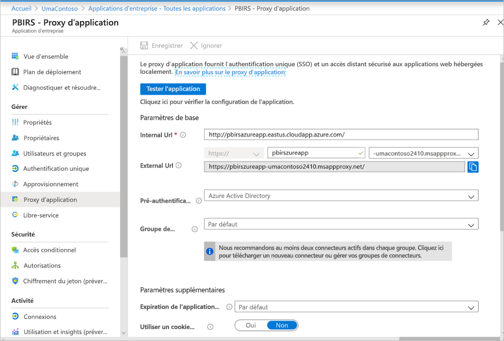

Nous n’avons apporté aucune modification dans la section **Paramètres supplémentaires**. Il est configuré pour fonctionner avec les options par défaut.

> [!IMPORTANT]
> Lors de la configuration du proxy d’application, notez que la propriété **Expiration de l’application principale** est définie sur **Par défaut** (85 secondes). Si vous avez des rapports dont l’exécution prend plus de 85 secondes, définissez cette propriété sur **Long** (180 secondes), qui est la valeur de délai d’expiration la plus élevée possible. Quand cette propriété est configurée sur **Long**, tous les rapports doivent être exécutés dans les 180 secondes, sinon ils dépassent le délai d’expiration et génèrent une erreur.


### <a name="configure-single-sign-on"></a>Configurer l’authentification unique

Une fois que votre application est publiée, configurez les paramètres d’authentification unique en effectuant les étapes suivantes :

1. Dans la page de l’application dans le portail, sélectionnez **Authentification unique**.
2. Pour le **mode d’authentification unique**, sélectionnez **Authentification Windows intégrée**.
3. Définissez l’option **SPN d’application interne** sur la valeur que vous avez définie précédemment. Vous pouvez identifier cette valeur en procédant comme suit :

    - Essayez d’exécuter un rapport ou d’effectuer un test de connexion à une source de données pour qu’un ticket Kerberos soit créé.
    - Après la réussite de l’exécution du rapport/du test de connexion, ouvrez l’invite de commandes et exécutez la commande : `klist`. Dans la section des résultats, vous devriez voir un ticket avec le SPN `http/`. S’il s’agit du même SPN que celui que vous avez configuré avec Power BI Report Server, utilisez ce SPN dans cette section.

1. Choisissez l’**Identité de connexion déléguée** pour le connecteur à utiliser pour le compte de vos utilisateurs. Pour plus d’informations, consultez [Utilisation d’identités cloud et locales différentes](/azure/active-directory/manage-apps/application-proxy-configure-single-sign-on-with-kcd#working-with-different-on-premises-and-cloud-identities).

    Nous vous recommandons d’utiliser le Nom d’utilisateur principal. Dans notre exemple, nous l’avons configuré pour qu’il fonctionne avec l’option **Nom d’utilisateur principal** :

    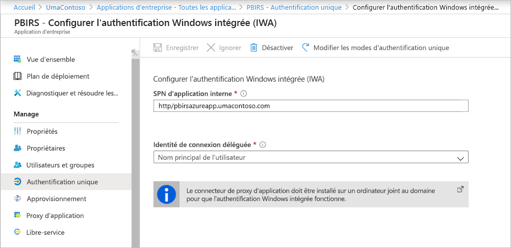

1. Cliquez sur **Enregistrer** pour enregistrer vos modifications.

### <a name="finish-setting-up-your-application"></a>Terminer la configuration de votre application

Pour terminer la configuration de votre application, accédez à la section **Utilisateurs et groupes** et affectez des utilisateurs pouvant accéder à cette application.

1. Configurez la section **Authentification** de l’inscription d’application pour l’application Power BI Report Server comme suit pour **URL de redirection** et **Paramètres avancés** :

    - Créez une URL de redirection et configurez-la avec **Type** = **Web** et **URI de redirection** = `https://pbirsazureapp-umacontoso2410.msappproxy.net/`
    - Dans la section **Paramètres avancés**, configurez **l’URL de déconnexion** sur `https://pbirsazureapp-umacontoso2410.msappproxy.net/?Appproxy=logout`

    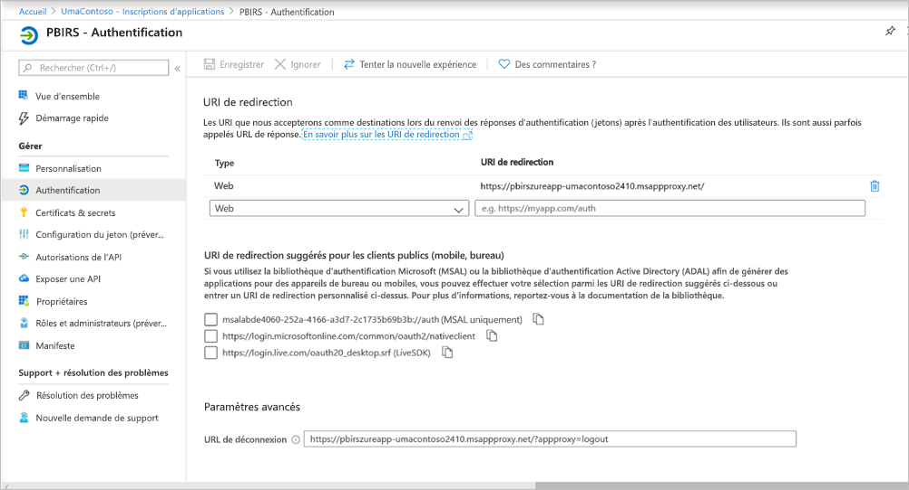

1. Poursuivez la configuration de la section **Authentification** de l’inscription d’application pour l’application Power BI Report Server comme suit pour **Octroi implicite**, **Type de client par défaut** et **Types de comptes pris en charge** :

    - Définissez **Octroi implicite** sur **Jetons d’ID**.
    - Définissez **Type de client par défaut** sur **Non**.
    - Définissez **Types de comptes pris en charge** sur **Comptes dans cet annuaire organisationnel uniquement (UmaContoso uniquement – Un seul locataire)** .

    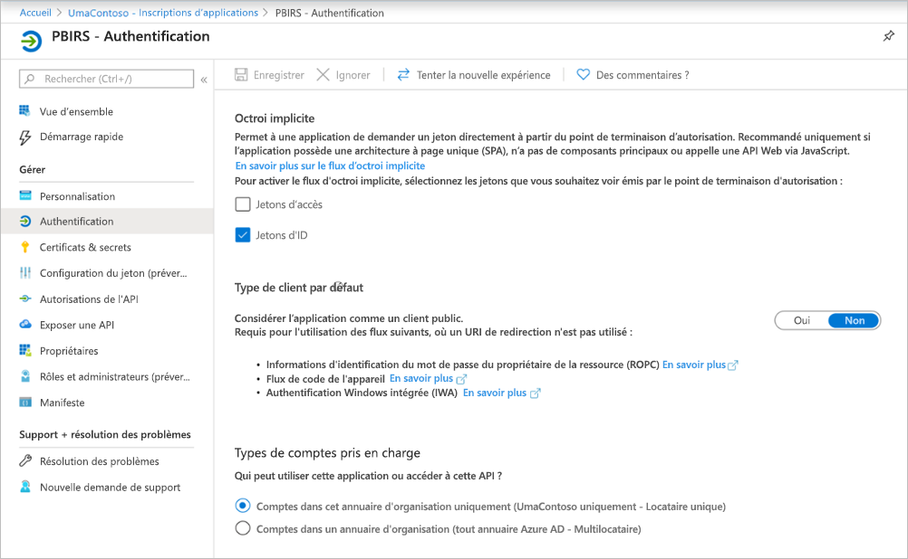

1. Une fois que l’authentification unique est configurée et que l’URL `https://pbirsazureapp-umacontoso2410.msappproxy.net` fonctionne, nous devons nous assurer que le compte que nous utilisons pour nous connecter est synchronisé avec le compte auquel les autorisations sont fournies dans Power BI Report Server.

1. Nous devons d’abord configurer le domaine personnalisé que nous envisageons d’utiliser dans la connexion, puis nous assurer qu’il est vérifié
2. Dans ce cas, nous avons acheté un domaine appelé umacontoso.com et configuré la zone DNS avec les entrées. Vous pouvez également essayer d’utiliser le domaine `onmicrosoft.com` et le synchroniser avec l’annuaire AD local.

    Consultez l’article [Tutoriel : Mapper un nom DNS personnalisé existant à Azure App Service](/Azure/app-service/app-service-web-tutorial-custom-domain) à titre de référence.

1. Après avoir vérifié correctement l’entrée DNS pour le domaine personnalisé, vous devriez être en mesure de voir l’état comme étant **Vérifié** correspondant au domaine du portail.

    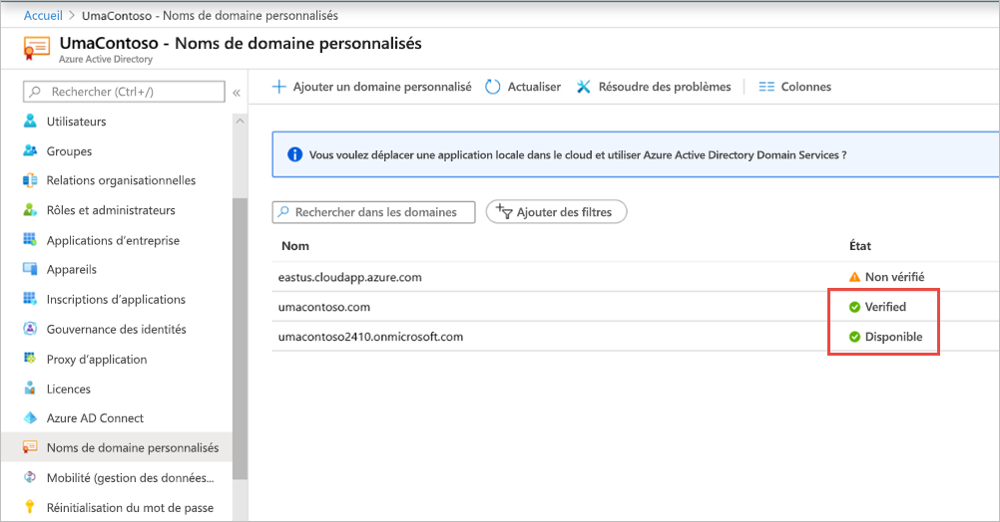

1. Installez Microsoft Azure AD Connect sur le serveur du contrôleur de domaine et configurez-le pour qu’il se synchronise avec Azure AD.

    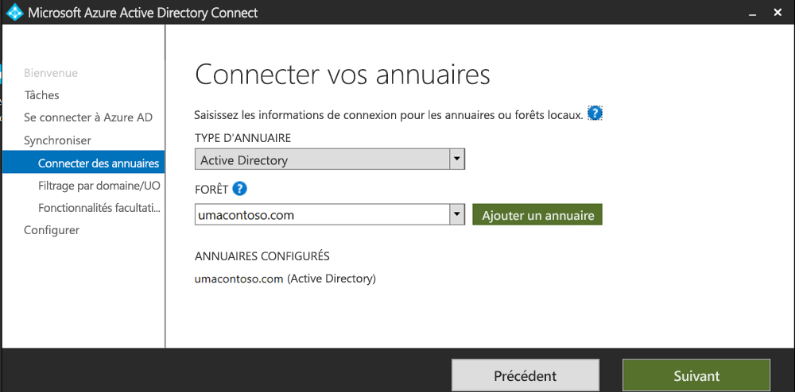

1. Une fois qu’Azure AD est synchronisé avec l’annuaire AD local, l’état suivant est affiché dans le portail Azure :

    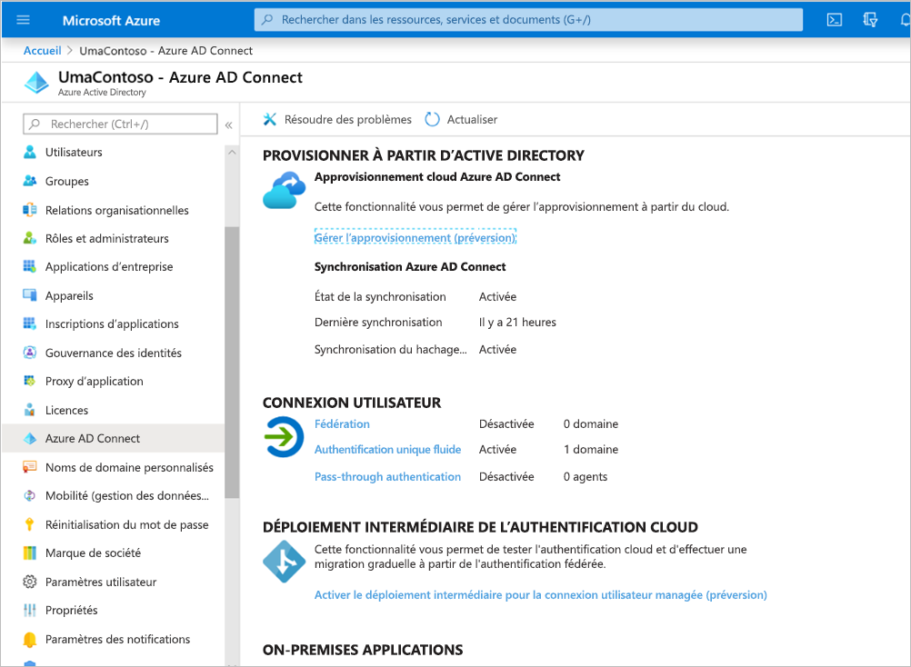

1. En outre, une fois la synchronisation réussie, ouvrez les domaines et approbations Active Directory sur le contrôleur de domaine. Cliquez avec le bouton droit sur Domaines et approbations Active Directory > Propriétés et ajoutez l’UPN. Dans notre environnement, `umacontoso.com` est le domaine personnalisé que nous avons acheté.

1. Après avoir ajouté l’UPN, vous devriez être en mesure de configurer les comptes utilisateur avec l’UPN afin que le compte Azure AD et le compte AD local soient connectés et que le jeton soit reconnu lors de l’authentification.

    Le nom de domaine AD est répertorié dans la liste déroulante de la section **Nom de connexion utilisateur** une fois que vous avez effectué l’étape précédente. Configurez le nom d’utilisateur, puis sélectionnez le domaine dans la liste déroulante de la section **Nom de connexion utilisateur** des propriétés de l’utilisateur AD.

    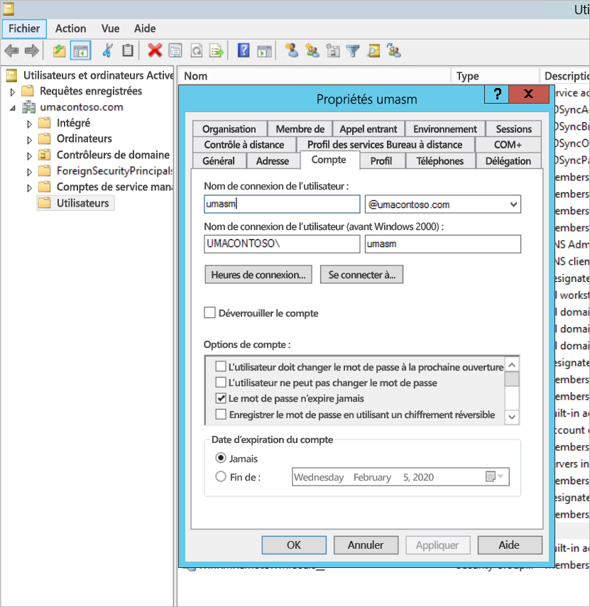

1. Une fois la synchronisation AD réussie, le compte AD local s’affiche dans le portail Azure sous la section **Utilisateurs et groupes** de l’application. La source du compte est **Windows Server AD.**
2. La connexion avec `umasm@umacontoso.com` est équivalente à l’utilisation des informations d’identification Windows `Umacontoso\umasm`.

    Les étapes précédentes sont applicables si vous disposez d’un annuaire AD local configuré et que vous envisagez de le synchroniser avec Azure AD.

    Connexion réussie après l’exécution des étapes ci-dessus :

    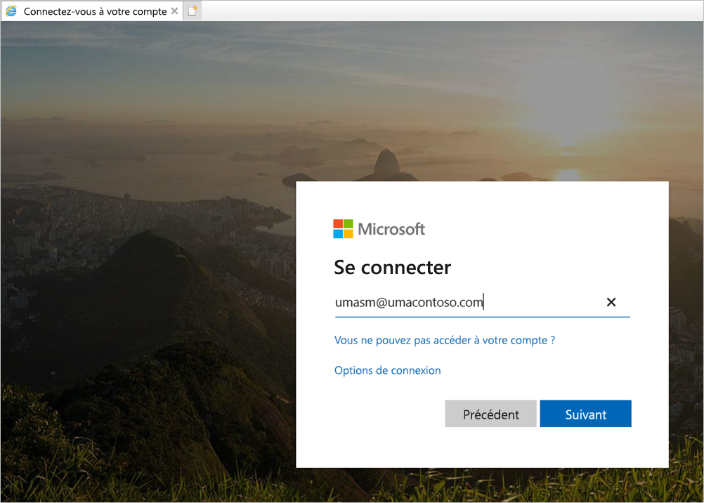

    Suivi de l’affichage du portail web :

    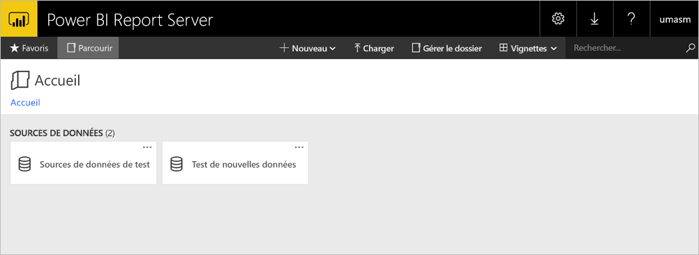

    Avec un test de connexion réussi à la source de données avec Kerberos comme authentification :

    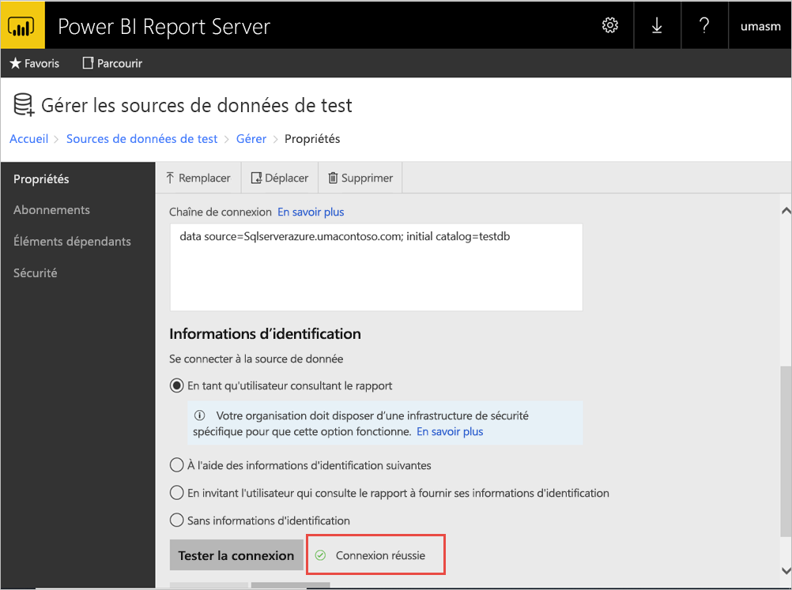

## <a name="access-from-power-bi-mobile-apps"></a>Accès à partir des applications mobiles Power BI

### <a name="configure-the-application-registration"></a>Configurer l’inscription d’application

Pour pouvoir connecter l’application mobile Power BI et accéder à Power BI Report Server, vous devez configurer l’inscription d’application créée automatiquement dans la section [Publier via le Proxy d’application Azure AD](#publish-through-azure-ad-application-proxy) plus haut dans cet article.

1. Dans la page de **vue d’ensemble d’Azure Active Directory**, sélectionnez **Inscriptions d’applications**.
2. Dans l’onglet **Toutes les applications**, recherchez celle que vous avez créée pour Power BI Report Server.
3. Sélectionnez-la, puis sélectionnez **Authentification**.
4. Ajoutez les URI de redirection suivants selon la plateforme que vous utilisez.

    Quand vous configurez l’application pour Power BI Mobile **iOS**, ajoutez les URI de redirection suivants de type Client public (mobile et bureau) :

    - `msauth://code/mspbi-adal%3a%2f%2fcom.microsoft.powerbimobile`
    - `msauth://code/mspbi-adalms%3a%2f%2fcom.microsoft.powerbimobilems`
    - `mspbi-adal://com.microsoft.powerbimobile`
    - `mspbi-adalms://com.microsoft.powerbimobilems`

    Quand vous configurez l’application pour Power BI Mobile **Android**, ajoutez les URI de redirection suivants de type Client public (mobile et bureau) :

    - `urn:ietf:wg:oauth:2.0:oob`
    - `mspbi-adal://com.microsoft.powerbimobile`
    - `msauth://com.microsoft.powerbim/g79ekQEgXBL5foHfTlO2TPawrbI%3D`
    - `msauth://com.microsoft.powerbim/izba1HXNWrSmQ7ZvMXgqeZPtNEU%3D`

    Quand vous configurez l’application pour Power BI Mobile iOS et Android, ajoutez l’URI de redirection suivant de type Client public (mobile et bureau) à la liste des URI de redirection configurés pour iOS :

    - `urn:ietf:wg:oauth:2.0:oob`

    > [!IMPORTANT]
    > Les URI de redirection doivent être ajoutés pour que l’application fonctionne correctement.

### <a name="connect-from-the-power-bi-mobile-apps"></a>Se connecter à partir des applications mobiles Power BI

1. Dans l’application mobile Power BI, connectez-vous à votre instance du serveur de rapports. Pour ce faire, entrez **l’URL externe** de l’application que vous avez publiée par le biais du proxy d’application.
2. Sélectionnez **Se connecter**. Vous serez redirigé vers la page de connexion Azure Active Directory.
3. Entrez des informations d’identification valides pour votre utilisateur et sélectionnez **Se connecter**. Vous verrez les éléments de votre serveur de rapports.

## <a name="next-steps"></a>Étapes suivantes

[Activer l’accès à distance pour Power BI Mobile avec le proxy d’application Azure AD](/azure/active-directory/manage-apps/application-proxy-integrate-with-power-bi)

D’autres questions ? [Essayez d’interroger la communauté Power BI](https://community.powerbi.com/)
