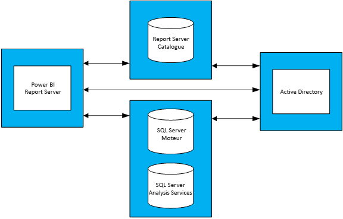

# Conseils sur la planification de la capacité de Power BI Report Server
Power BI Report Server est une solution d’informatique décisionnelle et de création de rapports en entreprise libre-service que les clients peuvent déployer localement, derrière le pare-feu d’entreprise. Cette solution combine la fonctionnalité de rapport interactif de Power BI Desktop avec la plateforme de serveur locale de SQL Server Reporting Services. En raison de l’utilisation croissante et intensive des analytiques et des rapports au sein des entreprises, la budgétisation de l’infrastructure matérielle et des licences logicielles nécessaires pour s’adapter à une base d’utilisateurs en entreprise peut représenter un défi. Ce document propose des conseils sur la planification de la capacité de Power BI Report Server en partageant les résultats de plusieurs exécutions de test de charge de différentes charges de travail exécutées sur un serveur de rapports. Alors que les rapports, les requêtes et les modèles d’utilisation des organisations peuvent varier, les résultats présentés dans ce document, ainsi que les tests réels utilisés et la description détaillée de leur exécution, servent de point de référence pour tous les utilisateurs qui envisagent de planifier en amont le déploiement de Power BI Report Server.

## Rapport de synthèse
Nous avons exécuté deux types de charges de travail sur Power BI Report Server. Chaque charge de travail consistait à restituer différents types de rapports, ainsi qu’à effectuer diverses opérations dans un portail web. 

* Dans la charge de travail « Power BI Report Heavy », l’opération la plus fréquente (par exemple l’opération exécutée 60 % du temps) consistait à restituer des rapports Power BI.
* Dans la charge de travail « Paginated Report Heavy », l’opération la plus fréquente était de restituer des rapports paginés.

Sous une topologie à quatre serveurs de Power BI Report Server et en considérant qu’un maximum de 5 % d’utilisateurs accèdent simultanément à un serveur de rapports, le tableau suivant décrit le nombre maximal d’utilisateurs que Power BI Report Server peut gérer avec une fiabilité d’au moins 99 %. 

| Charge de travail | 8 cœurs/32 Go de RAM | 16 cœurs/64 Go de RAM |
| --- | --- | --- |
| **Power BI Report Heavy** (> 60 %) |1 000 utilisateurs |3 000 utilisateurs |
| **Paginated (RDL) Report Heavy** (> 60 %) |2 000 utilisateurs |3 200 utilisateurs |

Dans chaque exécution, la ressource la plus submergée était l’UC. Pour cette raison, l’augmentation du nombre de cœurs de Power BI Report Server générerait un plus grand gain en termes de fiabilité du système que l’augmentation de la quantité de mémoire ou d’espace disque. 

## Méthodologie de test
La topologie de test utilisée était basée sur Machines virtuelles Microsoft Azure au lieu du matériel propre au fournisseur. Toutes les machines étaient hébergées en Amérique du Nord. Cela reflète la tendance générale de la virtualisation matérielle aussi bien localement que dans le cloud public. 

### Topologie Power BI Report Server
Le déploiement de Power BI Report Server était constitué des machines virtuelles suivantes :

* Contrôleur de domaine Active Directory : celui-ci était requis par le moteur de base de données SQL Server, SQL Server Analysis Services et Power BI Report Server afin d’authentifier toutes les demandes de manière sécurisée.
* Moteur de base de données SQL Server et SQL Server Analysis Services : c’est à cet endroit qu’étaient stockées toutes les bases de données des rapports à utiliser lorsque nous les avons restitués.
* Power BI Report Server
* Base de données Power BI Report Server La base de données du serveur de rapports est hébergée sur une autre machine que Power BI Report Server. Ainsi, elle ne doit pas être en concurrence avec le moteur de base de données SQL Server pour la mémoire, le processeur, le réseau et les ressources de disque.

Consultez l’annexe 1.1 Topologie Power BI Report Server et l’annexe 1.2 Configuration des machines virtuelles Power BI Report Server pour voir la configuration complète de chaque machine virtuelle utilisée dans la topologie.

### Tests
Les tests utilisés dans les séries de tests de charge sont accessibles publiquement dans un projet GitHub appelé [Reporting Services LoadTest](https://github.com/Microsoft/Reporting-Services-LoadTest). Cet outil permet aux utilisateurs d’étudier les caractéristiques de performances, de fiabilité, de scalabilité et de capacité de restauration de SQL Server Reporting Services et Power BI Report Server. Ce projet se compose de quatre groupes de tests :

* Tests simulant la restitution de rapports Power BI
* Tests simulant la restitution de rapports mobiles
* Tests simulant la restitution de rapports paginés de petite et grande taille 
* Tests simulant l’exécution de différents types d’opérations de portail web. 

Tous les tests ont été écrits pour effectuer une opération de bout en bout (telle que la restitution d’un rapport, la création d’une source de données, etc.). Pour cela, les tests ont effectué une ou plusieurs demandes web sur le serveur de rapports (via des API). Dans le monde réel, un utilisateur devra peut-être effectuer quelques opérations intermédiaires pour réaliser l’une de ces opérations de bout en bout. Par exemple, pour afficher un rapport, un utilisateur devra accéder au portail web, puis au dossier où est stocké le rapport, et enfin cliquer sur le rapport pour l’afficher. Alors que les tests n’effectuent pas toutes les opérations nécessaires pour accomplir une tâche de bout en bout, ils font tout de même subir la plus grande partie de la charge que pourrait rencontrer Power BI Report Server. Pour plus d’informations sur les différents types de rapports utilisés, ainsi que les diverses opérations effectuées, explorez le projet GitHub.

### Charges de travail
2 profils de charge de travail ont été utilisés lors des tests : Power BI Report Heavy et Paginated Report Heavy. Le tableau ci-dessous décrit la distribution des demandes exécutées sur le serveur de rapports.

| Activité | Power BI Report Heavy, fréquence d’occurrence | Paginated Report Heavy, fréquence d’occurrence |
| --- | --- | --- |
| **Restitution de rapports Power BI** |60 % |10 % |
| **Restitution de rapports paginés** |30% |60 % |
| **Restitution de rapports mobiles** |5% |20% |
| **Opérations de portail web** |5 % |10 % |

### Charge utilisateur
Pour chaque série de tests, des tests ont été exécutés selon la fréquence spécifiée dans une des deux charges de travail. Les tests ont démarré avec 20 demandes utilisateur simultanées envoyées au serveur de rapports. La charge utilisateur a ensuite été augmentée progressivement jusqu’à ce que la fiabilité descende en dessous de la cible de 99 %.

## Résultats
### Capacité des utilisateurs simultanés
Comme indiqué précédemment, les tests ont démarré avec 20 utilisateurs simultanés qui effectuent des demandes au serveur de rapports. Le nombre d’utilisateurs simultanés a ensuite été augmenté progressivement jusqu’à ce que 1 % de toutes les demandes échouent. Les résultats dans le tableau suivant nous indiquent le nombre de demandes utilisateur simultanées que le serveur est en mesure de gérer sous les pics de charge avec un taux d’échec de moins de 1 %.

| Charge de travail | 8 cœurs/32 Go | 16 cœurs/64 Go |
| --- | --- | --- |
| **Power BI Report Heavy** |50 utilisateurs simultanés |150 utilisateurs simultanés |
| **Paginated Report Heavy** |100 utilisateurs simultanés |160 utilisateurs simultanés |

### Capacité totale des utilisateurs
Chez Microsoft, nous avons un déploiement de production de Power BI Report Server utilisé par plusieurs équipes. Lorsque nous analysons l’utilisation réelle de cet environnement, nous observons que le nombre d’utilisateurs simultanés à un moment donné (même pendant les pics de charge quotidiens) n’a pas tendance à dépasser 5 % de la base d’utilisateurs totale. En utilisant ce taux de simultanéité de 5 % comme point de référence, nous avons extrapolé la base totale d’utilisateurs que Power BI Report Server peut gérer avec une fiabilité de 99 %.

| Charge de travail | 8 cœurs/32 Go | 16 cœurs/64 Go |
| --- | --- | --- |
| **Power BI Report Heavy** |1 000 utilisateurs |3 000 utilisateurs |
| **Paginated Report Heavy** |2 000 utilisateurs |3 200 utilisateurs |

### Voir les résultats
Sélectionnez un rapport pour afficher les résultats du test de charge.

| Charge de travail | 8 cœurs/32 Go | 16 cœurs/64 Go |
| --- | --- | --- |
| **Power BI Report Heavy** |[Affichage - 8 cœurs](https://msit.powerbi.com/view?r=eyJrIjoiMDhhNGY4NGQtNGRhYy00Yzk4LTk2MzAtYzFlNWI5NjBkMGFiIiwidCI6IjcyZjk4OGJmLTg2ZjEtNDFhZi05MWFiLTJkN2NkMDExZGI0NyIsImMiOjV9) |[Affichage - 16 cœurs](https://msit.powerbi.com/view?r=eyJrIjoiNDBiODk1OGUtYTAyOC00MzVhLThmZmYtNzVjNTFjNzMwYzkwIiwidCI6IjcyZjk4OGJmLTg2ZjEtNDFhZi05MWFiLTJkN2NkMDExZGI0NyIsImMiOjV9) |
| **Paginated Report Heavy** |[Affichage - 8 cœurs](https://msit.powerbi.com/view?r=eyJrIjoiNDFiZWYzMTktZGIxNS00MzcwLThjODQtMmJkMGRiZWEzNjhlIiwidCI6IjcyZjk4OGJmLTg2ZjEtNDFhZi05MWFiLTJkN2NkMDExZGI0NyIsImMiOjV9) |[Affichage - 16 cœurs](https://msit.powerbi.com/view?r=eyJrIjoiOTU0YjJkYTgtNDg4Yy00NzlhLWIwMGYtMzg4YWI2MjNmOTZjIiwidCI6IjcyZjk4OGJmLTg2ZjEtNDFhZi05MWFiLTJkN2NkMDExZGI0NyIsImMiOjV9) |

<iframe width="640" height="360" src="https://msit.powerbi.com/view?r=eyJrIjoiMDhhNGY4NGQtNGRhYy00Yzk4LTk2MzAtYzFlNWI5NjBkMGFiIiwidCI6IjcyZjk4OGJmLTg2ZjEtNDFhZi05MWFiLTJkN2NkMDExZGI0NyIsImMiOjV9" frameborder="0" allowFullScreen="true"></iframe>

<iframe width="640" height="360" src="https://msit.powerbi.com/view?r=eyJrIjoiNDBiODk1OGUtYTAyOC00MzVhLThmZmYtNzVjNTFjNzMwYzkwIiwidCI6IjcyZjk4OGJmLTg2ZjEtNDFhZi05MWFiLTJkN2NkMDExZGI0NyIsImMiOjV9" frameborder="0" allowFullScreen="true"></iframe>

<iframe width="640" height="360" src="https://msit.powerbi.com/view?r=eyJrIjoiNDFiZWYzMTktZGIxNS00MzcwLThjODQtMmJkMGRiZWEzNjhlIiwidCI6IjcyZjk4OGJmLTg2ZjEtNDFhZi05MWFiLTJkN2NkMDExZGI0NyIsImMiOjV9" frameborder="0" allowFullScreen="true"></iframe>

<iframe width="640" height="360" src="https://msit.powerbi.com/view?r=eyJrIjoiOTU0YjJkYTgtNDg4Yy00NzlhLWIwMGYtMzg4YWI2MjNmOTZjIiwidCI6IjcyZjk4OGJmLTg2ZjEtNDFhZi05MWFiLTJkN2NkMDExZGI0NyIsImMiOjV9" frameborder="0" allowFullScreen="true"></iframe>

## Résumé
Pour chaque série de tests de charge, l’UC était la ressource la plus submergée dans la phase de pic de charge de la machine Power BI Report Server. Pour cette raison, la première ressource qui doit être augmentée est le nombre de cœurs. Ou bien, vous pouvez envisager une scalabilité horizontale en ajoutant des serveurs hébergeant Power BI Report Server dans votre topologie.

Les résultats présentés dans ce document sont dérivés de l’exécution d’un ensemble spécifique de rapports consommant un ensemble particulier de données, répétés d’une manière spécifique. Il s’agit d’un point de référence utile, mais n’oubliez pas que votre utilisation dépend de vos rapports, requêtes, modèles d’utilisation ainsi que de votre déploiement de Power BI Report Server.

## Annexe
### 1 Topologie
**1.1 Topologie Power BI Report Server**

Pour axer les tests uniquement sur le comportement de Power BI Report Server dans différentes configurations, la configuration de machine virtuelle de chaque type de machine (à l’exception de la machine qui héberge Power BI Report Server) était fixe. Chaque machine a été approvisionnée selon des machines de série D de deuxième génération (v2) avec des disques de stockage Premium. Vous trouverez des informations détaillées sur chaque taille de machine virtuelle dans la section « Usage général » sur https://azure.microsoft.com/en-us/pricing/details/virtual-machines/windows/.

| Type de machine virtuelle | Processeur | Mémoire | Taille de machine virtuelle Azure |
| --- | --- | --- | --- |
| **Contrôleur de domaine Active Directory** |2 cœurs |7 Go |Standard_DS2_v2 |
| **Moteur de base de données SQL Server et Analysis Services** |16 cœurs |56 Go |Standard_DS5_v2 |
| **Base de données Report Server** |16 cœurs |56 Go |Standard_DS5_v2 |

**1.2 Configuration des machines virtuelles Power BI Report Server** 

Différentes configurations de processeur et de mémoire ont été utilisées pour la machine virtuelle qui héberge Power BI Report Server. Contrairement aux autres machines virtuelles, cette machine a été approvisionnée selon des machines de série D de troisième génération (v3) avec des disques de stockage Premium. Vous trouverez des informations détaillées sur cette taille de machine virtuelle dans la section « Usage général » sur https://azure.microsoft.com/en-us/pricing/details/virtual-machines/windows/.

| Machine virtuelle | Processeur | Mémoire | Taille de machine virtuelle Azure |
| --- | --- | --- | --- |
| **Power BI Report Server (petit)** |8 cœurs |32 Go |Standard_D8S_v3 |
| **Power BI Report Server (grand)** |16 cœurs |64 Go |vStandard_D16S_v3 |

### 2 Exécuter l’outil LoadTest
Si vous souhaitez exécuter l’outil LoadTest de Reporting Services sur votre déploiement ou un déploiement Microsoft Azure de Power BI Report Server, procédez comme suit.

1. Clonez le projet Reporting Services LoadTest à partir de GitHub (https://github.com/Microsoft/Reporting-Services-LoadTest)).
2. Dans le répertoire du projet se trouve un fichier de solution appelé RSLoadTests.sln. Ouvrez ce fichier dans Visual Studio 2015 ou version ultérieure.
3. Déterminez si vous souhaitez exécuter cet outil sur votre déploiement Power BI Report Server ou sur un déploiement Power BI Report Server dans Microsoft Azure. Si vous choisissez de l’exécuter sur votre propre déploiement, passez à l’étape 5.
4. Suivez les instructions figurant sur le site https://github.com/Microsoft/Reporting-Services-LoadTest#create-a-sql-server-reporting-services-load-environment-in-azure pour créer un environnement Power BI Report Server dans Azure.
5. Une fois que vous avez terminé le déploiement de l’environnement, suivez les instructions figurant sur le site https://github.com/Microsoft/Reporting-Services-LoadTest#load-test-execution pour exécuter les tests.

D’autres questions ? [Essayez d’interroger la communauté Power BI](https://community.powerbi.com/)

