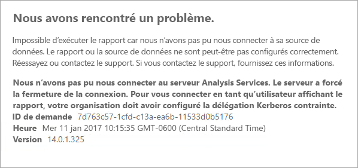
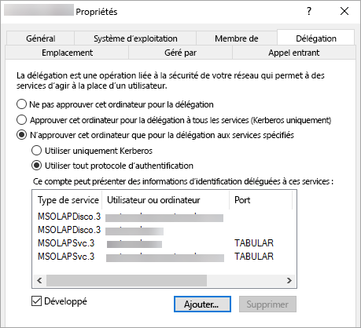

# <a name="configure-kerberos-to-use-power-bi-reports"></a>Configurer Kerberos pour utiliser les rapports Power BI
<iframe width="640" height="360" src="https://www.youtube.com/embed/vCH8Fa3OpQ0?showinfo=0" frameborder="0" allowfullscreen></iframe>

Découvrez comment configurer votre serveur de rapports pour l’authentification Kerberos auprès des sources de données utilisées dans vos rapports Power BI pour un environnement distribué.

Power BI Report Server permet d’héberger des rapports Power BI. De nombreuses sources de données sont prises en charge par votre serveur de rapports. Bien que cet article se concentre spécifiquement sur SQL Server Analysis Services, vous pouvez en utiliser les concepts pour les appliquer à d’autres sources de données telles que SQL Server.

Vous pouvez installer Power BI Report Server, SQL Server et Analysis Services sur un seul ordinateur. L’ensemble devrait fonctionner sans configuration supplémentaire. Il s’agit d’une excellente solution pour un environnement de test. Il se peut que vous rencontriez des erreurs si ces services sont installés sur des ordinateurs distincts au sein d’un environnement distribué. Dans ce type d’environnement, vous devez impérativement utiliser une authentification Kerberos. Pour implémenter cela, une configuration est nécessaire. 

Plus précisément, vous devrez configurer une délégation contrainte. Même si Kerberos est configuré dans votre environnement, il se peut qu’il ne le soit pas pour une délégation contrainte.

## <a name="error-running-report"></a>Erreur d’exécution de rapport
Si votre serveur de rapports n’est pas correctement configuré, vous pouvez rencontrer l’erreur suivante.

    Something went wrong.

    We couldn’t run the report because we couldn’t connect to its data source. The report or data source might not be configured correctly. 

Le message suivant apparaîtra dans les Détails techniques.

    We couldn’t connect to the Analysis Services server. The server forcibly closed the connection. To connect as the user viewing the report, your organization must have configured Kerberos constrained delegation.



## <a name="configuring-kerberos-constrained-delegation"></a>Configuration d’une délégation contrainte Kerberos
Pour qu’une délégation contrainte Kerberos fonctionne, plusieurs éléments doivent être configurés. Ceux-ci incluent les noms de principal du service (SPN) et les paramètres de délégation des comptes de service.

> [!NOTE]
> Pour configurer les noms de principal du service et les paramètres de délégation, vous devez être administrateur du domaine.
> 
> 

Nous allons devoir configurer ou valider les éléments suivants :

1. Le type d’authentification dans le cadre de la configuration du serveur de rapports.
2. Les noms de principal du service pour le compte de service du serveur de rapports.
3. Les noms de principal du service pour le service Analysis Services.
4. Les noms de principal du service pour le service SQL Browser sur l’ordinateur exécutant Analysis Services. Cela concerne uniquement les instances nommées.
5. Les paramètres de délégation sur le compte de service du serveur de rapports.

## <a name="authentication-type-within-report-server-configuration"></a>Type d’authentification dans le cadre de la configuration du serveur de rapports
Nous devons configurer le type d’authentification pour le serveur de rapports afin d’autoriser une délégation contrainte Kerberos. Cette opération est effectuée dans le fichier **rsreportserver.config**. L’emplacement par défaut de ce fichier est `C:\Program Files\Microsoft Power BI Report Server\PBIRS\ReportServer`.

Dans le fichier rsreportserver.config, vous pouvez affiner la section **Authentication/AuthenticationTypes**.

Nous devons nous assurer que RSWindowsNegotiate est répertorié et figure en première position dans la liste des types d’authentification. L’URL doit ressembler à ce qui suit.

```
<AuthenticationTypes>
    <RSWindowsNegotiate/>
    <RSWindowsNTLM/>
</AuthenticationTypes>
```

Si vous devez modifier le fichier de configuration, vous devez arrêter et redémarrer le serveur de rapports pour vous assurer que les modifications prennent effet.

Pour plus d’informations, voir [Configurer l’authentification Windows sur le serveur de rapports](https://docs.microsoft.com/sql/reporting-services/security/configure-windows-authentication-on-the-report-server).

## <a name="spns-for-the-report-server-service-account"></a>Noms de principal du service pour le compte de service du serveur de rapports
Nous devons ensuite nous assurer que le serveur de rapports dispose de noms de principal du service valides. Cela dépend du compte de service configuré pour le serveur de rapports.

### <a name="virtual-service-account-or-network-service"></a>Compte de service virtuel ou Compte de service réseau
Si votre serveur de rapports est configuré pour le Compte de service virtuel ou le Compte de service réseau, vous n’avez rien à faire. Ces comptes s’inscrivent dans le contexte du compte d’ordinateur. Celui-ci dispose des noms de principal du service par défaut. Ces derniers couvrent le service HTTP et sont utilisés par le serveur de rapports.

Si vous utilisez un nom de serveur virtuel différent de celui du compte d’ordinateur, les entrées HOST ne vous couvrent pas et vous devez ajouter manuellement les noms de principal du service pour le nom d’hôte du serveur virtuel.

### <a name="domain-user-account"></a>Compte d’utilisateur de domaine
Si votre serveur de rapports est configuré pour utiliser un compte d’utilisateur de domaine, vous devez créer manuellement des noms de principal du service HTTP sur ce compte. Vous pouvez le faire à l’aide de l’outil setspn intégré à Windows.

> [!NOTE]
> Pour créer le nom de principal du service, vous devez disposer de droits d’administrateur de domaine.
> 
> 

Il est recommandé de créer deux noms de principal du service : l’un avec le nom NetBIOS et l’autre avec le nom de domaine complet (FQDN). Le nom de principal du service doit être au format suivant :

    <Service>/<Host>:<port>

Power BI Report Server utilise un service de type HTTP. Pour les noms de principal du HTTP, vous n’affichez pas de port. Le service qui nous intéresse ici est HTTP. L’hôte du nom de principal du service sera identique à celui que vous utilisez dans une URL. En règle générale, il s’agit du nom de l’ordinateur. Si vous vous trouvez derrière un équilibreur de charge, il peut s’agir d’un nom virtuel.

> [!NOTE]
> Vous pouvez vérifier l’URL soit en examinant ce que vous avez entré dans la barre d’adresse du navigateur, soit en regardant dans le Gestionnaire de configuration du serveur de rapports sous l’onglet URL du portail web.
> 
> 

Si le nom de votre ordinateur est ContosoRS, vos noms de principal du service devraient être les suivants.

| Type de nom de principal du service | Nom de principal du service |
| --- | --- |
| Nom de domaine complet (FQDN) |HTTP/ContosoRS.contoso.com |
| NetBIOS |HTTP/ContosoRS |

### <a name="location-of-spn"></a>Emplacement du nom de principal du service
Où placer le nom de principal du service ? Le nom de principal du service sera placé sur ce que vous utilisez pour votre compte de service. Si vous utilisez un Compte de service virtuel ou Compte de service réseau, il s’agit du compte de l’ordinateur. Comme mentionné plus haut, vous ne devriez faire cela que pour une URL virtuelle. Si vous vous servez d’un utilisateur de domaine pour le compte de service du serveur de rapports, vous devez placer le nom de principal du service sur ce compte d’utilisateur de domaine.

Par exemple, si nous utilisons le compte de service réseau et si le nom de notre ordinateur est ContosoRS, nous plaçons le nom de principal du service sur ContosoRS.

Si nous utilisons un compte d’utilisateur de domaine de RSService, nous plaçons le nom de principal du service sur RSService.

### <a name="using-setspn-to-add-the-spn"></a>Utilisation de l’outil SetSPN pour ajouter le nom de principal du service
Nous pouvons utiliser l’outil SetSPN pour ajouter le nom de principal du service. Nous allons suivre le même exemple que ci-dessus avec le compte d’ordinateur et le compte d’utilisateur de domaine.

Placer le nom de principal du service sur un compte d’ordinateur, tant pour le nom de domaine complet (FQDN) que pour le nom de principal du service NetBIOS, ressemblerait à ce qui suit si nous utilisions une URL virtuelle de contosoreports.

      Setspn -a HTTP/contosoreports.contoso.com ContosoRS
      Setspn -a HTTP/contosoreports ContosoRS

Placer le nom de principal du service sur un compte d’utilisateur de domaine, tant pour le nom de domaine complet (FQDN) que pour le nom de principal du service NetBIOS, ressemblerait à ce qui suit si nous utilisions le nom d’ordinateur pour l’hôte du nom de principal du service.

      Setspn -a HTTP/ContosoRS.contoso.com RSService
      Setspn -a HTTP/ContosoRS RSService

## <a name="spns-for-the-analysis-services-service"></a>Noms de principal du service pour le service Analysis Services
Les noms de principal du service pour Analysis Services sont similaires à ce que nous avons fait avec Power BI Report Server. Le format du nom de principal du service est un peu différent si vous avez une instance nommée.

Pour Analysis Services, nous utilisons un service de MSOLAPSvc.3. Nous allons spécifier le nom d’instance pour l’emplacement du port sur le nom de principal du service. La partie hôte du nom de principal du service sera soit le nom de l’ordinateur, soit le nom du cluster virtuel.

Un exemple de nom de principal du service Analysis Services se présenterait comme suit.

| Type | Format |
| --- | --- |
| Instance par défaut |MSOLAPSvc.3/ContosoAS.contoso.com<br>MSOLAPSvc.3/ContosoAS |
| Instance nommée |MSOLAPSvc.3/ContosoAS.contoso.com:NOMINSTANCE<br>MSOLAPSvc.3/ContosoAS:NOMINSTANCE |

Le placement du nom de principal du service est similaire à ce que nous avons mentionné concernant Power BI Report Server. Il est basé sur le compte de service.  Si vous utilisez un système local ou un service réseau, vous serez dans le contexte du compte d’ordinateur. Si vous utilisez un compte d’utilisateur de domaine pour l’instance Analysis Services, vous allez placer le nom de principal du service sur le compte d’utilisateur de domaine.

### <a name="using-setspn-to-add-the-spn"></a>Utilisation de l’outil SetSPN pour ajouter le nom de principal du service
Nous pouvons utiliser l’outil SetSPN pour ajouter le nom de principal du service. Pour cet exemple, le nom d’ordinateur est ContosoAS.

Placer le nom de principal du service sur un compte d’ordinateur, tant pour le nom de domaine complet (FQDN) que pour le nom de principal du service NetBIOS, ressemblerait à ce qui suit.

    Setspn -a MSOLAPSvc.3/ContosoAS.contoso.com ContosoAS
    Setspn -a MSOLAPSvc.3/ContosoAS ContosoAS

Placer le nom de principal du service sur un compte d’utilisateur de domaine, tant pour le nom de domaine complet (FQDN) que pour le nom de principal du service NetBIOS, ressemblerait à ce qui suit.

    Setspn -a MSOLAPSvc.3/ContosoAS.contoso.com OLAPService
    Setspn -a MSOLAPSvc.3/ContosoAS OLAPService

## <a name="spns-for-the-sql-browser-service"></a>Noms de principal du service pour le service SQL Browser
Si vous avez une instance nommée Analysis Services, vous devez également vous assurer de disposer d’un nom de principal du service pour le service du navigateur. Ceci est propre à Analysis Services.

Les noms de principal du service pour SQL Browser sont similaires à ce que nous avons fait avec Power BI Report Server.

Pour SQL Browser, nous utilisons un service de MSOLAPDisco.3. Nous allons spécifier le nom d’instance pour l’emplacement du port sur le nom de principal du service. La partie hôte du nom de principal du service sera soit le nom de l’ordinateur, soit le nom du cluster virtuel.
Il est inutile de spécifier quoi que ce soit pour le nom d’instance ou le port.

Un exemple de nom de principal du service Analysis Services se présenterait comme suit.

    MSOLAPDisco.3/ContosoAS.contoso.com
    MSOLAPDisco.3/ContosoAS

Le placement du nom de principal du service est similaire à ce que nous avons mentionné concernant Power BI Report Server. La différence ici est que SQL Browser s’exécute toujours sous le compte système Local. Cela signifie que les noms de principal du service sont toujours placés sur le compte d’ordinateur. 

### <a name="using-setspn-to-add-the-spn"></a>Utilisation de l’outil SetSPN pour ajouter le nom de principal du service
Nous pouvons utiliser l’outil SetSPN pour ajouter le nom de principal du service. Pour cet exemple, le nom d’ordinateur est ContosoAS.

Placer le nom de principal du service sur le compte d’ordinateur, tant pour le nom de domaine complet (FQDN) que pour le nom de principal du service NetBIOS, ressemblerait à ce qui suit.

    Setspn -a MSOLAPDisco.3/ContosoAS.contoso.com ContosoAS
    Setspn -a MSOLAPDisco.3/ContosoAS ContosoAS

Pour plus d’informations, voir [Un nom de principal du service pour le service SQL Server Browser est requis](https://support.microsoft.com/kb/950599).

## <a name="delegation-settings-on-the-report-server-service-account"></a>Paramètres de délégation sur le compte de service du serveur de rapports
Il ne nous reste plus qu’à configurer les paramètres de délégation sur le compte de service du serveur de rapports. Différents outils permettent d’accomplir ces étapes. Dans le cadre de ce document, nous nous en tiendrons au composant logiciel enfichable Utilisateurs et ordinateurs Active Directory.

Vous devez commencer par accéder aux propriétés du compte de service du serveur de rapports à l’intérieur du composant logiciel enfichable Utilisateurs et ordinateurs Active Directory. Il s’agit soit du compte d’ordinateur si vous avez utilisé le Compte de service virtuel ou le Compte de service réseau, soit d’un compte d’utilisateur de domaine.

Nous devons configurer une délégation contrainte avec transit de protocole. Avec une délégation contrainte, nous devons être explicite concernant les services auxquels nous souhaitons déléguer. Nous allons ajouter à la fois le nom de principal du service Analysis Services SPN et le nom de principal du service SQL Browser à la liste des services auxquels Power BI Report Server peut déléguer.

1. Cliquez avec le bouton droit sur le compte de service du serveur de rapports, puis sélectionnez **Propriétés**.
2. Sélectionnez l’onglet **Délégation**.
3. Sélectionnez **N’approuver cet ordinateur que pour la délégation aux services spécifiés**.
4. Sélectionnez **Utiliser tout protocole d’authentification**.
5. Sous **Ce compte peut présenter des informations d’identification déléguées à ces services**, sélectionnez **Ajouter**.
6. Dans la boîte de dialogue Nouveau, sélectionnez **Utilisateurs ou ordinateurs**.
7. Entrez le compte de service pour le service Analysis Services et sélectionnez **Ok**.
8. Sélectionnez le nom de principal du service que vous avez créé. Il commence par `MSOLAPSvc.3`. Si vous avez ajouté le nom de domaine complet (FQDN) et le nom de principal du service NetBIOS, les deux sont sélectionnés. Vous ne pouvez en voir qu’un.
9. Sélectionnez **OK**.  Le nom de principal du service devrait à présent figurer dans la liste.
10. Vous pouvez également sélectionner **Développé** pour afficher à la fois le nom de domaine complet (FQDN) et le nom de principal du service NetBIOS dans la liste.
11. Sélectionnez une fois encore **Ajouter**. Nous allons à présent ajouter le nom de principal du service SQL Browser.
12. Dans la boîte de dialogue Nouveau, sélectionnez **Utilisateurs ou ordinateurs**.
13. Entrez le nom de l’ordinateur sur lequel le service SQL Browser est installé, puis sélectionnez **OK**.
14. Sélectionnez le nom de principal du service que vous avez créé. Il commence par `MSOLAPDisco.3`. Si vous avez ajouté le nom de domaine complet (FQDN) et le nom de principal du service NetBIOS, les deux sont sélectionnés. Vous ne pouvez en voir qu’un.
15. Sélectionnez **OK**. Si vous avez activé **Développé**, la boîte de dialogue devrait ressembler à ceci.
    
    
16. Sélectionnez **OK**.
17. Redémarrez Power BI Report Server.

## <a name="running-a-power-bi-report"></a>Exécution d’un rapport Power BI
Une fois toute la configuration ci-dessus en place, votre rapport devrait s’afficher correctement. 


Si cette configuration devrait fonctionner dans la plupart des cas, avec Kerberos, il peut y avoir des configurations différentes en fonction de votre environnement. Si le rapport ne se charge toujours pas, vous pouvez demander à votre administrateur de domaine d’étudier la question, ou contacter le support technique.

## <a name="next-steps"></a>Étapes suivantes
[Manuel de l’administrateur](admin-handbook-overview.md)  
[Installer Power BI Report Server](install-report-server.md)  

D’autres questions ? [Essayez d’interroger la communauté Power BI](https://community.powerbi.com/)

