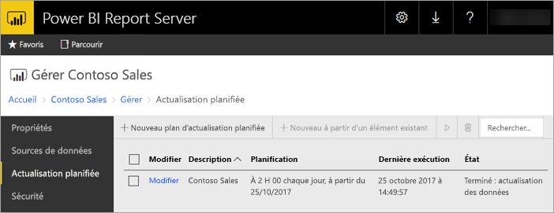
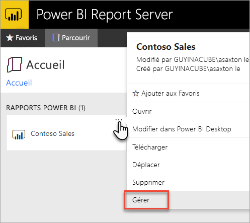
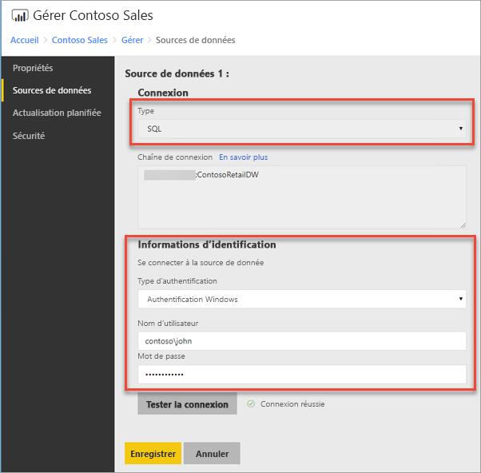
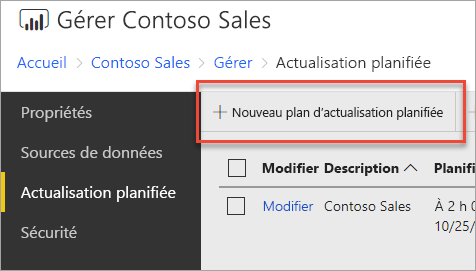
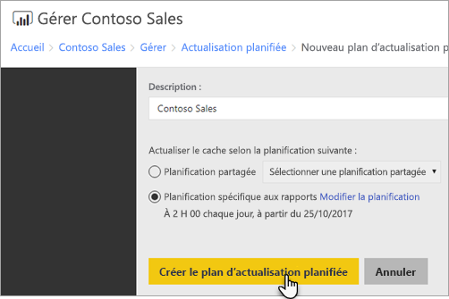
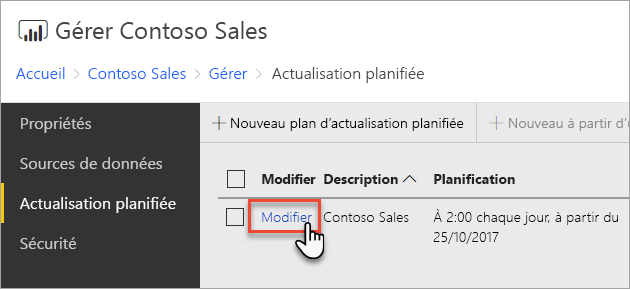
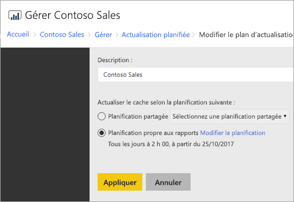

# Comment configurer une actualisation planifiée de rapport Power BI
Pour actualiser les données dans votre rapport Power BI, vous devez créer un plan d’actualisation planifiée. Cela s’effectue à l’intérieur de la zone *Gérer* d’un rapport Power BI.

## Configurer les informations d’identification de la source de données
Avant de créer un plan d’actualisation des données planifiée, vous devez définir les informations d’identification pour **chaque source de données** utilisée dans votre rapport Power BI.

1. Dans le portail web, cliquez avec le bouton droit sur le rapport Power BI, puis sélectionnez **Gérer**.
   
    
2. Dans le menu de gauche, sélectionnez l’onglet **Sources de données**.
3. Pour chaque source de données qui s’affiche, choisissez le type d’authentification à utiliser lors de la connexion à cette source de données. Entrez les informations d’identification appropriées.
   
    

## Création d’un plan d’actualisation planifiée
Pour créer un plan d’actualisation planifiée, procédez comme suit.

1. Dans le portail web, cliquez avec le bouton droit sur le rapport Power BI, puis sélectionnez **Gérer**.
   
    
2. Dans le menu de gauche, sélectionnez l’onglet **Actualisation planifiée**.
3. Dans la page **Actualisation planifiée**, sélectionnez **Nouveau plan d’actualisation planifiée**.
   
    
4. Dans la page **Nouveau plan d’actualisation planifiée**, entrez une description et définissez une planification du moment où vous souhaitez que votre modèle de données soit actualisé.
5. Lorsque vous avez terminé, sélectionnez **Créer le plan d’actualisation planifiée**.
   
    

## Modification d’un plan d’actualisation planifiée
La modification d’un plan d’actualisation planifiée est similaire à sa création.

1. Dans le portail web, cliquez avec le bouton droit sur le rapport Power BI, puis sélectionnez **Gérer**.
   
    
2. Dans le menu de gauche, sélectionnez l’onglet **Actualisation planifiée**.
3. Dans la page **Actualisation planifiée**, sélectionnez **Modifier** en regard du plan d’actualisation que vous souhaitez gérer.
   
    
4. Dans la page **Modifier un plan d’actualisation planifiée**, entrez une description et définissez une planification du moment où vous souhaitez que votre modèle de données soit actualisé.
5. Lorsque vous avez terminé, sélectionnez **Appliquer**.
   
    

## Affichage de l’état d’un plan d’actualisation planifiée
Affichez l’état d’un plan d’actualisation planifiée dans le portail web.

1. Dans le portail web, cliquez avec le bouton droit sur le rapport Power BI, puis sélectionnez **Gérer**.
   
    
2. Dans le menu de gauche, sélectionnez l’onglet **Actualisation planifiée**.
3. Dans la page **Actualisation planifiée**, la colonne la plus à droite affiche l’état d’un plan.
   
   | **État** | **Description** |
   | --- | --- |
   | Nouveau plan d’actualisation planifiée |Le plan a été créé mais pas été exécuté. |
   | Actualisation |Le processus d’actualisation a démarré. |
   | Modèle de diffusion en continu vers Analysis Server |Copie du modèle à partir de la base de données du catalogue du serveur de rapports vers l’instance Analysis Services hébergée. |
   | Actualisation des données |Actualisation des données dans le modèle. |
   | Suppression des informations d’identification du modèle |Suppression du modèle des informations d’identification utilisées pour se connecter à la source de données. |
   | Enregistrement du modèle dans le catalogue |L’actualisation des données est terminée et le modèle actualisé est réenregistré dans la base de données du catalogue du serveur de rapports. |
   | Terminé : actualisation des données |L’actualisation est terminée. |
   | Erreur : |Une erreur s’est produite lors de l’actualisation et s’affiche. |

La page web doit être actualisée pour afficher l’état actuel. L’état ne changera pas automatiquement.

## Étapes suivantes
Pour en savoir plus sur la création et la modification de planifications, voir [Créer, modifier et supprimer des planifications](https://docs.microsoft.com/sql/reporting-services/subscriptions/create-modify-and-delete-schedules).

Pour plus d’informations sur la façon de résoudre les problèmes d’actualisation planifiée, voir [Résoudre les problèmes d’actualisation planifiée dans Power BI Report Server](scheduled-refresh-troubleshoot.md).

D’autres questions ? [Essayez d’interroger la communauté Power BI](https://community.powerbi.com/)

