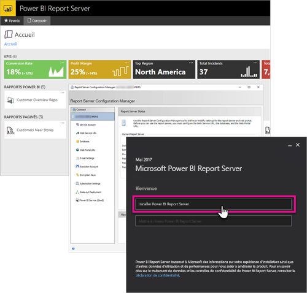

# Présentation du Manuel du développeur, Power BI Report Server

Bienvenue dans le Manuel du développeur pour Power BI Report Server, un emplacement local destiné au stockage et à la gestion de vos rapports Power BI mobiles et paginés.

Ce manuel met en évidence les options dont vous disposez en tant que développeur pour travailler avec Power BI Report Server.

## Incorporation

Dans Power BI Report Server, vous pouvez incorporer tout rapport dans un iFrame en ajoutant le paramètre QueryString `?rs:Embed=true` à l’URL. Cette technique fonctionne avec les rapports Power BI ainsi qu’avec d’autres types de rapports.

### Contrôle Visionneuse de rapports

Pour les rapports paginés, vous pouvez tirer parti du contrôle Visionneuse de rapports. Avec celui-ci, vous pouvez placer le contrôle dans une fenêtre ou une application web .NET. Pour plus d’informations, voir [Prise en main du contrôle Visionneuse de rapports](https://docs.microsoft.com/sql/reporting-services/application-integration/integrating-reporting-services-using-reportviewer-controls-get-started).

## API

Vous disposez de plusieurs options d’API permettant d’interagir avec Power BI Report Server. Cette technique inclut les éléments suivants.

* [API REST](rest-api.md)
* [Accès URL](https://docs.microsoft.com/sql/reporting-services/url-access-ssrs)
* [Fournisseur WMI](https://docs.microsoft.com/sql/reporting-services/wmi-provider-library-reference/reporting-services-wmi-provider-library-reference-ssrs)

Vous pouvez aussi utiliser des [utilitaires PowerShell](https://github.com/Microsoft/ReportingServicesTools) open source pour gérer votre serveur de rapports.

> [!NOTE]
> Les utilitaires PowerShell ne prennent actuellement pas en charge les fichiers Power BI Desktop (.pbix).

## Extensions personnalisées

La bibliothèque d’extensions est un ensemble de classes, d’interfaces et de types de valeurs inclus dans Power BI Report Server. Cette bibliothèque donne accès à des fonctionnalités système et est conçue pour être le fondement sur lequel des applications Microsoft .NET Framework peuvent être utilisées pour étendre des composants de Power BI Report Server.

Vous pouvez créer plusieurs types d’extensions.

* Extensions de traitement des données
* Extensions de remise
* Extensions de rendu pour les rapports paginés
* Extensions de sécurité

Pour plus d’informations, voir [Bibliothèque d’extensions](https://docs.microsoft.com/sql/reporting-services/extensions/reporting-services-extension-library).

## Étapes suivantes

[Prise en main du contrôle Visionneuse de rapports](https://docs.microsoft.com/sql/reporting-services/application-integration/integrating-reporting-services-using-reportviewer-controls-get-started)  
[Création d’Applications à l’aide du service web et de .NET Framework](https://docs.microsoft.com/sql/reporting-services/report-server-web-service/net-framework/building-applications-using-the-web-service-and-the-net-framework)  
[Accès URL](https://docs.microsoft.com/sql/reporting-services/url-access-ssrs)  
[Bibliothèque d’extensions](https://docs.microsoft.com/sql/reporting-services/extensions/reporting-services-extension-library)  
[Fournisseur WMI](https://docs.microsoft.com/sql/reporting-services/wmi-provider-library-reference/reporting-services-wmi-provider-library-reference-ssrs)

D’autres questions ? [Essayez d’interroger la communauté Power BI](https://community.powerbi.com/)