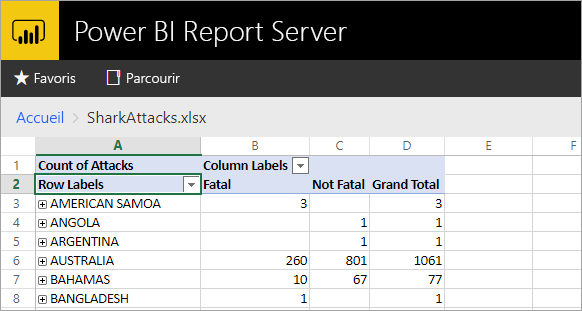
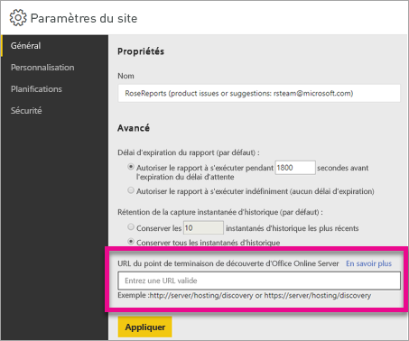

# <a name="configure-your-report-server-to-host-excel-workbooks-using-office-online-server-oos"></a>Configurer votre serveur de rapports pour héberger des classeurs Excel à l’aide d’Office Online Server (OOS)

Outre l’affichage de rapports Power BI sur le portail web, Power BI Report Server peut héberger des classeurs Excel à l’aide de [Office Online Server](/officeonlineserver/office-online-server-overview) (OOS). Votre serveur de rapports devient un emplacement unique pour publier et afficher le contenu de Microsoft BI en libre-service.



## <a name="prepare-server-to-run-office-online-server"></a>Préparer le serveur à l’exécution d’Office Online Server

Effectuez les procédures suivants sur le serveur qui doit exécuter Office Online Server. Il doit s’agir d’un serveur Windows Server 2012 R2 ou Windows Server 2016. Windows Server 2016 requiert la version d’avril 2017 d’Office Online Server ou une version ultérieure.

### <a name="install-prerequisite-software-for-office-online-server"></a>Installer les logiciels requis pour Office Online Server

1. Ouvrez l’invite de Windows PowerShell en tant qu’administrateur, puis exécutez cette commande pour installer les rôles et services requis.

    **Windows Server 2012 R2 :**

    ```powershell
    Add-WindowsFeature Web-Server,Web-Mgmt-Tools,Web-Mgmt-Console,Web-WebServer,Web-Common-Http,Web-Default-Doc,Web-Static-Content,Web-Performance,Web-Stat-Compression,Web-Dyn-Compression,Web-Security,Web-Filtering,Web-Windows-Auth,Web-App-Dev,Web-Net-Ext45,Web-Asp-Net45,Web-ISAPI-Ext,Web-ISAPI-Filter,Web-Includes,InkandHandwritingServices,NET-Framework-Features,NET-Framework-Core,NET-HTTP-Activation,NET-Non-HTTP-Activ,NET-WCF-HTTP-Activation45,Windows-Identity-Foundation,Server-Media-Foundation
    ```

    **Windows Server 2016 :**

    ```powershell
    Add-WindowsFeature Web-Server,Web-Mgmt-Tools,Web-Mgmt-Console,Web-WebServer,Web-Common-Http,Web-Default-Doc,Web-Static-Content,Web-Performance,Web-Stat-Compression,Web-Dyn-Compression,Web-Security,Web-Filtering,Web-Windows-Auth,Web-App-Dev,Web-Net-Ext45,Web-Asp-Net45,Web-ISAPI-Ext,Web-ISAPI-Filter,Web-Includes,NET-Framework-Features,NET-Framework-45-Features,NET-Framework-Core,NET-Framework-45-Core,NET-HTTP-Activation,NET-Non-HTTP-Activ,NET-WCF-HTTP-Activation45,Windows-Identity-Foundation,Server-Media-Foundation
    ```

    Si vous y êtes invité, redémarrez le serveur.
2. Installez les logiciels suivants :

   * [.NET Framework 4.5.2](https://go.microsoft.com/fwlink/p/?LinkId=510096)
   * [Packages redistribuables Visual C++ pour Visual Studio 2013](https://www.microsoft.com/download/details.aspx?id=40784)
   * [Redistribuable Visual C++ pour Visual Studio 2015](https://go.microsoft.com/fwlink/p/?LinkId=620071)
   * [Microsoft.IdentityModel.Extention.dll](https://go.microsoft.com/fwlink/p/?LinkId=620072)

### <a name="install-office-online-server"></a>Installer Office Online Server

Si vous envisagez d’exploiter des fonctionnalités d’Excel Online qui utilisent un accès à des données externes (par exemple, Power Pivot), notez qu’Office Online Server doit résider dans la même forêt Active Directory que ses utilisateurs, tout comme toutes les sources de données externes auxquelles vous prévoyez d’accéder à l’aide d’une authentification basée sur Windows.

1. Téléchargez Office Online Server à partir du [Centre de gestion des licences en volume (VLSC)](https://go.microsoft.com/fwlink/p/?LinkId=256561). Le téléchargement est accessible sous ces produits Office sur le portail VLSC. À des fins de développement, vous pouvez télécharger OOS à partir de MSDN Subscriber Downloads.
2. Exécutez Setup.exe.
3. Dans la page **Lire les termes du contrat de licence logiciel Microsoft**, sélectionnez **J’accepte les termes de ce contrat**, puis **Continuer**.
4. Dans la page **Choisir un emplacement de fichier**, sélectionnez le dossier où installer les fichiers Office Online Server (par exemple, C:\Program Files\Microsoft Office Web Apps\*) et sélectionnez **Installer maintenant**. Si le dossier spécifié n’existe pas, le programme d’installation le crée pour vous.

    Nous vous recommandons d’installer Office Online Server sur le lecteur système.

5. Lorsque le programme d’installation a terminé l’installation d’Office Online Server, sélectionnez **Fermer**.

### <a name="install-language-packs-for-office-web-apps-server-optional"></a>Installer les modules linguistiques pour Office Web Apps Server (facultatif)

Les modules linguistiques pour Office Online Server permettent aux utilisateurs d’afficher des fichiers Office sur web dans plusieurs langues.

Pour installer les modules linguistiques, procédez comme suit.

1. Téléchargez les modules linguistiques pour Office Online Server à partir du [Centre de téléchargement Microsoft](https://go.microsoft.com/fwlink/p/?LinkId=798136).
2. Exécutez **wacserverlanguagepack.exe**.
3. Dans l’Assistant d’installation de module linguistique pour Office Online Server, dans la page **Lire les termes du contrat de licence logiciel Microsoft**, sélectionnez **J’accepte les termes de ce contrat**, puis **Continuer**.
4. Lorsque le programme d’installation a terminé l’installation d’Office Online Server, sélectionnez **Fermer**.

## <a name="deploy-office-online-server"></a>Déployer Office Online Server

### <a name="create-the-office-online-server-farm-https"></a>Créer une batterie de serveurs Office Online Server (HTTPS)

Utilisez la commande New-OfficeWebAppsFarm pour créer une batterie de serveurs Office Online Server composée d’un serveur unique, comme illustré dans l’exemple suivant.

```powershell
New-OfficeWebAppsFarm -InternalUrl "https://server.contoso.com" -ExternalUrl "https://wacweb01.contoso.com" -CertificateName "OfficeWebApps Certificate"
```

**Paramètres**

* **– InternalURL** est le nom de domaine complet (FQDN) du serveur exécutant Office Online Server, tel que `https://servername.contoso.com`.
* **– ExternalURL** est le nom de domaine complet (FQDN) accessible sur Internet.
* **–CertificateName** est le nom convivial du certificat.

### <a name="create-the-office-online-server-farm-http"></a>Créer la batterie de serveurs Office Online Server (HTTP)

Utilisez la commande New-OfficeWebAppsFarm pour créer une batterie de serveurs Office Online Server composée d’un serveur unique, comme illustré dans l’exemple suivant.

```powershell
New-OfficeWebAppsFarm -InternalURL "https://servername" -AllowHttp
```

**Paramètres**

* **–InternalURL** est le nom du serveur exécutant Office Online Server, tel que `https://servername`.
* **– AllowHttp** configure la batterie de serveurs pour utiliser le protocole HTTP.

### <a name="verify-that-the-office-online-server-farm-was-created-successfully"></a>Vérifier que la batterie de serveurs Office Online Server a été correctement créée

Une fois la batterie de serveurs créée, des détails sur celle-ci apparaissent dans l’invite Windows PowerShell. Pour vérifier qu’Office Online Server est correctement installé et configuré, utilisez un navigateur web pour accéder à l’URL de découverte d’Office Online Server, comme illustré dans l’exemple suivant. L’URL de découverte est le paramètre *InternalUrl* que vous avez spécifié lors de la configuration de votre batterie de serveurs Office Online Server, suivi de */hosting/discovery*. Par exemple :

```
<InternalUrl>/hosting/discovery
```

Si Office Online Server fonctionne comme prévu, vous devez voir un fichier XML Web Application Open Platform Interface Protocol (WOPI)-discovery dans votre navigateur web. Les quelques premières lignes de ce fichier doivent ressembler à l’exemple suivant :

```xml
<?xml version="1.0" encoding="utf-8" ?> 
<wopi-discovery>
<net-zone name="internal-http">
<app name="Excel" favIconUrl="<InternalUrl>/x/_layouts/images/FavIcon_Excel.ico" checkLicense="true">
<action name="view" ext="ods" default="true" urlsrc="<InternalUrl>/x/_layouts/xlviewerinternal.aspx?<ui=UI_LLCC&><rs=DC_LLCC&>" /> 
<action name="view" ext="xls" default="true" urlsrc="<InternalUrl>/x/_layouts/xlviewerinternal.aspx?<ui=UI_LLCC&><rs=DC_LLCC&>" /> 
<action name="view" ext="xlsb" default="true" urlsrc="<InternalUrl>/x/_layouts/xlviewerinternal.aspx?<ui=UI_LLCC&><rs=DC_LLCC&>" /> 
<action name="view" ext="xlsm" default="true" urlsrc="<InternalUrl>/x/_layouts/xlviewerinternal.aspx?<ui=UI_LLCC&><rs=DC_LLCC&>" /> 
```

### <a name="configure-excel-workbook-maximum-size"></a>Configurer la taille maximale de classeur Excel

La taille de fichier maximale pour tous les fichiers dans Power BI Report Server est de 100 Mo. Pour vous aligner sur cette limite, vous devez la définir manuellement dans OOS.

```powershell
Set-OfficeWebAppsFarm -ExcelWorkbookSizeMax 100
```

## <a name="using-effectiveusername-with-analysis-services"></a>Utilisation d’EffectiveUserName avec Analysis Services

Pour autoriser des connexions actives à Analysis Services, pour des connexions au sein d’un classeur Excel qui utilisent EffectiveUserName. Pour qu’OOS utilise EffectiveUserName, vous devez ajouter le compte d’ordinateur du serveur OOS en tant qu’administrateur pour l’instance Analysis Services. Pour ce faire, vous devez disposer de SQL Server Management Studio 2016.

Seules les connexions Analysis Services incorporées sont actuellement prises en charge dans un classeur Excel. Le compte de l’utilisateur doit être autorisé à se connecter à Analysis Services, car il n’existe aucune possibilité d’utiliser un proxy pour l’utilisateur.

Exécutez les commandes PowerShell suivantes sur le serveur OOS.

```powershell
Set-OfficeWebAppsFarm -ExcelUseEffectiveUserName:$true
Set-OfficeWebAppsFarm -ExcelAllowExternalData:$true
Set-OfficeWebAppsFarm -ExcelWarnOnDataRefresh:$false
```

## <a name="configure-a-power-pivot-instance-for-data-models"></a>Configurer une instance du mode Power Pivot pour les modèles de données

L’installation d’une instance du mode Power Pivot d’Analysis Services vous permet de travailler avec des classeurs Excel qui utilisent Power Pivot. Assurez-vous que le nom d’instance est *POWERPIVOT*. Ajoutez le compte d’ordinateur du serveur OOS en tant qu’administrateur pour l’instance du mode PowerPivot d’Analysis Services. Pour ce faire, vous devez disposer de SQL Server Management Studio 2016.

Pour qu’OOS utilise l’instance du mode Power Pivot, exécutez la commande suivante.

```powershell
New-OfficeWebAppsExcelBIServer -ServerId <server_name>\POWERPIVOT
```

Si vous n’avez pas encore autorisé les données externes, à partir de l’étape Analysis Services ci-dessus, exécutez la commande suivante.

```powershell
Set-OfficeWebAppsFarm -ExcelAllowExternalData:$true
```

### <a name="firewall-considerations"></a>Considérations relatives au pare-feu

Pour éviter d’éventuels problèmes de pare-feu, il se peut que vous deviez ouvrir les ports 2382 et 2383. Vous pouvez également ajouter le fichier *msmdsrv.exe*, pour l’instance PowerPivot, en tant que stratégie de pare-feu d’application.

## <a name="configure-power-bi-report-server-to-use-the-oos-server"></a>Configurer Power BI Report Server pour utiliser le serveur OOS

Dans la page **Général** des **Paramètres du site**, entrez l’URL de découverte d’OOS. L’URL de découverte d’OOS est la valeur du paramètre *InternalUrl* utilisée lors du déploiement du serveur OOS, suivie de */hosting/discovery*. Par exemple, `https://servername/hosting/discovery` pour le protocole HTTP. Et `https://server.contoso.com/hosting/discovery` pour le protocole HTTPS.

Pour accéder aux **Paramètres du site**, sélectionnez l’**icône d’engrenage** en haut à droite, puis choisissez **Paramètres du site**.

Seul un utilisateur avec le rôle **Administrateur système** peut voir la valeur de l’URL de découverte d’Office Online Server.



Après que vous avez entré l’URL de découverte, puis sélectionné **Appliquer**, la sélection d’un classeur Excel au sein du portail web doit avoir pour effet d’afficher ce classeur sur le portail.

## <a name="limitations-and-considerations"></a>Considérations et limitations

- Vous pouvez accéder aux classeurs en lecture seule.
- L’actualisation planifiée n’est pas prise en charge pour les classeurs Excel dans Power BI Report Server.

## <a name="next-steps"></a>Étapes suivantes

[Vue d’ensemble de l’administrateur](admin-handbook-overview.md)  
[Installer Power BI Report Server](install-report-server.md)  
[Télécharger le Générateur de rapports](https://www.microsoft.com/download/details.aspx?id=53613)  
[Télécharger SQL Server Data Tools (SSDT)](/sql/ssdt/download-sql-server-data-tools-ssdt)

D’autres questions ? [Essayez d’interroger la communauté Power BI](https://community.powerbi.com/)