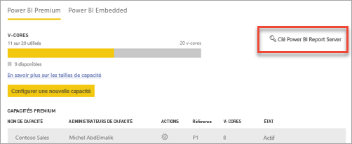
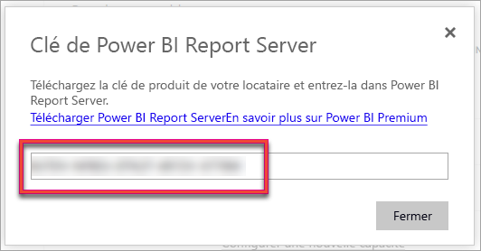
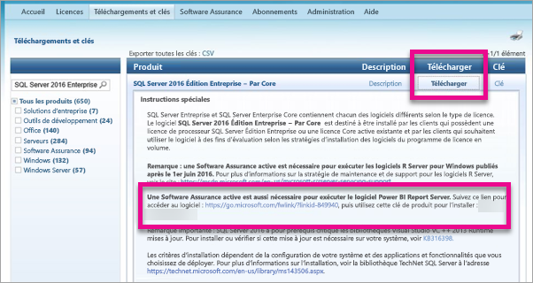

# Trouver la clé de produit de votre serveur de rapports
Découvrez comment vous pouvez trouver votre clé de produit Power BI Report Server pour installer votre serveur dans un environnement de production.

<iframe width="640" height="360" src="https://www.youtube.com/embed/6CQnf-NGtpU?rel=0&amp;showinfo=0" frameborder="0" allowfullscreen></iframe>

Vous avez téléchargé Power BI Report Server et vous disposez d’un contrat Software Assurance SQL Server Entreprise. Ou vous avez acheté Power BI Premium. Vous souhaitez installer le serveur dans un environnement de production, mais vous avez besoin d’une clé de produit. Où se trouve-t-elle ? 

La clé de produit peut être dans deux emplacements, selon ce que vous avez acheté.

## Achat de Power BI Premium
Si vous avez acheté Power BI Premium, la clé de produit de votre instance de Power BI Report Server est accessible à partir de l’onglet **Capacité Premium** du portail d’administration Power BI. Celle-ci est réservée aux administrateurs généraux ou aux utilisateurs dotés du rôle d’administrateur du service Power BI.

La sélection de **Clé de Power BI Report Server** a pour effet d’afficher une boîte de dialogue contenant votre clé de produit. Copiez-la pour l’utiliser lors de l’installation.

## Contrat Software Assurance acheté
Si vous disposez d’un contrat SQL Server Entreprise SA, vous pouvez vous procurer votre clé de produit auprès du [Centre de gestion des licences en volume](https://www.microsoft.com/Licensing/servicecenter/). Regardez sous le dernier service pack pour connaître la dernière version de SQL Server. Si celle-ci n’apparaît pas, regardez sous la version RTM de la dernière version de SQL Server.

> [!NOTE]
> Vous devez consulter la section sur le téléchargement. Pas la section sur les Clés.
> 
> 

 
## Étapes suivantes
[Installer Power BI Report Server](install-report-server.md)  
[Installer Power BI Desktop optimisé pour Power BI Report Server](install-powerbi-desktop.md)  
[Télécharger le Générateur de rapports](https://www.microsoft.com/download/details.aspx?id=53613)  
[Télécharger SQL Server Data Tools (SSDT)](https://go.microsoft.com/fwlink/?LinkID=616714)

D’autres questions ? [Essayez d’interroger la communauté Power BI](https://community.powerbi.com/)

