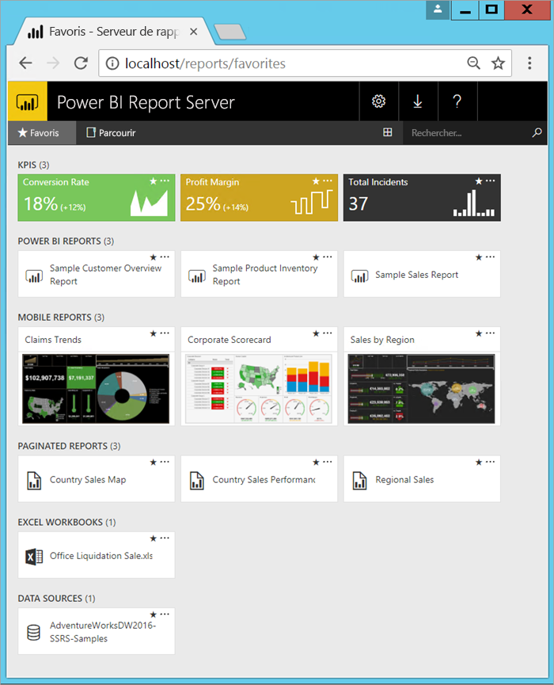

# Présentation de Power BI Report Server

Power BI Report Server est un serveur de rapports local avec un portail web, qui vous permet d’afficher et de gérer des rapports et des indicateurs de performance clés, avec des outils pour créer des rapports Power BI, des rapports paginés, des rapports mobiles et des indicateurs de performance clés. Vos utilisateurs peuvent accéder à ces rapports de différentes façons : les afficher dans un navigateur web ou un appareil mobile, ou sous forme d’e-mail dans leur boîte de réception.

## Comparaison de Power BI Report Server 
Power BI Report Server ressemble à la fois à SQL Server Reporting Services et au service en ligne Power BI, mais avec quelques différences. Comme le service Power BI, Power BI Report Server héberge des rapports Power BI (.PBIX) et des fichiers Excel. Comme Reporting Services, Power BI Report Server est installé localement et héberge des rapports paginés (.RDL). Power BI Report Server est un sur-ensemble de Reporting Services : tout ce que vous pouvez faire dans Reporting Services, vous pouvez aussi le faire avec Power BI Report Server et plus encore, avec la prise en charge des rapports Power BI. Consultez [Comparer Power BI Report Server et le service Power BI](compare-report-server-service.md) pour plus d’informations.

## Gestion des licences Power BI Report Server
Power BI Report Server est disponible avec deux licences : [Power BI Premium](../service-premium.md) et [SQL Server Enterprise Edition](https://www.microsoft.com/sql-server/sql-server-2017-editions) avec Software Assurance. Une licence Power BI Premium vous permet de créer un déploiement hybride combinant ressources dans le cloud et ressources locales.  

## Portail web
Le point d’entrée de Power BI Report Server est un portail web sécurisé affichable dans n’importe quel navigateur moderne. Ici, vous pouvez accéder à l’ensemble de vos rapports et indicateurs de performance clés. Le contenu du portail web est organisé sous forme d’une hiérarchie standard de dossiers. Dans vos dossiers, le contenu est organisé par type : rapports Power BI, rapports mobiles, rapports paginés, indicateurs de performance clés et classeurs Excel, mais aussi jeux de données partagés et sources de données à utiliser comme blocs de construction pour vos rapports. Vous pouvez marquer des favoris pour les afficher dans un dossier unique. Vous pouvez également créer des indicateurs de performance clés directement dans le portail web. 

Selon vos autorisations, vous pouvez gérer le contenu dans le portail web. Vous pouvez planifier le traitement des rapports, accéder à des rapports à la demande et vous abonner à des rapports publiés. Vous pouvez également [personnaliser](https://docs.microsoft.com/sql/reporting-services/branding-the-web-portal) votre portail web. 

En savoir plus sur le [portail web Power BI Report Server](https://docs.microsoft.com/sql/reporting-services/web-portal-ssrs-native-mode).

## Rapports Power BI
Vous créez des rapports Power BI (.PBIX) avec la version Power BI Desktop optimisée pour le serveur de rapports. Puis vous publiez et affichez ces rapports dans le portail web de votre propre environnement.

Un rapport Power BI est un affichage sous plusieurs angles d’un modèle de données, comportant des visualisations de différentes observations et informations concernant ce modèle de données.  Un rapport peut comprendre une seule visualisation ou des pages remplies de visualisations. Selon votre rôle, vous pouvez lire et explorer des rapports, ou les créer pour d’autres utilisateurs.

Installez [Power BI Desktop optimisé pour Power BI Report Server](quickstart-create-powerbi-report.md).

## Rapports paginés
Les rapports paginés (.RDL) sont des rapports de style document avec des visualisations, dans lesquels des tables se développent horizontalement et verticalement pour afficher toutes les données et page après page, selon les besoins. Ils conviennent bien pour la génération de documents à disposition fixe, précis au pixel près, optimisés pour l’impression, tels que des fichiers PDF et Word.

Vous pouvez créer des rapports d’aspect moderne à l’aide du [Générateur de rapports](https://docs.microsoft.com/sql/reporting-services/report-builder/report-builder-in-sql-server-2016) ou du Concepteur de rapports dans [SQL Server Data Tools (SSDT)](https://docs.microsoft.com/sql/reporting-services/tools/reporting-services-in-sql-server-data-tools-ssdt).

## Rapports mobiles Reporting Services
Les rapports mobiles se connectent aux données locales, avec une disposition réactive qui s’adapte aux différents appareils et aux différentes façons dont vous les conservez. Vous les créez dans l’Éditeur de rapports mobiles Microsoft SQL Server.

En savoir plus sur les [Rapports mobiles Reporting Services](https://docs.microsoft.com/sql/reporting-services/mobile-reports/create-mobile-reports-with-sql-server-mobile-report-publisher). 

## Fonctionnalités de programmation de Report Server
Tirez parti des fonctionnalités de programmation de Power BI Report Server pour étendre et personnaliser vos fonctionnalités de création de rapports avec des API pour intégrer ou étendre le traitement des données et des rapports dans des applications personnalisées.

Plus de [Documentation pour les développeurs de Reporting Services](https://docs.microsoft.com/sql/reporting-services/reporting-services-developer-documentation).

## Étapes suivantes
[Installer Power BI Report Server](install-report-server.md)  
[Installer le Générateur de rapports](https://docs.microsoft.com/sql/reporting-services/install-windows/install-report-builder)  

D’autres questions ? [Essayez d’interroger la communauté Power BI](https://community.powerbi.com/)

