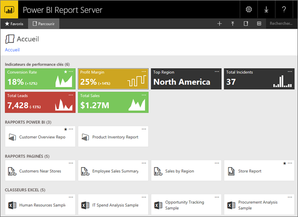
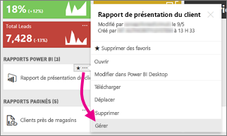
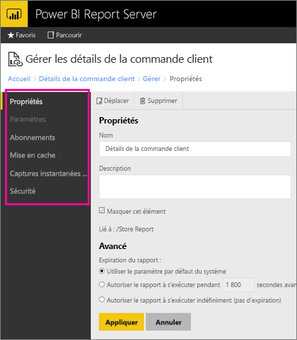
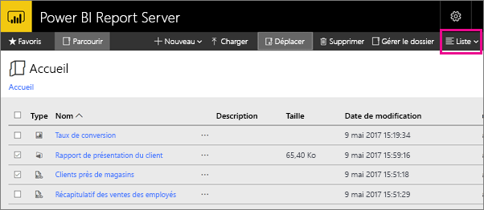

# Navigation dans le portail web Power BI Report Server
Le portail web Power BI Report Server est un emplacement local destiné à l’affichage, au stockage et à la gestion de vos rapports mobiles et paginés, ainsi que de vos indicateurs de performance clés Power BI.

Vous pouvez afficher le portail web dans tout navigateur moderne. Dans le portail web, rapports et les indicateurs de performance clés sont organisés en dossiers, et vous pouvez les marquer en tant que favoris. Vous pouvez également y stocker des classeurs Excel. À partir du portail web, vous pouvez lancer les outils nécessaires pour créer des rapports :

* **Rapports Power BI** créés avec Power BI Desktop : consultez-les dans le portail web et les applications mobiles Power BI.
* **Rapports paginés** créés dans le Générateur de rapports : documents d’aspect moderne à disposition fixe optimisés pour l’impression.
* **Indicateurs de performance clés** créés directement dans le portail web.

Dans le portail web, vous pouvez parcourir les dossiers du serveur de rapports ou rechercher des rapports spécifiques. Vous pouvez consulter un rapport, ses propriétés générales et ses anciennes versions capturées dans l’historique de rapport. Selon les autorisations dont vous disposez, vous pouvez également vous abonner à des rapports afin de recevoir ceux-ci dans votre boîte de réception ou de pouvoir y accéder dans un dossier partagé sur le système de fichiers.

## Tâches du portail web
Vous pouvez utiliser le portail web pour diverses tâches, à savoir :

* afficher, rechercher et imprimer des rapports, ainsi que vous abonner à ceux-ci ;
* créer, sécuriser et tenir à jour l’arborescence des dossiers pour organiser les éléments sur le serveur ;
* configurer les propriétés d’exécution, l’historique de rapport et les paramètres des rapports ;
* créer des planifications et des sources de données partagées pour faciliter la gestion des planifications et des connexions de source de données ;
* créer des abonnements pilotés par les données pour distribuer les rapports à un nombre important de destinataires ;
* créer des rapports liés pour réutiliser et réaffecter des rapports existants de différentes façons ;
* télécharger et ouvrir des outils courants tels que Power BI Desktop (serveur de rapports), le Générateur de rapports et l’Éditeur de rapports mobiles ;
* [créer des indicateurs de performance clés](https://docs.microsoft.com/sql/reporting-services/working-with-kpis-in-reporting-services) ;
* envoyer des commentaires ou formuler des demandes de fonctionnalités ;
* [personnaliser le portail web](https://docs.microsoft.com/sql/reporting-services/branding-the-web-portal) ;
* [utiliser des indicateurs de performance clés (KPI)](https://docs.microsoft.com/sql/reporting-services/working-with-kpis-in-reporting-services) ;
* [utiliser des datasets partagés](https://docs.microsoft.com/sql/reporting-services/work-with-shared-datasets-web-portal).

## Rôles et autorisations du portail web
Le portail web est une application web qui s’exécute dans un navigateur. Lorsque vous démarrez le portail web, les pages, les liens et les options accessibles varient selon les autorisations dont vous disposez sur le serveur de rapports. Si le rôle qui vous est attribué dispose de toutes les autorisations, vous avez accès à l’ensemble complet des menus et pages de l’application pour gérer un serveur de rapports. Si le rôle qui vous est attribué dispose des autorisations de consultation et d’exécution des rapports, vous avez accès uniquement aux menus et aux pages donc vous avez besoin pour mener ces activités. Vous pouvez avoir différentes attributions de rôle pour différents serveurs de rapports, voire pour divers rapports et dossiers sur un même serveur de rapports.

## Démarrez le portail web
1. Ouvrez votre navigateur web.
   
    Consultez la liste des [navigateurs web et des versions pris en charge](browser-support.md).
2. Dans la barre d’adresse, tapez l’URL du portail web.
   
    Par défaut, l’URL est *http://[NomOrdinateur]/reports*.
   
    Le serveur de rapports peut être configuré pour utiliser un port spécifique. Par exemple, *http://[NomOrdinateur]:80/reports* ou *http://[NomOrdinateur]:8080/reports*.
   
    Vous voyez les éléments des groupes du portail web dans les catégories suivantes :
   
   * indicateurs de performance clés (KPI) ;
   * rapports mobiles ;
   * rapports paginés ;
   * rapports Power BI Desktop ;
   * classeurs Excel ;
   * jeux de données ;
   * sources de données ;
   * ressources.

## Créer et modifier des rapports Power BI Desktop (fichiers .pbix)
Vous pouvez afficher, charger, créer, et organiser des rapports Power BI Desktop ainsi que gérer les autorisations les concernant via le portail web.

### Créer un rapport dans Power BI Desktop
1. Sélectionnez **Nouveau** > **Rapport Power BI**.
   
    
   
    L’application Power BI Desktop s’ouvre.
   
    
2. Créez votre rapport Power BI. Pour plus de détails, voir [Démarrage rapide : rapports Power BI](quickstart-create-powerbi-report.md).
3. Chargez votre rapport sur le serveur de rapports.

### Modifier un rapport Power BI Desktop
1. Sélectionnez les points de suspension (**...** ) dans l’angle supérieur droit de la vignette du rapport > **Modifier dans Power BI Desktop**.
   
    
   
    L’application Power BI Desktop s’ouvre.
2. Apportez vos modifications, puis enregistrez... [comment ?]

## Créer et modifier des rapports paginés (fichiers .rdl)
Vous pouvez afficher, charger, créer, et organiser des rapports paginés, ainsi que gérer les autorisations les concernant via le portail web.

### Créer un rapport paginé
1. Sélectionnez **Nouveau** > **Rapport paginé**.
   
    L’application Générateur de rapports s’ouvre.
   
    
2. Créez votre rapport paginé. Pour plus de détails, voir [Démarrage rapide : rapports paginés](quickstart-create-paginated-report.md).
3. Chargez votre rapport sur le serveur de rapports.

### Modifier un rapport paginé
1. Sélectionnez les points de suspension (... ) dans l’angle supérieur droit de la vignette du rapport > **Modifier dans le Générateur de rapports**.
   
    
   
    L’application Générateur de rapports s’ouvre.
2. Apportez vos modifications, puis enregistrez.

## Charger et organiser des classeurs Excel
Vous pouvez charger et organiser des rapports Power BI Desktop et des classeurs Excel, ainsi que gérer les autorisations les concernant. Ils seront regroupés au sein du portail web.

Les classeurs sont stockés dans Power BI Report Server, comme d’autres fichiers de ressources. La sélection d’un classeur a pour effet de télécharger celui-ci localement sur votre bureau. Vous pouvez enregistrer les modifications que vous y apportez en le chargeant à nouveau sur le serveur de rapports.

## Gérer les éléments dans le portail web
Power BI Report Server vous permet de contrôler avec précision sur les éléments que vous stockez sur le portail web. Par exemple, vous pouvez configurer les abonnements, la mise en cache, les instantanés et la sécurité de chaque rapport paginé.

1. Sélectionnez les points de suspension (...) dans l’angle supérieur droit d’un élément, puis choisissez **Gérer**.
   
    
2. Choisissez la propriété ou une fonctionnalité à définir.
   
    
3. Sélectionnez **Appliquer**.

Pour en savoir plus, voir [Gestion des abonnements via le portail web](https://docs.microsoft.com/sql/reporting-services/working-with-subscriptions-web-portal).

## Marquer vos rapports et indicateurs de performance clés favoris
Vous pouvez marquer les rapports et indicateurs de performance clés que vous souhaitez voire figurer parmi vos favoris. Ils sont ensuite plus faciles à trouver, car ils sont rassemblés dans un seul dossier Favoris, tant sur le portail web que dans les applications mobiles Power BI. 

1. Sélectionnez les points de suspension (**...** ) dans l’angle supérieur droit d’un indicateur de performance clé ou d’un rapport que vous souhaitez faire figurer parmi les favoris, puis choisissez **Ajouter aux Favoris**.
   
    
2. Sélectionnez **Favoris** sur le ruban du portail web pour l’afficher avec vos autres favoris sur la page Favoris du portail web.
   
    
   
    Désormais, dans les applications mobiles Power BI, vous voyez ces favoris ainsi que vos tableaux de bord favoris du service Power BI.
   
    

## Masquer ou afficher des éléments dans le portail web
Dans le portail web, vous pouvez masquer ou afficher les éléments de votre choix.

### Masquer un élément
1. Sélectionnez les points de suspension (...) dans l’angle supérieur droit d’un élément, puis choisissez **Gérer**.
   
    
2. Sélectionnez **Masquer cet élément**.
   
    
3. Sélectionnez **Appliquer**.

### Afficher des éléments masqués
1. Sélectionnez **Vignettes** (ou **Liste**) dans l’angle supérieur droit > **Afficher les éléments masqués**.
   
    Les éléments s’affichent. Ils sont grisés, mais vous pouvez toujours les ouvrir et les modifier.
   
    

## Rechercher des éléments
Vous pouvez entrer dans une équipe de recherche afin d’afficher tous les éléments qui vous sont accessibles. Les résultats sont classés en indicateurs de performance clés, rapports, datasets et autres éléments. Vous pouvez interagir avec les résultats et les ajouter à vos favoris.  

## Déplacer ou supprimer des éléments en mode Liste
Par défaut, le contenu du portail web s’affiche en mode Vignettes.

Vous pouvez basculer vers le mode Liste qui facilite le déplacement ou la suppression de plusieurs éléments à la fois. 

1. Sélectionnez **Vignettes** > **Liste**.
   
    
2. Sélectionnez les éléments, puis choisissez **Déplacer** ou **Supprimer**.

## Étapes suivantes
[Manuel de l’utilisateur](user-handbook-overview.md)  
[Démarrage rapide : rapports paginés](quickstart-create-paginated-report.md)  
[Démarrage rapide : rapports Power BI](quickstart-create-powerbi-report.md)

D’autres questions ? [Essayez d’interroger la communauté Power BI](https://community.powerbi.com/)

