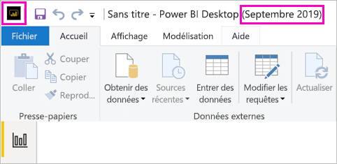

# Installer Power BI Desktop optimisé pour Power BI Report Server

Afin de créer des rapports Power BI pour Power BI Report Server, vous devez télécharger et installer la version de Power BI Desktop qui est optimisée pour Power BI Report Server. Il s’agit d’une version différente de Power BI Desktop utilisée avec le service Power BI. Par exemple, la version de Power BI Desktop pour le service Power BI présente des fonctionnalités en préversion qui ne sont pas dans la version Power BI Report Server tant qu’elles ne sont pas en disponibilité générale. Elle est nécessaire pour s’assurer que le serveur de rapports peut interagir avec une version connue des rapports et du modèle. 

La bonne nouvelle est que vous pouvez installer Power BI Desktop et Power BI Desktop optimisé pour Power BI Report Server côte à côte sur le même ordinateur.

## Télécharger et installer Power BI Desktop

Le moyen le plus simple d’avoir la version la plus récente de Power BI Desktop optimisée pour Power BI Report Server est de démarrer à partir du portail web de votre serveur de rapports.

1. Dans le portail web de votre serveur de rapports, sélectionnez la flèche **Télécharger** > **Power BI Desktop**.

    

    Vous pouvez accéder à la page d’accueil de [Power BI Report Server](https://powerbi.microsoft.com/report-server/) et sélectionner les **options de téléchargement avancées**.

2. Dans la page du Centre de téléchargement, sélectionnez une langue, puis sélectionnez **Télécharger**.

3. En fonction de votre ordinateur, sélectionnez : 

    - **PBIDesktopRS.msi** (version 32 bits) ou
    - **PBIDesktopRS_x64.msi** (version 64 bits).

1. Après avoir téléchargé le programme d’installation, exécutez l’Assistant Installation de Power BI Desktop (septembre 2019).

2. À la fin de l’installation, sélectionnez **Lancer Power BI Desktop**.

    Power BI Desktop démarre et vous pouvez l’utiliser.

## Vérifier que vous utilisez la version correcte
Il est facile de vérifier que vous utilisez la bonne version de Power BI Desktop : Regardez la barre de titre ou l’écran de démarrage dans Power BI Desktop. Vous pouvez voir que vous disposez de la version adéquate, car **Power BI Desktop (septembre 2019)** apparaît dans la barre de titre. De plus, les couleurs du logo Power BI sont inversées, jaune sur fond noir au lieu de noir sur fond jaune.

La barre de titre de la version de Power BI Desktop pour le service Power BI n’indique pas le mois et l’année.

## Association d’extension de fichier
Si vous installez Power BI Desktop et Power BI Desktop optimisé pour Power BI Report Server sur le même ordinateur, l’installation la plus récente de Power BI Desktop présente une association avec les fichiers .pbix. Par conséquent, quand vous double-cliquez sur un fichier .pbix, la version de Power BI Desktop que vous avez installée en dernier démarre.

Si vous avez Power BI Desktop, puis que vous installez Power BI Desktop optimisé pour Power BI Report Server, tous les fichiers .pbix s’ouvrent dans Power BI Desktop optimisé pour Power BI Report Server par défaut. Si vous préférez que Power BI Desktop soit démarré par défaut lors de l’ouverture d’un fichier pbix, réinstallez [Power BI Desktop à partir du Microsoft Store](https://aka.ms/pbidesktopstore).

Vous pouvez toujours commencer par ouvrir la version de Power BI Desktop que vous souhaitez utiliser, puis ouvrir le fichier à partir de Power BI Desktop.

La modification d’un rapport Power BI à partir de Power BI Report Server, ou la création d’un rapport Power BI à partir du portail web, ouvre toujours la version correcte de Power BI Desktop.

## Considérations et limitations

Les rapports Power BI dans Power BI Report Server, dans le service Power BI (https://app.powerbi.com) et dans les applications mobiles Power BI fonctionnent pratiquement de la même manière, mais certaines fonctionnalités diffèrent.

### Sélection d’une langue

Pour Power BI Desktop optimisé pour Power BI Report Server, vous sélectionnez la langue d’installation de l’application. Vous ne pouvez pas la changer après, mais vous pouvez installer une version dans une autre langue.

### Visuels de rapport dans un navigateur

Les rapports Power BI Report Server prennent en charge presque toutes les visualisations, notamment les visuels Power BI. Les rapports Power BI Report Server ne prennent pas en charge les fonctionnalités suivantes :

* Visuels R
* ArcGIS Maps
* Fil d’Ariane
* Fonctionnalités en préversion Power BI Desktop

### Rapports dans les applications mobiles Power BI

Les rapports Power BI Report Server prennent en charge toutes les fonctionnalités de base des [applications mobiles Power BI](../consumer/mobile/mobile-apps-for-mobile-devices.md), à savoir :

* [Disposition des rapports pour téléphone](../desktop-create-phone-report.md) : Vous pouvez optimiser un rapport pour les applications mobiles Power BI. Sur votre téléphone mobile, les rapports optimisés ont une icône  et une disposition spéciales.
  
    

Les rapports Power BI Report Server ne prennent pas en charge les fonctionnalités suivantes dans les applications mobiles Power BI :

* Visuels R
* ArcGIS Maps
* Visuels Power BI
* Fil d’Ariane
* Filtrage basé sur la géolocalisation ou codes barres

### Sécurité personnalisée

Power BI Desktop optimisé pour Power BI Report Server ne prend pas en charge la sécurité personnalisée. Si votre Power BI Report Server est configuré avec une extension de sécurité personnalisée, vous ne pouvez pas enregistrer un rapport Power BI à partir de Power BI Desktop (optimisé pour Power BI Report Server) sur l’instance Power BI Report Server. Vous devez enregistrer le fichier de rapport .pbix à partir de Power BI Desktop et le charger sur le site du portail Power BI Report Server.

## Power BI Desktop pour les versions antérieures de Power BI Report Server

Si votre serveur de rapports est d’une version antérieure, vous avez besoin de la version correspondante de Power BI Desktop. Voici le lien permettant de télécharger une version précédente.

- Microsoft Power BI Desktop ([optimisé pour Power BI Report Server - Septembre 2019](https://go.microsoft.com/fwlink/?linkid=2103723))

## Étapes suivantes

À présent que Power BI Desktop est installé, vous pouvez commencer à créer des rapports Power BI.

[Créer un rapport Power BI pour Power BI Report Server](quickstart-create-powerbi-report.md)  
[Présentation de Power BI Report Server](get-started.md)

D’autres questions ? [Essayez d’interroger la communauté Power BI](https://community.powerbi.com/)
