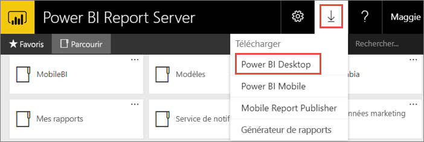
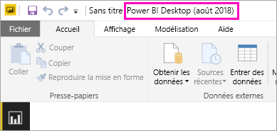
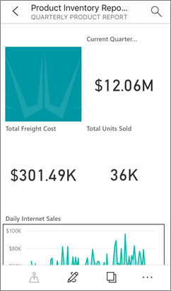

# Installer Power BI Desktop optimisé pour Power BI Report Server
Découvrez comment installer Power BI Desktop optimisé pour Power BI Report Server.

Afin de créer des rapports Power BI pour Power BI Report Server, vous devez télécharger et installer Power BI Desktop optimisé pour Power BI Report Server. Il s’agit d’une version différente de Power BI Desktop utilisée avec le service Power BI. Par exemple, la version de Power BI Desktop pour le service Power BI inclut des fonctionnalités en préversion qui ne sont pas disponibles dans la version Power BI Report Server une fois publiées. Elle est nécessaire pour s’assurer que le serveur de rapports peut interagir avec une version connue des rapports et du modèle. 

La bonne nouvelle est que vous pouvez installer Power BI Desktop et Power BI Desktop optimisé pour Power BI Report Server côte à côte sur le même ordinateur.

## Télécharger et installer Power BI Desktop

Le moyen le plus simple d’avoir la version la plus récente de Power BI Desktop optimisée pour Power BI Report Server est de démarrer à partir du portail web de votre serveur de rapports.

1. Dans le portail web de votre serveur de rapports, sélectionnez la flèche **Télécharger** > **Power BI Desktop**.

    

    Vous pouvez aussi accéder directement à [Microsoft Power BI Desktop](https://www.microsoft.com/download/details.aspx?id=57271) (optimisé pour Power BI Report Server - août 2018) dans le Centre de téléchargement Microsoft.

2. Dans la page du Centre de téléchargement, sélectionnez **Télécharger**.

3. En fonction de votre ordinateur, sélectionnez : 

    - **PBIDesktopRS.msi** (version 32 bits) ou

    - **PBIDesktopRS_x64.msi** (version 64 bits).

1. Après avoir téléchargé le programme d’installation, exécutez l’Assistant Installation de Power BI Desktop (août 2018).

2. À l’issue de l’installation, cochez **Démarrer Power BI Desktop maintenant**.
   
    Power BI Desktop démarre et vous pouvez l’utiliser.

## Vérifier que vous utilisez la version correcte
Vous pouvez vérifier que vous utilisez la version appropriée de Power BI Desktop en regardant l’écran de lancement ou la barre de titre dans Power BI Desktop. La barre de titre indique le mois et l’année de publication.

La barre de titre de la version Power BI Desktop du service Power BI n’affiche pas le mois et l’année.

## Association d’extension de fichier
Si vous avez installé Power BI Desktop et Power BI Desktop optimisé pour Power BI Report Server sur le même ordinateur, la dernière installation de Power BI Desktop a l’association de fichiers avec .pbix. Cela signifie que, lorsque vous double-cliquez sur un fichier pbix, cela a pour effet de lancer le dernier Power BI Desktop installé.

Si vous aviez Power BI Desktop, puis avez installé Power BI Desktop optimisé pour Power BI Report Server, tous les fichiers pbix s’ouvrent dans Power BI Desktop optimisé pour Power BI Report Server par défaut. Si préférez que Power BI Desktop soit l’application par défaut à lancer lors de l’ouverture d’un fichier pbix, réinstallez Power BI Desktop à partir du service Power BI.

Vous pouvez toujours commencer par ouvrir la version de Power BI Desktop que vous souhaitez utiliser, puis ouvrir le fichier à partir de Power BI Desktop.

La modification d’un rapport Power BI à partir de Power BI Report Server, ou la création d’un rapport Power BI à partir du portail web ont toujours pour effet d’ouvrir la version appropriée de Power BI Destop.

## Considérations et limitations
Les rapports Power BI dans Power BI Report Server, dans le service Power BI (http://app.powerbi.com) et dans les applications mobiles Power BI fonctionnent pratiquement de la même manière, mais certaines fonctionnalités diffèrent.

### Dans un navigateur
Les rapports Power BI Report Server prennent en charge toutes les visualisations, à savoir :

* Éléments visuels personnalisés

Les rapports Power BI Report Server ne prennent pas en charge les fonctionnalités suivantes :

* Visuels R
* ArcGIS Maps
* Fil d’Ariane
* Fonctionnalités en préversion Power BI Desktop

### Dans les applications mobiles Power BI
Les rapports Power BI Report Server prennent en charge toutes les fonctionnalités de base des [applications mobiles Power BI](../consumer/mobile/mobile-apps-for-mobile-devices.md), à savoir :

* [Disposition des rapports pour téléphone](../desktop-create-phone-report.md) : vous pouvez optimiser un rapport pour les applications mobiles Power BI. Sur votre téléphone mobile, les rapports optimisés ont une icône  et une disposition spéciales.
  
    

Les rapports Power BI Report Server ne prennent pas en charge les fonctionnalités suivantes dans les applications mobiles Power BI :

* Visuels R
* ArcGIS Maps
* Éléments visuels personnalisés
* Fil d’Ariane
* Filtrage basé sur la géolocalisation ou codes barres

## Power BI Desktop pour les versions antérieures de Power BI Report Server

Si votre serveur de rapports est d’une version antérieure, vous avez besoin de la version correspondante de Power BI Desktop. Voici les deux versions précédentes.

- Microsoft Power BI Desktop ([optimisé pour Power BI Report Server - octobre 2017](https://www.microsoft.com/download/details.aspx?id=56136))
- Microsoft Power BI Desktop ([optimisé pour Power BI Report Server - juin 2017](https://www.microsoft.com/download/details.aspx?id=55330))

## Étapes suivantes
À présent que Power BI Desktop est installé, vous pouvez commencer à créer des rapports Power BI.

[Créer un rapport Power BI pour Power BI Report Server](quickstart-create-powerbi-report.md)  
[Présentation de Power BI Report Server](get-started.md)

D’autres questions ? [Essayez d’interroger la communauté Power BI](https://community.powerbi.com/)

