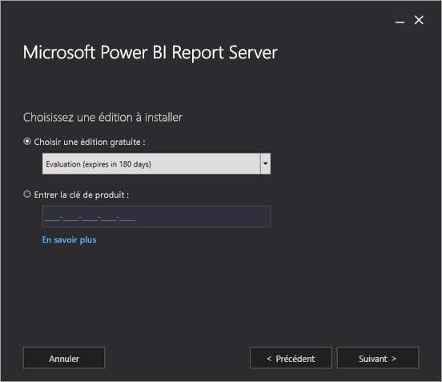
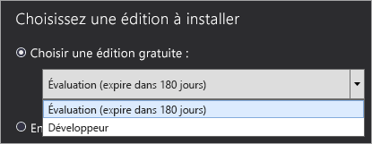
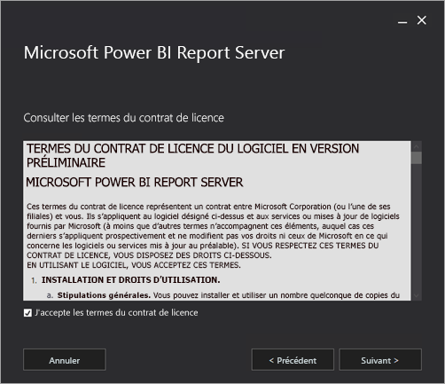
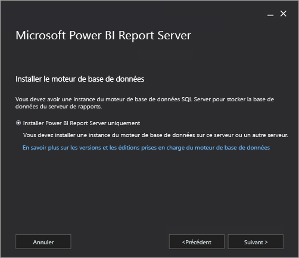
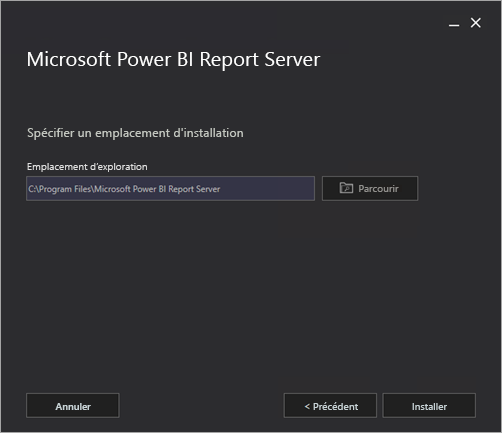
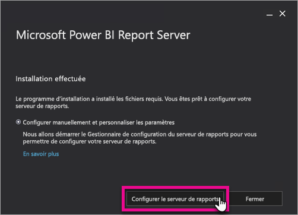
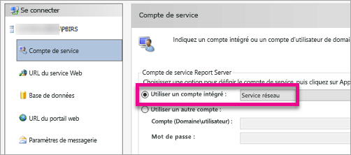
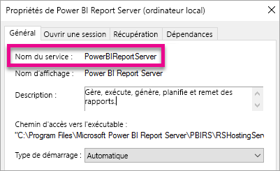

# Installer Power BI Report Server

Découvrez comment installer Power BI Report Server.

 **Télécharger** 

Pour télécharger Power BI Report Server, accédez à [Rapports locaux avec Power BI Report Server](https://powerbi.microsoft.com/report-server/) et sélectionnez **Téléchargez la version d’évaluation gratuite**. 

## Avant de commencer
Avant d’installer Power BI Report Server, il est recommandé de lire l’article [Configurations matérielle et logicielle requises pour installer Power BI Report Server](system-requirements.md).

 > [!IMPORTANT]
 > Même si vous pouvez installer Power BI Report Server dans un environnement disposant d’un contrôleur de domaine en lecture seule (RODC), pour fonctionner correctement, Power BI Report Server doit avoir accès à un contrôleur de domaine en lecture-écriture. Si Power BI Report Server a accès uniquement à un RODC, il se peut que vous rencontriez des erreurs lors de la tentative d’administrer le service.

### Clé de produit Power BI Report Server

#### Power BI Premium
Si vous avez acheté Power BI Premium, vous pouvez accéder à la clé de produit de votre instance de Power BI Report Server sous l’onglet **Paramètres Premium** du portail d’administration Power BI. C’est réservé aux administrateurs généraux ou aux utilisateurs qui ont le rôle d’administrateur du service Power BI.

Si vous sélectionnez **Clé de Power BI Report Server**, une boîte de dialogue contenant votre clé de produit s’affiche. Copiez-la pour l’utiliser lors de l’installation.

#### SQL Server Entreprise Software Assurance (SA)
Si vous disposez d’un contrat SQL Server Entreprise SA, vous pouvez vous procurer votre clé de produit auprès du [Centre de gestion des licences en volume](https://www.microsoft.com/Licensing/servicecenter/).

## Installer votre serveur de rapports
L’installation de Power BI Report Server est très simple. Quelques étapes suffisent pour installer les fichiers.

Il n’est pas nécessaire de disposer d’un moteur de base de données Microsoft SQL Server au moment de l’installation. En revanche, il vous en faudra un pour configurer Reporting Services après l’installation.

1. Trouvez le programme d’installation PowerBIReportServer.exe, puis exécutez-le.
2. Sélectionnez **Installer Power BI Report Server**.
   
    
3. Choisissez l’édition à installer, puis sélectionnez **suivant**.
   
    
   
    Dans la liste déroulante, choisissez l’édition Évaluation ou Développeur.
   
    
   
    Ou entrez la clé de produit du serveur obtenue à partir du service Power BI ou du Centre de gestion des licences en volume. Pour plus d’informations sur l’obtention de votre clé de produit, consultez la section [Avant de commencer](#before-you-begin).
4. Lisez et acceptez les termes du contrat de licence, puis sélectionnez **Suivant**.
   
    
5. Pour stocker la base de données du serveur de rapports, vous devez disposer d’un moteur de base de données. Sélectionnez **Suivant** pour installer uniquement le serveur de rapports.
   
    
6. Spécifiez l’emplacement d’installation du serveur de rapports. Sélectionnez **Installer** pour continuer.
   
    
   
    Le chemin d’accès par défaut est C:\Program Files\Microsoft Power BI Report Server.

1. Une fois l’installation effectuée, sélectionnez **Configurer Report Server** pour lancer le Gestionnaire de configuration de Reporting Services.
   
    

## Configuration de votre serveur de rapports

Lorsque vous sélectionnez **Configurer Report Server** dans le programme d’installation, le Gestionnaire de configuration de Reporting Services s’affiche. Pour plus d’informations, voir [Gestionnaire de configuration de Reporting Services](https://docs.microsoft.com/sql/reporting-services/install-windows/reporting-services-configuration-manager-native-mode).

Pour achever la configuration initiale de Reporting Services, vous devez [créer une base de données de serveur de rapports](https://docs.microsoft.com/sql/reporting-services/install-windows/ssrs-report-server-create-a-report-server-database). Pour effectuer cette étape, un serveur de base de données SQL Server est requis.

### Création d’une base de données sur un autre serveur
Si vous créez la base de données du serveur de rapports sur un serveur de base de données installé sur un autre ordinateur, vous devez modifier le compte de service du serveur de rapports avec des informations d’identification reconnues sur le serveur de base de données. 

Par défaut, le serveur de rapports utilise le compte de service virtuel. Si vous tentez de créer une base de données sur un autre serveur, vous pouvez rencontrer l’erreur suivante à l’étape d’application des droits de connexion.

`System.Data.SqlClient.SqlException (0x80131904): Windows NT user or group '(null)' not found. Check the name again.`

Pour corriger cette erreur, vous pouvez modifier le compte de service en Service réseau ou en un compte de domaine. La modification du compte de service en Service réseau applique des droits dans le contexte du compte d’ordinateur pour le serveur de rapports.

Pour plus d’informations, voir [Configurer le compte de service du serveur de rapports](https://docs.microsoft.com/sql/reporting-services/install-windows/configure-the-report-server-service-account-ssrs-configuration-manager).

## Service Windows
Un service Windows créé dans le cadre de l’installation. Il s’affiche en tant que **Power BI Report Server**. Le nom du service est **PowerBIReportServer**.

## Réservations d’URL par défaut
Les réservations d’URL se composent d’un préfixe, d’un nom d’hôte, d’un port et d’un répertoire virtuel :

| Partie | Description |
| --- | --- |
| Préfixe |Le préfixe par défaut est HTTP. Si vous avez installé précédemment un certificat SSL (Secure Sockets Layer), le programme d’installation tente de créer des réservations d’URL utilisant le préfixe HTTPS. |
| Nom d’hôte |Le nom d’hôte par défaut est un caractère générique fort (+). Il indique que le serveur de rapports accepte toute demande HTTP sur le port désigné pour tout nom d’hôte correspondant à l’ordinateur, dont `http://<computername>/reportserver`, `http://localhost/reportserver` ou`http://<IPAddress>/reportserver.` |
| Port |Le port par défaut est 80. Si vous utilisez un port autre que le port 80, vous devez ajouter celui-ci explicitement à l’URL lorsque vous ouvrez le portail web dans une fenêtre de navigateur. |
| Répertoire virtuel |Par défaut, les répertoires virtuels créés sont ReportServer pour le service Web Report Server et Reports pour le portail web. Pour le service Web Report Server, le répertoire virtuel par défaut est **reportserver**. Pour le portail web, le répertoire virtuel par défaut est **reports**. |

Voici un exemple de chaîne URL complète :

* `http://+:80/reportserver`, donne accès au serveur de rapports.
* `http://+:80/reports`, donne accès au portail web.

## Pare-feu
Si vous accédez au serveur de rapports à partir d’un ordinateur distant, vous pouvez vous assurer que vous avez configuré des règles de pare-feu si un pare-feu est présent.

Vous devez ouvrir le port TCP que vous avez configuré pour l’URL du service web et l’URL du portail Web. Par défaut, celles-ci sont configurées sur le port TCP 80.

## Configuration supplémentaire
* Pour configurer l’intégration avec le service Power BI afin de pouvoir épingler des éléments de rapport à un tableau de bord Power BI, voir [Intégration de Power BI Report Server](https://docs.microsoft.com/sql/reporting-services/install-windows/power-bi-report-server-integration-configuration-manager).
* Pour configurer le courrier pour le traitement des abonnements, voir [Paramètres du courrier](https://docs.microsoft.com/sql/reporting-services/install-windows/e-mail-settings-reporting-services-native-mode-configuration-manager) et [Remise du courrier dans un serveur de rapports](https://docs.microsoft.com/sql/reporting-services/subscriptions/e-mail-delivery-in-reporting-services).
* Pour configurer le portail web de façon à pouvoir y accéder sur un ordinateur de rapport pour afficher et gérer les rapports, voir [Configurer un pare-feu pour l’accès au serveur de rapports](https://docs.microsoft.com/sql/reporting-services/report-server/configure-a-firewall-for-report-server-access) et [Configurer un serveur de rapports pour l’administration à distance](https://docs.microsoft.com/sql/reporting-services/report-server/configure-a-report-server-for-remote-administration).

## Étapes suivantes
[Vue d’ensemble de l’administrateur](admin-handbook-overview.md)  
[Trouver la clé de produit de votre serveur de rapports](find-product-key.md)  
[Installer Power BI Desktop optimisé pour Power BI Report Server](install-powerbi-desktop.md)  
[Vérifier une installation de Reporting Services](https://docs.microsoft.com/sql/reporting-services/install-windows/verify-a-reporting-services-installation)  
[Configurer le compte de service du serveur de rapports](https://docs.microsoft.com/sql/reporting-services/install-windows/configure-the-report-server-service-account-ssrs-configuration-manager)  
[Configurer les URL du serveur de rapports](https://docs.microsoft.com/sql/reporting-services/install-windows/configure-report-server-urls-ssrs-configuration-manager)  
[Configurer la connexion de base de données d’un serveur de rapports](https://docs.microsoft.com/sql/reporting-services/install-windows/configure-a-report-server-database-connection-ssrs-configuration-manager)  
[Initialiser un serveur de rapports](https://docs.microsoft.com/sql/reporting-services/install-windows/ssrs-encryption-keys-initialize-a-report-server)  
[Configurer des connexions SSL sur un serveur de rapports](https://docs.microsoft.com/sql/reporting-services/security/configure-ssl-connections-on-a-native-mode-report-server)  
[Configurer des autorisations et des comptes de service Windows](https://docs.microsoft.com/sql/database-engine/configure-windows/configure-windows-service-accounts-and-permissions)  
[Prise en charge du navigateur pour Power BI Report Server](browser-support.md)

D’autres questions ? [Essayez d’interroger la communauté Power BI](https://community.powerbi.com/)

