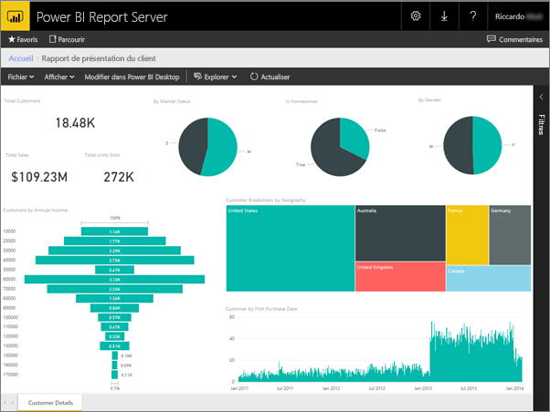
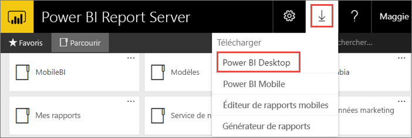
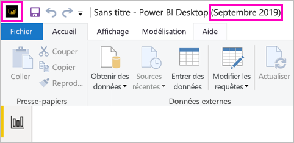
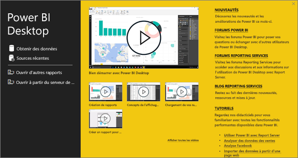
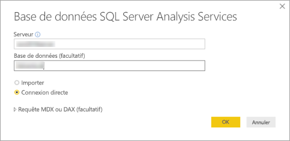
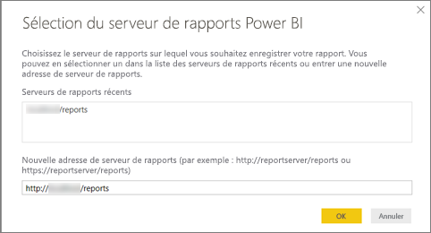
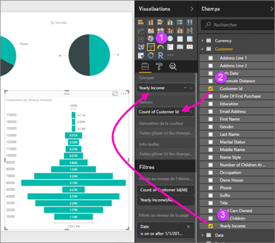
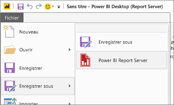

# Créer un rapport Power BI pour Power BI Report Server
Vous pouvez stocker et gérer des rapports Power BI localement sur le portail web Power BI Report Server tout comme vous pouvez stocker des rapports Power BI dans le cloud, dans le service Power BI (https://powerbi.com) ). Créez et modifiez des rapports dans Power BI Desktop, puis publiez-les sur le portail web. Les lecteurs au sein de votre organisation peuvent alors les consulter dans un navigateur ou dans une application mobile Power BI sur un appareil mobile.

Voici quatre étapes rapides pour démarrer.

## Étape 1 : Installer Power BI Desktop optimisé pour Power BI Report Server

Si vous avez déjà créé des rapports Power BI dans Power BI Desktop, vous êtes presque prêt à créer des rapports Power BI pour Power BI Report Server. Nous vous recommandons d’installer la version de Power BI Desktop optimisée pour Power BI Report Server afin d’être certain que le serveur et l’application soient toujours synchronisés. Vous pouvez avoir les deux versions de Power BI Desktop sur le même ordinateur.

1. Dans le portail web de votre serveur de rapports, sélectionnez la flèche **Télécharger** > **Power BI Desktop**.

    

    Vous pouvez accéder à la page d’accueil de [Power BI Report Server](https://powerbi.microsoft.com/report-server/) et sélectionner les **options de téléchargement avancées**.

2. Dans la page du Centre de téléchargement, sélectionnez **Télécharger**.

3. En fonction de votre ordinateur, sélectionnez :

    - **PBIDesktopRS.msi** (version 32 bits) ou

    - **PBIDesktopRS_x64.msi** (version 64 bits).

4. Après avoir téléchargé le programme d’installation, exécutez l’Assistant Installation de Power BI Desktop (septembre 2019).

2. À l’issue de l’installation, cochez **Démarrer Power BI Desktop maintenant**.
   
    Power BI Desktop démarre et vous pouvez l’utiliser. Vous pouvez voir que vous disposez de la version adéquate, car **Power BI Desktop (septembre 2019)** apparaît dans la barre de titre.

    

3. Si vous n’êtes pas familiarisé avec Power BI Desktop, songez à regarder les vidéos proposées sur l’écran d’accueil.
   
    

## Étape 2 : Sélectionner une source de données
Vous pouvez vous connecter à un vaste éventail de sources de données. Pour en savoir plus, voir [Connexion à des sources de données](connect-data-sources.md).

1. Dans l’écran de bienvenue, sélectionnez **Obtenir les données**.
   
    Ou bien, sous l’onglet **Accueil**, sélectionnez **Obtenir les données**.
2. Sélectionnez votre source de données, en l’occurrence, **Analysis Services**.
   
    
3. Spécifiez le **Serveur** et, éventuellement, la **Base de données**. Assurez-vous que l’option **Connexion directe** est activée, puis sélectionnez **OK**.
   
    
4. Choisissez le serveur de rapports dans lequel enregistrer vos rapports.
   
    

## Étape 3 : Créer votre rapport
Voici la partie amusante : Créer des éléments visuels illustrant vos données.

Par exemple, vous pouvez créer un graphique en entonnoir de valeurs de clients et de groupe par revenu annuel.

1. Dans **Visualisations**, sélectionnez **Graphique en entonnoir**.
2. Faites glisser le champ à compter vers le puits **Valeurs**. S’il ne s’agit pas d’un champ numérique, Power BI Desktop le convertit automatiquement en valeur *Nombre de*.
3. Faites glisser le champ à grouper vers puits **Groupe**.

En savoir plus sur la [conception d’un rapport Power BI](../desktop-report-view.md).

## Étape 4 : Enregistrer votre rapport sur le serveur de rapports
Une fois le rapport prêt, enregistrez-le sur le serveur de rapports Power BI Report Server que vous avez choisi à l’étape 2.

1. Dans le menu **Fichier**, sélectionnez **Enregistrer sous** > **Power BI Report Server**.
   
    
2. Vous pouvez à présent l’afficher dans le portail web.
   
    
    
> [!NOTE]
> Si, par la suite, vous décidez de modifier le rapport, sachez que les données affichées dans le bureau sont toujours celles qui ont été mises en cache au moment de la création initiale du rapport.  Pour voir les données les plus récentes quand vous modifiez le rapport, vous devez actualiser les données dans votre application Power BI Desktop.

## Étapes suivantes
### Power BI Desktop
Il existe de nombreuses ressources excellentes pour la création de rapports dans Power BI Desktop. Ce lien constitue un bon point de départ.

* [Prise en main de Power BI Desktop](../desktop-getting-started.md)
* Apprentissage guidé : [Explorer Power BI Desktop](/learn/modules/get-data-power-bi/2-getting-started-power-bi-desktop)

### Power BI Report Server
* [Installer Power BI Desktop optimisé pour Power BI Report Server](install-powerbi-desktop.md)  
* [Présentation de Power BI Report Server](get-started.md)  

D’autres questions ? [Essayez d’interroger la communauté Power BI](https://community.powerbi.com/)
