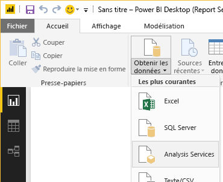

# Démarrage rapide : créer un rapport Power BI pour Power BI Report Server
Vous pouvez stocker et gérer des rapports Power BI localement sur le portail web Power BI Report Server tout comme vous pouvez stocker des rapports Power BI dans le cloud dans le service Power BI (https://powerbi.com). Créez et modifiez des rapports dans Power BI Desktop, puis publiez-les sur le portail web. Les lecteurs au sein de votre organisation peuvent alors les consulter dans un navigateur ou dans une application mobile Power BI sur un appareil mobile.

Si vous avez déjà créé des rapports Power BI dans Power BI Desktop, vous êtes prêt à créer des rapports Power BI pour Power BI Report Server. Si ce n’est pas le cas, voici quatre étapes rapides pour démarrer.

## Étape 1 : Installer Power BI Desktop (Report Server)
Vous avez peut-être déjà installé Power BI Desktop pour créer des rapports pour le service Power BI. Nous vous recommandons d’installer la version de Power BI Desktop optimisée pour Power BI Report Server afin d’être certain que le serveur et l’application soient toujours synchronisés. Vous pouvez avoir les deux versions de Power BI Desktop sur le même ordinateur.

1. Dans le portail web Power BI Report Server, sélectionnez **Nouveau** > **Rapport Power BI**.
   
    
   
    Si vous n’avez pas accès à un portail web Power BI Report Server, accédez au Centre de téléchargement Microsoft et téléchargez [Microsoft Power BI Desktop](https://go.microsoft.com/fwlink/?linkid=837581) (optimisé pour Power BI Report Serveur - Disponibilité générale de juin 2017).
2. À l’issue de celui-ci, activez l’option sur **Démarrer Power BI Desktop maintenant**.
   
    Power BI Desktop démarre et vous pouvez l’utiliser. Vous pouvez voir que vous disposez de la version adéquate, car « Power BI Desktop (Report Server) » est indiqué dans la barre de titre.
3. Si vous n’êtes pas familiarisé avec Power BI Desktop, songez à regarder les vidéos proposées sur l’écran d’accueil.
   
    

## Étape 2 : sélectionner une source de données
Vous pouvez vous connecter à un vaste éventail de sources de données. Pour en savoir plus, voir [Connexion à des sources de données](connect-data-sources.md).

1. Dans l’écran de bienvenue, sélectionnez **Obtenir les données**.
   
    Ou bien, sous l’onglet **Accueil**, sélectionnez **Obtenir les données**.
2. Sélectionnez votre source de données, en l’occurrence, **Analysis Services**.
   
    
3. Spécifiez le **Serveur** et, éventuellement, la **Base de données**. Assurez-vous que l’option **Connexion directe** est activée, puis sélectionnez **OK**.
   
    
4. Choisissez le serveur de rapports dans lequel enregistrer vos rapports.
   
    

## Étape 3 : créer votre rapport
C’est la partie amusante la plus agréable : créer des éléments visuels illustrant vos données.

Par exemple, vous pouvez créer un graphique en entonnoir de valeurs de clients et de groupe par revenu annuel.

1. Dans **Visualisations**, sélectionnez **Graphique en entonnoir**.
2. Faites glisser le champ à compter vers le puits **Valeurs**. S’il ne s’agit pas d’un champ numérique, Power BI Desktop le convertit automatiquement en valeur *Nombre de*.
3. Faites glisser le champ à grouper vers puits **Groupe**.

En savoir plus sur la [conception d’un rapport Power BI](../desktop-report-view.md).

## Étape 4 : enregistrer votre rapport sur le serveur de rapports
Une fois le rapport prêt, enregistrez-le sur le serveur de rapports Power BI Report Server que vous avez choisi à l’étape 2.

1. Dans le menu **Fichier**, sélectionnez **Enregistrer sous** > **Power BI Report Server**.
   
    
2. Vous pouvez à présent l’afficher dans le portail web.
   
    

## Considérations et limitations
Les rapports dans Power BI Report Server et dans le service Power BI (http://powerbi.com) fonctionnent pratiquement de la même manière, mais certaines fonctionnalités diffèrent.

### Dans un navigateur
Les rapports Power BI Report Server prennent en charge toutes les visualisations, à savoir :

* Éléments visuels personnalisés

Les rapports Power BI Report Server ne prennent pas en charge les fonctionnalités suivantes :

* Visuels R
* ArcGIS Maps
* Fil d’Ariane

### Dans les applications mobiles Power BI
Les rapports Power BI Report Server prennent en charge toutes les fonctionnalités de base des [applications mobiles Power BI](../mobile-apps-for-mobile-devices.md), à savoir :

* [Disposition des rapports pour téléphone](../desktop-create-phone-report.md) : vous pouvez optimiser un rapport pour les applications mobiles Power BI. Sur votre téléphone mobile, les rapports optimisés ont une icône  et une disposition spéciales.
  
    

Les rapports Power BI Report Server ne prennent pas en charge les fonctionnalités suivantes dans les applications mobiles Power BI :

* Visuels R
* ArcGIS Maps
* Éléments visuels personnalisés
* Fil d’Ariane
* Filtrage basé sur la géolocalisation ou codes barres

## Étapes suivantes
### Power BI Desktop
Il existe de nombreuses ressources excellentes pour la création de rapports dans Power BI Desktop. Ces liens constituent un bon point de départ.

* [Prise en main de Power BI Desktop](../desktop-getting-started.md)
* Formation guidée : [Prise en main de Power BI Desktop](../guided-learning/gettingdata.yml#step-2)

### Power BI Report Server
* [Installer Power BI Desktop optimisé pour Power BI Report Server](install-powerbi-desktop.md)  
* [Manuel de l’utilisateur Power BI Report Server](user-handbook-overview.md)  

D’autres questions ? [Essayez d’interroger la communauté Power BI](https://community.powerbi.com/)