# <a name="embed-a-power-bi-report-server-report-using-an-iframe-in-sharepoint-server"></a>Intégrer un rapport Power BI Report Server à l’aide d’un iFrame dans SharePoint Server

Dans cet article, vous allez apprendre à incorporer un rapport Power BI Report Server à l’aide d’un iFrame dans une page SharePoint. Si vous utilisez SharePoint Online, Power BI Report Server doit être accessible publiquement. Dans SharePoint Online, le composant Power BI WebPart qui fonctionne avec le service Power BI ne fonctionnera pas avec Power BI Report Server.  

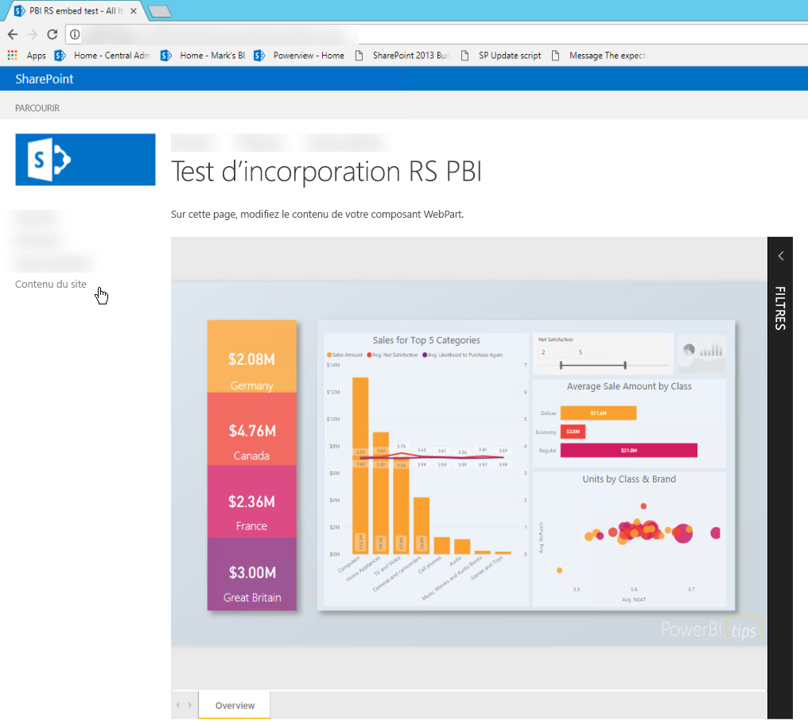

## <a name="prerequisites"></a>Conditions préalables
* [Power BI Report Server](https://powerbi.microsoft.com/report-server/) installé et configuré
* [Power BI Desktop optimisé pour Power BI Report Server](install-powerbi-desktop.md) installé
* Un environnement [SharePoint](https://docs.microsoft.com/sharepoint/install/install) installé et configuré

## <a name="create-the-power-bi-report-url"></a>Créer l’URL d’un rapport Power BI

1. Téléchargez l’exemple à partir de GitHub : [Blog Demo](https://github.com/Microsoft/powerbi-desktop-samples). Sélectionnez **Clone or download** (Cloner ou télécharger), puis sélectionnez **Download ZIP** (Télécharger le zip).

    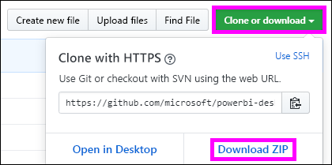

2. Décompressez le fichier .zip, puis ouvrez l’exemple de fichier .pbix dans Power BI Desktop optimisé pour Power BI Report Server.

    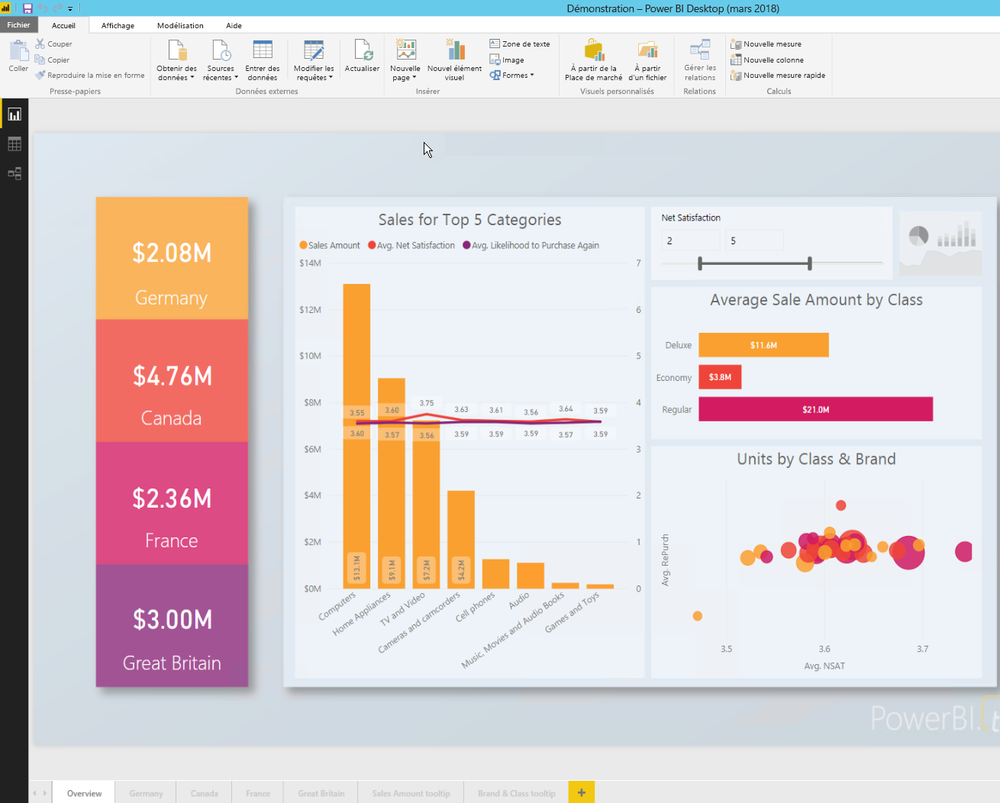

3. Enregistrez le rapport dans **Power BI Report Server**. 

    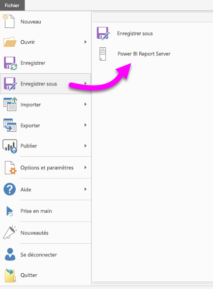

4. Affichez le rapport dans le portail web Power BI Report Server.

    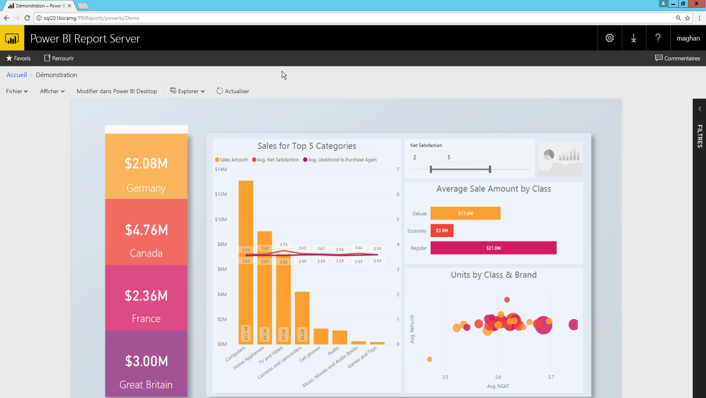

### <a name="capture-the-url-parameter"></a>Capturer le paramètre d’URL

Une fois que vous avez votre URL, vous pouvez créer un iFrame dans une page SharePoint pour y héberger le rapport. Pour les URL de rapport Power BI Report Server, vous devez ajouter le paramètre de chaîne de requête suivant afin d’incorporer votre rapport dans un iFrame SharePoint : `?rs:embed=true`.

   Par exemple :
    ``` 
    https://myserver/reports/powerbi/Sales?rs:embed=true
    ```
## <a name="embed-the-report-in-a-sharepoint-iframe"></a>Incorporer le rapport dans un iFrame SharePoint

1. Accédez à une page **Contenu du site** SharePoint.

    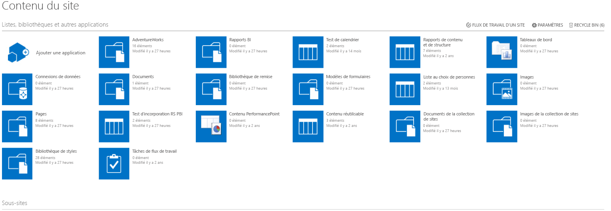

2. Sélectionnez la page où vous souhaitez ajouter votre rapport.

    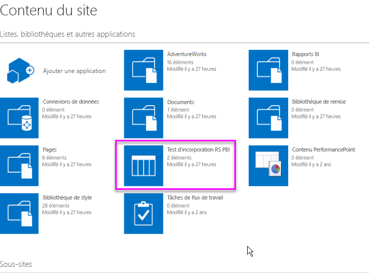

3. Sélectionnez l’icône en forme de roue dentée située en haut à droite, puis sélectionnez **Modifier la page**.

    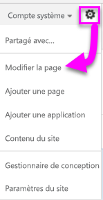

4. Sélectionnez **Ajouter un composant WebPart**.

5. Sous **Catégories**, sélectionnez **Média et contenu**. Sous **Composants WebPart**, sélectionnez **Éditeur de contenu**, puis sélectionnez **Ajouter**.

    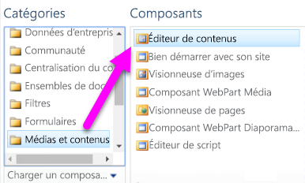

6. Sélectionnez **Cliquez ici pour ajouter un nouveau contenu**.

7. Dans le menu supérieur, sélectionnez **Mettre le texte en forme**, puis sélectionnez **Modifier la source**.

     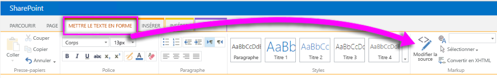

8. Dans la fenêtre **Modifier la source**, collez votre code iFrame dans **Source HTML**, puis sélectionnez **OK**.

    

     Par exemple :
     ```html
     <iframe width="800" height="600" src="https://myserver/reports/powerbi/Sales?rs:embed=true" frameborder="0" allowFullScreen="true"></iframe>
     ```

9. Dans le menu supérieur, sélectionnez **Page**, puis sélectionnez **Arrêter la modification**.

    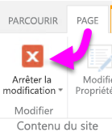

    Le rapport s’affiche dans la page.

    

## <a name="next-steps"></a>Étapes suivantes

- [Créer un rapport Power BI pour Power BI Report Server](quickstart-create-powerbi-report.md)  
- [Créer un rapport paginé pour Power BI Report Server](quickstart-create-paginated-report.md)  

D’autres questions ? [Posez vos questions à la Communauté Power BI](https://community.powerbi.com/). 