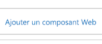
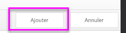
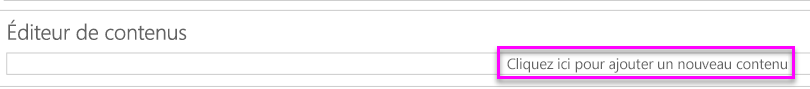

# <a name="quickstart-embed-a-power-bi-report-server-report-using-an-iframe-in-sharepoint-server"></a>Démarrage rapide : Intégrer un rapport Power BI Report Server à l’aide d’un iFrame dans SharePoint Server

Dans ce démarrage rapide, vous allez apprendre à intégrer un rapport Power BI Report Server à l’aide d’un iFrame dans une page SharePoint. Si vous utilisez SharePoint Online, Power BI Report Server doit être accessible publiquement. Dans SharePoint Online, le composant Power BI WebPart qui fonctionne avec le service Power BI ne fonctionne pas avec Power BI Report Server. 


## <a name="prerequisites"></a>Conditions préalables
* Vous devez avoir installé et configuré [Power BI Report Server](https://powerbi.microsoft.com/en-us/report-server/).
* Vous devez avoir installé [Power BI Desktop optimisé pour Power BI Report Server](install-powerbi-desktop.md).
* Vous devez avoir un installé et configuré un environnement [SharePoint](https://docs.microsoft.com/en-us/sharepoint/install/install).

## <a name="creating-the-power-bi-report-server-report-url"></a>Création de l’URL d’un rapport Power BI Report Server

1. Téléchargez l’exemple [Blog Demo](https://github.com/Microsoft/powerbi-desktop-samples) (Démonstration blog) à partir de GitHub.

    

2. Ouvrez l’exemple de fichier PBIX à partir de GitHub dans **Power BI Desktop optimisé pour Power BI Report Server**.

    

3. Enregistrez le rapport dans **Power BI Report Server**. 

    

4. Affichez le rapport dans le **portail web**.

    

### <a name="capturing-the-url-parameter"></a>Capture du paramètre d’URL

Une fois que vous avez votre URL, vous pouvez créer un iFrame dans une page SharePoint pour héberger le rapport. Pour toute URL de rapport Power BI Report Server, vous pouvez ajouter un paramètre querystring défini sur `?rs:embed=true` afin d’intégrer votre rapport dans un iFrame. 

   Par exemple :
    ``` 
    http://myserver/reports/powerbi/Sales?rs:embed=true
    ```
## <a name="embedding-a-power-bi-report-server-report-in-a-sharepoint-iframe"></a>Intégration d’un rapport Power BI Report Server dans un iFrame SharePoint

1. Accédez à une page **Contenu du site** SharePoint.

    

2. Sélectionnez la page où vous souhaitez ajouter votre rapport.

    

3. Sélectionnez l’engrenage en haut à droite, puis choisissez **Modifier la page**.

    

4. Sélectionnez **Ajouter un composant WebPart**.

    

5. Sous **Categories** (Catégories), sélectionnez **Media and Content** (Médias et contenu), sous **Parts** (Composants), sélectionnez **Content Editor** (Éditeur de contenu), puis **Add** (Ajouter).

     

6. Sélectionnez **Cliquez ici pour ajouter un nouveau contenu**.

    

7. Dans le ruban, sélectionnez l’onglet **Mettre en forme le texte**, puis choisissez **Modifier la source**.

     

8. Dans la fenêtre Modifier la source, collez votre code iFrame, puis sélectionnez OK.

    

     Par exemple :
     ```
     <iframe width="800" height="600" src="http://myserver/reports/powerbi/Sales?rs:embed=true" frameborder="0" allowFullScreen="true"></iframe>
     ```

9. Dans le ruban, sélectionnez l’onglet **Page**, puis choisissez **Arrêter la modification**.

    

10. Vous devriez maintenant voir le rapport sur la page.

    

## <a name="next-steps"></a>Étapes suivantes

[Démarrage rapide : créer un rapport Power BI pour Power BI Report Server](quickstart-create-powerbi-report.md)  
[Démarrage rapide : créer un rapport paginé pour Power BI Report Server](quickstart-create-paginated-report.md)  

D’autres questions ? [Essayez d’interroger la communauté Power BI](https://community.powerbi.com/) 