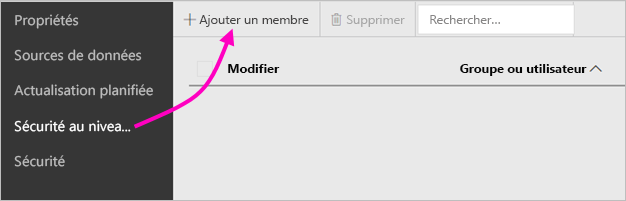
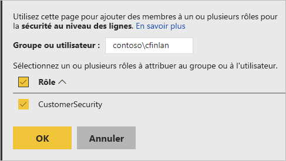

# Sécurité au niveau des lignes (SNL) dans Power BI Report Server

La configuration de la sécurité au niveau des lignes (SNL) avec Power BI Report Server peut restreindre l’accès aux données pour certains utilisateurs. Les filtres limitent l’accès aux données au niveau des lignes, et vous pouvez définir des filtres dans des rôles.  Si vous utilisez les autorisations par défaut dans Power BI Report Server, tout utilisateur disposant d’autorisations Serveur de publication ou Gestionnaire de contenu sur le rapport Power BI peut affecter des membres à des rôles pour ce rapport.    

Vous configurez SNL pour les rapports importés dans Power BI avec Power BI Desktop. Vous pouvez également configurer SNL sur les rapports qui utilisent DirectQuery, comme SQL Server.  Gardez à l’esprit que SNL n’est pas respectée si votre connexion DirectQuery utilise l’authentification intégrée pour les lecteurs de rapports. Pour les connexions actives Analysis Services, la sécurité au niveau des lignes doit être configurée sur le modèle local. L’option de sécurité ne s’affiche pas pour les jeux de données d’une connexion active. 

[!INCLUDE [rls-desktop-define-roles](../includes/rls-desktop-define-roles.md)]

## Filtrage croisé bidirectionnel

Par défaut, le filtrage de la sécurité au niveau des lignes utilise des filtres unidirectionnels, et ce que les relations soient unidirectionnelles ou bidirectionnelles. Vous pouvez activer manuellement le filtrage croisé bidirectionnel avec la sécurité au niveau des lignes.

- Sélectionnez la relation et cochez la case **Appliquer le filtre de sécurité dans les deux directions**. 

    

Cochez cette case en cas d’implémentation d’une [sécurité dynamique au niveau des lignes](https://docs.microsoft.com/analysis-services/tutorial-tabular-1200/supplemental-lesson-implement-dynamic-security-by-using-row-filters) basée sur le nom d’utilisateur ou l’ID de connexion. 

Pour en savoir plus, consultez [Filtrage croisé bidirectionnel avec DirectQuery dans Power BI Desktop](../desktop-bidirectional-filtering.md) et le livre blanc technique[Sécurisation du modèle sémantique BI tabulaire](https://download.microsoft.com/download/D/2/0/D20E1C5F-72EA-4505-9F26-FEF9550EFD44/Securing%20the%20Tabular%20BI%20Semantic%20Model.docx).

[!INCLUDE [rls-desktop-view-as-roles](../includes/rls-desktop-view-as-roles.md)]

## Ajouter des membres aux rôles 

Après avoir enregistré votre rapport dans Power BI Report Server, vous pouvez gérer la sécurité et ajouter ou supprimer des membres sur le serveur. Seuls les utilisateurs disposant d’autorisations Serveur de publication ou Gestionnaire de contenu sur le rapport ont accès à la sécurité au niveau des lignes (option non grisée).

 Si le rapport n’a pas les rôles dont il a besoin, vous devez l’ouvrir dans Power BI Desktop, ajouter des rôles ou les modifier, puis le réenregistrer dans Power BI Report Server. 

1. Dans Power BI Desktop, enregistrez le rapport dans Power BI Report Server. Vous devez utiliser la version de Power BI Desktop optimisée pour Power BI Report Server.
2. Dans Power BI Report Server, sélectionnez les points de suspension ( **...** ) en regard du rapport. 

3. Sélectionnez **Gérer** > **Sécurité au niveau des lignes**. 

     

    Dans la page **Sécurité au niveau des lignes**, ajoutez les membres à un rôle que vous avez créé dans Power BI Desktop.

5. Pour ajouter un membre, sélectionnez **Ajouter un membre**.

1. Entrez l’utilisateur ou le groupe dans la zone de texte au format Nom d’utilisateur (DOMAINE\utilisateur), puis sélectionnez les rôles à lui attribuer. Le membre doit faire partie de votre organisation.   

    

    Selon la façon dont vous avez configuré Active Directory, la saisie ici du nom d’utilisateur principal fonctionne également. Dans ce cas, le serveur de rapports affiche le nom d’utilisateur correspondant dans la liste.

1. Cliquez sur **OK** pour appliquer vos changements.   

8. Pour supprimer des membres, cochez la case en regard de leur nom et sélectionnez **Supprimer**.  Vous pouvez supprimer plusieurs membres à la fois. 

    

## username() et userprincipalname()

Vous pouvez utiliser les fonctions DAX username() et userprincipalname() dans votre jeu de données. Dans Power BI Desktop, celles-ci peuvent être utilisées dans des expressions. Quand vous publiez votre modèle, Power BI Report Server les utilise.

Dans Power BI Desktop, username() retourne un utilisateur au format DOMAINE\Utilisateur tandis que userprincipalname() le retourne au format user@contoso.com.

Dans Power BI Report Server, username() et userprincipalname() retournent le nom d’utilisateur principal (UPN) de l’utilisateur, celui-ci étant similaire à une adresse e-mail.

Si vous utilisez une authentification personnalisée dans Power BI Report Server, le format de nom d’utilisateur que vous avez configuré pour les utilisateurs est retourné.  

## Limites 

Voici les limites actuelles de la sécurité au niveau des lignes sur les modèles Power BI. 

Les utilisateurs dont les rapports utilisaient la fonction DAX username() constatent désormais un nouveau comportement dans lequel le nom d’utilisateur principal (UPN) est retourné, SAUF en cas d’utilisation de DirectQuery avec sécurité intégrée.  Étant donné que SNL n’est pas respectée dans ce scénario, le comportement dans ce dernier est inchangé.

Vous pouvez définir SNL uniquement sur les jeux de données créés avec Power BI Desktop. Pour activer SNL pour les jeux de données créés avec Excel, vous devez d’abord convertir vos fichiers au format PBIX (Power BI Desktop). Découvrez-en plus sur la [conversion des fichiers Excel](../desktop-import-excel-workbooks.md).

Seules les connexions ETL (extraction, transformation et chargement) et DirectQuery utilisant des informations d’identification stockées sont prises en charge. Les connexions actives à Analysis Services et DirectQuery utilisant l’authentification intégrée sont gérées dans la source de données sous-jacente. 

Si vous utilisez la sécurité intégrée avec DirectQuery, vos utilisateurs peuvent constater les comportements suivants :
- SNL est désactivée et toutes les données sont retournées.
- Les utilisateurs ne peuvent pas mettre à jour leurs attributions de rôle et obtiennent une erreur dans la page Gérer de SNL.
- Pour la fonction DAX username, vous continuez à recevoir le nom d’utilisateur au format DOMAINE\UTILISATEUR. 

Les auteurs de rapport ne sont pas autorisés à afficher les données de rapport dans Power BI Report Server tant qu’ils ne se sont pas attribué les rôles correspondants après le chargement du rapport. 

 

## FORUM AUX QUESTIONS 

### Puis-je créer ces rôles pour des sources de données Analysis Services ? 

Oui, à condition que vous ayez importé les données dans Power BI Desktop. Si vous utilisez une connexion active, vous ne pouvez pas configurer SNL au sein du service Power BI. SNL se définit localement dans le modèle Analysis Services. 

### Puis-je utiliser SNL pour limiter les colonnes ou les mesures accessibles par mes utilisateurs ? 

Non. Si un utilisateur a accès à une ligne particulière de données, il peut voir toutes les colonnes de données pour cette ligne. 

### Avec SNL, puis-je masquer les données détaillées tout en donnant accès aux données résumées dans les visuels ? 

Non, vous sécurisez des lignes de données individuelles, mais les utilisateurs peuvent toujours voir les détails ou les données résumées. 

### Puis-je ajouter de nouveaux rôles dans Power BI Desktop si j’ai déjà des rôles et des membres attribués à ceux-ci ? 

Oui. Si vous avez déjà défini des rôles et que vous leur avez attribué des membres dans Power BI Report Server, vous pouvez créer d’autres rôles et republier votre rapport sans aucune incidence sur vos attributions actuelles. 
 

## Étapes suivantes

[Présentation de Power BI Report Server](get-started.md) 
[Manuel de l’administrateur](admin-handbook-overview.md)  

D’autres questions ? [Essayez d’interroger la communauté Power BI](https://community.powerbi.com/)
