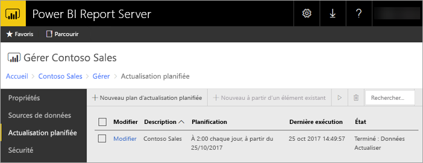

# Actualisation planifiée de rapport Power BI dans Power BI Report Server
L’actualisation planifiée des rapports Power BI permet de tenir à jour les données d’un rapport.

L’actualisation planifiée est spécifique des rapports Power BI avec un modèle incorporé. Ce qui signifie que vous avez importées des données dans le rapport au lieu d’utiliser une connexion active ou DirectQuery. Lors de l’importation de vos données, celles-ci sont déconnectées de la source de données d’origine et doivent être mises à jour pour rester actualisées. L’actualisation planifiée est la façon de conserver vos données à jour.

L’actualisation planifiée est configurée dans la section gestion d’un rapport. Pour plus d’informations sur la façon de configurer une actualisation planifiée, voir [Comment configurer une actualisation planifiée de rapport Power BI](configure-scheduled-refresh.md).

## Comment cela fonctionne
Plusieurs composants sont impliqués lors de l’utilisation de l’actualisation planifiée pour vos rapports Power BI.

* SQL Server Agent est utilisé en tant que minuteur pour générer des événements planifiés.
* Les travaux planifiés sont ajoutés à une file d’attente d’événements et de notifications dans la base de données du serveur de rapports. Dans un déploiement avec montée en puissance parallèle, la file d’attente est partagée entre tous les serveurs de rapports figurant dans le déploiement.
* Le traitement des rapports qui se produit suite à un événement de planification est effectué en arrière-plan.
* Le modèle de données est chargé dans une instance Analysis Services.
* Pour certaines sources de données, le moteur mashup Power Query est utilisé pour se connecter aux sources de données et transformer les données. Une connexion à d’autres sources de données est possible directement à partir d’un service Analysis Services utilisé pour héberger les modèles de données pour Power BI Report Server.
* Les nouvelles données sont chargées dans le modèle de données à l’intérieur d’Analysis Services.
* Analysis Services traite les données et exécute tous les calculs nécessaire.

Power BI Report Server maintient une file d’attente des événements pour toutes les opérations planifiées. Il interroge la file d’attente à intervalles réguliers pour vérifier la présence de nouveaux événements. Par défaut, la file d’attente est analysée toutes les 10 secondes. Vous pouvez modifier l’intervalle en changeant les paramètres de configuration **PollingInterval**, **IsNotificationService** et **IsEventService** dans le fichier RSReportServer.config. **IsDataModelRefreshService** peut également être utilisé pour indiquer si un serveur de rapports traite les événements planifiés.

### Analysis Services
Rendre un rapport Power BI ainsi qu’effectuer une actualisation planifiée nécessitent le chargement du modèle de données du rapport Power BI dans Analysis Services. Un processus Analysis Services s’exécute avec Power BI Report Server.

## Considérations et limitations
### Quand une actualisation planifiée ne peut pas être utilisée
Il n’est pas possible de créer un plan d’actualisation planifiée sur certains rapports Power BI. La liste suivante répertorie les rapports Power BI sur lesquels il n’est pas possible de créer un plan d’actualisation planifiée.

* Votre rapport contient une ou plusieurs sources de données Analysis Services qui utilisent une connexion active.
* Votre rapport contient une ou plusieurs sources de données qui utilisent DirectQuery.
* Votre rapport ne contient aucune source de données. Par exemple, les données sont entrées manuellement via l’option *Entrer des données* ou un rapport contient uniquement du contenu statique tel que des images, du texte, etc.

Outre la liste ci-dessus, il existe des scénarios spécifiques avec des sources de données en mode d’*importation*, pour lesquels vous ne pouvez pas créer des plans d’actualisation.

* Si une source de données *Fichier* ou *Dossier* est utilisée, et si le chemin d’accès du fichier est un chemin local (par exemple, C:\Users\user\Documents), il n’est pas possible de créer un plan d’actualisation. Le chemin d’accès doit être un chemin auquel le serveur de rapports peut se connecter, tel un partage réseau. Par exemple, *\\myshare\Documents*.
* Si la source de données peut être connectée uniquement à l’aide d’OAuth (par exemple, Facebook, Google Analytique, Salesforce, etc.), le plan d’actualisation du cache ne peut pas être créé. Actuellement, le serveur de rapports ne prend en charge l’authentification OAuth pour aucune source de données, que ce soit pour un rapport paginé, mobile ou Power BI.

### Limites applicables à la mémoire
Traditionnellement, la charge de travail pour un serveur de rapports était similaire à celle d’une application web. La capacité à charger des rapports avec des données importées ou DirectQuery, ainsi que la possibilité d’effectuer une actualisation planifiée, reposent sur une instance Analysis Services hébergée à côté du serveur de rapports. Par conséquent, cela pourrait entraîner une sollicitation de la mémoire inattendue sur le serveur. Planifiez le déploiement de votre serveur en conséquence, sachant qu’Analysis Services peut consommer de la mémoire en même temps que le serveur de rapports.

Pour plus d’informations sur la façon de surveiller une instance Analysis Services, voir [Surveiller une instance Analysis Services](https://docs.microsoft.com/sql/analysis-services/instances/monitor-an-analysis-services-instance).

Pour plus d’informations sur les paramètres de mémoire dans Analysis Services, voir [Propriétés de mémoire](https://docs.microsoft.com/sql/analysis-services/server-properties/memory-properties).

### Authentification et Kerberos
Si votre source de données est définie pour utiliser les informations d’identification Windows, il peut être nécessaire de configurer une délégation Kerberos contrainte pour que cela fonctionne. Pour plus d’informations, voir [Configurer une authentification Windows sur le serveur de rapports](https://docs.microsoft.com/sql/reporting-services/security/configure-windows-authentication-on-the-report-server).

## Étapes suivantes
Configurez une [actualisation planifiée](configure-scheduled-refresh.md) sur un rapport Power BI.

D’autres questions ? [Essayez d’interroger la communauté Power BI](https://community.powerbi.com/)

