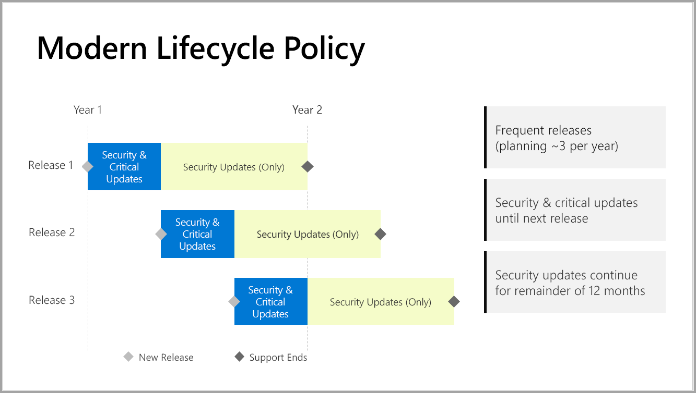

# Chronologie de prise en charge pour Power BI Report Server

Power BI Report Server est publié quelques fois par an. Des mises à jour de sécurité et critiques sont disponibles jusqu’à ce que la publication suivante soit en disponibilité générale (GA). Après la nouvelle publication, la publication précédente continue de recevoir des mises à jour de sécurité pendant le reste des 12 mois de son cycle de vie.

Cette stratégie de prise en charge vous permet d’offrir des innovations à vos clients rapidement tout en offrant une flexibilité suffisante pour leur permettre d’adopter les innovations à leur propre rythme.

* Phase de service des mises à jour de sécurité et critiques : lors de l’exécution de la version la plus récente de Power BI Report Server, vous recevez des mises à jour de sécurité et critiques.
* Phase de maintenance des mises à jour de sécurité (uniquement) : après la publication d’une nouvelle version, le support des versions antérieures est réduit aux seules mises à jour de sécurité pendant le reste des 12 mois du cycle de vie du support (voir figure 1).

    

## Historique des versions

| **Version** | **Disponibilité** | **Date de fin du support** |
| --- | --- | --- |
| Septembre 2019 | Septembre 2019 | La version de septembre 2019 et toutes celles qui la précèdent ne sont plus prises en charge
| Janvier 2020 | Janvier 2020 | Janvier 2021
| Mai 2020 | Mai 2020 | Mai 2021
| Octobre 2020 | Octobre 2020 | Octobre 2021

Pour télécharger Power BI Report Server et Power BI Desktop optimisé pour Power BI Report Server, accédez à la page [Rapports locaux avec Power BI Report Server](https://powerbi.microsoft.com/report-server/).

## Étapes suivantes
[Nouveautés dans Power BI Report Server](whats-new.md)  
[Présentation de Power BI Report Server](get-started.md)
[Vue d’ensemble de l’administrateur](admin-handbook-overview.md)  
[Installer Power BI Report Server](install-report-server.md)  

D’autres questions ? [Essayez d’interroger la communauté Power BI](https://community.powerbi.com/)
