# Tutoriel : Explorer le portail web Power BI Report Server dans une machine virtuelle
Dans ce tutoriel, vous créez une machine virtuelle Azure avec Power BI Report Server déjà installé, pour pouvoir afficher, modifier et gérer des exemples de rapports Power BI Report Server et paginés ainsi que des indicateurs de performance clés.

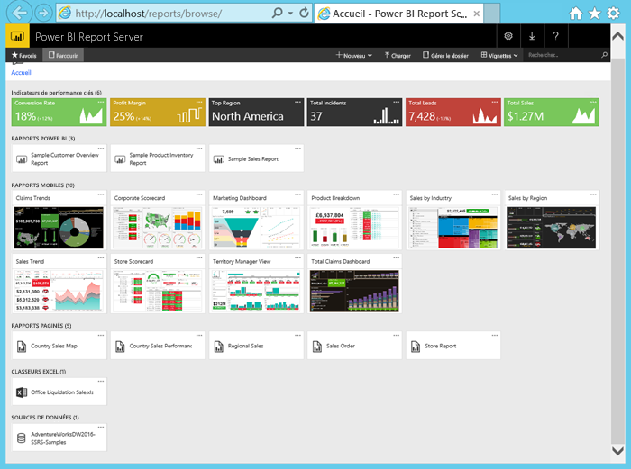

Voici les tâches que vous allez effectuer dans ce tutoriel :

> [!div class="checklist"]
> * Créer une machine virtuelle et s’y connecter
> * Lancer et explorer le portail web Power BI Report Server
> * Marquer un élément favori
> * Afficher et modifier un rapport Power BI
> * Afficher, gérer et modifier un rapport paginé
> * Afficher un classeur Excel dans Excel Online

Pour ce tutoriel, vous avez besoin d’un abonnement Azure. Si ce n’est déjà fait, [créez un compte gratuit](https://azure.microsoft.com/free/?WT.mc_id=A261C142F) avant de commencer.

## Créer une machine virtuelle Power BI Report Server

Heureusement, l’équipe Power BI a créé une machine virtuelle fournie avec Power BI Report Server déjà installé.

1. Dans Azure Marketplace, ouvrez [Power BI Report Server](https://azuremarketplace.microsoft.com/marketplace/apps/reportingservices.technical-preview?tab=Overview).  

2. Sélectionnez **Obtenir maintenant**.
3. Pour accepter les conditions d'utilisation et la politique de confidentialité du fournisseur, sélectionnez **Continuer**.

    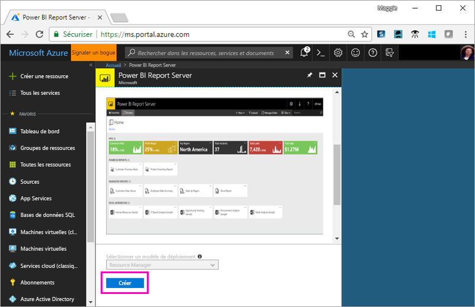

4. **Étape 1 - Principes de base** : pour **nom de machine virtuelle**, choisissez **reportservervm**.

5. Créez un nom d'utilisateur et un mot de passe.

6. Pour **Groupe de ressources**, conservez **Créer** et attribuez le nom **reportserverresourcegroup**.

    Si vous effectuez plusieurs fois le tutoriel, vous devez renommer le groupe de ressources après la première fois. Vous ne pouvez pas utiliser deux fois le même nom de groupe de ressources dans un même abonnement. 

7. Conservez les autres valeurs par défaut > **OK**.

    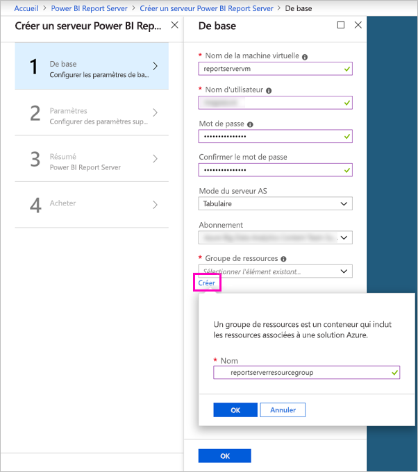

8. **Étape 2 - Paramètres** : conservez les valeurs par défaut > **OK**.

9. **Étape 3 - Résumé :**  > **OK**.

10. **Étape 4** : passez en revue les termes de la politique de confidentialité > **Créer**.

    Le processus de **soumission du déploiement pour Power BI Report Server** prend plusieurs minutes.

## Se connecter à votre machine virtuelle

1. Dans le volet de navigation gauche Azure, sélectionnez **Machines virtuelles**. 

2. Dans le champ **Filtrer par nom**, tapez « report » (rapport). 

3. Sélectionnez la machine virtuelle nommée **REPORTSERVERVM**.

    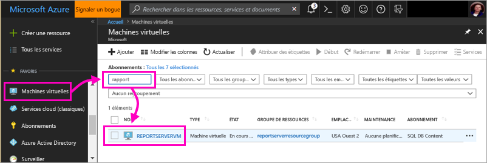

4. Sous la machine virtuelle REPORTSERVERVM, sélectionnez **Se connecter**.

    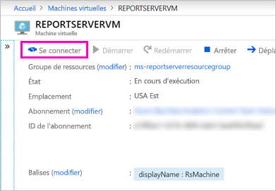

5. Dans la boîte de dialogue Connexion au Bureau à distance, sélectionnez **Se connecter**.

6. Entrez le nom et le mot de passe que vous avez créés pour la machine virtuelle > **OK**.

7. La boîte de dialogue suivante indique que l’ordinateur distant ne peut pas être identifié. Sélectionnez **Oui**.

   Voilà ! Votre nouvelle machine virtuelle s’ouvre.

## Power BI Report Server sur la machine virtuelle

Lorsque votre machine virtuelle s’ouvre, voici les éléments qui apparaissent sur le bureau.

|Numéro  |Ce que cela représente  |
|---------|---------|
| | Démarre SQL Server Data Tools pour créer des rapports paginés (.RDL) |
| | Exemples de rapports Power BI (.PBIX)  |
| | Liens vers la documentation Power BI Report Server   |
| | Démarre Power BI Desktop optimisé pour Power BI Report Server (mars 2018)  |
| | Ouvre le portail web Power BI Report Server dans le navigateur   |

Double-cliquez sur l’icône **Portail web Report Server**. Le navigateur ouvre `http://localhost/reports/browse`. Le portail web affiche divers fichiers regroupés par type. 

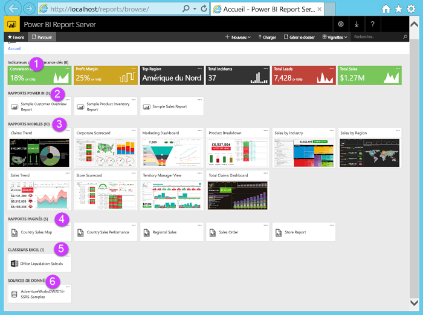

|Numéro  |Ce que cela représente  |
|---------|---------|
| | Indicateurs de performance clés créés dans le portail web |
| |  Rapports Power BI (.PBIX)  |
| | Rapports mobiles créés dans SQL Server Mobile Report Publisher  |
| |  Rapports paginés créés dans le Générateur de rapports ou SQL Server Data Tools  |
| | classeurs Excel ;   | 
| | Sources de données pour rapports paginés | 

## Marquer vos favoris
Vous pouvez marquer les rapports et indicateurs de performance clés que vous souhaitez voire figurer parmi vos favoris. Ils sont ensuite plus faciles à trouver, car ils sont rassemblés dans un seul dossier Favoris, tant sur le portail web que dans les applications mobiles Power BI. 

1. Sélectionnez les points de suspension **(... )** dans l’angle supérieur droit de l’indicateur de performance clé **Marge bénéficiaire** > **Ajouter aux Favoris**.
   
    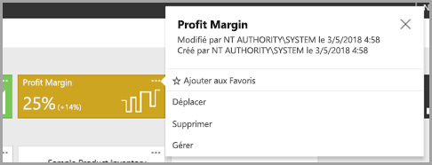
2. Sélectionnez **Favoris** sur le ruban du portail web pour l’afficher avec vos autres favoris sur la page Favoris du portail web.
   
    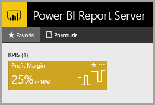

3. Sélectionnez **Parcourir** pour revenir au portail web.
   
## Afficher les éléments en mode Liste
Par défaut, le contenu du portail web s’affiche en mode Vignettes.

Vous pouvez basculer vers le mode Liste qui facilite le déplacement ou la suppression de plusieurs éléments à la fois. 

1. Sélectionnez **Vignettes** > **Liste**.
   
    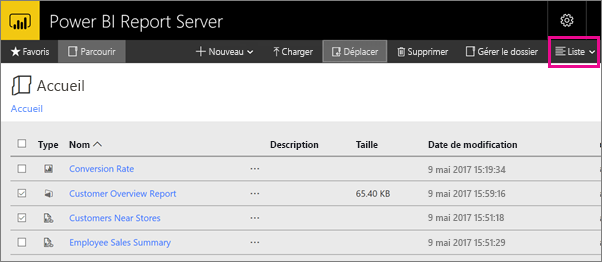

2. Revenez à la vue Vignettes : Sélectionnez **Liste** > **Vignettes**.

## Rapports Power BI

Vous pouvez afficher et interagir avec les rapports Power BI dans le portail web et démarrer Power BI Desktop directement depuis du portail web.

### Afficher les rapports Power BI

1. Dans le portail web, sous **Rapports Power BI**, sélectionnez **Sample Customer Overview Report** (Exemple de rapport de vue d’ensemble du client). Le rapport s’ouvre dans le navigateur.

1. Sélectionnez le bloc États-Unis dans l’arborescence pour voir comment il met en surbrillance les valeurs associées dans les autres éléments visuels.

    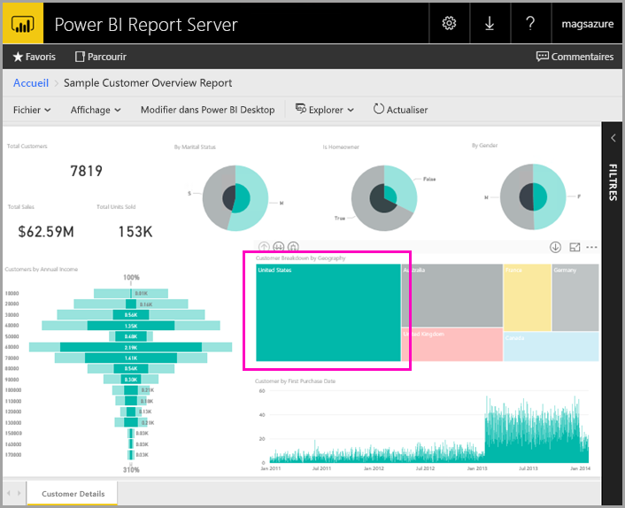

### Modifier dans Power BI Desktop

1. Sélectionnez **Modifier Power BI Desktop**.

1. Sélectionnez **Autoriser** pour autoriser ce site web ouvrir un programme sur votre ordinateur. 

     Le rapport s’ouvre dans Power BI Desktop. Notez le nom dans la barre supérieure, « Power BI Desktop (mars 2018) ». Il s’agit de la version optimisée pour Power BI Report Server.

    

     Utilisez la version de Power BI Desktop qui est installée sur la machine virtuelle. Vous ne pouvez pas passer d’un domaine à l’autre pour charger un rapport.

3. Dans le volet Champs, développez la table Clients et faites glisser le champ Profession vers Filtres au niveau des rapports.

    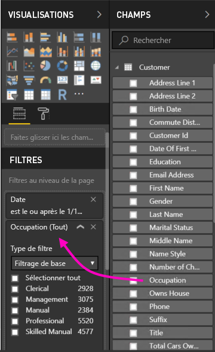

1. Enregistrez le rapport.

1. Revenez au rapport dans le navigateur puis sélectionnez l’icône **Actualiser** du navigateur.

    

8. Développez le volet **Filtres** sur la partie droite pour afficher le filtre **Profession** que vous avez ajouté. Sélectionnez **Professionnel**.

    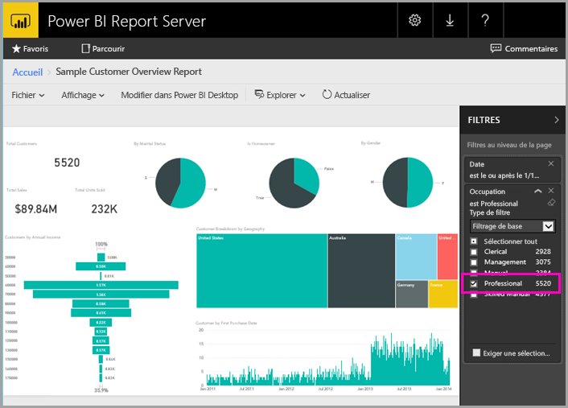

3. Sélectionnez **Parcourir** pour revenir au portail web.

## Rapports paginés (.RDL)

Vous pouvez afficher et gérer des rapports paginés et lancer le Générateur de rapports depuis le portail web.

### Gérer un rapport paginé

1. Dans le portail web, sous **Rapports paginés**, sélectionnez les points de suspension (...) en regard de **Commande client** > **Gérer**.

1. Sélectionnez **Paramètres**, remplacez la valeur par défaut **SalesOrderNumber** par **SO50689** > **Appliquer**.

   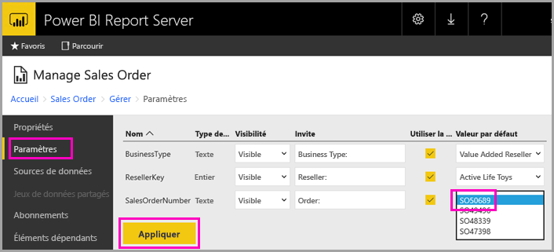

3. Sélectionnez **Parcourir** pour revenir au portail web.

### Afficher un rapport paginé

1. Sélectionnez **Commande client** dans le portail web.
 
3.  Le rapport s’affiche avec le paramètre **Commande** que vous avez défini, **SO50689**. 

    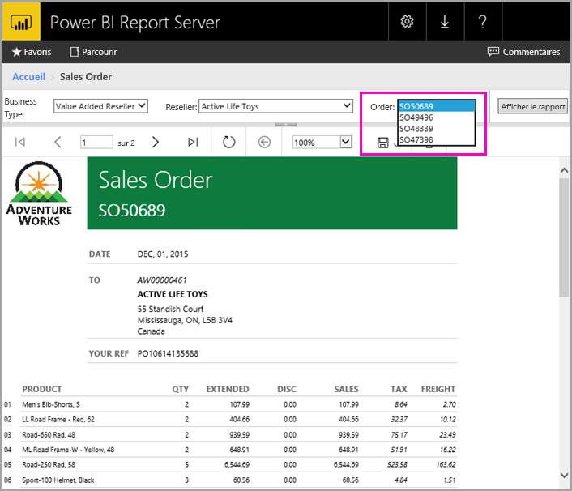

    Vous pouvez modifier ce paramètre ici, ainsi que les autres paramètres, sans modifier les valeurs par défaut.

1. Sélectionnez **Commande** **SO48339** > **Afficher le rapport**.

4. Vous voyez qu’il s’agit de la page 1 de 2. Sélectionnez la flèche droite pour afficher la deuxième page. La table continue sur cette page.

    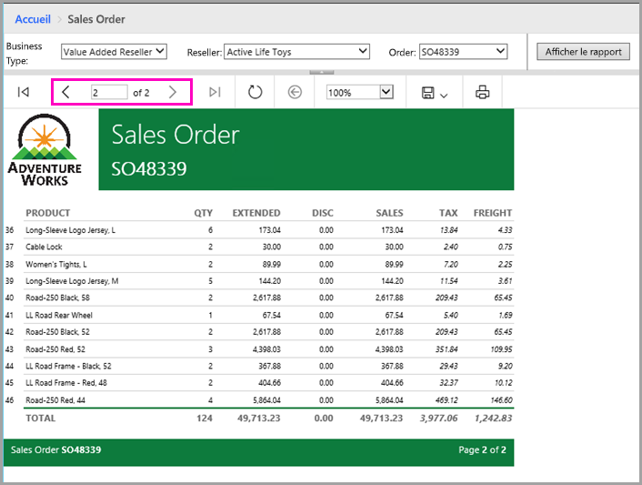

5. Sélectionnez **Parcourir** pour revenir au portail web.

### Modifier un rapport paginé

Vous pouvez modifier des rapports paginés dans le Générateur de rapports, et démarrer le Générateur de rapports directement à partir du navigateur.

1. Dans le portail web, sélectionnez les points de suspension (...) en regard de **Commande client** > **Modifier dans le Générateur de rapports**.

1. Sélectionnez **Autoriser** pour autoriser ce site web ouvrir un programme sur votre ordinateur.

1. Le rapport Commande client s’ouvre en mode Création dans le Générateur de rapports.

    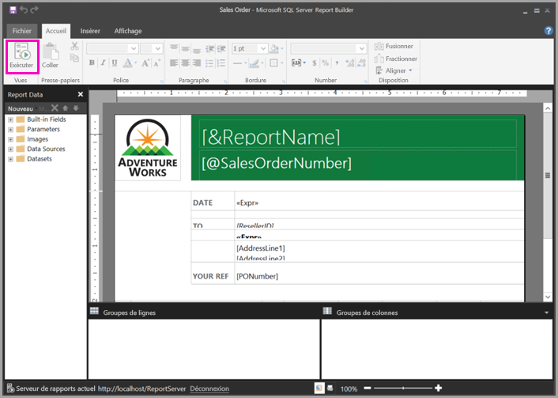

1. Sélectionnez **Exécuter** pour afficher un aperçu du rapport.

    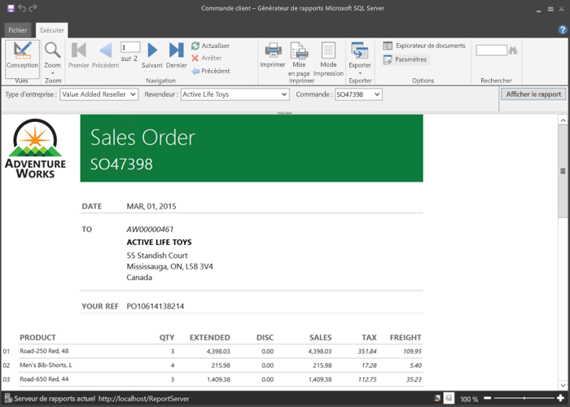

5. Fermez le Générateur de rapports et revenez dans le navigateur.

## Afficher des classeurs Excel

Vous pouvez afficher et interagir avec des classeurs Excel dans Excel Online dans Power BI Report Server. 

1. Sélectionnez le classeur Excel **Office Liquidation Sale.xlsx**. Des informations d’identification peuvent vous être demandées. Sélectionnez **Annuler**. 
    Le portail web s’ouvre.
1. Sélectionnez **Appliance** dans le segment.

    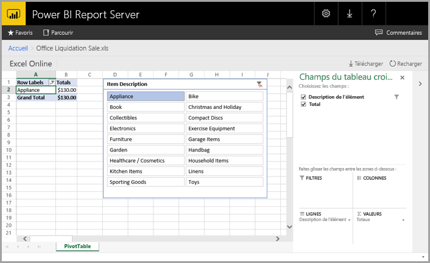

1. Sélectionnez **Parcourir** pour revenir au portail web.

## Nettoyer les ressources

Maintenant que vous avez terminé ce tutoriel, supprimez le groupe de ressources, la machine virtuelle et toutes les ressources associées. 

- Pour ce faire, sélectionnez le groupe de ressources de la machine virtuelle puis choisissez **Supprimer**.

## Étapes suivantes

Dans ce tutoriel, vous avez créé une machine virtuelle avec Power BI Report Server. Vous avez testé certaines fonctionnalités du portail web, puis ouvert un rapport Power BI et un rapport paginé dans leurs éditeurs respectifs. Étant donné que des sources de données SQL Server Analysis Services sont installées sur cette machine virtuelle, vous pouvez essayer de créer vos propres rapports Power BI et paginés avec ces mêmes sources de données. 

Pour plus d’informations sur la création de rapports pour Power BI Report Server, poursuivez la lecture.

> [!div class="nextstepaction"]
> [Créer un rapport Power BI pour Power BI Report Server](./quickstart-create-powerbi-report.md)

