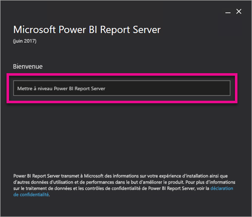
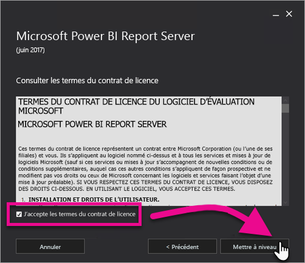
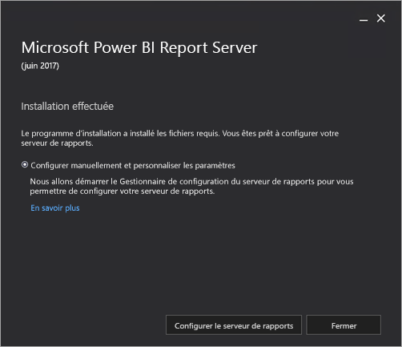

# Mettre à niveau Power BI Report Server

Découvrez comment mettre à niveau Power BI Report Server.

 **Télécharger** 

Pour télécharger Power BI Report Server et Power BI Desktop optimisé pour Power BI Report Server, accédez à la page [Rapports locaux avec Power BI Report Server](https://powerbi.microsoft.com/report-server/).

## Avant de commencer

Avant de mettre à niveau un serveur de rapports, nous vous recommandons de suivre la procédure décrite ci-après pour le sauvegarder.

### Sauvegarder les clés de chiffrement

Lorsque vous configurez une installation de serveur de rapports pour la première fois, sauvegardez les clés de chiffrement. Sauvegardez également les clés chaque fois que vous changez l’identité des comptes de service ou renommez l’ordinateur. Pour plus d’informations, consultez [Sauvegarder et restaurer des clés de chiffrement Reporting Services](https://docs.microsoft.com/sql/reporting-services/install-windows/ssrs-encryption-keys-back-up-and-restore-encryption-keys).

### Sauvegarder les bases de données de serveur de rapports

Étant donné qu’un serveur de rapports est un serveur sans état, toutes les données d’application sont stockées dans les bases de données **reportserver** et **reportservertempdb** qui s’exécutent sur une instance du moteur de base de données SQL Server. Vous pouvez sauvegarder les bases de données **reportserver** et **reportservertempdb** en utilisant l’une des méthodes prises en charge pour la sauvegarde des bases de données SQL Server. Ces recommandations sont spécifiques aux bases de données du serveur de rapports :

* Utilisez le mode de récupération complète pour sauvegarder la base de données **reportserver**.
* Utilisez le mode de récupération simple pour sauvegarder la base de données **reportservertempdb**.
* Vous pouvez utiliser des planifications de sauvegarde différentes pour chaque base de données. La sauvegarde de la base de données **reportservertempdb** a pour seul but d’éviter d’avoir à la recréer en cas de défaillance matérielle. En cas de défaillance matérielle, il n’est pas nécessaire de récupérer les données de **reportservertempdb**, mais vous avez besoin de la structure de la table. Si vous perdez la base de données **reportservertempdb**, le seul moyen de la récupérer est de recréer la base de données du serveur de rapports. Si vous recréez la base de données **reportservertempdb**, il est important de lui donner le même nom que la base de données de serveur de rapports primaire.

Pour plus d’informations sur la sauvegarde et la restauration des bases de données relationnelles SQL Server, consultez [Sauvegarde et restauration des bases de données SQL Server](/sql/relational-databases/backup-restore/back-up-and-restore-of-sql-server-databases).

### Sauvegarder des fichiers de configuration

Power BI Report Server utilise des fichiers de configuration pour stocker les paramètres de l’application. Sauvegardez les fichiers lorsque vous configurez le serveur pour la première fois et après avoir déployé des extensions personnalisées. Les fichiers à sauvegarder comprennent :

* config.json
* RSHostingService.exe.config
* Rsreportserver.config
* Rssvrpolicy.config
* Reportingservicesservice.exe.config
* Web.config pour les applications Report Server ASP.NET
* Machine.config pour ASP.NET

## Mettre à niveau le serveur de rapports

La mise à niveau de Power BI Report Server est très simple. Quelques étapes suffisent pour installer les fichiers.

1. Trouvez le programme d’installation PowerBIReportServer.exe, puis exécutez-le.

2. Sélectionnez **Mettre à niveau Power BI Report Server**.

    

3. Lisez et acceptez les conditions générales du contrat de licence, puis sélectionnez **Mettre à niveau**.

    

4. Une fois la mise à niveau effectuée, sélectionnez **Configurer Report Server** pour lancer le Gestionnaire de configuration de Reporting Services, ou sélectionnez **Fermer** pour quitter le programme d’installation.

    

## Activer les correctifs de sécurité Microsoft Update pour Power BI Report Server

Power BI Report Server reçoit des correctifs de sécurité via Microsoft Update. Pour les obtenir, abonnez-vous manuellement à Microsoft Update.

1.  Ouvrez Windows Update dans **Paramètres de mise à jour et de sécurité** sur l’ordinateur que vous souhaitez inscrire.
2.  Sélectionnez **Options avancées**.
3.  Cochez la case **Me communiquer les mises à jour d’autres produits Microsoft lorsque je mets à jour Windows**.

## Mettre à niveau Power BI Desktop

Une fois le serveur de rapports mis à niveau, assurez-vous que les auteurs de rapports Power BI effectuent une mise à niveau qui corresponde au serveur vers la version de Power BI Desktop optimisée pour Power BI Report Server.

## Étapes suivantes

* [Vue d’ensemble de l’administrateur](admin-handbook-overview.md)  
* [Installer Power BI Desktop optimisé pour Power BI Report Server](install-powerbi-desktop.md)  
* [Vérifier une installation de Reporting Services](/sql/reporting-services/install-windows/verify-a-reporting-services-installation)  
* [Configurer le compte de service du serveur de rapports](/sql/reporting-services/install-windows/configure-the-report-server-service-account-ssrs-configuration-manager)  
* [Configurer les URL du serveur de rapports](/sql/reporting-services/install-windows/configure-report-server-urls-ssrs-configuration-manager)  
* [Configurer la connexion de base de données d’un serveur de rapports](/sql/reporting-services/install-windows/configure-a-report-server-database-connection-ssrs-configuration-manager)  
* [Initialiser un serveur de rapports](/sql/reporting-services/install-windows/ssrs-encryption-keys-initialize-a-report-server)  
* [Configurer des connexions SSL sur un serveur de rapports](/sql/reporting-services/security/configure-ssl-connections-on-a-native-mode-report-server)  
* [Configurer des autorisations et des comptes de service Windows](/sql/database-engine/configure-windows/configure-windows-service-accounts-and-permissions)  
* [Prise en charge du navigateur pour Power BI Report Server](browser-support.md)

D’autres questions ? [Essayez d’interroger la communauté Power BI](https://community.powerbi.com/)
