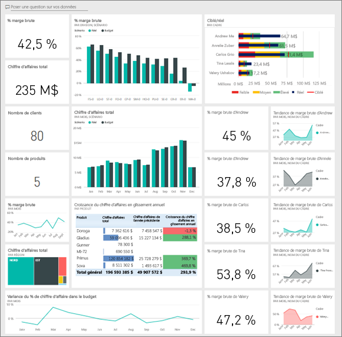
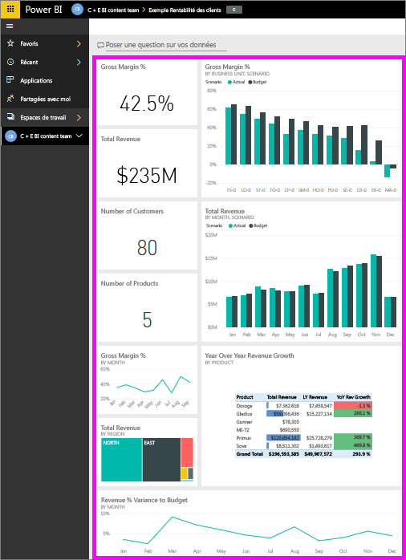
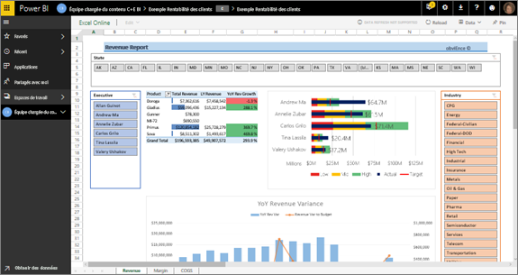
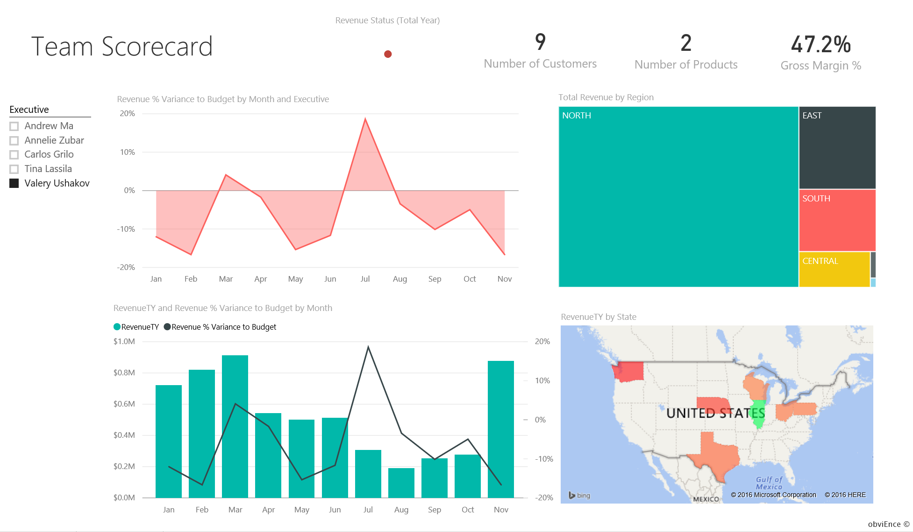
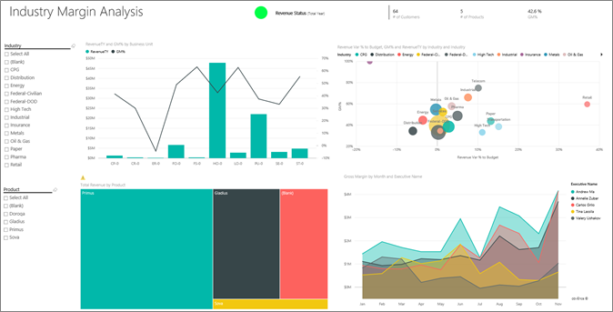
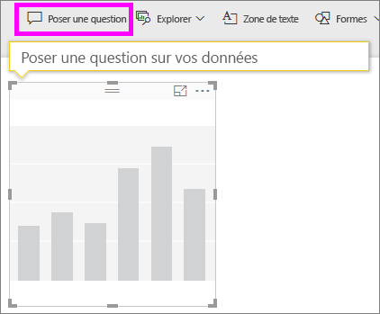
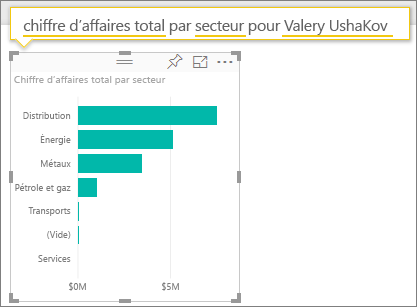
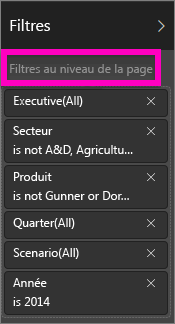
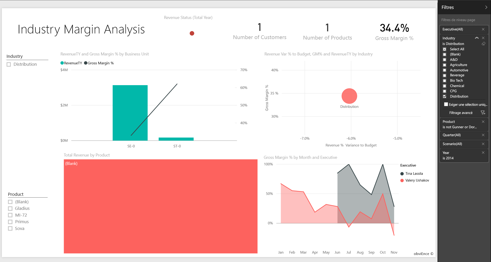
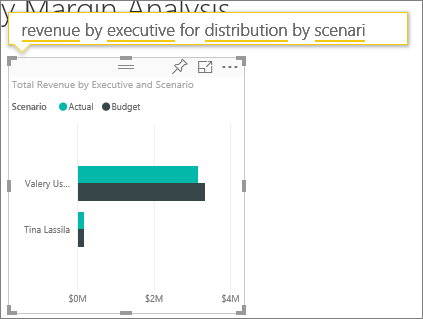

# Exemple Rentabilité des clients pour Power BI : Visite guidée

Le pack de contenu exemple Rentabilité des clients contient un tableau de bord, un rapport et un jeu de données qui concernent une société qui fabrique des supports marketing. Ce tableau de bord a été créé par une directrice financière désireuse d’afficher des métriques clés sur les cinq responsables de division (cadres), les produits, les clients et les marges brutes (GM). D’un coup d’œil, elle peut identifier les facteurs qui ont un impact sur la rentabilité.

Cet exemple fait partie d’une série d’exemples qui illustre la façon dont vous pouvez utiliser Power BI avec des données, des rapports et des tableaux de bord orientés métier. Il a été créé par [obviEnce](http://www.obvience.com/) avec des données réelles qui sont présentées de façon anonyme. Les données sont disponibles dans plusieurs formats : pack de contenu, fichier .pbix Power BI Desktop ou classeur Excel. Consultez [Exemples pour Power BI](sample-datasets.md). 

Ce tutoriel explore le pack de contenu de l’exemple Rentabilité des clients dans le service Power BI. Les expériences d’utilisation des rapports étant similaires dans Power BI Desktop et dans le service, vous pouvez également poursuivre avec et l’exemple de fichier .pbix dans Power BI Desktop. 

Vous n’avez pas besoin d’une licence Power BI pour explorer les exemples dans Power BI Desktop. Si vous n’avez pas de licence Power BI Pro, vous pouvez enregistrer l’exemple dans votre espace Mon espace de travail du service Power BI. 

## Obtenir l’exemple

Avant de pouvoir utiliser l’exemple, vous devez le télécharger en tant que [pack de contenu](#get-the-content-pack-for-this-sample), [fichier .pbix](#get-the-pbix-file-for-this-sample) ou [classeur Excel](#get-the-excel-workbook-for-this-sample).

### Se procurer le pack de contenu pour cet exemple

1. Ouvrez le service Power BI (app.powerbi.com), connectez-vous et ouvrez l’espace de travail où vous souhaitez enregistrer l’exemple.

   Si vous n’avez pas de licence Power BI Pro, vous pouvez enregistrer l’exemple dans votre espace Mon espace de travail.

2. Dans le coin inférieur gauche, sélectionnez **Obtenir des données**.

   
3. Dans la page **Obtenir des données** qui s’affiche, sélectionnez **Exemples**.

4. Sélectionnez l’**exemple Rentabilité des clients**, puis choisissez **Se connecter**.  

    
5. Power BI importe le pack de contenu, puis ajoute un tableau de bord, un rapport et un jeu de données à votre espace de travail actuel.

    

### Se procurer le fichier .pbix pour cet exemple

Vous pouvez également télécharger l’exemple Rentabilité des clients en tant que [fichier .pbix](https://download.microsoft.com/download/6/A/9/6A93FD6E-CBA5-40BD-B42E-4DCAE8CDD059/Customer%20Profitability%20Sample%20PBIX.pbix), qui est conçu pour une utilisation avec Power BI Desktop.

### Se procurer le classeur Excel pour cet exemple

Si vous souhaitez afficher la source de données de cet exemple, elle est également disponible en tant que [classeur Excel](https://go.microsoft.com/fwlink/?LinkId=529781). Le classeur contient des feuilles Power View que vous pouvez consulter et modifier. Pour afficher les données brutes, activez les compléments Analyse de données, puis sélectionnez **Power Pivot > Gérer**. Pour plus d’informations sur l’activation des compléments Power View et Power Pivot, consultez [Affichage des exemples Excel directement dans Excel](sample-datasets.md#optional-take-a-look-at-the-excel-samples-from-inside-excel-itself).

## Que nous révèle ce tableau de bord ?

Dans l’espace de travail où vous avez enregistré l’exemple, recherchez le tableau de bord Rentabilité des clients et sélectionnez-le :

### Vignettes de tableau de bord à l’échelle de l’entreprise
1. Ouvrez le tableau de bord dans le service Power BI. Ces vignettes de tableau de bord offrent à la directrice financière une vue d’ensemble des mesures de l’entreprise importantes pour elle. Quand quelque chose l’interpelle, elle peut sélectionner une vignette pour explorer les données.

2. Passez en revue les vignettes du côté gauche du tableau de bord.

    

   Notez les points suivants :
   - La société a une marge brute de 42,5 %.
   - Elle compte 80 clients.
   - Elle vend cinq produits différents.
   - Elle a enregistré son plus faible écart de chiffre d’affaires par rapport aux prévisions en février, suivi du plus haut en mars.
   - Notre chiffre d’affaires est réalisé principalement dans les régions Est (« East ») et Nord (« North »). La marge brute n’a jamais dépassé les prévisions ; quelques recherches complémentaires devront être entreprises en ce qui concerne les divisions ER-0 et MA-0.
   - Le chiffre d’affaires total de l’année est proche des prévisions.

### Vignettes de tableau de bord des responsables
Les vignettes du côté droit du tableau de bord représentent la carte de performance de l’équipe. La directrice financière a besoin d’effectuer le suivi des responsables, et ces vignettes lui offrent une vision globale des bénéfices, grâce à GM% (ratio de marge brute). Si la tendance du ratio de marge brute est inattendue pour l’un des responsables, il peut étudier la question de plus près.

L’analyse des vignettes de tableau de bord des responsables nous permet de faire les observations suivantes :

- Tous les cadres, à l’exception de Carlos, ont déjà dépassé leur objectif de ventes. Toutefois, les ventes réelles de Carlos sont les plus élevées.
- Le ratio de marge brute d’Annelie est le plus bas, mais nous constatons cependant qu’il augmente de façon régulière depuis le mois de mars.
- Valery, quant à elle, a vu le sien baisser de manière significative.
- Andrew a eu une année en dents de scie.

## Explorer les données sous-jacentes du tableau de bord
Ce tableau de bord comporte des vignettes qui pointent vers un rapport et un classeur Excel.

### Ouvrir la source de données Excel Online
Deux vignettes de ce tableau de bord, **Target vs Actual** (Objectif/Réel) et **Year Over Year Revenue Growth** (Croissance du chiffre d’affaires en glissement annuel), ont été épinglées à partir d’un classeur Excel. Quand l’une d’elles est sélectionnée, Power BI ouvre la source des données, Excel Online dans ce cas.

1. Sélectionnez l’une des vignettes épinglées à partir d’Excel. Excel Online s’ouvre dans le service Power BI.
2. Notez que le classeur comporte trois onglets de données. Ouvrez **Revenue** (Chiffre d’affaires).
3. Examinons pourquoi Carlos n’a pas encore atteint son objectif :  

    a. Sur le curseur **Executive** (Cadre), sélectionnez **Carlos Grilo**.   

    b. Le premier tableau croisé dynamique indique que la croissance du chiffre d’affaires de Carlos pour son produit phare, Primus, est en baisse de 152 % par rapport à l’année dernière. Le graphique **Variation des revenus d’une année à l’autre** montre que Carlos est au-dessous du budget la plupart du temps.  

    

    

4. Poursuivez votre exploration. Si vous trouvez quelque chose d’intéressant, sélectionnez **Épingler**  dans le coin supérieur droit pour [l’épingler à un tableau de bord](service-dashboard-pin-tile-from-excel.md).

5. Utilisez la flèche de retour de votre navigateur pour revenir au tableau de bord.

### Ouvrir le rapport Power BI sous-jacent
La plupart des vignettes du tableau de bord de l’exemple Rentabilité des clients ont été épinglées à partir du rapport de l’exemple Rentabilité des clients sous-jacent.

1. Sélectionnez l’une de ces vignettes pour ouvrir le rapport en Mode Lecture.

   Si la vignette a été créée dans Questions et réponses, sélectionnez-la pour ouvrir la fenêtre Questions et réponses. Sélectionnez **Quitter Questions et réponses** pour revenir au tableau de bord et essayer une autre vignette.

2. Le rapport comprend trois pages. Chaque onglet dans la partie inférieure du rapport représente une page différente.

    

    * **Team Scorecard** (Carte de performance de l’équipe) se concentre sur les performances des cinq responsables et leur activité.
    * **Industry Margin Analysis** (Analyse de la marge sectorielle) permet d’analyser la rentabilité par rapport au secteur.
    * **Executive Scorecard** (Carte de performance de l’exécutif) affiche chacun des responsables, selon une mise en page définie pour Cortana.

### Page « Team Scorecard » (Carte de performance de l’équipe)

Étudions en détail le cas de deux membres de l’équipe et voyons les enseignements que l’on peut en tirer : 

1. Dans le segment **Executive** situé à gauche, sélectionnez le nom d’Andrew pour filtrer la page de rapport afin d’afficher uniquement les données concernant Andrew :

   * Pour un indicateur de performance clé rapide, regardez **l’état du chiffre d’affaires (année complète)** (Revenue Status [Total Year]) d’Andrew : il est vert, ce qui signifie qu’il obtient de bons résultats.
   * Le graphique **Revenue % Variance to Budget by Month and Executive** montre que si l’on fait abstraction d’une baisse en février, Andrew obtient de bons résultats. La région prédominante pour Andrew est la région Est, qui comprend 49 clients et cinq des sept produits. Le ratio de marge brute d’Andrew n’est ni le plus élevé ni le plus faible.
   * Le graphique **RevenueTY and Revenue % Var to Budget by Month** (chiffre d’affaires annuel et écart en % du chiffre d’affaires par rapport aux prévisions par mois) fait état d’un bénéficie régulier. Toutefois, si vous filtrez en sélectionnant le carré de la région **Central** (Centre) dans le treemap des régions, vous constatez qu’Andrew n’a généré du chiffre d’affaires qu’en mars et seulement dans l’Indiana. S’agit-il d’une tendance intentionnelle ou y a-t-il une autre raison à découvrir ?

2. Passons maintenant au cas de Valery. Dans le segment **Executive**, sélectionnez le nom de Valery pour filtrer la page de rapport afin d’afficher uniquement les données la concernant. 

   

   * Notez que l’indicateur de performance clé **Revenue Status (Total Year)** (État du chiffre d’affaires [année complète]) est au rouge. Cet élément nécessite une analyse plus fine.
   * De même, l’écart de son chiffre d’affaires dresse un tableau inquiétant. Valery n’a pas atteint les objectifs de marge définis.
   * Valery a seulement neuf clients, vend seulement deux produits et travaille presque exclusivement avec des clients de la région Nord (« North »). Cette spécialisation peut expliquer les fluctuations importantes observées dans les métriques.
   * Si vous sélectionnez le carré **North** (Nord) dans l’arborescence, vous pouvez constater que la marge brute de Valery pour cette région est en phase avec sa marge globale.
   * En sélectionnant chacun des autres carrés **Revenu total par région**, on découvre quelque chose d’intéressant : son ratio de marge brute (GM%) varie de 23 % à 79 %. Le chiffre d’affaires de Valery, dans toutes les régions à l’exception du Nord, est extrêmement saisonnier.

3. Poursuivez l’exploration pour découvrir les raisons qui expliquent les mauvais résultats enregistrés dans la zone de Valery. Examinez les régions, les autres divisions et la page suivante du rapport : **Industry Margin Analysis** (Analyse de la marge sectorielle).

### Industry Margin Analysis
La page du rapport intitulée « Industry Margin Analysis » propose une autre découpe des données. Elle s’intéresse à la marge brute de l’ensemble des secteurs, ventilée par segment. La directrice financière se sert de cette page pour comparer les métriques de l’entreprise et des divisions à celles des secteurs d’activité afin d’analyser les tendances et la rentabilité. Vous vous demandez peut-être ce que fait le graphique **% de marge brute par mois et par cadre** dans cette page, puisque celle-ci est censée concerner l’équipe. En fait, il permet de filtrer la page par responsable de division.  

1. Dans quelle mesure la rentabilité varie-t-elle en fonction du secteur d’activité ? Quelle est la répartition des produits et des clients par secteur d’activité ? Pour répondre à ces questions, sélectionnez un ou plusieurs secteurs d’activité dans la partie en haut à gauche (commencez par CPG, c’est-à-dire le secteur des biens emballés pour la vente au détail). Pour effacer le filtre, sélectionnez l’icône en forme de gomme.

2. Sur le graphique à bulles **% de variation des revenus par rapport au budget, % de marge brute et chiffre d’affaires annuel par secteur**, la directrice financière recherche les plus grosses bulles, celles-ci ayant le plus d’impact sur le chiffre d’affaires. Pour afficher facilement l’impact de chaque responsable par secteur, filtrez la page en cliquant sur le nom de chaque responsable dans le graphique en aires.

3. Lorsque vous sélectionnez chaque responsable dans le graphique, notez les points suivants :
   * La zone d’influence d’Andrew s’étend sur plusieurs secteurs d’activité bien différents avec un ratio de marge brute (le plus souvent positif) et un pourcentage d’écart très variables.
   * Le graphique d’Annelie est assez similaire, sauf qu’elle se concentre uniquement sur quelques secteurs d’activité, avec une priorité donnée au secteur Federal et au produit Gladius.
   * Carlos met clairement l’accent sur le segment Services, ce qui lui réussit. Carlos a également fortement amélioré son pourcentage d’écart (Var%) dans les secteurs High Tech (Hautes technologies) et Industrial (Industrie), qui est nouveau et où il a nettement dépassé les prévisions.
   * Tina se concentre sur quelques secteurs, et c’est elle qui affiche le meilleur ratio de marge brute, mais la petite taille des bulles indique que sa contribution au résultat de l’entreprise est minime.
   * Valery, qui a un seul produit dans son portefeuille, travaille seulement dans cinq secteurs d’activité. Bien que son activité soit saisonnière, elle produit toujours une bulle de grande taille, ce qui est le signe qu’elle contribue de manière importante au résultat de l’entreprise. Est-ce que ses performances négatives sont liées aux secteurs ?

### Executive Scorecard
Cette page est mise en forme comme une carte de réponse pour Cortana. Pour plus d’informations, consultez [Créer une page de réponse personnalisées pour Cortana](service-cortana-answer-cards.md).

## Explorer les données en posant des questions dans Q&R
Pour notre analyse, il serait intéressant d’identifier le secteur d’activité qui profite le plus à Valery en termes de chiffre d’affaires. Utilisons Q&R.

1. Sélectionnez **Modifier le rapport** pour ouvrir le rapport en Mode Édition. Le mode Édition est uniquement disponible si vous êtes propriétaire du rapport. Ce mode est parfois appelé *créateur*. Si, à l’inverse, ce rapport a été partagé uniquement avec vous, vous ne pouvez pas l’ouvrir en mode Édition.

2.  En haut du tableau de bord, sélectionnez **Poser une question** pour ouvrir la zone Questions et réponses.

    

3. Tapez *revenu total par secteur pour Valery*. Comme vous pouvez le constater, la visualisation se met à jour à mesure que vous tapez la question.

    

   Comme vous pouvez le voir, le secteur le plus porteur pour Valery est celui de la distribution.

### Aller plus loin en ajoutant des filtres
Penchons-nous sur le secteur de la distribution.  

1. Ouvrez la page de rapport **Industry Margin Analysis** (analyse de la marge sectorielle).
2. Sans sélectionner de visualisations sur la page de rapport, développez le volet Filtres à droite (si ce n’est déjà fait). Le volet **Filtres** doit afficher uniquement **Filtres de niveau page**.  

   
3. Recherchez le filtre pour **Industry** ( secteur), puis cliquez sur la flèche pour développer la liste. Ajoutons un filtre de page pour le secteur Distribution. Tout d’abord, annulez toutes les sélections en désactivant la case à cocher **Sélectionner tout**. Ensuite, sélectionnez **Distribution** seulement.  

   
4. Le graphique **Gross Margin % by Month and Executive** (% de marge brute par mois et par cadre) nous apprend que seules Valery et Tina ont des clients dans ce secteur d’activité et que Valery ne travaille dans ce secteur que de juin à novembre.   
5. Sélectionnez **Tina**, puis **Valery** dans la légende du graphique **Gross Margin % by Month and Executive** (% de marge brute par mois et par cadre) Remarquez que la contribution de Tina au chiffre d’affaires total par produit (**Total Revenue by Product**) est faible par rapport à celle de Valery.
6. Pour afficher les revenus réels, sélectionnez la zone Questions et réponses dans le tableau de bord et saisissez *revenu total par cadre pour la distribution par scénario*.  

     

    Nous pouvons procéder de la même manière pour explorer d’autres secteurs, voire ajouter des clients à nos éléments visuels pour comprendre les performances de Valery.

## Étapes suivantes : Vous connecter à vos données
Cet environnement est sécurisé pour y jouer, étant donné que vous pouvez choisir ne pas enregistrer vos modifications. Mais si vous les enregistrez, vous pouvez toujours sélectionner **Obtenir des données** pour obtenir une nouvelle copie de cet exemple.

Nous espérons que cette visite guidée vous a montré comment les tableaux de bord, Questions et réponses et les rapports Power BI peuvent fournir des insights sur des exemples de données. À présent, c’est votre tour : connectez-vous à vos propres données. Avec Power BI, vous pouvez vous connecter à une grande variété de sources de données. Pour en savoir plus, consultez [Prise en main du service Power BI](service-get-started.md).

