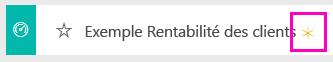

# Exemple Rentabilité des clients pour Power BI : visite guidée

## Vue d’ensemble de l’exemple Rentabilité des clients
Le pack de contenu « Exemple Rentabilité des clients » contient un tableau de bord, un rapport et un jeu de données qui concernent une société qui fabrique des supports marketing. Ce tableau de bord a été créé par une directrice financière désireuse d’afficher des métriques clés sur les 5 responsables de division (encadrement), les produits, les clients et les marges brutes (GM). D’un simple coup d’œil, elle peut identifier les facteurs qui ont un impact sur la rentabilité.

Cet exemple fait partie d’une série d’exemples qui illustre la façon dont vous pouvez utiliser Power BI avec des données, des rapports et des tableaux de bord orientés métier. Il s’agit de données réelles provenant d’obviEnce ([www.obvience.com](http://www.obvience.com/)), présentées de façon anonyme. Les données sont disponibles dans plusieurs formats : application/pack de contenu, classeur Excel ou fichier PBIX Power BI Desktop. Consultez la section [Jeux de données d’exemple](sample-datasets.md).

## Conditions préalables
Comment procéder ? Ce didacticiel utilise le service Power BI et le pack de contenu d’exemple « Rentabilité des clients ».  Les expériences d’utilisation des rapports étant similaires, vous pouvez également poursuivre avec Power BI Desktop et le fichier PBIX d’exemple. Voici les instructions de connexion au pack de contenu et au fichier PBIX.

### Se procurer le pack de contenu pour cet exemple

1. Ouvrez le service Power BI (app.powerbi.com), puis connectez-vous.
2. Dans le coin inférieur gauche, sélectionnez **Obtenir des données**.

    
3. Dans la page Obtenir des données qui s’affiche, sélectionnez l’icône **Exemples**.

   
4. Sélectionnez l’**exemple Rentabilité des clients**, puis choisissez **Se connecter**.  

   
5. Power BI importe le pack de contenu, puis ajoute un tableau de bord, un rapport et un jeu de données à votre espace de travail. Le nouveau contenu est signalé par un astérisque jaune. Utilisez les exemples pour tester Power BI.  

   

### Se procurer le fichier .pbix pour cet exemple

Vous pouvez également télécharger l’exemple en tant que fichier .pbix, qui est conçu pour une utilisation avec Power BI Desktop.
[Exemple Rentabilité des clients](http://download.microsoft.com/download/6/A/9/6A93FD6E-CBA5-40BD-B42E-4DCAE8CDD059/Customer%20Profitability%20Sample%20PBIX.pbix)

### Se procurer le classeur Excel pour cet exemple

Si vous souhaitez fouiller dans la source de données de cet exemple, elle est également disponible en tant que [(classeur Excel)](http://go.microsoft.com/fwlink/?LinkId=529781). Le classeur contient des feuilles Power View que vous pouvez consulter et modifier. Pour afficher les données brutes, sélectionnez **Power Pivot > Gérer**.

## Que nous révèle ce tableau de bord ?

Sous **Mon espace de travail**, recherchez le tableau de bord de l’exemple Rentabilité des clients :

### Vignettes de tableau de bord à l’échelle de l’entreprise
1. Ouvrez le tableau de bord dans le service Power BI. Ces vignettes de tableau de bord offrent à la directrice financière une vue d’ensemble des mesures de l’entreprise importantes pour elle.  Quand quelque chose l’interpelle, elle peut sélectionner une vignette pour explorer les données.

2. Passez en revue les vignettes du côté gauche du tableau de bord.

    

- La marge brute de notre société est de 42,5 %.
- Nous avons 80 clients.
- Nous vendons 5 produits différents.
- Nous avons enregistré notre plus faible écart de chiffre d’affaires par rapport aux prévisions en février, suivi de notre plus haut en mars.
- Notre chiffre d’affaires est réalisé principalement dans les régions Est (« East » et Nord (« North »). La marge brute n’a jamais dépassé les prévisions ; quelques recherches complémentaires devront être entreprises en ce qui concerne 0-ER et MA-0.
- Le chiffre d’affaires total de l’année est proche des prévisions.

### Vignettes de tableau de bord des responsables
Les vignettes du côté droit du tableau de bord représentent la carte de performance de l’équipe. La directrice financière a besoin d’effectuer le suivi des responsables et ces vignettes lui offrent une vision globale des bénéfices, via GM% (ratio de la marge brute). Si la tendance du ratio de marge brute est inattendue pour l’un des responsables, elle peut étudier la question de plus près.

- Tous les cadres, à l’exception de Carlos, ont déjà dépassé leur objectif de ventes. Mais les ventes réelles de Carlos sont les plus élevées.
- Le ratio de marge brute d’Annelie est le plus bas, mais nous constatons cependant qu’il augmente de façon régulière depuis le mois de mars.
- Valery, quant à elle, a vu le sien baisser de manière significative.
- Et Andrew a eu une année en dents de scie.

## Explorer les données sous-jacentes du tableau de bord
Ce tableau de bord comporte des vignettes qui pointent vers un rapport et un classeur Excel.

### Ouvrir la source de données Excel Online
Deux vignettes de ce tableau de bord, « Objectif / Réel » et « Croissance du chiffre d’affaires en glissement annuel », ont été épinglées à partir d’un classeur Excel. Lorsque l’une d’elles est sélectionnée, Power BI ouvre la source des données, Excel Online dans ce cas.

1. Sélectionnez l’une des vignettes épinglées à partir d’Excel. Excel Online s’ouvre dans le service Power BI.
2. Vous remarquerez que le classeur comporte trois onglets de données. Ouvrez « Chiffre d’affaires ».
3. Regardons pourquoi Carlos n’a pas encore atteint son objectif.  
    a. Sur le curseur « Cadre », sélectionnez **Carlos Grilo**.   
    b. Le premier tableau croisé dynamique indique que le chiffre d’affaires de Carlos pour son produit phare, Primus, a baissé de 152 % par rapport à l’année dernière. Et le graphique en glissement annuel montre qu’il est au-dessous du budget la plupart du temps.  

    

    

4. Poursuivez l’exploration ; si vous trouvez quelque chose d’intéressant, sélectionnez **Épingler**  dans le coin supérieur droit pour [l’épingler à un tableau de bord](service-dashboard-pin-tile-from-excel.md).

5. Utilisez la flèche de retour de votre navigateur pour revenir au tableau de bord.

### Ouvrir le rapport Power BI sous-jacent
La majorité des vignettes du tableau de bord de l’exemple Rentabilité des clients ont été épinglées à partir du rapport de l’exemple Rentabilité des clients sous-jacent.

1. Sélectionnez l’une de ces vignettes pour ouvrir le rapport en Mode Lecture.

2. Le rapport comporte trois pages. Chaque onglet au bas du rapport représente une page.

    

    * La page « Team Scorecard » (Carte de performance de l’équipe) se concentre sur les performances de 5 responsables et sur leur « activité ».
    * La page « Industry Margin Analysis » (Analyse de la marge sectorielle) permet d’analyser notre rentabilité par rapport au secteur.
    * La page « Executive Scorecard » (Carte de performance de l’exécutif) affiche chacun de nos responsables, selon une mise en page définie pour Cortana.

### Page « Team Scorecard » (Carte de performance de l’équipe)

Étudions le cas de deux membres de l’équipe et voyons les enseignements que l’on peut en tirer. Dans le segment situé à gauche, sélectionnez « Andrew » pour filtrer la page de rapport uniquement sur les données le concernant.

* Pour un indicateur de performance clé rapide, regardez **l’état du chiffre d’affaires** (Revenue Status) d’Andrew : il est vert. Cela veut dire qu’il est performant.
* Le graphique en aires « Revenue Var % to Budget by Month » (Écart en % du chiffre d’affaires par rapport aux prévisions par mois) montre que si l’on fait abstraction d’une baisse en février, Andrew obtient dans l’ensemble de bons résultats. La région prédominante pour lui est la région Est (« East »). Il a un portefeuille de 49 clients et il vend 5 produits (sur 7). Son ratio de marge brute (« % GM ») n’est ni le plus élevé ni le plus faible.
* Le graphique « RevenueTY and Revenue Var % to Budget by Month » (Chiffre d’affaires annuel et Écart en % du chiffre d’affaires par rapport aux prévisions par mois) fait état d’un bénéficie régulier. Mais si l’on filtre en cliquant sur le carré de la région **Central** (Centre) dans le treemap des régions, on constate qu’Andrew n’a généré du chiffre d’affaires qu’en mars et seulement dans l’Indiana. Est-ce intentionnel ou y a-t-il une autre raison à découvrir ?

Passons maintenant au cas de Valery. Dans le segment, sélectionnez Valery pour filtrer la page de rapport uniquement sur les données qui l’intéressent.  

* Notez que l’indicateur de performance clé **RevenueTY Status**(État du chiffre d’affaires annuel) est au rouge. Une analyse plus fine s’impose.
* De même, l’écart de son chiffre d’affaires dresse un tableau inquiétant. Elle n’a pas atteint ses objectifs de marge.
* Valery a seulement 9 clients, vend seulement 2 produits et travaille presque exclusivement avec des clients de la région Nord (« North »). Cette spécialisation pourrait expliquer les fluctuations importantes observées dans ses métriques.
* En sélectionnant le carré **North** (Nord) dans le treemap, on constate que la marge brute de Valery pour la région Nord cadre est en phase avec sa marge globale.
* En sélectionnant les carrés des autres **régions** , on découvre quelque chose d’intéressant : son ratio de marge brute (GM%) varie de 23 % à 79 % et son chiffre d’affaires, dans toutes les régions à l’exception du Nord, est extrêmement saisonnier.

Poursuivez l’analyse pour découvrir les raisons qui expliquent les mauvais résultats enregistrés dans la zone de Valery. Examinez les régions, les autres divisions et la page suivante du rapport : « Industry Margin Analysis » (Analyse de la marge sectorielle).

### Analyse de la marge sectorielle
La page du rapport intitulée « Industry Margin Analysis » propose une autre découpe des données. Elle s’intéresse à la marge brute de l’ensemble des secteurs, ventilée par segment. La directrice financière se sert de cette page pour comparer les métriques de l’entreprise et des divisions à celles des secteurs d’activité afin d’analyser les tendances et la rentabilité. Vous vous demandez peut-être se que fait le graphique en aires « Gross Margin by Month and Executive Name » (Marge brute par mois et par cadre » dans cette page, puisque celle-ci est censée concerner l’équipe. En fait, il permet de filtrer la page par responsable de division.  

Dans quelle mesure la rentabilité varie-t-elle en fonction du secteur d’activité ? Quelle est la répartition des produits et des clients par secteur d’activité ? Sélectionnez un ou plusieurs secteurs d’activité en haut à gauche. (Le premier est CPG, c’est-à-dire le secteur des biens emballés pour la vente au détail) Pour effacer le filtre, sélectionnez l’icône de gomme.

Dans le graphique en bulles, la directrice financière recherche les bulles les plus grandes, car ce sont celles qui contribuent le plus au chiffre d’affaires. Si l’on filtre la page par responsable en cliquant sur leurs noms dans le graphique en aires, il est facile de déterminer l’impact de chacun d’eux par secteur d’activité.

* La zone d’influence d’Andrew s’étend sur plusieurs secteurs d’activité bien différents avec un ratio de marge brute (le plus souvent positif) et un pourcentage d’écart très variables.
* Le graphique d’Annelie est assez similaire, sauf qu’elle se concentre uniquement sur quelques secteurs d’activités, avec une priorité donnée au secteur Federal et au produit Gladius.
* Carlos met clairement l’accent sur le segment Services, ce qui lui réussit. Il a fortement amélioré son pourcentage d’écart sur les secteurs High Tech (Hautes technologies) et Industrial (Industrie), qui est nouveau pour lui et où il a nettement dépassé les prévisions.
* Tina se concentre sur quelques secteurs et c’est elle qui affiche le meilleur ratio de marge brute, mais la petite taille de ses bulles indique que sa contribution au résultat de l’entreprise est minime.
* Valery, qui a un seul produit dans son portefeuille, travaille seulement dans 5 secteurs d’activité. Bien que son activité soit saisonnière, elle produit toujours une bulle de grande taille, ce qui est le signe qu’elle contribue de manière importante au résultat de l’entreprise. Est-ce le secteur qui explique ses performances négatives ?

### Tableau de bord exécutif
Cette page est mise en forme comme une carte de réponse pour Cortana. Pour plus d’informations, voir [Créer des cartes de réponses pour Cortana](service-cortana-answer-cards.md).

## Explorer les données en posant des questions dans Q&R
Pour notre analyse, il serait intéressant d’identifier le secteur d’activité qui profite le plus à Valery en termes de chiffre d’affaires. Utilisons Q&R.

1. Ouvrez le rapport en Mode Édition en sélectionnant **Modifier le rapport**. Le Mode Édition n’est disponible qu’aux « propriétaires » du rapport ; il est parfois nommé Mode **Créateur**. Si, à l’inverse, ce rapport a été partagé avec vous, vous ne pourrez pas l’ouvrir en Mode Édition.

2.  Dans la barre de menus supérieure, sélectionnez **Poser une question** pour ouvrir la zone Questions et réponses.

    

3. Tapez **total revenue by industry for Valery**(chiffre d’affaires total par secteur pour Valery). Comme vous pouvez le constater, la visualisation se met à jour à mesure que vous tapez la question.

    

   Le secteur le plus porteur pour Valery est celui de la distribution.

### Aller plus loin en ajoutant des filtres
Penchons-nous sur le secteur *Distribution* .  

1. Ouvrez la page de rapport « Analyse de la marge sectorielle ».
2. Sans sélectionner de visualisations sur la page de rapport, développez le volet Filtres à droite (si ce n’est déjà fait). Le volet Filtres doit afficher uniquement les filtres au niveau page.  

   
3. Recherchez le filtre pour **Industry** ( secteur), puis cliquez sur la flèche pour développer la liste. Ajoutons un filtre de page pour le secteur Distribution. Tout d’abord, annulez toutes les sélections en désactivant la case à cocher **Sélectionner tout**. Ensuite, sélectionnez seulement **Distribution**.  

   
4. Le graphique en aires « Gross margin by Month and Executive Name » (Marge brute par mois et par cadre) nous apprend que seules Valery et Tina ont des clients dans ce secteur d’activité et que Valery ne travaille dans ce secteur que de juin à novembre.   
5. Sélectionnez **Tina**, puis **Valery** dans la légende du graphique en aires « Gross margin by Month and Executive » (Marge brute par mois et Exécutif). Remarquez que la contribution de Tina au chiffre d’affaires total par produit (« Total Revenue by Product ») est très faible par rapport à celle de Valery.
6. Pour afficher le chiffre d’affaires réel, utilisez la fonctionnalité Questions et réponses pour demander le **chiffre d’affaires total par cadre pour la distribution par scénario**.  

     

    Nous pouvons procéder de la même manière pour explorer d’autres secteurs, voire ajouter des clients à nos éléments visuels pour comprendre les performances de Valery.

Il s’agit d’un environnement sécurisé à explorer. Vous pouvez toujours choisir de ne pas enregistrer les modifications apportées. Mais si vous les enregistrez, vous pouvez toujours accéder à **Obtenir des données** pour avoir une nouvelle copie de cet exemple.

Vous pouvez également [télécharger uniquement le jeu de données (classeur Excel) de cet exemple](http://go.microsoft.com/fwlink/?LinkId=529781).

## Étapes suivantes : Connexion à vos données
Nous espérons qu’à travers cette visite guidée, vous aurez cerné tout l’intérêt des tableaux de bord Power BI, de Q&R et des rapports pour tirer des informations des données client. À présent, c’est votre tour : connectez-vous à vos propres données. Avec Power BI, vous pouvez vous connecter à une grande variété de sources de données. En savoir plus sur [la prise en main de Power BI](service-get-started.md).

[Revenir aux exemples Power BI](sample-datasets.md)  
