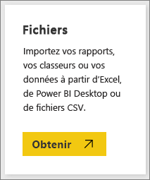
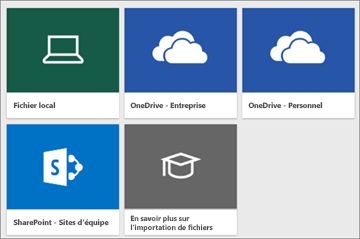
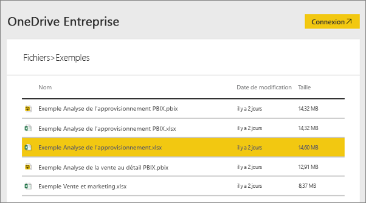
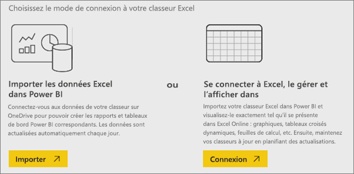
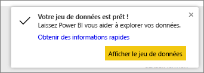
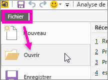

# Quels exemples de données pouvez-vous utiliser avec Power BI ?
Vous n’avez pas de données sous la main pour essayer Power BI ?  Vous avez un jeu de données, mais vous craignez de l’endommager, car vous ne connaissez pas assez bien le fonctionnement de Power BI ?

Ne vous inquiétez pas. obviEnce ([www.obvience.com](http://www.obvience.com/)) et Microsoft ont créé des exemples de données que vous pouvez utiliser pour vous familiariser avec Power BI.  Ces données sont anonymes et représentatives de différents secteurs d’activité : finances, ressources humaines, ventes et bien plus encore. D’ailleurs, notre documentation en ligne contient des didacticiels et des exemples que vous pouvez suivre à la lettre, car ils utilisent les mêmes exemples de données.      

   

Chacun de ces exemples est disponible sous plusieurs formats : pack de contenu, classeur Excel et fichier .pbix. Si vous ne connaissez pas ces formats ou ignorez comment y accéder, pas de problème : la suite de cet article fournit les explications nécessaires. De plus, nous avons rédigé une *présentation* de chaque exemple, c’est-à-dire un article qui détaille les données de l’exemple et vous guide dans les différents scénarios. Voici quelques exemples de scénarios : répondre aux questions de votre responsable, rechercher des informations sur la concurrence, mais aussi créer des rapports et tableaux de bord pour partager ou expliquer une évolution commerciale.   

Mais avant de commencer, lisez ces instructions juridiques sur l’utilisation des exemples. Une fois cette lecture terminée, nous vous présenterons les exemples et vous expliquerons comment les utiliser.   

## Instructions d’utilisation pour les classeurs Excel d’exemples Power BI
Lisez ces informations avant d’utiliser les exemples Power BI.

©2015 Microsoft Corporation. Tous droits réservés. Les documents et les classeurs sont fournis « en l’état ». Les informations et les opinions exprimées dans les classeurs, y compris les URL et les autres références à des sites web Internet, sont susceptibles d’être modifiées sans préavis. Vous assumez les risques liés à leur utilisation. Certains exemples sont fournis à des fins d’illustration et sont fictifs. Aucune association réelle n’est voulue ni sous-entendue. Microsoft exclut toute garantie, expresse ou implicite, concernant les informations fournies ici.

Les classeurs ne vous confèrent aucun droit légal sur toute propriété intellectuelle dans un quelconque produit Microsoft. Vous pouvez copier et utiliser ce classeur pour un usage interne, à titre de référence.

Les classeurs et les données associées sont fournis par obviEnce. [www.obvience.com](http://www.obvience.com)

ObviEnce est un éditeur de logiciels et un incubateur de propriété intellectuelle (IP) spécialiste de Microsoft Business Intelligence. ObviEnce travaille en étroite collaboration avec Microsoft pour développer des meilleures pratiques et un leadership éclairé visant à faire émerger et à déployer des solutions Microsoft Business Intelligence.

Les classeurs et les données sont la propriété d’obviEnce, LLC et sont partagés uniquement dans le but d’illustrer les fonctionnalités de Power BI avec des exemples de données issus de l’industrie.

Toutes les utilisations des classeurs et/ou des données doivent inclure l’attribution ci-dessus (qui figure également sur la feuille de calcul Info incluse dans chaque classeur). Le classeur et toutes les visualisations doivent être accompagnés de la mention de copyright suivante : obviEnce ©.

En cliquant sur les liens ci-dessous pour télécharger les fichiers .pbix ou des classeurs Excel, vous acceptez les conditions ci-dessus.

## Exemples disponibles
8 exemples sont mis à votre disposition.  Chacun d’eux représente un secteur d’activité particulier.

### Exemple Rentabilité des clients 
[Découvrez l’exemple Rentabilité des clients](sample-customer-profitability.md)

Cet exemple de secteur d’activité analyse les principales métriques des cadres, produits et clients d’une directrice financière. Vous pouvez examiner quels facteurs ont un impact sur la rentabilité de l’entreprise.

### Exemple Ressources humaines 
[Découvrez l’exemple Ressources humaines](sample-human-resources.md)

Cet exemple de secteur d’activité se focalise sur la stratégie de recrutement d’une entreprise en analysant les nouvelles embauches, les employés actifs et les employés ayant quitté l’entreprise.  En explorant les données, vous pouvez rechercher les tendances en matière de départs volontaires et de stratégie d’embauche.

### Exemple Analyse des dépenses informatiques 
[Découvrez l’exemple Analyse des dépenses informatiques](sample-it-spend.md)

Dans cet exemple, nous analysons les coûts prévus par rapport aux coûts réels du service informatique d’une entreprise. Cette comparaison nous aide à évaluer la pertinence des prévisions de l’entreprise pour l’année et à analyser les secteurs qui présentent des écarts importants par rapport aux prévisions. L’entreprise décrite dans cet exemple suit un cycle de prévision annuel. Ensuite, tous les trimestres, elle produit ses toutes dernières estimations pour faciliter l’analyse des changements survenus en matière de dépenses informatiques pendant l’année fiscale.

### Exemple Analyse des opportunités 
[Découvrez l’exemple Analyse des opportunités](sample-opportunity-analysis.md)

Cet exemple de secteur d’activité explore le canal de vente d’une société. Les responsables des ventes surveillent les ventes de leurs canaux de vente directs et des partenaires en suivant les opportunités et les chiffres d’affaires par région, par volume de transactions et par canal.

### Exemple Analyse de l’approvisionnement 
[Découvrez l’exemple Analyse de l’approvisionnement](sample-procurement.md)

Cet exemple de secteur d’activité analyse les principales métriques des cadres, produits et clients d’une directrice financière. Vous pouvez examiner quels facteurs ont un impact sur la rentabilité de l’entreprise.

### Exemple Analyse de la vente au détail 
[Découvrez l’exemple Analyse de la vente au détail](sample-retail-analysis.md)

Cet exemple de secteur d’activité analyse les données de vente au détail d’articles vendus dans plusieurs magasins et régions. Les métriques comparent les performances de l’année à celles de l’année précédente dans les domaines suivants : ventes, unités, marge brute, écart et analyse des nouveaux magasins.

### Exemple Vente et marketing 
[Découvrez l’exemple Vente et marketing](sample-sales-and-marketing.md)

Cet exemple de secteur d’activité analyse une entreprise de fabrication, VanArsdel Ltd. Il permet au directeur marketing d’observer l’évolution de l’industrie et la part de marché de VanArsdel.  En explorant cet exemple, vous pouvez découvrir la part de marché de l’entreprise, son volume de produits et ses ventes, ainsi que le climat des affaires.

### Exemple Qualité des fournisseurs 
[Découvrez l’exemple Qualité des fournisseurs](sample-supplier-quality.md)

Cet exemple de secteur d’activité se focalise sur l’un des enjeux classiques dans une chaîne d’approvisionnement : l’analyse de la qualité des fournisseurs. Deux métriques principales sont au cœur de cette analyse : le nombre total de défauts et le temps d’arrêt total entraîné par ces derniers. Cet exemple a deux objectifs majeurs : comprendre quels sont les meilleurs et les pires fournisseurs en matière de qualité, et identifier les usines qui réussissent le mieux à détecter et à éliminer les défauts pour réduire le temps d’arrêt.

Maintenant, vous connaissez les exemples disponibles. À présent, découvrez comment les obtenir.  

## Obtention des exemples
Comme indiqué précédemment, les exemples sont disponibles en plusieurs formats : packs de contenu, classeurs Excel et fichiers .pbix. Voici comment utiliser chacun de ces formats, en commençant par les packs de contenu.

## Exemples Power BI sous forme de packs de contenu
Les packs de contenu sont le seul format d’exemple disponible à partir de Power BI ; vous n’êtes pas obligé de quitter Power BI pour les trouver. Pour l’essentiel, un pack de contenu est un ensemble d’un ou plusieurs tableaux de bord, jeux de données et rapports créés par une personne et utilisable avec le service Power BI. Les packs de contenu sont créés pour être partagés avec des collègues. Chaque exemple de pack de contenu Power BI contient un jeu de données, un rapport et un tableau de bord.  Les packs de contenu ne sont pas disponibles pour Power BI Desktop. Si vous souhaitez en savoir plus sur les packs de contenu, consultez [Introduction aux packs de contenu pour Power BI](service-organizational-content-pack-introduction.md).

### Obtenir et ouvrir un exemple de pack de contenu dans le service Power BI
1. Ouvrez le service Power BI (app.powerbi.com), puis connectez-vous.
2. Dans le coin inférieur gauche, sélectionnez **Obtenir des données**.

    
3. Dans la page Obtenir des données qui s’affiche, sélectionnez l’icône **Exemples**.

   
4. Sélectionnez l’un des exemples pour ouvrir une description de cet exemple. Puis choisissez **Se connecter**.  

   
5. Power BI importe le pack de contenu, puis ajoute un tableau de bord, un rapport et un jeu de données à votre espace de travail. Le nouveau contenu est signalé par un astérisque jaune. Utilisez les exemples pour tester Power BI.  

   

Maintenant que vous avez des données, vous êtes sur la bonne voie.  Suivez certains de nos didacticiels en utilisant les exemples de packs de contenu ou ouvrez simplement le service Power BI pour le découvrir.

## Exemples Power BI sous forme de fichiers Excel
Chacun des exemples de packs de contenu est également disponible en tant que classeur Excel. Les classeurs Excel sont conçus pour être utilisés avec le service Power BI.  

1. Téléchargez les fichiers individuels à l’aide des liens ci-dessous ou [téléchargez un fichier zip contenant tous les exemples de fichiers](http://go.microsoft.com/fwlink/?LinkId=535020). Si vous êtes un utilisateur expérimenté, nous vous recommandons de télécharger les classeurs Excel pour explorer ou modifier les modèles de données.

   * [Exemple Analyse de la vente au détail](http://go.microsoft.com/fwlink/?LinkId=529778)
   * [Exemple Analyse de la qualité des fournisseurs](http://go.microsoft.com/fwlink/?LinkId=529779)
   * [Exemple Ressources humaines](http://go.microsoft.com/fwlink/?LinkId=529780)
   * [Exemple Rentabilité des clients](http://go.microsoft.com/fwlink/?LinkId=529781)
   * [Exemple Suivi d’opportunités](http://go.microsoft.com/fwlink/?LinkId=529782)
   * [Exemple Analyse des dépenses informatiques](http://go.microsoft.com/fwlink/?LinkId=529783)
   * [Exemple Analyse de l’approvisionnement](http://go.microsoft.com/fwlink/?LinkId=529784)
   * [Exemple Vente et marketing](http://go.microsoft.com/fwlink/?LinkId=529785)
2. Enregistrez le fichier téléchargé. L’emplacement d’enregistrement de votre fichier change tout.

   *  **Local** : si votre fichier est enregistré sur un disque local sur votre ordinateur ou un autre emplacement de votre organisation, vous pouvez importer votre fichier à partir de Power BI. Votre fichier est en fait conservé sur votre disque local. Il n’est donc pas entièrement importé dans Power BI. En réalité, un nouveau jeu de données est créé dans votre site Power BI, et les données, et dans certains cas le modèle de données, sont chargés dans ce jeu de données. Si votre fichier contient des rapports, ceux-ci apparaissent dans votre site Power BI sous Rapports.
   *  **OneDrive Entreprise** : si vous disposez de OneDrive Entreprise et que vous vous connectez avec le même compte que pour Power BI, cette méthode est de loin la plus efficace pour que votre travail dans Excel, Power BI ou un fichier CSV reste synchronisé avec vos jeux de données, rapports et tableaux de bord dans Power BI. Power BI et OneDrive étant tous les deux dans le cloud, Power BI se connecte à votre fichier sur OneDrive toutes les heures environ. Si des modifications sont détectées, vos jeu de données, rapports et tableaux de bord sont automatiquement mis à jour dans Power BI.
   *  **OneDrive personnel** : si vous enregistrez vos fichiers sur votre compte OneDrive personnel, vous bénéficiez de la plupart des avantages obtenus avec OneDrive Entreprise. La différence principale réside dans le fait que, la première fois que vous vous connectez à votre fichier (via Obtenir des données > Fichiers > OneDrive personnel), vous devez vous connecter à votre compte OneDrive avec votre compte Microsoft, qui est généralement différent de celui utilisé pour vous connecter à Power BI. Lorsque vous vous connectez à OneDrive avec votre compte Microsoft, veillez à sélectionner l’option Maintenir la connexion. Power BI peut ainsi se connecter à votre fichier toutes les heures environ et s’assurer que votre jeu de données dans Power BI est synchronisé.
   *  **Sites d’équipe SharePoint** : l’enregistrement de vos fichiers Power BI sur des sites d’équipe SharePoint revient plus ou moins à enregistrer dans OneDrive Entreprise. La différence majeure réside dans la manière dont vous vous connectez au fichier à partir de Power BI. Vous pouvez spécifier une URL ou vous connecter au dossier racine.
3. Ouvrez le service Power BI (app.powerbi.com), puis connectez-vous.

   > [!TIP]
   > À ce stade, nous vous recommandons de créer un tableau de bord, puis de le nommer selon le fichier que vous prévoyez d’importer.  Sinon, Power BI ne crée pas de tableau de bord nommé d’après l’exemple lors de l’importation du jeu de données Excel. Au lieu de cela, il ajoute une vignette au tableau de bord que vous avez ouvert. En sélectionnant cette vignette, vous accédez au rapport du jeu de données. Cela n’est pas grave, car vous pouvez toujours créer un tableau de bord plus tard. Cependant, partir d’un nouveau tableau de bord vous permet de gagner un peu de temps.
   >
   >
4. Dans le coin inférieur gauche, sélectionnez **Obtenir des données**.

    
5. Dans la page Obtenir des données qui s’affiche, sélectionnez **Fichiers > Obtenir**.

     
6. Accédez à l’emplacement où vous avez téléchargé et enregistré l’exemple.

   
7. Sélectionnez le fichier (ici **Exemple Analyse de l’approvisionnement.xlsx**) qui a été enregistré sur OneDrive Entreprise, puis sélectionnez **Se connecter**.

   
8. Vous pouvez choisir d’importer les données ou d’afficher le classeur dans Power BI pour l’afficher exactement de la même manière que dans Excel Online.

    
9. Si vous sélectionnez **Importer**, Power BI importe l’exemple de classeur et l’ajoute en tant que nouveau jeu de données nommé **Exemple Analyse de l’approvisionnement**.  Si le classeur contient des feuilles, tableaux ou plages Power View, ou un modèle de données, Power BI crée également un rapport (portant le même nom). Et si vous n’avez pas déjà ouvert de tableau de bord, Power BI en crée un. Dans le cas contraire, une fois que vous avez cliqué sur **Obtenir des données**, une vignette vide s’affiche sur votre tableau de bord.  En cliquant sur celle-ci, vous accédez au rapport du jeu de données que vous venez d’ajouter. Le nouveau contenu est nommé d’après l’exemple et il est signalé par un astérisque jaune.
10. Lorsque l’écran **Votre jeu de données est prêt !** s’affiche, sélectionnez **Afficher le jeu de données** ou **Obtenir rapidement des informations** ou utilisez simplement la barre de navigation gauche de Power BI pour localiser et ouvrir le rapport ou le tableau de bord associé.  

     

### (Facultatif) Affichage des exemples Excel directement dans Excel
Vous voulez savoir comment les données d’un classeur Excel sont converties en jeux de données et rapports Power BI ? Pour cela, vous pouvez ouvrir les exemples Excel ***dans Excel*** et parcourir les feuilles de calcul.

* Quand vous ouvrez pour la première fois un classeur d’exemples, deux avertissements peuvent s’afficher. Le premier indique que le classeur est en mode protégé. Sélectionnez **Activer la modification**. Le second peut indiquer que le classeur contient des connexions de données externes. Sélectionnez **Activer le contenu**.
* Chaque classeur contient plusieurs feuilles. Comme ces exemples Excel ont tous au moins une feuille Power View avec des visualisations, lorsque vous importez le fichier Excel dans Power BI, vous obtenez un jeu de données **et** un rapport.

   Vous devrez peut-être [activer le complément Power View](https://support.office.com/article/Create-a-Power-View-sheet-in-Excel-2013-B23D768D-7586-47FE-97BD-89B80967A405#__toc328591957).
* Où se trouvent les données réelles ? Elles sont situées dans le modèle de données Power Pivot. Pour afficher les données, sous l’onglet **PowerPivot**, sélectionnez **Gérer le modèle de données**.

    Vous ne voyez pas l’onglet PowerPivot ? [Activez le complément PowerPivot](https://support.office.com/article/Start-Power-Pivot-in-Microsoft-Excel-2013-add-in-A891A66D-36E3-43FC-81E8-FC4798F39EA8).
* L’onglet Info fournit des informations sur obviEnce, la société qui a créé l’exemple.

## Exemples Power BI sous forme de fichiers .pbix
Chacun des exemples de packs de contenu est également disponible en tant que fichier .pbix pour Power BI. Les fichiers .pbix sont conçus pour être utilisés avec Power BI Desktop.  

1. Téléchargez les fichiers individuellement en utilisant les liens ci-dessous. Quand vous sélectionnez ces liens, le fichier est enregistré automatiquement dans votre dossier Téléchargements. 

   * [PBIX Exemple Analyse de la vente au détail](http://download.microsoft.com/download/9/6/D/96DDC2FF-2568-491D-AAFA-AFDD6F763AE3/Retail%20Analysis%20Sample%20PBIX.pbix)
   * [PBIX Exemple Analyse de la qualité des fournisseurs](http://download.microsoft.com/download/8/C/6/8C661638-C102-4C04-992E-9EA56A5D319B/Supplier%20Quality%20Analysis%20Sample%20PBIX.pbix)
   * [PBIX Exemple Ressources humaines](http://download.microsoft.com/download/6/9/5/69503155-05A5-483E-829A-F7B5F3DD5D27/Human%20Resources%20Sample%20PBIX.pbix)
   * [PBIX Exemple Rentabilité des clients](http://download.microsoft.com/download/6/A/9/6A93FD6E-CBA5-40BD-B42E-4DCAE8CDD059/Customer%20Profitability%20Sample%20PBIX.pbix)
   * [PBIX Exemple Suivi d’opportunités](http://download.microsoft.com/download/9/1/5/915ABCFA-7125-4D85-A7BD-05645BD95BD8/Opportunity%20Analysis%20Sample%20PBIX.pbix)
   * [PBIX Exemple Analyse des dépenses informatiques](http://download.microsoft.com/download/E/9/8/E98CEB6D-CEBB-41CF-BA2B-1A1D61B27D87/IT%20Spend%20Analysis%20Sample%20PBIX.pbix)
   * [PBIX Exemple Analyse de l’approvisionnement](http://download.microsoft.com/download/D/5/3/D5390069-F723-413B-8D27-5888500516EB/Procurement%20Analysis%20Sample%20PBIX.pbix)
   * [PBIX Exemple Vente et marketing](http://download.microsoft.com/download/9/7/6/9767913A-29DB-40CF-8944-9AC2BC940C53/Sales%20and%20Marketing%20Sample%20PBIX.pbix)

1. À partir de Power BI Desktop, sélectionnez **Fichier > Ouvrir**, puis accédez à l’emplacement où vous avez enregistré l’exemple de fichier .pbix.

   
4. Sélectionnez le fichier .pbix pour l’ouvrir dans Power BI Desktop.

## Étapes suivantes
[Power BI - Concepts de base](service-basic-concepts.md)

[Didacticiel : se connecter aux exemples Power BI](sample-tutorial-connect-to-the-samples.md)

[Sources de données pour Power BI](service-get-data.md)

D’autres questions ? [Posez vos questions à la communauté Power BI](http://community.powerbi.com/)
