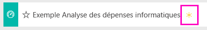
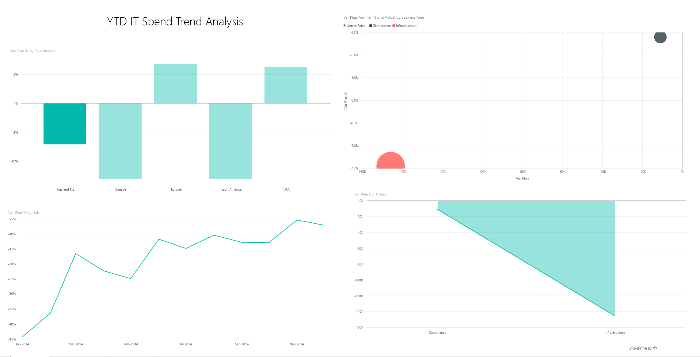
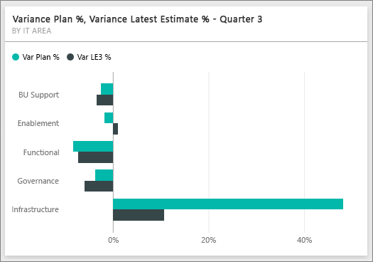
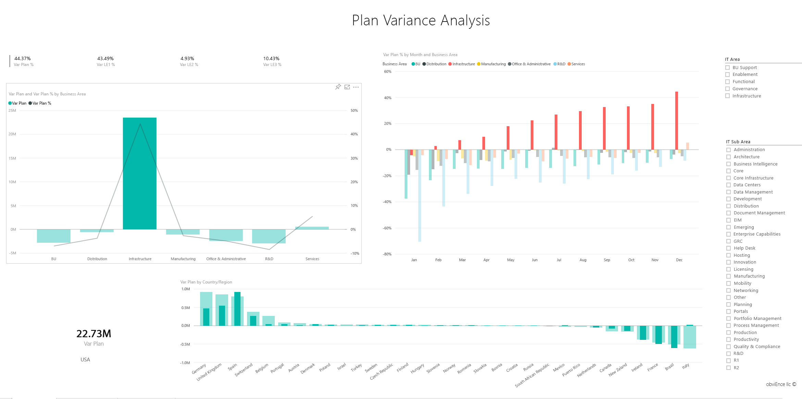

# Exemple Analyse des dépenses informatiques pour Power BI : Visite guidée

## Présentation de l’exemple Analyse des dépenses informatiques
Le [pack de contenu](service-organizational-content-pack-introduction.md) Analyse des dépenses informatiques (tableau de bord, rapports et jeu de données) analyse les coûts prévus par rapport aux coûts réels d’un service informatique. Cette comparaison nous aide à évaluer la pertinence des prévisions de l’entreprise pour l’année et à analyser les secteurs qui présentent des écarts importants par rapport aux prévisions. L’entreprise décrite dans cet exemple suit un cycle de prévision annuel. Ensuite, tous les trimestres, elle produit ses toutes dernières estimations pour faciliter l’analyse des changements survenus en matière de dépenses informatiques pendant l’année fiscale.

Cet exemple fait partie d’une série d’exemples qui illustre la façon dont vous pouvez utiliser Power BI avec des données, des rapports et des tableaux de bord orientés métier. Il s’agit de données réelles provenant d’obviEnce (<http://obvience.com/>), présentées de façon anonyme.

## Conditions préalables

 Avant de pouvoir utiliser l’exemple, vous devez le télécharger en tant que [pack de contenu](https://docs.microsoft.com/power-bi/sample-it-spend#get-the-content-pack-for-this-sample), [fichier .pbix](http://download.microsoft.com/download/E/9/8/E98CEB6D-CEBB-41CF-BA2B-1A1D61B27D87/IT-Spend-Analysis-Sample-PBIX.pbix) ou [classeur Excel](http://go.microsoft.com/fwlink/?LinkId=529783).

### Se procurer le pack de contenu pour cet exemple

1. Ouvrez le service Power BI (app.powerbi.com), puis connectez-vous.
2. Dans le coin inférieur gauche, sélectionnez **Obtenir des données**.
   
    
3. Dans la page Obtenir des données qui s’affiche, sélectionnez l’icône **Exemples**.
   
   
4. Sélectionnez **Exemple Analyse des dépenses informatiques**, puis choisissez **Se connecter**.  
  
   
   
5. Power BI importe le pack de contenu, puis ajoute un tableau de bord, un rapport et un jeu de données à votre espace de travail. Le nouveau contenu est signalé par un astérisque jaune. 
   
   
  
### Se procurer le fichier .pbix pour cet exemple

Vous pouvez également télécharger l’exemple en tant que fichier .pbix, qui est conçu pour une utilisation avec Power BI Desktop. 

 * [Exemple Analyse des dépenses informatiques](http://download.microsoft.com/download/E/9/8/E98CEB6D-CEBB-41CF-BA2B-1A1D61B27D87/IT%20Spend%20Analysis%20Sample%20PBIX.pbix)

### Se procurer le classeur Excel pour cet exemple
Vous pouvez également [télécharger uniquement le jeu de données (classeur Excel) de cet exemple](http://go.microsoft.com/fwlink/?LinkId=529783). Le classeur contient des feuilles Power View que vous pouvez consulter et modifier. Pour afficher les données brutes, sélectionnez **Power Pivot > Gérer**.

## Exemple de tableau de bord Analyse des dépenses informatiques
Les deux vignettes représentant des nombres sur le tableau de bord, **Var Plan %** (% de prévisions d’écart) et **Variance Latest Estimate % Quarter 3**(% des dernières estimations de l’écart du trimestre 3), nous donnent une vue d’ensemble de nos résultats par rapport aux prévisions et par rapport aux estimations du dernier trimestre (LE3 = Latest Estimate Quarter 3, dernières estimations Trimestre 3). Globalement, nous sommes à environ 6 % des prévisions. Examinons la cause de cet écart : quand, où et dans quelle catégorie ?

## Page « YTD IT Spend Trend Analysis » (Analyse des tendances des dépenses informatiques de l’année en cours)
En sélectionnant la vignette de tableau de bord **Var Plan % by Sales Region** (% écart prévisions par région de vente), vous accédez à la page « IT Spend Trend Analysis » (Analyse des tendances des dépenses informatiques) du rapport de l’exemple Analyse des dépenses informatiques. Nous voyons en un clin d’œil que nous avons un écart positif aux États-Unis et en Europe, et un écart négatif au Canada, en Amérique latine et en Australie. Les États-Unis avaient un écart d’environ 6 % au-dessus des dernières estimations et l’Australie a un écart d’environ 7 % en dessous des dernières estimations.

Mais le simple examen de ce graphique et le fait d’en tirer des conclusions peuvent induire en erreur. Nous devons examiner les montants réels en dollars pour replacer les choses dans leur contexte.

1. Sélectionnez **Aus and NZ** (Aus et NZ) dans le graphique Var Plan % by Sales Region (% de prévisions d’écart par région de vente) et observez le graphique Var Plan by IT Area (Prévisions d’écart par domaine informatique).

   
2. Sélectionnez à présent **USA**. Vous comprenez maintenant : l’Australie représente une très petite partie de nos dépenses globales par rapport aux États-Unis.

    Donc nous les avons limitées aux États-Unis. Et maintenant ? Explorons quelle catégorie aux États-Unis est à l’origine de l’écart.

## Poser des questions sur les données
1. Sélectionnez **Exemple Analyse des dépenses informatiques** dans la barre de navigation supérieure pour revenir à Tableaux de bord.
2. Dans la zone de question, tapez « afficher le graphique à barre Var Plan % and Var LE3 % by IT area » (% de prévisions d’écart et % des dernières estimations d’écart pour le trimestre 3).

   

   Dans le premier domaine informatique, **Infrastructure**, le pourcentage a changé considérablement entre les prévisions d’écart initiales et les dernières estimations des prévisions d’écart.

## Page « YTD Spend by Cost Elements » (Dépenses de l’année en cours par élément de coût)
Revenez au tableau de bord et examinez la vignette du tableau de bord **Var Plan %, Var LE3%** (% de prévisions d’écart, % des dernières estimations d’écart pour le trimestre 3).

L’infrastructure dévie avec un écart positif très important par rapport aux prévisions.

1. Cliquez sur cette vignette pour accéder à la page « YTD Spend by Cost Elements » (Dépenses de l’année en cours par élément de coût) du rapport de l’exemple Analyse des dépenses informatiques.
2. Cliquez sur la barre **Infrastructure** dans le graphique « Var Plan % and Var LE3 % by IT Area » (% de prévisions d’écart et % des dernières estimations d’écart pour le trimestre 3 par domaine informatique) dans l’angle inférieur gauche et observez l’écart par rapport aux prévisions dans le graphique « Var Plan % by Sales Region » (% de prévisions d’écart par région de vente) » situé à gauche.

    
3. Cliquez sur le nom de chaque groupe d’éléments de coût dans le segment pour rechercher l’élément de coût présentant un écart important.
4. L’option **Autres** étant sélectionnée, cliquez sur **Infrastructure** dans le segment IT Area (Domaine informatique), puis cliquez sur les sous-domaines du segment IT Sub Area (Sous-domaine informatique) pour trouver le sous-domaine présentant le plus grand écart.  

   Nous constatons un écart très important dans **Networking**(Réseau).

   Apparemment, l’entreprise a décidé d’offrir à ses employés des services téléphoniques, mais cette mesure n’a pas été prévue.

## Page « Plan Variance Analysis » (Analyse des écarts des estimations)
Toujours dans le rapport, cliquez sur l’onglet « Plan Variance Analysis » (Analyse des écarts des estimations) en bas du rapport pour accéder à la page 3 du rapport.

Dans le graphique combiné « Var Plan, and Var Plan % by Business Area » (Prévisions d’écart et % de prévisions d’écart par secteur d’activité) situé à gauche, cliquez sur la colonne Infrastructure pour mettre en surbrillance les valeurs d’infrastructure dans le reste de la page.

Notez, sur le graphique « Var plan % by Month and Business Area » (% de prévisions d’écart par mois et par secteur d’activité), que cette infrastructure a commencé à présenter un écart positif vers février, puis que cet écart continue à augmenter. Notez également comment l’écart par rapport à la valeur de prévision pour l’infrastructure varie par pays, par rapport à la valeur de tous les secteurs d’activité. Utiliser les segments « IT Area » (Domaine informatique) et « IT Sub Areas » (Sous-domaines informatiques) sur la droite pour filtrer les valeurs du reste de la page au lieu de les mettre en surbrillance. Cliquez sur les différents domaines informatiques sur la droite pour explorer les données d’une autre manière. Vous pouvez également cliquer sur IT Sub Areas (Sous-domaines informatiques) et afficher l’écart à ce niveau.

## Modifier le rapport
Cliquez sur **Modifier le rapport** en haut à gauche et procédez à l’examen en mode Edition.

* Découvrir la façon dont les pages sont constituées : les champs de chaque graphique, les filtres sur les pages
* Ajouter des pages et des graphiques basés sur les mêmes données
* Modifier le type de visualisation pour chaque graphique
* Les épingler au tableau de bord

Il s’agit d’un environnement sécurisé à explorer. Vous pouvez toujours choisir de ne pas enregistrer les modifications apportées. Mais si vous les enregistrez, vous pouvez toujours accéder à Obtenir des données pour avoir une nouvelle copie de cet exemple.

## Étapes suivantes : Connexion à vos données
Nous espérons que cette visite guidée vous a montré comment les tableaux de bord Power BI, Q&R et les rapports peuvent fournir des informations sur les données relatives aux dépenses informatiques. À présent, c’est votre tour : connectez-vous à vos propres données. Avec Power BI, vous pouvez vous connecter à une grande variété de sources de données. En savoir plus sur [la prise en main de Power BI](service-get-started.md).
