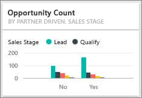

# Exemple Analyse des opportunités pour Power BI : visite guidée

## Présentation de l’exemple Analyse des opportunités
L’**exemple Analyse des opportunités** contient le tableau de bord (et le rapport associé) d’une société de logiciels qui s’appuie sur 2 canaux de vente : *direct* et *partenaires*. La responsable des ventes a créé ce tableau de bord pour suivre les opportunités et le chiffre d’affaires par région, par taille de contrat et par canal.

Elle s’appuie sur 2 mesures du chiffre d’affaires :

* **Chiffre d’affaires** : il est basé sur les estimations de chiffre d’affaires qu’un commercial pense réaliser.
* **Chiffre d’affaires pondéré** : il est calculé selon la formule Chiffre d’affaires X Probabilité en %. Il est généralement considéré comme une prévision plus précise du chiffre d’affaires réel. La probabilité est déterminée en fonction de l’étape de vente (« ***Sales Stage*** ») dans laquelle se trouve l’affaire.
  * Piste de vente (« Lead ») : 10 %  
  * Cible avérée (« Qualify ») : 20 %  
  * Solution : 40 %  
  * Proposition (« Proposal ») : 60 %  
  * Finalisation (« Finalize ») : 80 %

  

Cet exemple fait partie d’une série d’exemples qui illustre la façon dont vous pouvez utiliser Power BI avec des données, des rapports et des tableaux de bord orientés métier. Il s’agit de données réelles provenant d’obviEnce ([www.obvience.com](http://www.obvience.com/)), présentées de façon anonyme.

## Conditions préalables

 Avant de pouvoir utiliser l’exemple, vous devez le télécharger en tant que [pack de contenu](https://docs.microsoft.com/en-us/power-bi/sample-opportunity-analysis#get-the-content-pack-for-this-sample), [fichier .pbix](http://download.microsoft.com/download/9/1/5/915ABCFA-7125-4D85-A7BD-05645BD95BD8/Opportunity Analysis Sample PBIX.pbix) ou [classeur Excel](http://go.microsoft.com/fwlink/?LinkId=529782).

### Se procurer le pack de contenu pour cet exemple

1. Ouvrez le service Power BI (app.powerbi.com), puis connectez-vous.
2. Dans le coin inférieur gauche, sélectionnez **Obtenir des données**.
   
    
3. Dans la page Obtenir des données qui s’affiche, sélectionnez l’icône **Exemples**.
   
   
4. Sélectionnez **Exemple Analyse des opportunités**, puis choisissez **Se connecter**.  
  
   
   
5. Power BI importe le pack de contenu, puis ajoute un tableau de bord, un rapport et un jeu de données à votre espace de travail. Le nouveau contenu est signalé par un astérisque jaune. 
   
   
  
### Se procurer le fichier .pbix pour cet exemple

Vous pouvez également télécharger l’exemple en tant que fichier .pbix, qui est conçu pour une utilisation avec Power BI Desktop. 

 * [Exemple Analyse des opportunités](http://download.microsoft.com/download/9/1/5/915ABCFA-7125-4D85-A7BD-05645BD95BD8/Opportunity%20Analysis%20Sample%20PBIX.pbix)

### Se procurer le classeur Excel pour cet exemple
Vous pouvez également [télécharger uniquement le jeu de données (classeur Excel) de cet exemple](http://go.microsoft.com/fwlink/?LinkId=529782). Le classeur contient des feuilles Power View que vous pouvez consulter et modifier. Pour afficher les données brutes, sélectionnez **Power Pivot > Gérer**.

## Que nous révèle ce tableau de bord ?
La responsable des ventes a créé un tableau de bord pour suivre les métriques qu’elle juge les plus importantes. Quand quelque chose l’interpelle, elle peut sélectionner une vignette pour explorer les données.

1. La société réalise un chiffre d’affaires de 2 milliards de dollars et un chiffre d’affaires pondéré de 461 millions de dollars.
2. Le nombre d’opportunités et le chiffre d’affaires obéissent à une logique d’entonnoir bien connue où les totaux diminuent à chaque étape suivante.
3. La plupart de nos opportunités se situent dans la région Est (« East »).
4. Les opportunités de grande taille génèrent davantage de chiffre d’affaires que les opportunités de petite ou moyenne taille.
5. Les gros contrats remportés par les partenaires génèrent plus de chiffre d’affaires : 8 millions de dollars en moyenne contre 6 millions de dollars pour les ventes directes.

Sachant que les efforts à déployer pour décrocher un contrat sont les mêmes quelle que soit sa taille, notre société a tout intérêt à analyser les données pour en apprendre davantage sur les opportunités de grande taille.

Sélectionnez la vignette **Opportunity Count by Partner Driven and Sales Stage** (Nombre d’opportunités partenaires et étape de vente) pour ouvrir la page 1 du rapport.  

## Exploration des pages du rapport
### La page 1 de notre rapport est intitulée « Opportunity Counts Overview » (Vue d’ensemble du nombre d’opportunités).

* L’Est est notre région la plus importante en termes de nombre d’opportunités.  
* Sur le graphique à secteurs, sélectionnez une région après l’autre pour filtrer la page. Pour chaque région, les partenaires visent des opportunités bien plus importantes.   
* L’histogramme « Opportunity Count by Partner Driven and Opportunity Size » (Nombre d’opportunités partenaires et taille d’opportunité) montre clairement que la plupart des opportunités de grande taille sont portées par les partenaires, contrairement aux opportunités de petite et moyenne taille.
* Sélectionnez chaque étape de vente (« Sales Stage ») dans le graphique à barres en bas à gauche pour observer les différences régionales en matière de nombre d’opportunités. Comme vous pouvez le constater, bien que la région Est soit la région la plus importante au niveau du nombre d’opportunités, les 3 régions affichent des nombres comparables aux étapes Solution, Proposal (Proposition) et Finalize (Finalisation). Cela signifie que nous concluons un pourcentage de contrats plus élevé dans les régions Centre (« Central ») et Ouest (« West »).

### La page 2 de notre rapport est intitulée « Revenue Overview » (Vue d’ensemble du chiffre d’affaires)
Les données y sont examinées de manière similaire, sauf que l’analyse porte non pas sur le nombre d’opportunités mais sur le chiffre d’affaires.  

* L’Est est notre région principale, aussi bien en termes de nombre d’opportunités que de chiffre d’affaires.  
* En filtrant sur le chiffre d’affaires induit par les partenaires (sélectionnez **Yes** (Oui) dans la légende en haut à droite), on obtient un chiffre d’affaires de 1,5 milliards de dollars et 294 millions de dollars. Ces données sont à comparer au chiffre d’affaires non partenaire, à savoir, 644 millions de dollars et 166 millions de dollars.  
* Le chiffre d’affaires moyen réalisé auprès des grands comptes est supérieur (8 millions) si l’opportunité est portée par un partenaire plutôt que par un non-partenaire (6 millions).  
* Pour les affaires conclues par les partenaires, le chiffre d’affaires réalisé sur les opportunités de grande taille représente en moyenne presque le double de celui des opportunités de taille moyenne (4 millions).  
* Le chiffre d’affaires moyen généré par les affaires de petite et moyenne taille réalisées par les partenaires est comparable à celui des non-partenaires.   

Il apparaît clairement que nos partenaires vendent mieux à nos clients.  Il pourrait être judicieux de miser davantage sur nos partenaires.

### La page 3 de notre rapport est intitulée « Region Stage Counts » (Nombres d’opportunités par région et par étape)
Cette page présente des données similaires, mais les décompose par région et par étape.  

* En filtrant sur la région Est (sélectionnez **East** dans le graphique à secteurs), on constate que les opportunités résultent presque à parts égales des partenaires et des non-partenaires.
* Les opportunités de grande taille sont plus courantes dans la région Centre, les opportunités de petite taille sont plus courantes dans la région Est et les opportunités de taille moyenne sont plus courantes dans la région Ouest.

### La page 4 de notre rapport est intitulée « Upcoming Opportunities » (Opportunités à venir)
Là encore, nous nous intéressons à des facteurs similaires, sauf que cette fois, nous prenons en compte la date/heure.  

Notre directrice financière se sert de cette page pour gérer la charge de travail. L’analyse des opportunités de chiffre d’affaires par étape de vente et par mois lui permet de planifier de manière appropriée.

* C’est à l’étape de finalisation (« Finalize ») que le chiffre d’affaires moyen est le plus élevé. La priorité absolue est de conclure ces affaires.
* En filtrant sur le mois (en sélectionnant le mois dans le segment de gauche), on constate que le mois de janvier compte une grande proportion de gros contrats à l’étape de finalisation avec un chiffre d’affaires pondéré de 75 millions de dollars. En revanche, au mois de février, ce sont principalement des contrats de taille moyenne aux étapes Solution et Proposal (Proposition).
* En règle générale, le chiffre d’affaires pondéré varie en fonction de l’étape de vente, du nombre d’opportunités et de la taille de contrat. Vous pouvez ajouter des filtres (via le volet Filtres à droite) pour ces facteurs, vous en tirerez davantage d’enseignements.

Il s’agit d’un environnement sécurisé à explorer. Vous pouvez toujours choisir de ne pas enregistrer les modifications apportées. Mais si vous les enregistrez, vous pouvez toujours accéder à **Obtenir des données** pour avoir une nouvelle copie de cet exemple.

## Étapes suivantes : Connexion à vos données
Nous espérons qu’à travers cette visite guidée, vous aurez cerné tout l’intérêt des tableaux de bord Power BI, de Q&R et des rapports pour tirer des informations de données de suivi des opportunités. À présent, c’est votre tour : connectez-vous à vos propres données. Avec Power BI, vous pouvez vous connecter à une grande variété de sources de données. En savoir plus sur [la prise en main de Power BI](service-get-started.md).

[Télécharger les exemples](sample-datasets.md)  
