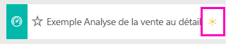
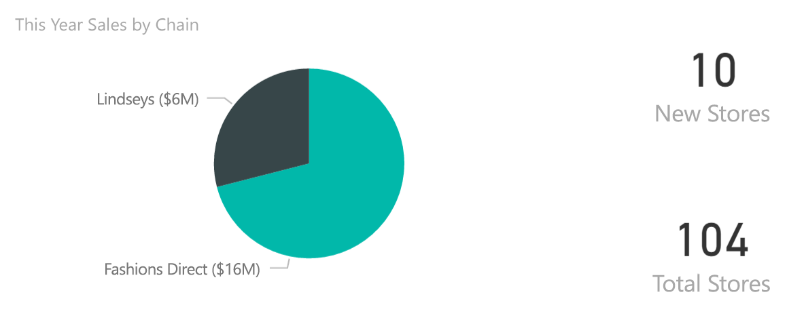
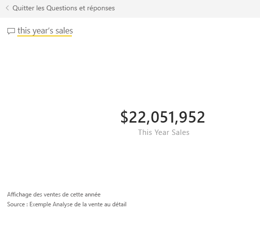
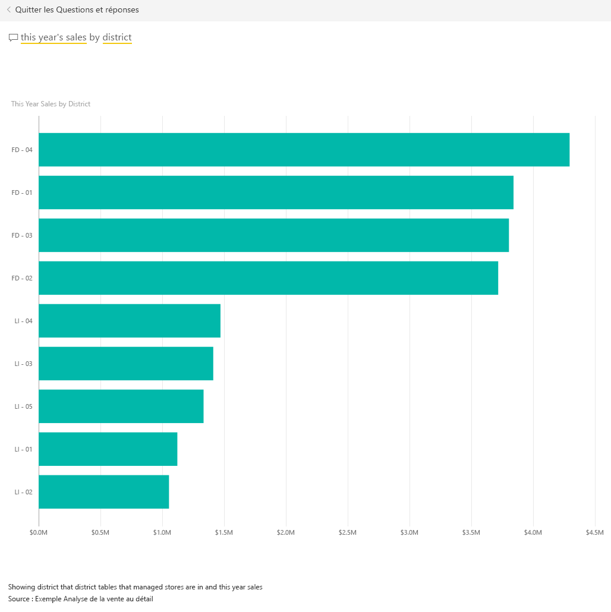
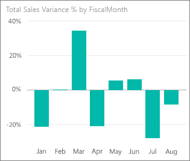
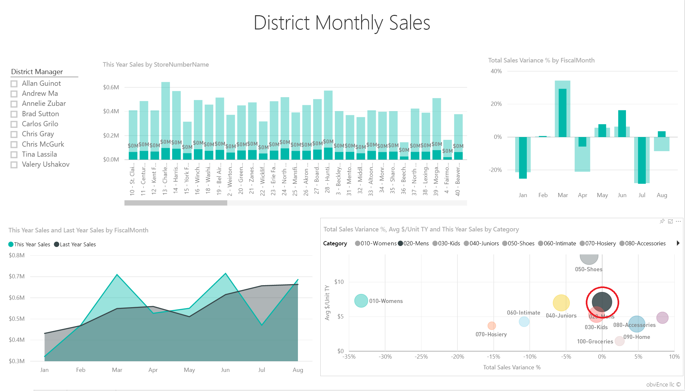
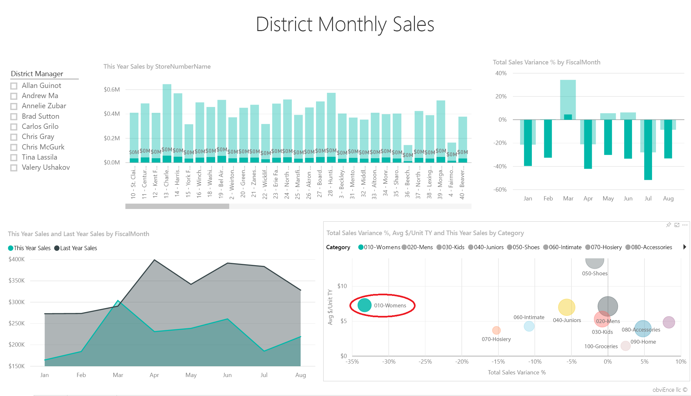
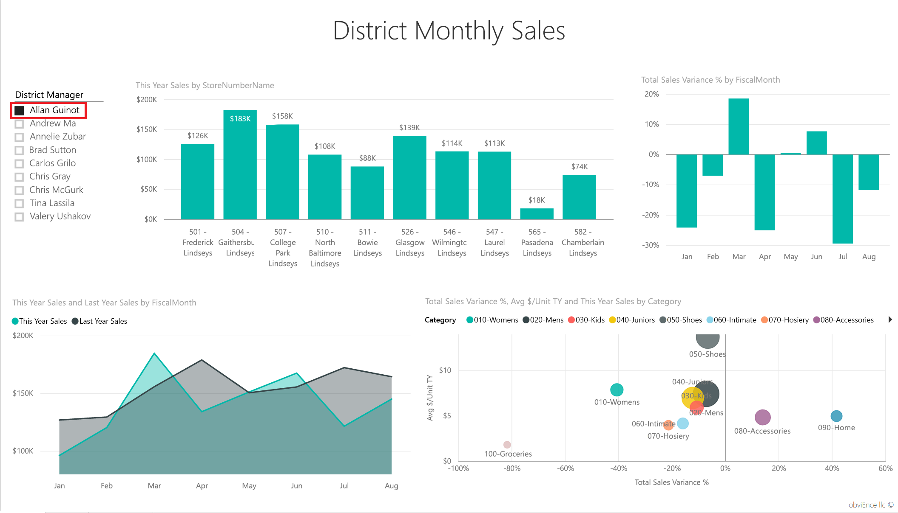
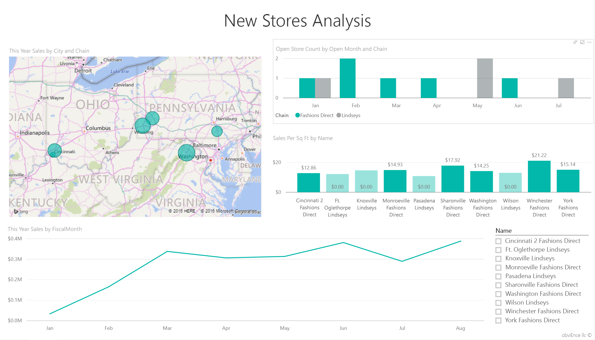
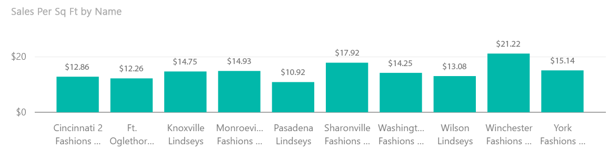

# Exemple Analyse de la vente au détail pour Power BI : Visite guidée

Cet exemple de tableau de bord et son rapport sous-jacent permettent d’analyser les données de vente au détail d’articles vendus dans plusieurs magasins et régions. Les métriques comparent les performances de l’année à celle de l’année précédente pour les données suivantes : ventes, unités, marge brute, écart et analyse des nouveaux magasins. Il s’agit de données réelles provenant d’obviEnce ([www.obvience.com](http://www.obvience.com)), présentées de façon anonyme.

## Conditions préalables

 Avant de pouvoir utiliser l’exemple, vous devez le télécharger en tant que [pack de contenu](https://docs.microsoft.com/en-us/power-bi/sample-datasets#get-and-open-a-sample-content-pack-in-power-bi-service), [fichier .pbix](http://download.microsoft.com/download/9/6/D/96DDC2FF-2568-491D-AAFA-AFDD6F763AE3/Retail%20Analysis%20Sample%20PBIX.pbix) ou [classeur Excel](http://go.microsoft.com/fwlink/?LinkId=529778).

### Se procurer le pack de contenu pour cet exemple

1. Ouvrez le service Power BI (app.powerbi.com), puis connectez-vous.
2. Dans le coin inférieur gauche, sélectionnez **Obtenir des données**.
   
    
3. Dans la page Obtenir des données qui s’affiche, sélectionnez l’icône **Exemples**.
   
   
4. Sélectionnez **Exemple Analyse de la vente au détail**, puis choisissez **Se connecter**.  
  
   
   
5. Power BI importe le pack de contenu, puis ajoute un tableau de bord, un rapport et un jeu de données à votre espace de travail. Le nouveau contenu est signalé par un astérisque jaune. 
   
   
  
### Se procurer le fichier .pbix pour cet exemple

Vous pouvez également télécharger l’exemple en tant que fichier .pbix, qui est conçu pour une utilisation avec Power BI Desktop. 

 * [Exemple Analyse de la vente au détail](http://download.microsoft.com/download/9/6/D/96DDC2FF-2568-491D-AAFA-AFDD6F763AE3/Retail%20Analysis%20Sample%20PBIX.pbix)

### Se procurer le classeur Excel pour cet exemple
Vous pouvez également [télécharger uniquement le jeu de données (classeur Excel) de cet exemple](http://go.microsoft.com/fwlink/?LinkId=529778). Le classeur contient des feuilles Power View que vous pouvez consulter et modifier. Pour afficher les données brutes, sélectionnez **Power Pivot > Gérer**.

## Démarrer sur le tableau de bord et ouvrir le rapport
1. Dans le tableau de bord, sélectionnez la vignette « Total Stores » (Nombre total de magasins) :

     

   Vous accédez à la page « Store Sales Overview » (Vue d’ensemble des ventes des magasins) du rapport. Vous voyez que nous avons un total de 104 magasins, dont 10 sont nouveaux. Nous avons deux chaînes, Fashions Direct et Lindseys. Les magasins Fashions Direct sont en moyenne plus grands.
2. Sur le graphique en secteurs, sélectionnez **Fashions Direct**.

     

   Notez le résultat dans le graphique en bulles :

     

   La région FD-01 a la moyenne la plus élevée des ventes par unité de surface, FD-02 a l’écart type le plus faible pour les ventes par rapport à l’année dernière, FD-03 et FD-04 ont les résultats les moins bons dans l’ensemble.
3. Sélectionnez des bulles individuelles ou d’autres graphiques pour mettre en évidence des informations croisées, reflétant l’impact de vos sélections.
4. Pour revenir au tableau de bord, sélectionnez son nom dans la barre de navigation supérieure (fils d’Ariane).

   
5. Dans le tableau de bord, sélectionnez la vignette indiquant « This Year’s Sales » (Ventes de cette année).

   

   Cela équivaut à taper « This year sales » (Ventes de cette année) dans la zone de question.

   L’écran suivant s’affiche :

   

## Examiner une vignette créée avec Q&R de Power BI
Effectuons une étude plus détaillée.

1. Ajoutez « This Year’s Sales **by district**» (Ventes de cette année par région) à la question. Observez le résultat : l’application met automatiquement la réponse dans un graphique à barres et suggère d’autres expressions :

   
2. Remplacez maintenant la question par « This Year’s Sales **by zip and chain**» (Ventes de cette année par code postal et par chaîne).

   Notez comment la réponse à la question s’affiche avec les graphiques appropriés à mesure que vous tapez.
3. Essayez avec d’autres questions pour voir quel type de résultats vous obtenez.
4. Lorsque vous êtes prêt, retournez au tableau de bord.

## Explorer plus en détail les données
Effectuons maintenant un examen encore plus détaillé, en observant les performances des régions.

1. Dans le tableau de bord, sélectionnez la vignette comparant les ventes de cette année à celles de l’année dernière.

   

   Notez l’important pourcentage d’écart par rapport à l’année dernière, les mois de janvier, avril et juillet étant particulièrement mauvais.

   

   Voyons si nous pouvons cerner avec précision les problèmes.
2. Sélectionnez le graphique en bulles, puis choisissez **020-Mens**(020-Hommes).

     

   Notez que la catégorie Hommes n’était pas aussi durement touchée en avril que l’ensemble de l’activité, mais que janvier et juillet sont encore des mois problématiques.
3. À présent, sélectionnez la bulle **010-Womens**(010-Dames).

   

   Notez aussi que la catégorie Femmes s’est comportée d’une façon bien pire que l’activité globale pour tous les mois, et d’une façon bien pire également dans presque tous les mois en comparaison avec l’année précédente.
4. Sélectionnez à nouveau la bulle pour effacer le filtre.

## Essayer le segment
Examinons les performances des différentes régions.

1. Sélectionnez Allan Guinot dans le segment situé en haut à gauche.

   

   Notez que la région d’Allan a obtenu les meilleures performances en mars et en juin l’année dernière.
2. À présent, Allan étant sélectionné, cliquez sur la bulle correspondant à la catégorie Womens (Dames).

   

   Notez que pour la catégorie Femmes, sa région n’a jamais atteint le volume de l’année dernière.
3. Examinez les autres responsables de région et catégories : quelles autres informations pouvez-vous découvrir ?
4. Lorsque vous êtes prêt, retournez au tableau de bord.

## Que nous apprennent nos données sur la croissance des ventes cette année ?
Le dernier domaine que nous souhaitons examiner est notre croissance : les nouveaux magasins ouverts cette année.

1. Sélectionnez la vignette « Stores Opened This Year » (Magasins ouverts cette année).

   

   Comme le montre clairement la vignette, il s’est ouvert cette année davantage de magasins Fashions Direct que de magasins Lindseys.
2. Observez le graphique « Sales Per Sq Ft by Name » (ventes par pied carré par nom) :

   

    Il y a une grande différence dans les ventes moyennes par pied carré pour les nouveaux magasins.
3. Cliquez sur l’élément de légende Fashions Direct dans le graphique affiché en haut à droite. Notez que, même pour la même chaîne, le meilleur magasin (Winchester Fashions Direct) a été nettement plus performant que le plus mauvais magasin (Cincinnati 2 Fashions Direct), avec 21,22 $ contre 12,86 $, respectivement.

   
4. Cliquez sur Winchester Fashions Direct dans le segment, puis observez le graphique en courbes. Les premiers chiffres de ventes ont été rapportés en février.
5. Cliquez sur Cincinnati 2 Fashions Direct dans le segment : vous voyez dans le graphique en courbes qu’il a été ouvert en juin et qu’il semble être le magasin le moins performant.
6. Comme précédemment, poursuivez l’exploration en cliquant sur les autres barres, lignes et bulles dans les graphiques, afin de découvrir d’autres informations.

Il s’agit d’un environnement sécurisé à explorer. Vous pouvez toujours choisir de ne pas enregistrer les modifications apportées. Mais si vous les enregistrez, vous pouvez toujours accéder à Obtenir des données pour avoir une nouvelle copie de cet exemple.

## Vous connecter à vos données
Nous espérons que cette visite guidée vous a montré comment les tableaux de bord, Q&R et les rapports Power BI peuvent fournir des informations sur les données des ventes. À présent, c’est votre tour : connectez-vous à vos propres données. Avec Power BI, vous pouvez vous connecter à une grande variété de sources de données. En savoir plus sur [la prise en main de Power BI](service-get-started.md).

## Étapes suivantes
* [Télécharger l’exemple de pack de contenu Analyse de la vente au détail](sample-tutorial-connect-to-the-samples.md)
* [Télécharger un fichier zip de tous les fichiers d’exemple](http://go.microsoft.com/fwlink/?LinkId=535020)    
* [Télécharger le classeur Excel pour cet exemple Power BI](http://go.microsoft.com/fwlink/?LinkId=529778)    
* [Obtenir des données (pour Power BI)](service-get-data.md)    
* [Power BI – Concepts de base](service-basic-concepts.md)    
* D’autres questions ? [Posez vos questions à la communauté Power BI](http://community.powerbi.com/)
