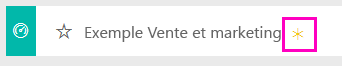
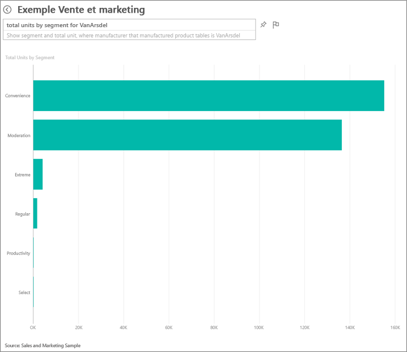
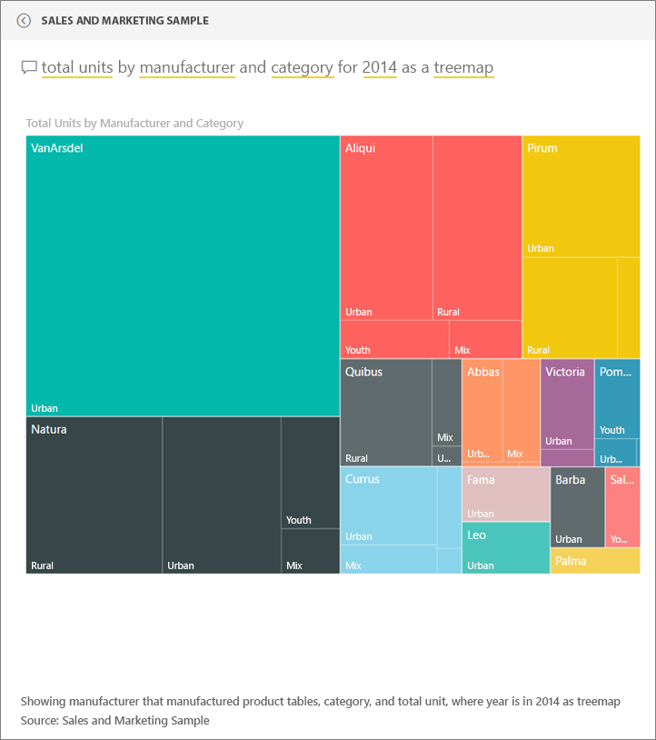
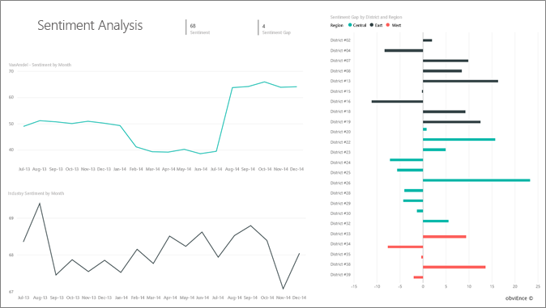

# Exemple Vente et marketing pour Power BI : Visite guidée

## Présentation de l’exemple Vente et marketing
**L’exemple Vente et marketing** contient un tableau de bord et un rapport qui concernent une société de fabrication fictive nommée VanArsdel Ltd. Ce tableau de bord a été créé par le directeur marketing de VanArsdel pour surveiller le secteur, mais aussi la part de marché de la société, ses volumes de production, ses ventes et l’opinion.

VanArsdel a de nombreux concurrents, mais est leader dans son secteur d’activité. Le directeur marketing souhaite augmenter la part de marché et découvrir des opportunités de croissance. Or, pour une raison quelconque, la part de marché de VanArsdel a commencé à diminuer, avec des baisses significatives en juin.

Cet exemple fait partie d’une série d’exemples qui illustre la façon dont vous pouvez utiliser Power BI avec des données, des rapports et des tableaux de bord orientés métier. Il s’agit de données réelles provenant d’obviEnce (www.obvience.com) qui ont été rendues anonymes.

## Conditions préalables

 Avant de pouvoir utiliser l’exemple, vous devez le télécharger en tant que [pack de contenu](https://docs.microsoft.com/power-bi/sample-sales-and-marketing#get-the-content-pack-for-this-sample), [fichier .pbix](http://download.microsoft.com/download/9/7/6/9767913A-29DB-40CF-8944-9AC2BC940C53/Sales%20and%20Marketing%20Sample%20PBIX.pbix) ou [classeur Excel](http://go.microsoft.com/fwlink/?LinkId=529785).

### Se procurer le pack de contenu pour cet exemple

1. Ouvrez le service Power BI (app.powerbi.com), puis connectez-vous.
2. Dans le coin inférieur gauche, sélectionnez **Obtenir des données**.
   
    
3. Dans la page Obtenir des données qui s’affiche, sélectionnez l’icône **Exemples**.
   
   
4. Sélectionnez l’**exemple Vente et marketing**, puis choisissez **Se connecter**.  
  
   
   
5. Power BI importe le pack de contenu, puis ajoute un tableau de bord, un rapport et un jeu de données à votre espace de travail. Le nouveau contenu est signalé par un astérisque jaune. 
   
   
  
### Se procurer le fichier .pbix pour cet exemple

Vous pouvez également télécharger l’exemple en tant que fichier .pbix, qui est conçu pour une utilisation avec Power BI Desktop. 

 * [Exemple Vente et marketing](http://download.microsoft.com/download/9/7/6/9767913A-29DB-40CF-8944-9AC2BC940C53/Sales%20and%20Marketing%20Sample%20PBIX.pbix)

### Se procurer le classeur Excel pour cet exemple
Vous pouvez également [télécharger uniquement le jeu de données (classeur Excel) de cet exemple](http://go.microsoft.com/fwlink/?LinkId=529785). Le classeur contient des feuilles Power View que vous pouvez consulter et modifier. Pour afficher les données brutes, sélectionnez **Power Pivot > Gérer**.

## Que nous révèle ce tableau de bord ?
Commençons notre tour d’horizon sur le tableau de bord et examinons les vignettes que le directeur marketing a choisi d’épingler. On y trouve des informations sur la part de marché, les ventes et l’opinion. Et nous voyons que les données sont ventilées par région, période et concurrence.

* Les vignettes de nombres au bas de la colonne de gauche indiquent le volume des ventes du secteur au cours de l’exercice précédent (50 000), la part de marché (32,86 %), le volume des ventes (16 000), le score d’opinion (68), l’écart d’opinion (4) et le nombre total d’unités vendues (1 million).
* Le graphique en courbes du haut montre l’évolution de la part de marché au fil du temps. La part de marché de la société a nettement baissé en juin. De même, la part de marché sur une période glissante de 12 mois (« R12M »), qui avait augmenté pendant un certain temps, commence à fléchir.
* Le principal concurrent de l’entreprise est Aliqui (la vignette d’histogramme du milieu le montre bien).
* Le plus gros de l’activité de l’entreprise se concentre dans les régions Est (« East ») et Centre (« Central »).
* Le graphique en courbes du bas montre que la baisse du mois de juin n’est pas saisonnière : aucun de nos concurrents ne suit cette tendance.
* Les deux vignettes « Total Units » (Nombre total d’unités) indiquent le nombre d’unités vendues, par segment et par région/fabricant. Les plus gros segments de marché du secteur sont **Productivity** (Productivité) et **Convenience**(Commodité).

### Utilisation de Q&R pour approfondir l’analyse
#### Quels sont les segments qui tirent nos ventes ? Est-ce que cela correspond à la tendance du secteur ?
1. Sélectionnez la vignette « Total Units Overall by Segment » (Nombre total d’unités par segment) pour ouvrir Q&R.
2. Tapez **for VanArsdel** (pour VanArsdel) à la fin de la requête existante. Q&R interprète la question et affiche un graphique mis à jour avec la réponse. Le volume de production de l’entreprise repose sur les segments Convenience (Commodité) et Moderation (Modération).

   
3. Sa part dans les catégories **Moderation** et **Convenience** est très importante ; ce sont les segments sur lesquels l’entreprise est compétitive.
4. Accédez au tableau de bord en sélectionnant son nom dans la barre de navigation supérieure (fils d’Ariane).

#### Quelle est la part de marché en nombre total d’unités par catégorie (comparée à la région) ?
1. Notez le titre « Total Units YTD by Manufacturer, Region » (Nombre total d’unités de l’année en cours par fabricant, par région). Vous voulez connaître la part de marché par catégorie ?

   
2. Dans la zone de question en haut du tableau de bord, tapez la question **total units by manufacturer and category for 2014 as a treemap** (nombre total d’unités par fabricant et par catégorie pour 2014, treemap). Comme vous pouvez le constater, la visualisation se met à jour à mesure que vous tapez la question.
   
3. Pour comparer les résultats, épinglez le graphique à votre tableau de bord. Très intéressant. En 2014, VanArsdel n’a vendu que des produits de la catégorie **Urban** (Urbain).
4. Retournez dans le tableau de bord.

Les tableaux de bord sont aussi un point d’entrée dans les rapports.  Si une vignette a été créée à partir d’un rapport sous-jacent, il suffit de cliquer sur cette vignette pour ouvrir le rapport.

Dans notre tableau de bord, la ligne R12M (période glissante de 12 mois) montre que la part de marché de l’entreprise n’augmente plus dans le temps, elle baisse même un peu. Et comment expliquer cette forte baisse de part de marché en juin ? Pour aller plus loin dans l’analyse, cliquez sur cette visualisation pour ouvrir le rapport sous-jacent.

### Le rapport contient 4 pages
#### La page 1 du rapport porte sur la part de marché de VanArsdel.

1. Examinez l’histogramme du bas intitulé « Total Units by Month and isVanArsdel » (Nombre total d’unités par mois pour VanArsdelen). La colonne noire représente VanArsdel (ses produits) et la verte ses concurrents. La baisse enregistrée par VanArsdel en juin 2014 ne se retrouve pas chez les concurrents.
2. Le graphique à barres « Total Category Volume by Segment » (Volume total de la catégorie par segment), au milieu à droite, est filtré pour afficher les 2 principaux segments de VanArsdel. Voyons comment ce filtre a été créé :  

   a.  Développez le volet Filtres à droite.  
   b.  Cliquez sur la visualisation pour la sélectionner.  
   c.  Sous Filtres au niveau de l’élément visuel, notez que **Segment** est filtré pour n’inclure que les catégories **Convenience** (Commodité) et **Moderation** (Modération).  
   d.  Modifiez le filtre en sélectionnant Segment pour développer cette section, puis cochez **Productivity** (Productivité) pour ajouter aussi ce segment.  
3. Dans « Total Units by Month and isVanArsdel » (Nombre total d’unités par mois pour VanArsdel), sélectionnez le « Yes » (Oui) noir pour effectuer un filtrage croisé de la page sur VanArsdel. À noter que la société n’est pas présente sur le segment Productivity (Productivité).
4. Sélectionnez de nouveau sur le « Yes » (Oui) noir pour effacer le filtre.
5. Examinons le graphique en courbes. Il présente la part de marché mensuelle de l’entreprise et ses parts de marché sur une période glissante de 12 mois. Les données de cette période permettent de lisser les variations mensuelles et dégage les tendances sur le long terme. Dans le graphique à barres, sélectionnez Convenience puis Moderation pour déterminer l’importance de la variation de la part de marché pour chaque segment. Le segment Moderation présente une variation de la part de marché bien plus importante que le segment Convenience.

Nous cherchons toujours à savoir pourquoi la part de marché a autant diminué en juin. Intéressons-nous à l’opinion.

#### La page 3 du rapport se concentre sur cet aspect.

Tweets, Facebook, blogs, articles et autres contribuent à forger l’opinion qui est représentées dans les deux graphiques en courbes. Le graphique sur l’opinion (« Sentiment ») situé en haut à gauche montre que l’opinion vis-à-vis des produits de l’entreprise est restée assez neutre jusqu’en février. Une chute importante s’est amorcée en février pour atteindre son plus bas en juin. Qu’est-ce qui explique cette chute de l’opinion ? Nous devons nous appuyer sur des sources externes. En février, plusieurs articles et billets de blog ont décrit le service client de VanArsdel comme étant le pire du secteur. Cette mauvaise publicité a eu une corrélation directe sur l’opinion des clients et les ventes. VanArsdel a travaillé dur pour améliorer son service client, ce qu’ont noté les clients et le secteur. En juillet, les opinions positives ont commencé à décoller pour atteindre leur plus haut historique des années 60. Ce relèvement de l’opinion apparaît bien dans « Total Units by Month » (Nombre total d’unités par mois) aux pages 1 et 3. Cela explique-t-il peut-être en partie la baisse de part de marché de juin ?

L’écart d’opinion est un autre point à explorer : dans quels districts l’écart d’opinion est-il le plus élevé, comment la direction peut-elle en tirer parti et trouver des moyens de reproduire ce schéma dans les autres districts ?

#### La page 2 du rapport porte sur la tendance de la catégorie pour l’année en cours

* Si l’on considère toutes les entreprises de la catégorie, VanArsdel est le leader et ses principaux concurrents sont Natura, Aliqui et Pirium. Analysons cela de plus près.
* Aliqui se développe, mais sa production reste modeste par rapport à celle de VanArsdel.
* VanArsdel apparaît en vert dans le treemap. Dans l’Est, les clients ont une préférence pour les concurrents, au Centre notre société s’en sort bien et c’est dans l’Est que sa part de marché est la plus faible.
* Les unités vendues varient fortement en fonction du secteur géographique. L’Est est la région dominante pour la plupart des fabricants et VanArsdel a aussi une forte présence dans la région Centre.
* Dans le graphique « Total Units YTD Var % by Month » (Écart en % du nombre total d’unités de l’année en cours par mois et par fabricant » en bas à droite, VanArsdel présente un écart positif, ce qui est un bon signe : l’entreprise enregistre de meilleurs résultats que l’année dernière, mais c’est aussi le cas d’un autre concurrent : Aliqui.

#### La page 4 du rapport porte sur l’analyse des produits concurrents.

* Le graphique en bas à gauche montre tous les segments de catégorie à l’exception des deux principaux segments de VanArsdel. Si l’on filtre par catégorie en cliquant sur les barres, il est plus facile de repérer les domaines de développement potentiels de VanArsdel. Les segments **Extreme** (Extrême) et **Productivity** (Productivity) progressent plus vite que les autres.
* Or, la société n’est pas présente sur ces segments. Pour s’y investir, la société peut s’appuyer sur ces données pour cibler les segments porteurs dans les différentes régions. Nous pouvons aller plus loin dans l’analyse en formulant des questions. Par exemple, quelle est la région qui progresse le plus vite et quel serait le principal concurrent dans ce segment ?
* Vous vous souvenez de cette diminution de la part de marché en juin ? Juin est un mois porteur sur le segment Productivity (Productivité), segment sur lequel la société n’est pas du tout présente. Cela pourrait nous aider à comprendre la diminution de notre part de marché en juin.

En filtrant les visualisations sur VanArsdel, par segment, par mois et par région, nous pouvons découvrir des opportunités de croissance pour VanArsdel.

Il s’agit d’un environnement sécurisé à explorer. Vous pouvez toujours choisir de ne pas enregistrer les modifications apportées. Mais si vous les enregistrez, vous pouvez toujours accéder à **Obtenir des données** pour avoir une nouvelle copie de cet exemple.

## Étapes suivantes : Vous connecter à vos données
Nous espérons qu’à travers cette visite guidée, vous aurez cerné tout l’intérêt des tableaux de bord Power BI, de Q&R et des rapports pour tirer des informations des données liées aux ventes et au marketing. À présent, c’est votre tour : connectez-vous à vos propres données. Avec Power BI, vous pouvez vous connecter à une grande variété de sources de données. En savoir plus sur [la prise en main de Power BI](service-get-started.md).  
