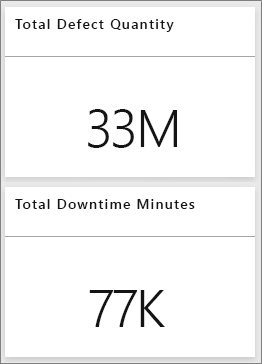
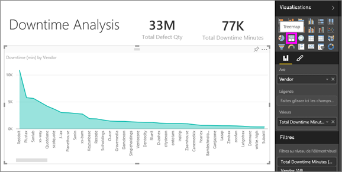
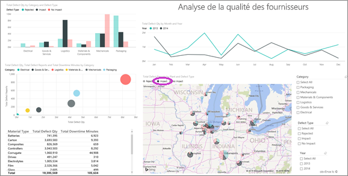
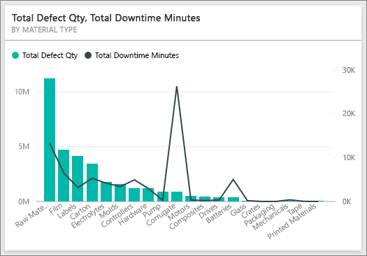
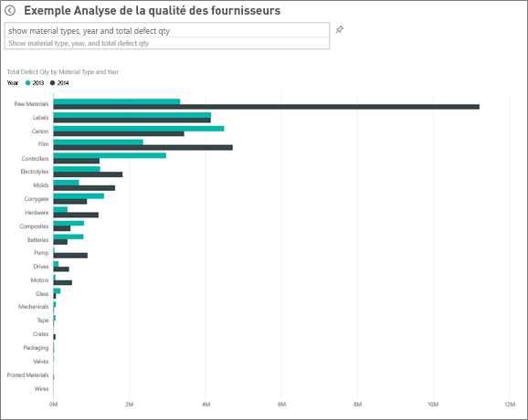
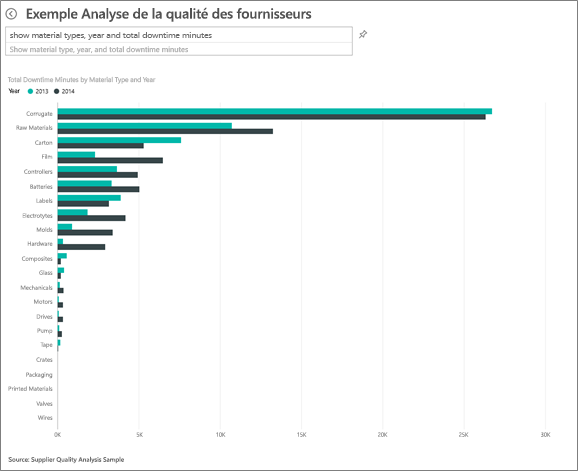
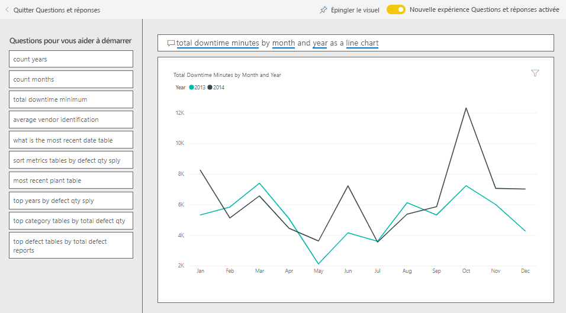

# Exemple Analyse de la qualité des fournisseurs pour Power BI : visite guidée

## Courte présentation de l’exemple Analyse de la qualité des fournisseurs
Cet exemple sectoriel de tableau de bord et son rapport sous-jacent se focalisent sur l’un des enjeux classiques dans une chaîne d’approvisionnement : l’analyse de la qualité des fournisseurs.
Deux métriques principales sont au cœur de cette analyse : le nombre total de défauts et le temps d’arrêt total entraîné par ces derniers. Cet exemple a deux objectifs principaux :

* identifier les fournisseurs qui répondent le mieux aux critères de qualité et ceux qui y répondent le moins bien ;
* identifier les usines qui réussissent le mieux à détecter et rejeter les défauts pour réduire les temps d’arrêt.

Cet exemple fait partie d’une série d’exemples qui illustre la façon dont vous pouvez utiliser Power BI avec des données, des rapports et des tableaux de bord orientés métier.
Il s’agit de données réelles provenant d’obviEnce ([www.obvience.com](http://www.obvience.com/)), présentées de façon anonyme.

## Conditions préalables

 Avant de pouvoir utiliser l’exemple, vous devez le télécharger en tant que [pack de contenu](https://docs.microsoft.com/en-us/power-bi/sample-supplier-quality#get-the-content-pack-for-this-sample), [fichier .pbix](http://download.microsoft.com/download/8/C/6/8C661638-C102-4C04-992E-9EA56A5D319B/Supplier-Quality-Analysis-Sample-PBIX.pbix) ou [classeur Excel](http://go.microsoft.com/fwlink/?LinkId=529779).

### Se procurer le pack de contenu pour cet exemple

1. Ouvrez le service Power BI (app.powerbi.com), puis connectez-vous.
2. Dans le coin inférieur gauche, sélectionnez **Obtenir des données**.
   
    
3. Dans la page Obtenir des données qui s’affiche, sélectionnez l’icône **Exemples**.
   
   
4. Sélectionnez l’**exemple Analyse de la qualité des fournisseurs**, puis choisissez **Se connecter**.  
  
   
   
5. Power BI importe le pack de contenu, puis ajoute un tableau de bord, un rapport et un jeu de données à votre espace de travail. Le nouveau contenu est signalé par un astérisque jaune. 
   
   
  
### Se procurer le fichier .pbix pour cet exemple

Vous pouvez également télécharger l’exemple en tant que fichier .pbix, qui est conçu pour une utilisation avec Power BI Desktop. 

 * [Exemple Analyse de la qualité des fournisseurs](http://download.microsoft.com/download/8/C/6/8C661638-C102-4C04-992E-9EA56A5D319B/Supplier-Quality-Analysis-Sample-PBIX.pbix)

### Se procurer le classeur Excel pour cet exemple
Vous pouvez également [télécharger uniquement le jeu de données (classeur Excel) de cet exemple](http://go.microsoft.com/fwlink/?LinkId=529779). Le classeur contient des feuilles Power View que vous pouvez consulter et modifier. Pour afficher les données brutes, sélectionnez **Power Pivot > Gérer**.

## Temps d’arrêt causés par des articles défectueux
Analysons les temps d’arrêt causés par des articles défectueux et voyons quels fournisseurs en sont responsable.  

1. Dans le tableau de bord, sélectionnez la vignette de nombre **Total Defect Quantity** (Quantité totale de défauts) ou la vignette de nombre **Total Downtime Minutes** (Total des temps d’arrêt en minutes).  

     

   Le rapport de l’« exemple Analyse de la qualité des fournisseurs » s’ouvre à la page « Downtime Analysis » (Analyse des temps d’arrêt). Notez que nous avons au total 33 millions de pièces défectueuses et le total des temps d’arrêt causés par ces pièces défectueuses est de 77 000 minutes. Certains articles ont moins de pièces défectueuses, mais ils peuvent causer des retards considérables et entraîner par là même des temps d’arrêt plus importants. Explorons-les dans la page de rapport.  
2. En examinant la ligne **Total Downtime Minutes** (Total des temps d’arrêt en minutes) du graphique combiné **Defects and Downtime (min) by Material Type** (Défauts et temps d’arrêt (min) par type d’article), nous constatons que ce sont les cartons ondulés qui causent le plus de temps d’arrêt.  
3. Sélectionnez la colonne **Corrugate** (Ondulé) de ce même graphique combiné pour identifier les usines les plus impactées par ce défaut et le fournisseur qui en est responsable.  

     
4. Sélectionnez une usine dans la carte géographique pour déterminer quel fournisseur ou quel article est responsable du temps d’arrêt dans l’usine en question.

### Quels sont les pires fournisseurs ?
 Nous voulons identifier les huit pires fournisseurs et déterminer le pourcentage de temps d’arrêt qui leur est attribuable. Pour cela, nous pouvons changer le graphique en aires **Downtime (min) by Vendor** (Temps d’arrêt (min) par fournisseur) en treemap.  

1. À la page 3 du rapport, « Downtime Analysis » (Analyse des temps d’arrêt), sélectionnez **Modifier le rapport** dans l’angle supérieur gauche.  
2. Sélectionnez le graphique en aires **Downtime (min) by Vendor** (Temps d’arrêt (min) par fournisseur) puis, dans le volet Visualisations, sélectionnez Treemap.  

     

    Le treemap fait automatiquement du champ **Vendor** (Fournisseur) un **groupe**.  

      

   Dans ce treemap, nous constatons que les huit principaux fournisseurs sont les huit blocs situés à gauche du treemap. Nous pouvons aussi constater qu’ils représentent environ 50 % des temps d’arrêt en minutes.  
3. Sélectionnez **Exemple Analyse de la qualité des fournisseurs** dans la barre de navigation supérieure pour revenir au tableau de bord.

### Comparaison au niveau des usines
À présent, voyons quelle usine gère le mieux les articles défectueux et qui subit de ce fait le moins de temps d’arrêt.  

1. Sélectionnez la vignette de carte géographique **Total Defect Reports by Plant, Defect Type** (Nombre total de défauts signalés par usine, type de défaut).  

    Le rapport s’ouvre à la page « Supplier Quality » (Qualité des fournisseurs).  

     
2. Dans la légende de la carte, sélectionnez le cercle **Impact** .  

      

    Comme vous pouvez le constater dans le graphique en bulles, la catégorie **Logistics** (Logistique) est celle qui connaît le plus de difficultés. C’est celle qui compte le plus de défauts, de signalements de défauts et de minutes de temps d’arrêt. Intéressons-nous de plus près à cette catégorie.  
3. Sélectionnez la bulle Logistics (Logistique) dans le graphique en bulles et observez les usines de Springfield et Naperville dans l’Illinois. Visiblement, l’usine de Naperville parvient beaucoup mieux à gérer les approvisionnements défectueux. Elle compte un grand nombre de rejets et peu de répercussions par rapport à l’usine de Springfield qui en connaît beaucoup.  

     
4. Sélectionnez **Exemple Analyse de la qualité des fournisseurs** dans la barre de navigation supérieure pour revenir à votre espace de travail actif.

## Quel type d’article est le mieux géré ?
Le type d’article le mieux géré est celui qui connaît le moins de temps d’arrêt ou qui ne subit aucune répercussion (« impact »), indépendamment du nombre de défauts.

* Dans le tableau de bord, examinons la vignette **Total Defect Quantity by Material Type, Defect Type** (Nombre total de défauts par type d’article, Type de défaut).

  

Notez que le type **Raw Materials** (Matières premières) comptabilise un grand nombre de défauts, mais que la plupart de ces défauts sont soit rejetés, soit ils n’ont aucune répercussion.

Vérifions que les matières premières ne provoquent pas beaucoup de temps d’arrêt, en dépit des nombreux défauts.

* Dans le tableau de bord, examinons la vignette **Total Defect Qty, Total Downtime Minutes by Material Type** (Nombre total de défauts, total des temps d’arrêt en minutes par type d’article).

  

Apparemment, les matières premières sont bien gérées : elles présentent plus de défauts, mais les temps d’arrêt qu’elles provoquent durent moins longtemps.

### Analyse de la corrélation entre défauts et temps d'arrêt par année
1. Sélectionnez la vignette de carte géographique **Total Defect Reports by Plant, Defect Type** (Nombre total de défauts signalés par usine, par type de défaut) pour ouvrir la première page du rapport « Supplier Quality » (Qualité des fournisseurs).
2. Notez que le nombre de défaut ( **Defect Qty** ) est supérieure en 2014 qu’en 2013.  

      
3. Y a-t-il une corrélation entre le nombre de défauts et les temps d’arrêt ? Pour le déterminer, nous pouvons poser des questions dans la zone Q&R.  
4. Sélectionnez **Exemple Analyse de la qualité des fournisseurs** dans la barre de navigation supérieure pour revenir au tableau de bord.  
5. Sachant que les matières premières comptent le plus de défauts, dans la zone de question, tapez « show material types, year and total defect qty » (afficher types d’articles, année et nombre total de défauts).  

    Il y a eu beaucoup plus de défauts de matières premières en 2014 qu’en 2013.  

      
6. Maintenant, posons la question suivante : « show material types, year and total downtime minutes » (afficher types d’articles, année et total des temps d’arrêts en minutes).  

   

Les temps d’arrêt liés aux matières premières ont été à peu près équivalents en 2013 et en 2014, même s’il y a eu beaucoup plus de matières premières défectueuses en 2014.

Autrement dit, les défauts de matières premières, plus nombreux en 2014, n’ont pas entraîné beaucoup plus de temps d’arrêts au cours de l’année.

### Analyse de la corrélation entre défauts et temps d’arrêt mois par mois
Examinons une autre vignette de tableau de bord relative au nombre total de défauts.  

1. Sélectionnez la flèche Précédent  dans l’angle supérieur gauche, au-dessus de la zone de question, pour revenir au tableau de bord.  

    En examinant de plus près la vignette **Total Defect Quantity by Month, Year** (Nombre total de défauts par mois, par année), on constate que le nombre de défauts au premier semestre 2014 était équivalent à celui de 2013, mais que ce nombre a bondi au deuxième semestre 2014.  

      

    Voyons si cette augmentation du nombre de défauts s’est traduite par une évolution égale des temps d’arrêt en minutes.  
2. Dans la zone de question, tapez « total downtime minutes by month and year as a line chart » (total des temps d’arrêt en minutes par mois et par année, graphique en courbes.  

   

   S’il est à constater une forte augmentation des temps d’arrêts en minutes en juin et octobre, hormis cela, l’augmentation du nombre de défauts n’a pas entraîné beaucoup plus de temps d’arrêt. Cela montre que les défauts ont bien été gérés.  
3. Pour épingler ce graphique à votre tableau de bord, sélectionnez l’icône d’épingle  à droite de la zone de question.  
4. Pour explorer les mois aberrants, vérifiez les temps d’arrêt en minutes en octobre par type d’article, lieu d’implantation des usines, catégorie, etc. en posant des questions telles que « total downtime minutes in October by plant » (total des temps d’arrêt en minutes en octobre par usine).    
5. Sélectionnez la flèche Précédent  dans l’angle supérieur gauche, au-dessus de la zone de question, pour revenir au tableau de bord.

Il s’agit d’un environnement sécurisé à explorer. Vous pouvez toujours choisir de ne pas enregistrer les modifications apportées. Mais si vous les enregistrez, vous pouvez toujours accéder à **Obtenir des données** pour avoir une nouvelle copie de cet exemple.

## Étapes suivantes : Connexion à vos données
Nous espérons qu’à travers cette visite guidée, vous aurez cerné tout l’intérêt des tableaux de bord Power BI, de Q&R et des rapports pour tirer des informations des données sur la qualité des fournisseurs. À présent, c’est votre tour : connectez-vous à vos propres données. Avec Power BI, vous pouvez vous connecter à une grande variété de sources de données. En savoir plus sur [la prise en main de Power BI](service-get-started.md).
