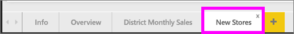
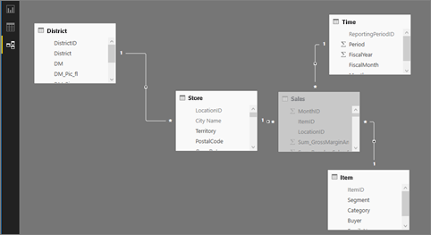

# Exemples Power BI

Nous vous recommandons de commencer par lire l’article [Exemples de jeux de données Power BI](sample-datasets.md). Celui-ci présente ce qu’il vous faut savoir sur nos exemples : comment les obtenir, où les enregistrer, comment les utiliser, ainsi que certains récits que les exemples peuvent illustrer. Puis, lorsque vous avez saisi les notions de base, revenez ici.   

### Conditions préalables
Les exemples sont disponibles pour le service Power BI et pour Power BI Desktop. Pour la suite, nous allons utiliser l’exemple Analyse de la vente au détail.

Le pack de contenu de l’exemple *Analyse de la vente au détail* utilisé dans ce didacticiel comprend un tableau de bord, un rapport et un jeu de données.
Pour vous familiariser avec ce pack de contenu et son scénario, nous vous recommandons de [découvrir l’exemple Analyse de la vente au détail](sample-retail-analysis.md) avant de commencer.

## À propos de ce didacticiel
Ce didacticiel explique comment : 
- importer un pack de contenu d’exemple, l’ajouter au service Power BI et ouvrir son contenu. Un *pack de contenu* est un type d’exemple où le jeu de données est fourni avec un tableau de bord et un rapport. 
-  ouvrir un fichier PBIX d’exemple dans Power BI Desktop.

## Exemples et service Power BI

1. Ouvrez le service Power BI (app.powerbi.com) et connectez-vous.
2. Sélectionnez **Obtenir des données** en bas du volet de navigation gauche. Si vous ne voyez pas l’option **Obtenir des données**, développez le volet de navigation en sélectionnant .
   
   
5. Sélectionnez **Samples**(Exemples).  
   
   
6. Sélectionnez *Exemple Analyse de la vente au détail*, puis choisissez **Se connecter**.   
   
   

## Quels sont les éléments importés ?
Lorsque vous sélectionnez **Se connecter** en utilisant un exemple de pack de contenu, Power BI transfère pour vous une copie de ce pack de contenu sur le cloud, à des fins de stockage. Comme la personne qui a créé le pack de contenu y a inclus un jeu de données, un rapport et un tableau de bord, vous obtenez ces éléments lorsque vous cliquez sur **Se connecter**. 

1. Power BI crée le tableau de bord et le répertorie sous votre onglet **Tableaux de bord**. L’astérisque jaune (*) indique qu’il s’agit d’un nouvel élément.
   
   
2. Ouvrez l’onglet **Rapports**.  Vous pouvez constater la présence d’un nouveau rapport nommé *Exemple Analyse de la vente au détail*.
   
   
   
   Puis consultez l’onglet **Jeux de données**.  Vous pouvez également constater la présence d’un nouveau jeu de données.
   
   

## Explorer votre nouveau contenu
À présent, vous pouvez explorer le tableau de bord, le jeu de données et le rapport. Il existe différentes manières d’accéder à vos tableaux de bord, rapports et jeux de données. Nous allons décrire l’une d’elles.  

> [!TIP]
> Vous voulez d’abord quelques conseils ?  Commencez par [découvrir l’exemple Analyse de la vente au détail](sample-retail-analysis.md) en suivant une procédure pas à pas sur cet exemple.
> 
> 

1. Revenez à l’onglet **Tableaux de bord**, puis sélectionnez le tableau de bord *Exemple Analyse de la vente au détail* pour l’ouvrir.    
   
   
2. Le tableau de bord s’ouvre.  Il possède de nombreuses vignettes de visualisation.
   
   
3. Sélectionnez une vignette pour ouvrir le rapport sous-jacent.  Dans cet exemple, sélectionnez le graphique en aires (encadré en rose dans l’image précédente). Le rapport s’ouvre à la page contenant ce graphique en aires.
   
    
   
   > [!NOTE]
   > Si la vignette est créée à l’aide de [Questions et réponses Power BI](power-bi-q-and-a.md), c’est la page Questions et réponses qui s’ouvre. Si la vignette a été [épinglée à partir d’Excel](service-dashboard-pin-tile-from-excel.md), c’est Excel Online qui s’ouvre dans Power BI.
   > 
   > 
1. Revenez à votre onglet **Jeux de données**. Vous disposez de plusieurs options pour l’exploration de votre jeu de données.  Vous ne pouvez pas l’ouvrir et afficher toutes ses lignes et colonnes (comme dans Power BI Desktop ou Excel).  Lorsqu’un utilisateur partage un pack de contenu avec des collègues, il souhaite généralement partager des insights, et non permettre à ses collègues d’accéder directement aux données. Mais vous pouvez tout de même explorer le jeu de données.  
   
   
   
   * L’une des méthodes employées pour l’exploration d’un jeu de données consiste à créer vos propres visualisations et rapports à partir de zéro.  Sélectionnez l’icône de graphique  pour ouvrir le jeu de données en mode Édition de rapports.
     
       
   * Une autre méthode d’exploration d’un jeu de données consiste à exécuter la fonctionnalité [Informations rapides](service-insights.md). Sélectionnez les points de suspension (...) et choisissez **Obtenir des informations**. Lorsque les informations sont prêtes, sélectionnez **Afficher les informations**.
     
       

## Exemples et Power BI Desktop 
À la première ouverture, le fichier PBIX d’exemple apparaît dans l’affichage Rapport, qui permet d’explorer, de créer et de modifier les pages de rapport souhaitées avec des visualisations. L’affichage Rapport offre à peu près la même expérience de conception que le Mode Édition d’un rapport dans le service Power BI. Vous pouvez déplacer les visualisations et effectuer des opérations telles que le copier-coller ou la fusion.

La différence est qu’avec Power BI Desktop, vous pouvez utiliser vos requêtes et modéliser vos données pour obtenir les meilleures analyses possibles dans les rapports. Vous pouvez ensuite enregistrer votre fichier Power BI Desktop à l’emplacement de votre choix (lecteur local ou cloud).

1. Ouvrez le [fichier PBIX d’exemple Analyse de la vente au détail](http://download.microsoft.com/download/9/6/D/96DDC2FF-2568-491D-AAFA-AFDD6F763AE3/Retail-Analysis-Sample-PBIX.pbix) dans Power BI Desktop. 

    

1. Le fichier s’ouvre dans l’affichage Rapport. Vous remarquerez les quatre onglets au bas de l’éditeur de rapport. Cela signifie qu’il y a quatre pages dans ce rapport et que la page « Nouveaux magasins » est actuellement sélectionnée. 

    .

3. Pour aller plus loin dans l’éditeur de rapport, consultez la section [Visite guidée de l’éditeur de rapport](service-the-report-editor-take-a-tour.md).

## Quels sont les éléments importés ?
Lorsque vous ouvrez le fichier PBIX d’exemple dans Desktop, Power BI présente en fait une copie de ces données et la stocke pour vous dans le cloud. Dans Desktop, vous avez accès au rapport ***et au jeu de données sous-jacent***. Quand les données sont chargées, Power BI Desktop tente de trouver et de créer automatiquement des relations.  

1. Basculez vers la [Vue de données](desktop-data-view.md) en sélectionnant l’icône de la table .
 
    

    La vue Données vous permet d’inspecter, d’explorer et de comprendre les données dans votre modèle Power BI Desktop. Elle diffère de la façon dont vous affichez les données, les colonnes et les tables dans l’Éditeur de requête. La Vue de données permet d’examiner les données une fois qu’elles ont été chargées dans le modèle.

    Quand vous modélisez vos données, vous souhaitez parfois consulter le contenu réel d’une table ou d’une colonne sans créer d’élément visuel sur le canevas de rapport, bien souvent jusqu’au niveau de la ligne. Cela est particulièrement vrai lorsque vous créez des mesures et des colonnes calculées ou quand vous devez identifier un type de données ou une catégorie de données.

1. Basculez vers la [Vue de relations](desktop-relationship-view.md) en sélectionnant l’icône .
 
    

    La Vue de relations présente toutes les tables, colonnes et relations du modèle. Elle permet d’afficher, de modifier et de créer des relations.

## Explorer votre nouveau contenu
Explorez à présent le jeu de données, les relations et le rapport par vous-même. Pour obtenir de l’aide, consultez le [Guide Bien démarrer avec Desktop](desktop-getting-started.md).    

## Étapes suivantes
[Power BI - Concepts de base](service-basic-concepts.md)

[Exemples pour le service Power BI](sample-datasets.md)

[Sources de données pour Power BI](service-get-data.md)

D’autres questions ? [Posez vos questions à la communauté Power BI](http://community.powerbi.com/)

