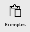
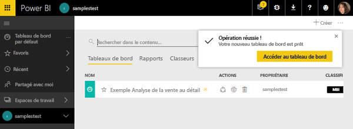
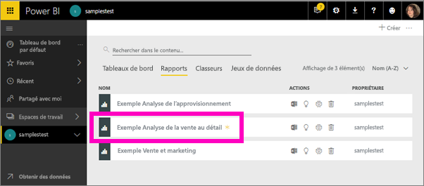
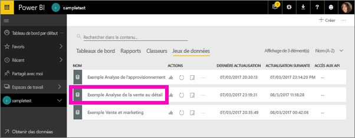
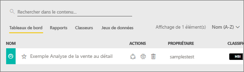
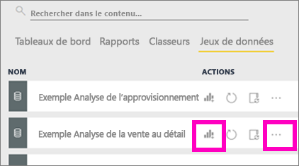
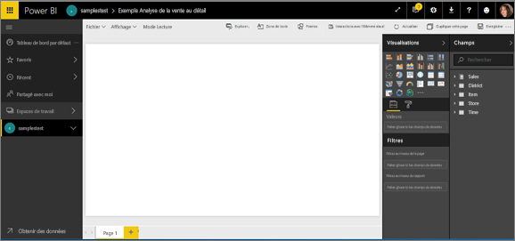

# Exemples Power BI (didacticiel)
<!-- Shared newnav Include -->
[!INCLUDE [newnavbydefault](./includes/newnavbydefault.md)]

Nous vous recommandons de commencer par lire l’article [Exemples de jeux de données Power BI](sample-datasets.md). Celui-ci présente ce qu’il vous faut savoir sur nos exemples : comment les obtenir, où les enregistrer, comment les utiliser, ainsi que certains récits que les exemples peuvent illustrer. Puis, lorsque vous avez saisi les notions de base, revenez ici.   

## À propos de ce didacticiel
Ce didacticiel explique comment importer nos exemples de packs de contenu, les ajouter au service Power BI et ouvrir le contenu. Un *pack de contenu* est un type d’exemple où le jeu de données est fourni avec un tableau de bord et un rapport. Pour télécharger les packs de contenu, utilisez **Obtenir des données**dans Power BI.

> [!NOTE]
> Ce didacticiel s’applique au service Power BI, mais pas à Power BI Desktop.
> 
> 

Le pack de contenu de l’exemple *Analyse de la vente au détail* utilisé dans ce didacticiel comprend un tableau de bord, un rapport et un jeu de données.
Pour vous familiariser avec ce pack de contenu et son scénario, nous vous recommandons de [découvrir l’exemple Analyse de la vente au détail](sample-retail-analysis.md) avant de commencer.

## Obtenir des données (dans ce cas, obtenir un exemple de pack de contenu)
1. Ouvrez le service Power BI (app.powerbi.com) et connectez-vous.
2. Sélectionnez un espace de travail et créez un tableau de bord.  
   
    
3. Nommez-le **Exemple Analyse de la vente au détail**.
   
   
4. Sélectionnez **Obtenir des données** en bas du volet de navigation gauche. Si vous ne voyez pas l’option **Obtenir des données**, développez le volet de navigation en sélectionnant .
   
   
5. Sélectionnez **Samples**(Exemples).  
   
   
6. Sélectionnez *Exemple Analyse de la vente au détail*, puis choisissez **Se connecter**.   
   
   

## Quels sont les éléments importés ?
Lorsque vous sélectionnez **Se connecter** en utilisant un exemple de pack de contenu, Power BI transfère pour vous une copie de ce pack de contenu sur le cloud, à des fins de stockage. Comme la personne qui a créé le pack de contenu y a inclus un jeu de données, un rapport et un tableau de bord, vous obtenez ces éléments lorsque vous cliquez sur **Se connecter**.

1. Power BI crée le tableau de bord et le répertorie sous votre onglet **Tableaux de bord**. L’astérisque jaune (*) indique qu’il s’agit d’un nouvel élément.
   
   
2. Ouvrez l’onglet **Rapports**.  Vous pouvez constater la présence d’un nouveau rapport nommé *Exemple Analyse de la vente au détail*.
   
   
   
   Puis consultez l’onglet **Jeux de données**.  Vous pouvez également constater la présence d’un nouveau jeu de données.
   
   

## Explorer votre nouveau contenu
À présent, vous pouvez explorer le tableau de bord, le jeu de données et le rapport. Il existe différentes manières d’accéder à vos tableaux de bord, rapports et jeux de données. Nous allons décrire l’une d’elles.  

> [!TIP]
> Vous voulez d’abord quelques conseils ?  Commencez par [découvrir l’exemple Analyse de la vente au détail](sample-retail-analysis.md) en suivant une procédure pas à pas sur cet exemple.
> 
> 

1. Revenez à l’onglet **Tableaux de bord**, puis sélectionnez le tableau de bord *Exemple Analyse de la vente au détail* pour l’ouvrir.    
   
   
2. Le tableau de bord s’ouvre.  Il possède de nombreuses vignettes de visualisation.
   
   
3. Sélectionnez une vignette pour ouvrir le rapport sous-jacent.  Dans cet exemple, sélectionnez le graphique en aires (encadré en rose dans l’image précédente). Le rapport s’ouvre à la page contenant ce graphique en aires.
   
    
   
   > [!NOTE]
   > Si la vignette est créée à l’aide de [Questions et réponses Power BI](power-bi-q-and-a.md), c’est la page Questions et réponses qui s’ouvre.
   > 
   > 
4. Revenez à votre onglet **Jeux de données**. Vous disposez de plusieurs options pour l’exploration de votre jeu de données.  Vous ne pouvez pas l’ouvrir et afficher toutes ses lignes et colonnes (comme dans Power BI Desktop ou Excel).  Lorsqu’un utilisateur partage un pack de contenu avec des collègues, il souhaite généralement partager des insights, et non permettre à ses collègues d’accéder directement aux données. Mais vous pouvez tout de même explorer le jeu de données.  
   
   
   
   * L’une des méthodes employées pour l’exploration d’un jeu de données consiste à créer vos propres visualisations et rapports à partir de zéro.  Sélectionnez l’icône de graphique  pour ouvrir le jeu de données en mode Édition de rapports.
     
       
   * Une autre méthode d’exploration d’un jeu de données consiste à exécuter la fonctionnalité [Informations rapides](service-insights.md). Sélectionnez les points de suspension (...) et choisissez **Obtenir des informations**. Lorsque les informations sont prêtes, sélectionnez **Afficher les informations**.
     
       

## Étapes suivantes
[Power BI - Concepts de base](service-basic-concepts.md)

[Exemples pour le service Power BI](sample-datasets.md)

[Sources de données pour Power BI](service-get-data.md)

D’autres questions ? [Posez vos questions à la communauté Power BI](http://community.powerbi.com/)

