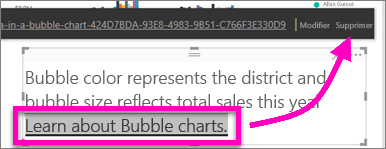

# Ajouter un lien hypertexte à une zone de texte dans un rapport
Vous pouvez ajouter une zone de texte à un rapport dans Power BI Desktop ou dans le service Power BI. Vous pouvez épingler une zone de texte d’un rapport à un tableau de bord ou en ajouter une directement à un tableau de bord. Où que soit la zone de texte, vous pouvez toujours lui ajouter un lien hypertexte. Cet article explique comment ajouter un lien hypertexte à une zone de texte dans un rapport. 

Regardez Will Thompson créer une zone de texte et lui ajouter un lien hypertexte. 

<iframe width="560" height="315" src="https://www.youtube.com/embed/_3q6VEBhGew#t=0m55s" frameborder="0" allowfullscreen></iframe>

Pour plus d’informations sur les liens hypertexte dans les tables et les matrices Power BI, consultez [Ajouter des liens hypertexte à une table](power-bi-hyperlinks-in-tables.md). Pour plus d’informations sur l’ajout de zones de texte à votre tableau de bord, consultez [Ajouter des images, des vidéos, etc. à votre tableau de bord](service-dashboard-add-widget.md). 

## Pour ajouter un lien hypertexte à une zone de texte
1. Ouvrez un rapport, [créez une zone de texte](power-bi-reports-add-text-and-shapes.md) et ajoutez du texte. 
2. Sélectionnez le texte existant ou ajoutez le nouveau texte à utiliser comme lien hypertexte. 

   Le menu de zone de texte s’affiche.
   
   
3. Sélectionner l’icône de lien hypertexte  dans le menu de zone de texte.

   Le champ de lien hypertexte apparaît dans le menu de zone de texte.

4. Tapez ou collez l’URL dans le champ de lien hypertexte, puis sélectionnez **Terminé**.
   
   
5. Testez le lien :  

   a. Placez votre curseur n’importe où dans le nouveau lien hypertexte dans la zone de texte pour afficher l’URL dans le champ de lien hypertexte.  
     
      
   
      

   b. Sélectionnez l’URL dans le champ de lien hypertexte pour ouvrir la page dans une nouvelle fenêtre de navigateur.

## Pour supprimer le lien hypertexte
1. Dans la zone de texte, sélectionnez le lien hypertexte pour le mettre en surbrillance.
   
     
2. Sélectionnez **Supprimer** dans le menu de zone de texte. 

   Power BI Desktop supprime le lien hypertexte, mais laisse le texte.

## Étapes suivantes
[Zones de texte et formes dans les rapports Power BI](power-bi-reports-add-text-and-shapes.md)

D’autres questions ? [Posez vos questions à la Communauté Power BI](http://community.powerbi.com/).

