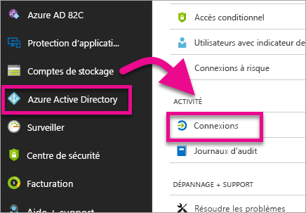
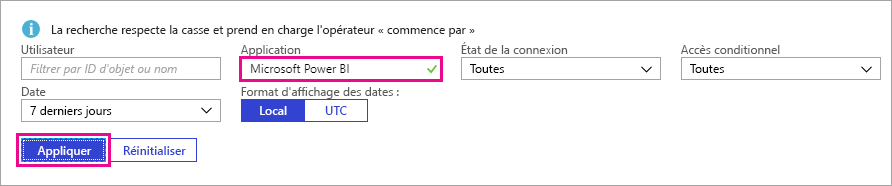
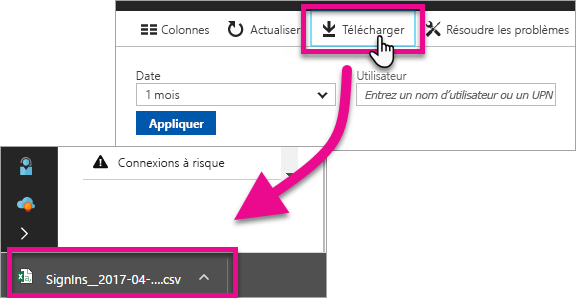

# Trouver les utilisateurs Power BI qui se sont connectés
Si vous êtes administrateur de locataire et que vous voulez voir quels utilisateurs se sont connectés à Power BI, vous pouvez utiliser les rapports d’accès et d’utilisation Azure Active Directory pour une meilleure visibilité.

<iframe width="640" height="360" src="https://www.youtube.com/embed/1AVgh9w9VM8?showinfo=0" frameborder="0" allowfullscreen></iframe>

Vous pouvez accéder au rapport d’activité sur les portails Azure Active Directory (Azure AD) [nouveau](https://docs.microsoft.com/azure/active-directory/active-directory-reporting-activity-sign-ins) et [classique](https://docs.microsoft.com/azure/active-directory/active-directory-view-access-usage-reports). Bien que la vidéo ci-dessus utilise le portail classique pour l’exemple, cet article utilise le nouveau portail.

> [!NOTE]
> Ce rapport d’activité inclut les utilisateurs de Power BI (Gratuit) et Pro, mais ne précise pas les licences dont ils disposent.
> 
> 

## Configuration requise
Voici la configuration requise pour afficher le rapport d’activité de connexion.

* Les utilisateurs des rôles Administrateur général, Administrateur de sécurité ou Lecteur Sécurité peuvent accéder aux données.
* Tous les utilisateurs (non-administrateurs) peuvent accéder à leurs propres connexions.
* Votre locataire doit avoir une licence Azure AD Premium associée pour voir la totalité du rapport d’activité de connexion.

## Utilisation du portail Azure pour afficher les connexions
Vous pouvez utiliser le portail Azure AD pour afficher l’activité de connexion.

1. Accédez au **portail Azure** et sélectionnez **Azure Active Directory**.
2. Sous **Activité**, sélectionnez **Connexions**.
   
    
3. Filtrez l’application par **Microsoft Power BI** ou **Passerelle Power BI Gateway** et sélectionnez **Appliquer**.
   
    **Microsoft Power BI** concerne l’activité de connexion liée au service, tandis que **Power BI Gateway** concerne des connexions spécifiques pour la passerelle de données locale.
   
    

## Exporter les données
Vous pouvez exporter les données de connexion de deux manières, soit en téléchargeant un fichier .csv, soit en utilisant PowerShell.

### Télécharger un fichier .csv
Dans l’écran Activité, vous pouvez sélectionner **Télécharger** dans la barre d’outils. Cela a pour effet de télécharger un fichier .csv pour les données filtrées.

### PowerShell
Vous pouvez utiliser PowerShell pour exporter les données de connexion. Un [exemple](https://docs.microsoft.com/azure/active-directory/active-directory-reporting-api-sign-in-activity-samples#powershell-script) est disponible dans la documentation Azure AD.

> [!NOTE]
> Pour que l’exemple PowerShell fonctionne, veillez à respecter la [configuration requise pour accéder à l’API de création de rapports Azure AD](https://docs.microsoft.com/en-us/azure/active-directory/active-directory-reporting-api-prerequisites).
> 
> 

## Rétention de données
Les données de connexion sont disponibles pour une durée maximale de 30 jours. Pour plus d’informations, consultez [Stratégies de rétention de rapport Azure Active Directory](https://docs.microsoft.com/azure/active-directory/active-directory-reporting-retention).

## Étapes suivantes
[Rapports d’activité de connexion dans le portail Azure Active Directory (nouveau portail)](https://docs.microsoft.com/azure/active-directory/active-directory-reporting-activity-sign-ins)  
[Afficher vos rapports d’accès et d’utilisation (portail classique)](https://docs.microsoft.com/azure/active-directory/active-directory-view-access-usage-reports#view-or-download-a-report)  
[Script PowerShell d’exemple de connexion](https://docs.microsoft.com/azure/active-directory/active-directory-reporting-api-sign-in-activity-samples#powershell-script)  
[Stratégies de rétention de rapports Azure Active Directory](https://docs.microsoft.com/azure/active-directory/active-directory-reporting-retention)  
[Utilisation de l’audit dans votre organisation](service-admin-auditing.md)  
[Activation de la version d’essai Pro prolongée](service-extended-pro-trial.md)

D’autres questions ? [Essayez d’interroger la communauté Power BI](https://community.powerbi.com/)

