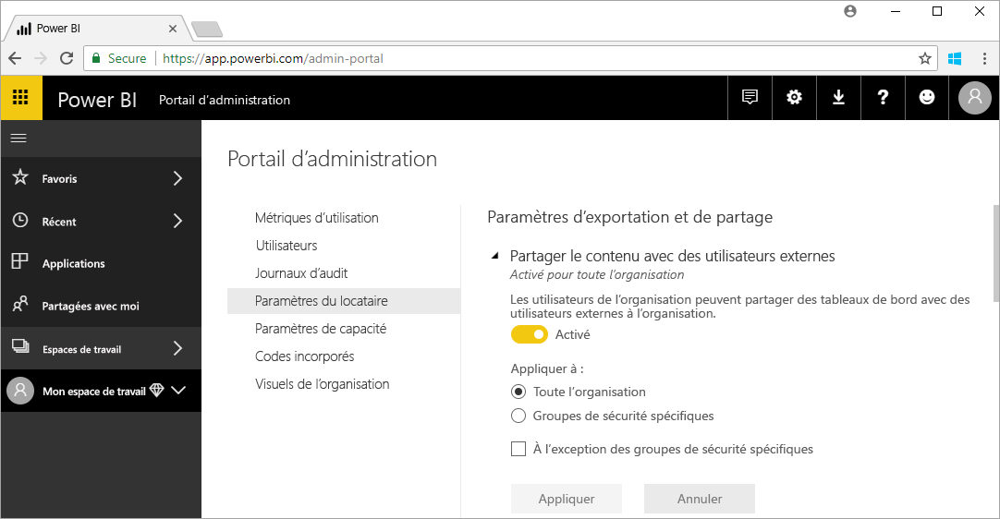

# Présentation de l’administration de Power BI

L’administration de Power BI correspond à la gestion d’un client Power BI, y compris la configuration des règles de gouvernance, le monitoring de l’utilisation et le provisionnement des licences, de la capacité et des ressources de l’organisation. Cet article donne une vue d’ensemble des rôles, des tâches et des outils d’administration ; il comporte des liens vers des articles qui approfondissent le sujet.

Power BI est conçu pour l’informatique décisionnelle en libre-service ; l’administrateur est le gardien des données, des processus et des stratégies dans le client Power BI. Un administrateur Power BI est un membre clé de l’équipe qui comprend des développeurs, des analystes et d’autres fonctions liées à l’informatique décisionnelle. Il peut aider l’organisation à remplir les objectifs critiques suivants :

- comprendre les indicateurs de performance clés et les mesures dont les utilisateurs ont _vraiment_ besoin ;
- réduire le délai de création de rapports d’entreprise par le service informatique ;
- augmenter l’adoption et le retour sur investissement d’un déploiement Power BI.

La tâche consiste à rendre plus productifs les utilisateurs professionnels et à garantir la sécurité et la conformité à la législation et aux réglementations. Parmi les responsabilités assumées figurent l’aide et le support et, dans de nombreux cas, l’accompagnement des utilisateurs professionnels.

## Rôles d’administrateur liés à Power BI

Le tableau suivant décrit les différents rôles liés à l’administration de Power BI.

| **Type d’administrateur** | **Étendue d’administration** | **Étendue Power BI** |
| --- | --- | --- |
| Administrateur général d’Office 365 | Office 365 | Peut gérer tous les aspects d’un client Power BI et d’autres services. |
| Administrateur de facturation Office 365 | Office 365 | Peut acquérir des licences Power BI par le biais d’abonnements Office 365. |
| Administrateur de services fédérés Power BI | Client Power BI | A un contrôle total sur un client Power BI et ses fonctionnalités d’administration (à l’exception des licences). |
| Administrateur de capacité Power BI Premium | Une seule capacité Premium | A un contrôle total sur une capacité Premium et ses fonctionnalités d’administration. |
| Administrateur de capacité Power BI Embedded | Une seule capacité Embedded | A un contrôle total sur une capacité Embedded et ses fonctionnalités d’administration. |

Les administrateurs généraux d’Office 365 et d’Azure Active Directory disposent de droits d’administrateur dans Power BI. Un administrateur général d’Office 365 peut affecter d’autres utilisateurs au rôle d’administrateur du service Power BI, qui n’accorde des droits d’administration que sur les fonctionnalités de Power BI.

Les administrateurs du service Power BI ont accès au portail d’administration de Power BI, qui comporte divers paramètres au niveau du client concernant les fonctionnalités, la sécurité et le monitoring. Ils peuvent accéder à toutes les ressources d’un client Power BI. Dans la plupart des cas, ils identifient les problèmes, puis assurent le suivi avec les propriétaires des ressources pour effectuer des actions correctives.

Le rôle d’administrateur du service Power BI n’accorde pas la possibilité d’affecter des licences aux utilisateurs ou de consulter les journaux d’audit dans Office 365. Par conséquent, les utilisateurs qui sont seulement membres du rôle d’administrateur du service Power BI ne peuvent pas à l’heure actuelle assurer la tâche d’administration de Power BI.

## Tâches d’administration

Le tableau suivant décrit les nombreuses tâches effectuées par les administrateurs pour prendre en charge le client Power BI de leur organisation.

| **Zone de tâches** | **Tâches courantes** |
| --- | --- |
| Gérer le client Power BI |<ul><li>Activer et désactiver des fonctionnalités clés de Power BI <li>Créer un rapport sur les performances et l’utilisation <li>Examiner et gérer les audits d’événements</ul>|
| Acquérir et affecter des licences Power BI |<ul><li>Gérer l’inscription des utilisateurs <li>Acheter et affecter des licences Pro <li>Empêcher les utilisateurs d’accéder à Power BI</ul>|
| Gérer la capacité Premium |<ul><li>Acquérir et travailler avec une capacité Premium <li>Garantir la qualité de service|
| Gérer la capacité Embedded |<ul><li>Acquérir une capacité Embedded pour simplifier l’utilisation des fonctionnalités de Power BI par les éditeurs de logiciels indépendants et les développeurs</ul>|
| Assurer la conformité aux stratégies internes, à la législation et aux réglementations | <ul><li>Gérer la classification de données métiers <li>Participer à la publication de contenu et au partage de stratégies</ul>|
| Gérer les ressources Power BI |<ul><li>Gérer les espaces de travail <li>Publier des visuels personnalisés <li>Vérifier les codes utilisés pour incorporer Power BI dans d’autres applications|
| Offrir de l’aide et un support aux utilisateurs du client |<ul><li>Résoudre les problèmes d’accès aux données et autres</ul>|
| Autres tâches |<ul><li>Déployer Power BI Desktop, par exemple, avec System Center Configuration Manager <li>Gérer le déploiement d’applications mobiles Power BI avec Intune <li>Gérer la sécurité et la confidentialité des données, notamment des données sources</ul>|

## Outils d’administration

Le tableau suivant décrit les différents outils liés à l’administration de Power BI. En règle générale, les administrateurs passent la majeure partie de leur temps sur le portail d’administration de Power BI et utilisent d’autres outils selon les besoins.

| **Outil** | **Tâches courantes** |
| --- | --- |
| Portail d’administration Power BI |<ul><li>Acquérir et travailler avec une capacité Premium</li><li>Garantir la qualité de service</li><li>Gérer la classification de données métiers</li><li>Participer à la publication de contenu et au partage de stratégies</li><li>Gérer les espaces de travail <li>Publier des visuels personnalisés</li><li>Vérifier les codes utilisés pour incorporer Power BI dans d’autres applications</li><li>Résoudre les problèmes d’accès aux données et autres</li></ul>|
| Centre d’administration Microsoft 365 |<ul><li>Gérer l’inscription des utilisateurs</li><li>Acheter et affecter des licences Pro</li><li>Empêcher les utilisateurs d’accéder à Power BI</li></ul>|
| Centre de sécurité et conformité Office 365 |<ul><li>Examiner et gérer les audits d’événements</li></ul>|
| Azure Active Directory (AAD) sur le Portail Azure |<ul><li>Configurer l’accès conditionnel aux ressources de Power BI avec AAD</li><li>Approvisionner la capacité de Power BI Embedded</li></ul>|
| Applets de commande PowerShell |<ul><li>Gérer les espaces de travail et d’autres aspects de Power BI avec des scripts</li></ul>|
| API d’administration et kit SDK |<ul><li>Construire des outils d’administration personnalisés pour faciliter le travail d’un administrateur de Power BI (par exemple, Power BI Desktop peut utiliser ces API pour générer des rapports à partir de données liées à l’administration)</li></ul>|

## Étapes suivantes

Nous espérons que cet article vous aura donné un rapide éclairage sur le travail de l’administrateur de Power BI et les rôles, tâches et outils impliqués. Nous vous recommandons de consulter les deux rubriques suivantes pour approfondir votre compréhension.

[Utiliser le portail d’administration de Power BI](service-admin-portal.md)

[Utiliser les applets de commande PowerShell](/powershell/power-bi/overview)

[FAQ sur l’administration de Power BI](service-admin-faq.md)

D’autres questions ? [Essayez d’interroger la communauté Power BI](https://community.powerbi.com/)