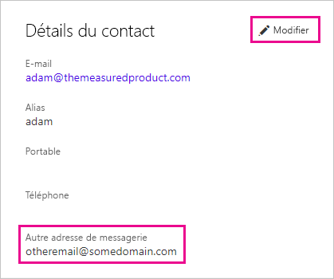

# <a name="using-an-alternate-email-address"></a>Utilisation d’une autre adresse de messagerie
Par défaut, l’adresse de messagerie avec laquelle vous vous êtes inscrit à Power BI est utilisée pour vous envoyer des mises à jour sur l’activité dans Power BI.  Par exemple, quand quelqu’un vous envoie une invitation de partage, elle est expédiée à cette adresse.

Vous souhaiterez peut-être parfois que ces messages soient envoyés à une adresse autre que celle avec laquelle vous vous êtes inscrit à Power BI.

## <a name="updating-through-office-365-personal-info-page"></a>Mise à jour par le biais de la page d’informations personnelles Office 365
1. Accédez à votre [page d’informations personnelles Office 365](https://portal.office.com/account/#personalinfo).  Si vous êtes y invité, connectez-vous avec l’adresse de messagerie et le mot de passe que vous utilisez pour Power BI.
2. Cliquez sur le lien Modifier dans la section Détails du contact.  
   
   > [!NOTE]
   > Si aucun lien Modifier n’est visible, cela signifie que votre adresse de messagerie est gérée par l’administrateur Office 365. Vous devrez le contacter pour mettre à jour votre adresse de messagerie.
   > 
   > 
   
   
3. Dans le champ Autre adresse de messagerie, entrez l’adresse de messagerie qui doit recevoir les mises à jour de Power BI.

> [!NOTE]
> La modification de ce paramètre n’a aucun impact sur l’adresse de messagerie utilisée pour les mises à jour de service, les bulletins d’informations et les autres communications promotionnelles.  Ces éléments seront toujours envoyés à l’adresse de messagerie utilisée initialement lors de l’inscription à Power BI.
> 
> 

## <a name="updating-through-azure-active-directory"></a>Mise à jour par le biais d’Azure Active Directory
Pour capturer un jeton incorporé Active Azure Directory (AAD) pour Power BI, vous pouvez utiliser l’un des trois types d’e-mails suivants :

* L’adresse e-mail principale associée au compte AAD d’un utilisateur
* L’adresse e-mail UPN (UserPrincipalName)
* L’attribut tableau d’une « autre » adresse e-mail

Power BI sélectionne l’e-mail à utiliser selon les critères suivants :
1.  Si l’attribut de messagerie est défini dans l’objet utilisateur du locataire AAD, Power BI l’utilise pour l’adresse e-mail
2.  Si l’adresse e-mail UPN n’est *pas* une adresse e-mail du domaine **\*.onmicrosoft.com** (informations après le symbole « \@ »), Power BI utilise cet attribut de messagerie pour l’adresse e-mail
3.  Si l’attribut tableau d’une « autre » adresse e-mail est défini dans l’objet utilisateur AAD, Power BI utilise la première adresse e-mail dans cette liste (quand il y a plusieurs e-mails spécifiés dans cet attribut)
4. Si aucun des critères ci-dessus n’est rempli, l’adresse UPN est utilisée

## <a name="updating-with-powershell"></a>Mise à jour avec PowerShell
Vous pouvez également mettre à jour l’autre adresse de messagerie par le biais de PowerShell pour Azure Active Directory. Cette opération s’effectue avec la commande [Set-AzureADUser](https://docs.microsoft.com/powershell/module/azuread/set-azureaduser).

```
Set-AzureADUser -ObjectId john@contoso.com -OtherMails "otheremail@somedomain.com"
```

Pour plus d’informations, consultez [Azure Active Directory PowerShell Version 2](https://docs.microsoft.com/powershell/azure/active-directory/install-adv2).

D’autres questions ? [Posez vos questions à la communauté Power BI](http://community.powerbi.com/)

