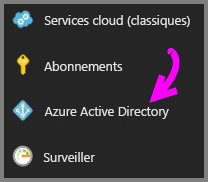
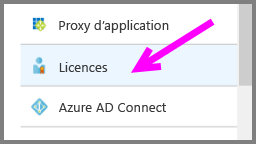
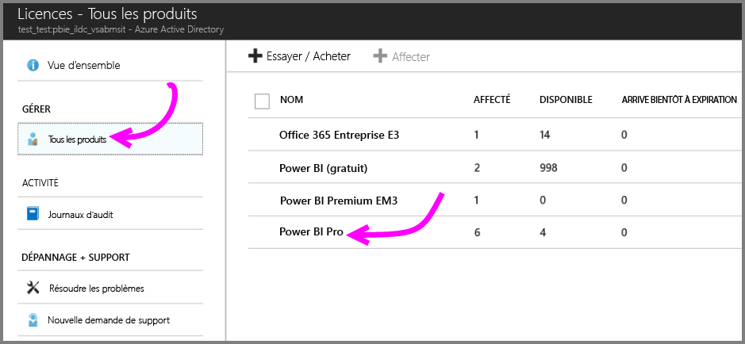
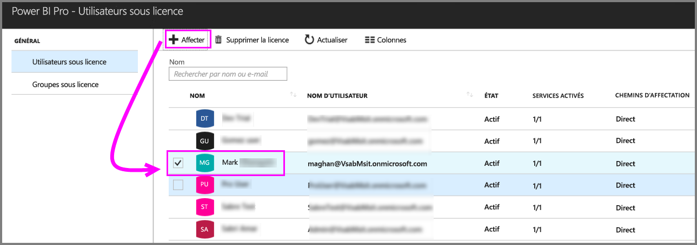

# Démarrage rapide : Affecter des licences Power BI Pro dans Azure

Power BI Pro est une licence individuelle qui autorise l’accès à la totalité du contenu et des fonctionnalités du service Power BI, y compris la possibilité de partager du contenu et de collaborer avec d’autres utilisateurs Pro. Seuls les utilisateurs Pro peuvent publier du contenu à partir d’espaces de travail d’application, partager des tableaux de bord et s’abonner aux rapports et tableaux de bord. Cet article explique comment affecter des licences Power BI Pro dans Azure. Vous pouvez également [affecter des licences dans Office 365](service-admin-assigning-power-bi-pro-licenses.md).

## Conditions préalables

Vous devez être propriétaire de l’abonnement utilisé par Azure Power BI pour les recherches Active Directory.

Vous devez [acheter au moins une licence](service-admin-purchasing-power-bi-pro.md) avant de commencer.

## Affecter des licences à des comptes d’utilisateur individuels

Suivez ces étapes pour affecter des licences Power BI Pro à des comptes d’utilisateur individuels :

1. Accédez au [portail Azure](https://ms.portal.azure.com/#@microsoft.onmicrosoft.com/dashboard/private/39bc3cf7-31a4-43f6-954c-f2d69ca2f0). 

2. Dans la barre de navigation gauche, sélectionnez **Azure Active Directory**.

    

3. Sous **Azure Active Directory**, sélectionnez **Licences**.

    

4. Sous **Licences**, sélectionnez **Tous les produits**, puis **Power BI Pro** pour afficher la liste des utilisateurs avec licence.

    

5. Sélectionnez **Affecter** pour ajouter une licence Power BI Pro à un compte d’utilisateur supplémentaire.

    

## Étapes suivantes

Maintenant que vous avez affecté des licences, découvrez plus en détail Power BI Pro.

[Power BI Pro dans votre organisation](service-admin-power-bi-pro-in-your-organization.md)

[Trouver les utilisateurs Power BI qui se sont connectés](service-admin-access-usage.md)

D’autres questions ? [Essayez d’interroger la communauté Power BI](https://community.powerbi.com/)