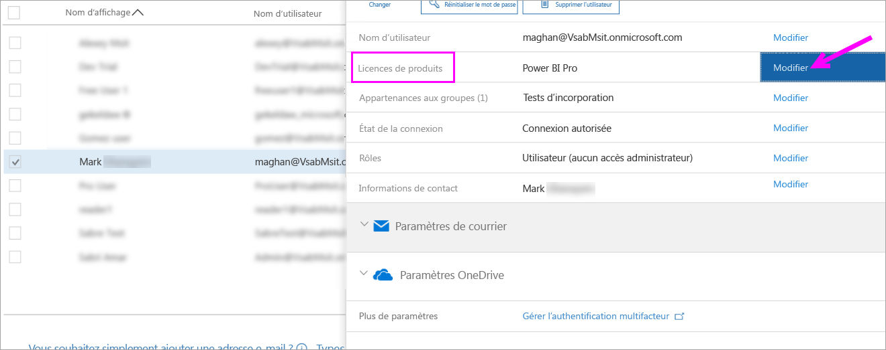
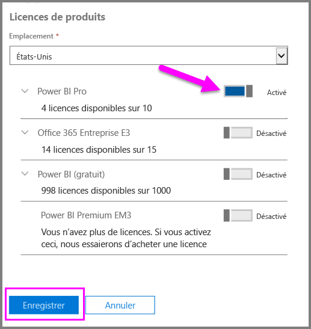
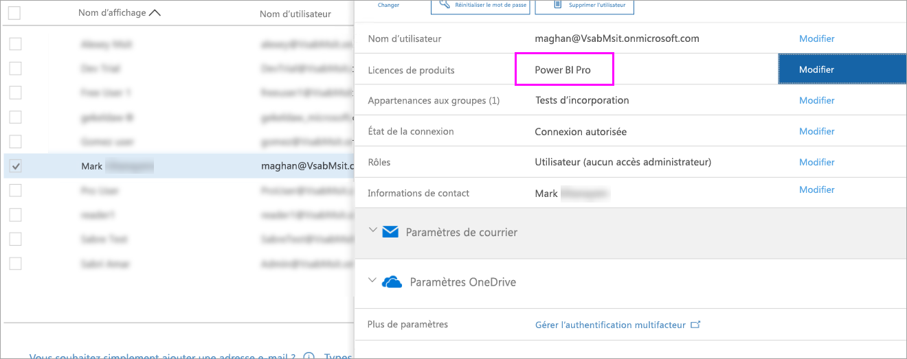

# Démarrage rapide : Affecter des licences Power BI Pro dans Office 365

Power BI Pro est une licence individuelle qui autorise l’accès à la totalité du contenu et des fonctionnalités du service Power BI, y compris la possibilité de partager du contenu et de collaborer avec d’autres utilisateurs Pro. Seuls les utilisateurs Pro peuvent publier du contenu à partir d’espaces de travail d’application, partager des tableaux de bord et s’abonner aux rapports et tableaux de bord. Cet article explique comment affecter des licences Power BI Pro dans Office 365. Vous pouvez également [affecter des licences dans Azure](service-admin-assigning-power-bi-pro-licenses-azure.md).

## Conditions préalables

Vous devez être membre du rôle [ **Administrateur global** ou **Administrateur des comptes d’utilisateur** ](https://support.office.com/article/about-office-365-admin-roles-da585eea-f576-4f55-a1e0-87090b6aaa9d?ui=en-US&rs=en-US&ad=US) dans Office 365.

Vous devez [acheter au moins une licence](service-admin-purchasing-power-bi-pro.md) avant de commencer.

## Affecter des licences à des comptes d’utilisateur individuels

Suivez ces étapes pour affecter des licences Power BI Pro à des comptes d’utilisateur individuels :

1. Ouvrez le [Centre d’administration Office 365](https://portal.office.com/adminportal/home#/homepage).

2. Dans le volet de navigation gauche, développez **Utilisateurs**, puis sélectionnez **Utilisateurs actifs**.

    

3. Sélectionnez un utilisateur puis, sous **Licences**, choisissez **Modifier**.

    

4. Sous **Power BI Pro**, faites passer la valeur à **Activé**, puis sélectionnez **Enregistrer**.

    

5. Sous **État** pour le compte sélectionné, vérifiez que la licence Power BI Pro a été affectée.

    

## Étapes suivantes

Maintenant que vous avez affecté des licences, découvrez plus en détail Power BI Pro.

[Power BI Pro dans votre organisation](service-admin-power-bi-pro-in-your-organization.md)

[Trouver les utilisateurs Power BI qui se sont connectés](service-admin-access-usage.md)

D’autres questions ? [Essayez d’interroger la communauté Power BI](https://community.powerbi.com/)