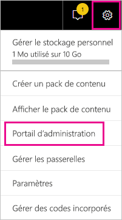
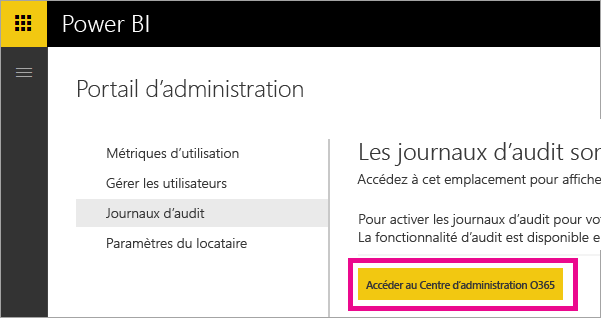
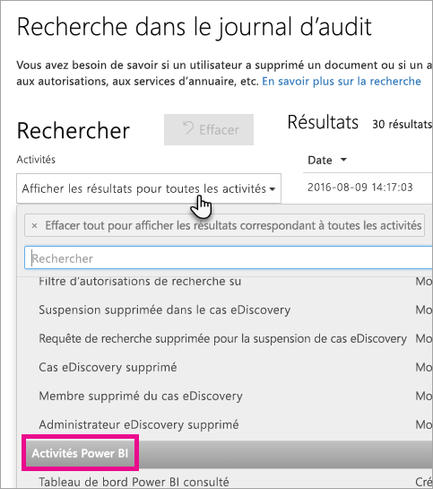
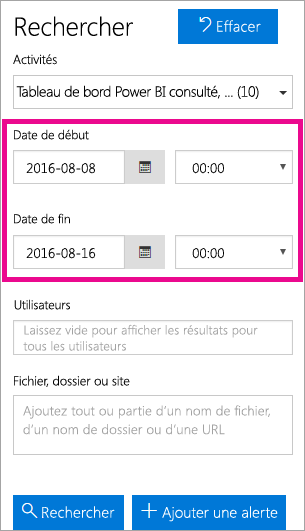
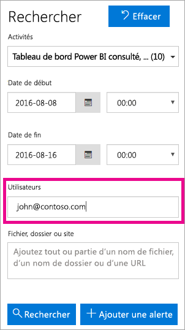
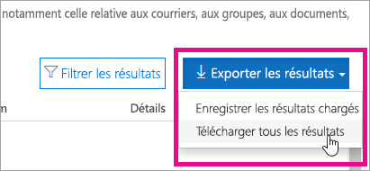

# <a name="using-auditing-within-your-organization"></a>Utilisation de l’audit dans votre organisation

<iframe width="560" height="315" src="https://www.youtube.com/embed/zj4kA39jV_4?showinfo=0" frameborder="0" allowfullscreen></iframe>

Découvrez comment l’audit avec Power BI peut vous permettre d’analyser et d’examiner les actions effectuées. Vous pouvez utiliser le centre de sécurité et conformité ou utiliser PowerShell.

Il est important de savoir qui effectue une action sur un élément donné de votre locataire Power BI, afin de permettre à votre entreprise de répondre à ses exigences, notamment en matière de conformité réglementaire et de gestion des enregistrements.

Vous pouvez filtrer les données d’audit par période, utilisateur, tableau de bord, rapport, jeu de données et type d’activité. Vous pouvez également télécharger les activités dans un fichier .csv (valeurs séparées par des virgules) pour les analyser en mode hors connexion.

> [!NOTE]
> La fonctionnalité d’audit de Power BI en préversion est disponible dans toutes les régions.

## <a name="requirements"></a>Configuration requise
Vous devez respecter les exigences suivantes pour accéder aux journaux d’audit :

- Pour accéder à la section d’audit du Centre de sécurité et conformité Office 365, vous devez disposer d’une licence Exchange Online (incluse avec les abonnements Office 365 Entreprise E3 et E5).
- Vous devez être administrateur général ou avoir un rôle d’administrateur Exchange qui fournit l’accès au journal d’audit. 

  Les rôles d’administrateur Exchange sont contrôlés par le biais du centre d’administration Exchange. Pour plus d’informations, consultez [Autorisations dans Exchange Online](https://technet.microsoft.com/library/jj200692(v=exchg.150).aspx).

- Si vous avez accès au journal d’audit, mais que vous n’êtes pas administrateur général ni un administrateur de service Power BI, vous n’avez pas accès au portail d’administration de Power BI. Dans ce cas, vous devez obtenir un lien direct au Centre de sécurité et conformité Office 365.

## <a name="enabling-auditing-functionality-in-the-power-bi-admin-portal"></a>Activation des fonctionnalités d’audit dans le portail d’administration Power BI

Pour utiliser les rapports, vous devez activer l’audit pour votre organisation. Pour cela, utilisez les paramètres de client du portail d’administration.

1. Sélectionnez l’**icône en forme d’engrenage** dans le coin supérieur droit.

2. Sélectionnez **Portail d’administration**.
   
   

3. Sélectionnez **Paramètres du client**.
   
   

4. Basculez sur **Créer des journaux d’audit pour l’audit des activités internes et la vérification de la conformité**.

5. Sélectionnez **Appliquer**.

Power BI démarre l’enregistrement des différentes activités que les utilisateurs effectuent dans Power BI. L’affichage des journaux dans le Centre de sécurité et conformité Office 365 peut prendre jusqu’à 48 heures. Pour plus d’informations sur les activités qui sont enregistrées, consultez [Liste des activités auditées par Power BI](#list-of-activities-audited-by-power-bi).

> [!NOTE]
> Afin d’activer l’audit pour Power BI dans votre client, ce dernier doit avoir au moins une licence de boîte aux lettres Exchange.

## <a name="accessing-your-audit-logs"></a>Accès à vos journaux d’audit

Pour auditer vos journaux Power BI, vous devez visiter le Centre de sécurité et conformité Office 365.

1. Sélectionnez l’**icône en forme d’engrenage** dans le coin supérieur droit.

2. Sélectionnez **Portail d’administration**.
   
   

3. Sélectionnez **Journaux d’audit**.
 
4. Sélectionnez **Accéder au Centre d’administration O365**.
   
   

Vous pouvez également accéder à [Office 365 | Sécurité et conformité](https://protection.office.com/#/unifiedauditlog).

> [!NOTE]
> Pour fournir à des comptes non-administrateurs l’accès au journal d’audit, vous devez attribuer les autorisations dans le centre d’administration Exchange Online. Par exemple, vous pouvez affecter un utilisateur à un groupe de rôles existant (comme Gestion de l’organisation) ou vous pouvez créer un nouveau groupe de rôles avec le rôle Journaux d’audit. Pour plus d’informations, consultez [Autorisations dans Exchange Online](https://technet.microsoft.com/library/jj200692\(v=exchg.150\).aspx).

## <a name="search-only-power-bi-activities"></a>Rechercher des activités Power BI uniquement

Pour limiter les résultats aux seules activités Power BI, procédez comme suit.

1. Sur la page **Recherche de journaux d’audit**, sélectionnez la liste déroulante **Activités** sous **Recherche**.

2. Sélectionnez **Activités Power BI**.
   
   

3. Sélectionnez n’importe quel emplacement en dehors de la zone de sélection pour la fermer.

Vos recherches sont maintenant limitées aux seules activités Power BI.

## <a name="search-the-audit-logs-by-date"></a>Rechercher des journaux d’audit par date

Vous pouvez rechercher les journaux par période à l’aide des champs « Date de début » et « Date de fin ». Les sept derniers jours sont sélectionnés par défaut. La date et l’heure sont présentées au format UTC (temps universel coordonné). La période maximale que vous pouvez spécifier est de 90 jours. Une erreur s’affiche si la période sélectionnée est supérieure à 90 jours.

> [!NOTE]
> Si vous utilisez la période maximale de 90 jours, sélectionnez l’heure actuelle comme date de début. Sinon, vous recevez une erreur indiquant que la date de début est antérieure à la date de fin. Si vous avez activé l’audit dans les 90 derniers jours, la période maximale ne peut pas démarrer avant la date à laquelle l’audit a été activé.



## <a name="search-the-audit-logs-by-users"></a>Rechercher des journaux d’audit par utilisateur

Vous pouvez rechercher des entrées du journal d’audit pour les activités effectuées par des utilisateurs spécifiques. Pour ce faire, entrez un ou plusieurs noms d’utilisateur dans le champ Utilisateurs.  Il s’agit du nom avec lequel les utilisateurs se connectent à Power BI. Celui-ci ressemble à une adresse de messagerie.
Laissez cette zone vide afin de renvoyer les entrées pour tous les utilisateurs (et les comptes de service) de votre organisation.



## <a name="viewing-search-results"></a>Affichage des résultats de la recherche

Une fois que vous appuyez sur le bouton de recherche, les résultats de recherche sont chargés et ils s’affichent quelques secondes plus tard sous forme de résultats. Lorsque la recherche est terminée, le nombre de résultats s’affiche. 

> [!NOTE]
> Un maximum de 1 000 événements s’affiche ; si plus de 1 000 événements correspondent aux critères de recherche, les 1 000 événements les plus récents apparaissent.

Les résultats contiennent les informations suivantes sur chaque événement renvoyé par la recherche.

| **Colonne** | **Définition** |
| --- | --- |
| Date |Date et heure (UTC) auxquelles l’événement s’est produit. |
| Adresse IP |Adresse IP de l’appareil utilisé lors de l’enregistrement de l’activité. L’adresse IP est affichée au format d’adresse IPv4 ou IPv6. |
| Utilisateur |Utilisateur (ou compte de service) qui a effectué l’action qui a déclenché l’événement. |
| Activité |Activité exécutée par l’utilisateur. Cette valeur correspond aux activités que vous avez sélectionnées dans la liste déroulante Activités. Pour un événement du journal d’audit d’administrateur Exchange, la valeur de cette colonne est une applet de commande Exchange. |
| Élément |Objet créé ou modifié suite à l’activité correspondante. Par exemple, le fichier affiché ou modifié ou le compte utilisateur mis à jour. Seule une partie des activités a une valeur dans cette colonne. |
| Détails |Informations supplémentaires sur une activité. Là encore, seule une partie des activités a une valeur. |

> [!NOTE]
> Sélectionnez un en-tête de colonne sous Résultats pour trier les résultats. Vous pouvez trier les résultats de A à Z ou de Z à A. Cliquez sur l’en-tête Date pour trier les résultats du plus ancien au plus récent ou du plus récent au plus ancien.

## <a name="view-the-details-for-an-event"></a>Afficher les détails d’un événement

Vous pouvez afficher plus de détails sur un événement en sélectionnant l’enregistrement d’événement dans la liste des résultats de recherche. La page de détails qui s’affiche contient les propriétés détaillées de l’enregistrement de l’événement. Les propriétés affichées dépendent du service Office 365 dans lequel l’événement se produit. Pour afficher des détails supplémentaires, sélectionnez **Plus d’informations**.

Le tableau suivant fournit des détails sur que vous pouvez voir affiché.

| **Paramètre ou événement** | **Description** | **Informations supplémentaires** |
| --- | --- | --- |
| Rapport Power BI téléchargé |Cette activité est journalisée chaque fois qu’un rapport est téléchargé. |Nom du rapport, Nom du jeu de données |
| Créer un rapport |Cette activité est journalisée chaque fois qu’un rapport est créé. |Nom du rapport, Nom du jeu de données |
| Modifier le rapport |Cette activité est enregistrée chaque fois qu’un rapport est modifié. |Nom du rapport, Nom du jeu de données |
| Créer un jeu de données |Cette activité est journalisée chaque fois qu’un jeu de données est créé. |Nom du jeu de données, DataConnectivityMode |
| Supprimer un jeu de données |Cette activité est journalisée chaque fois qu’un jeu de données est supprimé. |Nom du jeu de données, DataConnectivityMode |
| Créer une application Power BI |Cette activité est journalisée chaque fois qu’une application Power BI est créée. |Nom de l’application, Autorisations, Nom de l’espace de travail |
| Installer une application Power BI |Cette activité est journalisée chaque fois qu’une application Power BI est installée. |Nom de l’application |
| Mettre à jour une application Power BI |Cette activité est journalisée chaque fois qu’une application Power BI est mise à jour. |Nom de l’application, Autorisations, Nom de l’espace de travail |
| Évaluation étendue de Power BI démarrée |Cette activité est journalisée chaque fois qu’un utilisateur accepte la version d’évaluation Pro étendue exécutable jusqu’au 31 mai 2018. | |
| Jeu de données Power BI analysé |Cette activité est journalisée chaque fois qu’un jeu de données Power BI est analysé dans Excel. | |
| Passerelle Power BI créée |Cette activité est journalisée chaque fois qu’une passerelle est créée. |Nom de la passerelle, Type de passerelle |
| Passerelle Power BI supprimée |Cette activité est journalisée chaque fois qu’une passerelle est supprimée. |Nom de la passerelle, Type de passerelle |
| Source de données ajoutée à la passerelle Power BI |Cette activité est journalisée chaque fois qu’une source de données est ajoutée à la passerelle |Nom de la passerelle, Type de passerelle, Nom de la source de données, Type de source de données |
| Source de données supprimée de la passerelle Power BI |Cette activité est journalisée chaque fois qu’une source de données est supprimée d’une passerelle |Nom de la passerelle, Type de passerelle, Nom de la source de données, Type de source de données |
| Administrateurs de passerelle Power BI modifiés |Cette activité est journalisée chaque fois que les administrateurs d’une passerelle sont modifiés (ajoutés/supprimés) |Nom de la passerelle, Utilisateurs ajoutés, Utilisateurs supprimés |
| Utilisateurs de source de données de passerelle Power IB modifiés |Cette activité est journalisée chaque fois que les utilisateurs d’une passerelle sont modifiés (ajoutés/supprimés) |Nom de la passerelle, Utilisateurs ajoutés, Utilisateurs supprimés |
| SetScheduledRefresh |Cette activité est journalisée chaque fois qu’une nouvelle actualisation est planifiée pour un jeu de données |Nom du jeu de données, Fréquence d’actualisation (en minutes) |

## <a name="using-powershell-to-search"></a>Utilisation de PowerShell pour la recherche

Vous pouvez utiliser PowerShell pour accéder aux journaux d’audit en fonction de votre connexion. Pour cela, accédez à Exchange Online. Voici un exemple de commande permettant d’extraire des entrées de journal d’audit Power BI.

> [!NOTE]
> Pour utiliser la commande New-PSSession, votre compte doit disposer d’une licence Exchange Online et vous devez accéder au journal d’audit de votre locataire.

```
Set-ExecutionPolicy RemoteSigned

$UserCredential = Get-Credential

$Session = New-PSSession -ConfigurationName Microsoft.Exchange -ConnectionUri https://outlook.office365.com/powershell-liveid/ -Credential $UserCredential -Authentication Basic -AllowRedirection

Import-PSSession $Session
Search-UnifiedAuditLog -StartDate 9/11/2016 -EndDate 9/15/2016 -RecordType PowerBI -ResultSize 1000 | Format-Table | More
```

Pour plus d’informations sur la connexion à Exchange Online, consultez [Se connecter à Exchange Online PowerShell](https://technet.microsoft.com/library/jj984289\(v=exchg.160\).aspx).

Pour plus d’informations sur les paramètres et l’utilisation de la commande Search-UnifiedAuditLog, consultez [Search-UnifiedAuditLog](https://technet.microsoft.com/library/mt238501\(v=exchg.160\).aspx).

Pour voir un exemple d’utilisation de PowerShell pour effectuer une recherche dans le journal d’audit et attribuer des licences Power BI Pro en fonction des entrées, consultez le billet de blog sur l’[utilisation du journal d’audit Power BI et de PowerShell pour attribuer des licences Power BI Pro](https://powerbi.microsoft.com/blog/using-power-bi-audit-log-and-powershell-to-assign-power-bi-pro-licenses/).

## <a name="export-the-power-bi-audit-log"></a>Exporter le journal d’audit Power BI

Vous pouvez exporter le journal d’audit Power BI dans un fichier .csv.

1. Sélectionnez **Exporter les résultats**.

2. Sélectionnez **Enregistrer les résultats chargés** ou **Télécharger tous les résultats**.
   
   

## <a name="record-and-user-types"></a>Types d’enregistrement et d’utilisateur

Les entrées du journal d’audit incluent des éléments UserType et RecordType. Toutes les entrées Power BI ont un RecordType de 20.

Pour obtenir la liste complète, consultez [Propriétés détaillées du journal d’audit Office 365](https://support.office.com/article/Detailed-properties-in-the-Office-365-audit-log-ce004100-9e7f-443e-942b-9b04098fcfc3)

## <a name="list-of-activities-audited-by-power-bi"></a>Liste des activités auditées par Power BI

| Activité | Description | Informations supplémentaires |
| --- | --- | --- |
| CreateDashboard |Cette activité est enregistrée chaque fois qu’un tableau de bord est créé. |- Nom du tableau de bord. |
| EditDashboard |Cette activité est enregistrée chaque fois qu’un tableau de bord est renommé. |- Nom du tableau de bord. |
| DeleteDashboard |Cette activité est enregistrée chaque fois qu’un tableau de bord est supprimé. |- Nom du tableau de bord. |
| PrintDashboard |Cet événement est enregistré chaque fois qu’un tableau de bord est imprimé. |- Nom du tableau de bord.<br/>- Nom du jeu de données. |
| ShareDashboard |Cette activité est enregistrée chaque fois qu’un tableau de bord est partagé. |- Nom du tableau de bord.<br/>- E-mail du destinataire.<br/>- Nom du jeu de données.<br>- Autorisations de repartage. |
| ViewDashboard |Cette activité est enregistrée chaque fois qu’un tableau de bord est consulté. |- Nom du tableau de bord. |
| ExportTile |Cet événement est enregistré chaque fois qu’une vignette de tableau de bord est exportée. |- Nom de la vignette.<br/>- Nom du jeu de données. |
| DeleteReport |Cette activité est enregistrée chaque fois qu’un rapport est supprimé. |- Nom du rapport. |
| ExportReport |Cet événement est enregistré chaque fois que les données sont exportées à partir d’une vignette de rapport. |- Nom du rapport.<br/>- Nom du jeu de données. |
| PrintReport |Cet événement est enregistré chaque fois qu’un rapport est imprimé. |- Nom du rapport.<br/>- Nom du jeu de données. |
| PublishToWebReport |Cet événement est enregistré chaque fois qu’un rapport est publié sur le web. |- Nom du rapport.<br/>- Nom du jeu de données. |
| ViewReport |Cette activité est enregistrée chaque fois qu’un rapport est consulté. |- Nom du rapport. |
| ExploreDataset |Cet événement est enregistré chaque fois que vous explorez un jeu de données en le sélectionnant. |- Nom du jeu de données. |
| DeleteDataset |Cet événement est enregistré chaque fois qu’un jeu de données est supprimé. |- Nom du jeu de données. |
| CreateOrgApp |Cette activité est enregistrée chaque fois qu’un pack de contenu d’organisation est créé. |- Nom du pack de contenu d’organisation.<br/>- Nom des tableaux de bord.<br/>- Nom des rapports.<br/>- Nom des jeux de données. |
| CreateGroup |Cette activité est déclenchée chaque fois qu’un groupe est créé. |- Nom du groupe. |
| AddGroupMembers |Cette activité est enregistrée chaque fois qu’un membre est ajouté à un espace de travail de groupe Power BI. |- Nom du groupe.<br/>- Adresses e-mail. |
| UpdatedAdminFeatureSwitch |Cet événement est enregistré chaque fois qu’un commutateur de fonctionnalité d’administration est modifié. |- Nom du commutateur.<br/>- Nouvel état du commutateur. |
| OptInForProTrial |Cet événement est consigné quand un utilisateur choisit d’essayer Power BI Pro au sein du service. |- Adresse e-mail |

## <a name="next-steps"></a>Étapes suivantes

[Portail d’administration Power BI](service-admin-portal.md)  
[Qu’est-ce que Power BI Premium ?](service-premium.md)  
[Achat de Power BI Pro](service-admin-purchasing-power-bi-pro.md)  
[Autorisations dans Exchange Online](https://technet.microsoft.com/library/jj200692\(v=exchg.150\).aspx)  
[Se connecter à Exchange Online PowerShell](https://technet.microsoft.com/library/jj984289\(v=exchg.160\).aspx)  
[Search-UnifiedAuditLog](https://technet.microsoft.com/library/mt238501\(v=exchg.160\).aspx)  
[Propriétés détaillées du journal d’audit Office 365](https://support.office.com/article/Detailed-properties-in-the-Office-365-audit-log-ce004100-9e7f-443e-942b-9b04098fcfc3)  

D’autres questions ? [Essayez d’interroger la communauté Power BI](http://community.powerbi.com/)