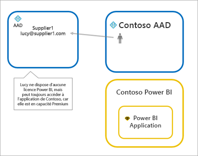
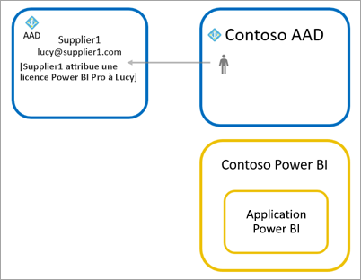
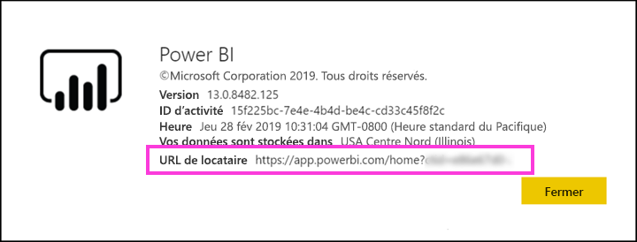

# Distribuer du contenu Power BI à des utilisateurs invités externes avec Azure AD B2B

Power BI s’intègre avec Azure Active Directory B2B (Azure AD B2B) pour permettre une distribution sécurisée de contenu Power BI à des utilisateurs invités extérieurs à votre organisation, tout en conservant le contrôle des données internes.  

De plus, vous pouvez autoriser les utilisateurs invités extérieurs à votre organisation à modifier et à gérer du contenu au sein de votre organisation.

## Activer l’accès

Veillez à activer la fonctionnalité [Partager du contenu avec des utilisateurs externes](service-admin-portal.md#export-and-sharing-settings) dans le portail d’administration de Power BI avant de convier des utilisateurs invités.

Vous pouvez aussi utiliser la fonctionnalité [Autoriser les utilisateurs invités externes à modifier et à gérer le contenu de l’organisation](service-admin-portal.md#allow-external-guest-users-to-edit-and-manage-content-in-the-organization). Elle vous permet de sélectionner quel utilisateur invité peut voir et créer du contenu dans les espaces de travail, notamment explorer le système Power BI de votre organisation.

## Qui pouvez-vous inviter ?

Vous pouvez inviter des utilisateurs qui ont une adresse e-mail, notamment des comptes personnels comme gmail.com, outlook.com et hotmail.com. Azure AD B2B appelle ces adresses des *identités sociales*.

## Inviter des utilisateurs

Les utilisateurs invités nécessitent des invitations seulement la première fois que vous les invitez dans votre organisation. Il existe deux façons d’inviter des utilisateurs : les invitations planifiées et les invitations ad hoc.

### Invitations planifiées

Utilisez une invitation planifiée si vous savez quels utilisateurs inviter. Vous pouvez envoyer l’invitation à l’aide du portail Azure ou de PowerShell. Vous devez être un administrateur de locataire pour inviter des personnes.

Procédez comme suit pour envoyer une invitation dans le portail Azure.

1. Dans le [portail Azure](https://portal.azure.com), sélectionnez **Azure Active Directory**.

1. Sous **Gérer**, sélectionnez **Utilisateurs** > **Tous les utilisateurs** > **Nouvel utilisateur invité**.

    

1. Entrez une **adresse e-mail** et un **message personnel**.

    

1. Sélectionnez **Inviter**.

Pour inviter plus d’un utilisateur, utilisez PowerShell. Pour plus d’informations, consultez [Code Azure AD B2B Collaboration et exemples PowerShell](/azure/active-directory/b2b/code-samples/).

L’utilisateur invité doit sélectionner **Mise en route** dans l’e-mail d’invitation qu’il reçoit. L’utilisateur invité est ensuite ajouté au client.

### Invitations ad hoc

Pour inviter à tout moment un utilisateur externe, ajoutez-le à votre tableau de bord ou à votre rapport à l’aide de l’interface utilisateur de partage, ou à votre application via la page d’accès. L’exemple suivant montre comment inviter un utilisateur externe à utiliser une application.

L’utilisateur invité reçoit un e-mail indiquant que vous avez partagé l’application avec lui.

L’utilisateur invité doit se connecter en utilisant l’adresse e-mail de son organisation. Il recevra une demande d’acceptation de l’invitation une fois connecté. Après la connexion, l’application s’ouvre pour l’utilisateur invité. Pour revenir à l’application, il peut marquer le lien à l’aide d’un signet, ou enregistrer l’e-mail.

## Licensing

L’utilisateur invité doit disposer de la licence appropriée pour voir le contenu que vous avez partagé. Il existe trois façons de vérifier que l’utilisateur dispose d’une licence appropriée : utiliser Power BI Premium, attribuer une licence Power BI Pro ou utiliser la licence Power BI Pro de l’invité.

Quand vous utilisez la fonctionnalité [Autoriser les utilisateurs invités externes à modifier et à gérer le contenu de l’organisation](service-admin-portal.md#allow-external-guest-users-to-edit-and-manage-content-in-the-organization), les utilisateurs invités contribuant à du contenu dans des espaces de travail ou partageant du contenu avec d’autres utilisateurs nécessitent une licence Power BI Pro.

### Utiliser Power BI Premium

L’affectation de l’espace de travail de l’application à la [capacité Power BI Premium](service-premium-what-is.md) permet à l’utilisateur invité d’utiliser l’application sans disposer d’une licence Power BI Pro. Power BI Premium permet également à des applications de tirer parti d’autres capacités, comme des fréquences de rafraîchissement accrues, une capacité dédiée et des modèles de grande taille.

### Affecter une licence Power BI Pro à un utilisateur invité

L’affectation d’une licence Power BI Pro à l’utilisateur invité au sein de votre locataire permet à cet utilisateur de voir du contenu dans le locataire.

### Utilisateur invité apportant sa propre licence Power BI Pro

L’utilisateur invité dispose déjà d’une licence Power BI Pro assignée à l’intérieur de son client.

## Utilisateurs invités pouvant modifier et gérer du contenu 

Quand vous utilisez la fonctionnalité [Autoriser les utilisateurs invités externes à modifier et à gérer le contenu de l’organisation ](service-admin-portal.md#allow-external-guest-users-to-edit-and-manage-content-in-the-organization), les utilisateurs invités spécifiés accèdent au système Power BI de votre organisation. Ils peuvent voir tout le contenu pour lequel ils disposent d’une autorisation. Ils peuvent accéder à l’accueil, parcourir des espaces de travail, installer des applications, voir où ils figurent dans la liste d’accès et contribuer à du contenu dans des espaces de travail. Ils peuvent créer ou être des administrateurs d’espaces de travail qui utilisent la nouvelle expérience d’espace de travail. Certaines limitations s’appliquent. La section Considérations et limitations liste ces restrictions.
 
Pour aider ces utilisateurs à se connecter à Power BI, fournissez-leur l’URL du locataire. Pour trouver l’URL de locataire, effectuez les étapes suivantes.

1. Dans le service Power BI, menu supérieur, sélectionnez l’aide ( **?** ), puis **À propos de Power BI**.

2. Recherchez la valeur en regard de **URL de locataire**. La valeur est l’URL du locataire que vous pouvez partager avec vos utilisateurs invités.

    

## Considérations et limitations

* Par défaut, Azure AD B2B limite les invités externes à la seule consommation du contenu. Les invités Azure AD B2B externes peuvent consulter les applications, les tableaux de bord et les rapports, exporter des données, et créer des abonnements par courrier pour les tableaux de bord et les rapports. Ils ne peuvent pas accéder aux espaces de travail ou publier leur propre contenu. Cependant, ces restrictions ne s’appliquent pas aux utilisateurs invités qui ont obtenu l’accès via la fonctionnalité [Autoriser les utilisateurs invités externes à modifier et à gérer le contenu de l’organisation ](service-admin-portal.md#allow-external-guest-users-to-edit-and-manage-content-in-the-organization).

* Pour les utilisateurs invités autorisés via la fonctionnalité [Autoriser les utilisateurs invités externes à modifier et à gérer le contenu de l’organisation](service-admin-portal.md#allow-external-guest-users-to-edit-and-manage-content-in-the-organization), certaines expériences ne sont pas accessibles. Pour mettre à jour ou publier des rapports, ils doivent utiliser l’interface utilisateur web du service Power BI, notamment l’option Obtenir les données pour charger des fichiers Power BI Desktop.  Les expériences suivantes ne sont pas prises en charge :
    * Diriger la publication de Power BI Desktop vers le service Power BI
    * Les utilisateurs invités ne peuvent pas utiliser Power BI Desktop pour se connecter à des jeux de données du service dans le service Power BI
    * Espaces de travail classiques liés à des groupes Office 365 :
        * Un utilisateur invité ne peut pas créer ou être un administrateur de ces espaces de travail
        * Les utilisateurs invités peuvent être membres
    * L’envoi d’invitations ad hoc n’est pas pris en charge pour les listes d’accès aux espaces de travail
    * Power BI Publisher pour Excel n’est pas pris en charge pour les utilisateurs invités
    * Les utilisateurs invités ne peuvent pas installer une passerelle Power BI Gateway et la connecter à votre organisation
    * Les utilisateurs invités ne peuvent pas installer d’applications à publier dans toute l’organisation
    * Les utilisateurs invités ne peuvent pas utiliser, créer, mettre à jour ou installer des packs de contenu d’organisation
    * Les utilisateurs invités ne peuvent pas utiliser la fonctionnalité Analyser dans Excel
    * Les utilisateurs invités ne peuvent pas être @mentioned dans les commentaires
    * Les utilisateurs invités ne peuvent pas utiliser des abonnements
    * Les utilisateurs invités qui utilisent cette fonctionnalité doivent disposer d’un compte professionnel ou scolaire. Les utilisateurs invités utilisant des comptes personnels seront confrontés à plus de limitations en raison de restrictions de connexion.

* Pour l’instant, cette fonctionnalité n’est pas disponible avec le composant WebPart de rapport Power BI SharePoint Online.

* Des paramètres Active Directory peuvent limiter ce que les utilisateurs invités externes peuvent faire dans l’ensemble de votre organisation. Ceci s’applique également à votre environnement Power BI. La documentation suivante décrit les paramètres :
    * [Gérer les paramètres de collaboration externes](/azure/active-directory/b2b/delegate-invitations#configure-b2b-external-collaboration-settings)
    * [Autoriser ou bloquer les invitations aux utilisateurs B2B provenant d’organisations spécifiques ](https://docs.microsoft.com/azure/active-directory/b2b/allow-deny-list)  

## Étapes suivantes

Pour plus d’informations, notamment sur la façon dont fonctionne la sécurité au niveau des lignes, consultez le livre blanc : [Distribuer du contenu Power BI à des utilisateurs invités externes à l’aide d’Azure AD B2B](https://aka.ms/powerbi-b2b-whitepaper).

Pour plus d’informations sur Azure AD B2B, consultez [Qu’est-ce qu’Azure AD B2B Collaboration ?](/azure/active-directory/active-directory-b2b-what-is-azure-ad-b2b/).
