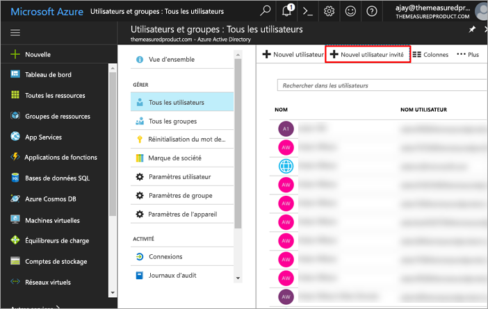
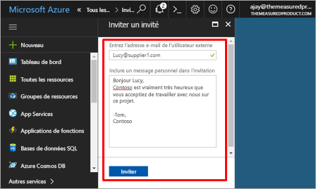
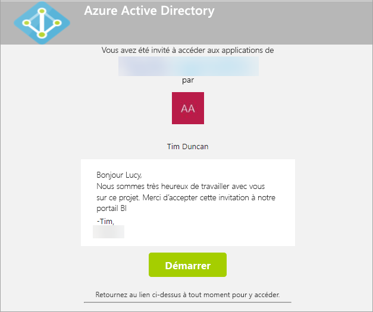
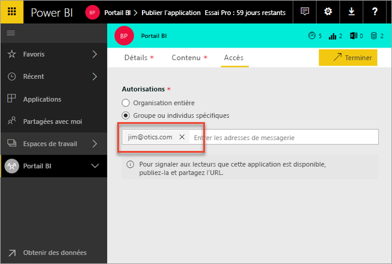
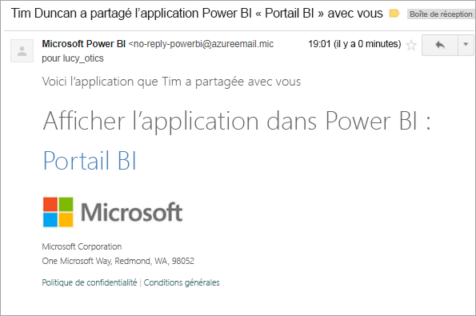

# Distribuer du contenu Power BI à des utilisateurs invités externes avec Azure AD B2B

Power BI s’intègre avec Azure Active Directory B2B (Azure AD B2B) pour permettre une distribution sécurisée de contenu Power BI à des utilisateurs invités extérieurs à l’organisation, tout en conservant le contrôle des données internes.

> [!VIDEO https://www.youtube.com/embed/xxQWEQ1NnlY]

> [!NOTE]
> Cette fonctionnalité n’est pas disponible actuellement avec les applications mobiles Power BI. Sur un appareil mobile, vous pouvez afficher le contenu Power BI partagé à l’aide d’Azure AD B2B dans un navigateur. 

## Inviter des utilisateurs

Il existe deux façons d’inviter des utilisateurs à rejoindre votre client Power BI : l’invitation planifiée ou l’invitation ad hoc. Une invitation n’est nécessaire que la première fois que vous invitez un utilisateur externe à rejoindre votre organisation.

### Invitations planifiées

Une invitation planifiée s’effectue via le portail Microsoft Azure dans Azure AD ou à l’aide de PowerShell. Il s’agit de l’option à utiliser si vous savez quels utilisateurs doivent être invités. 

**Pour pouvoir créer des utilisateurs invités dans le portail Azure AD, vous devez être administrateur de clients.**

1. Accédez au [portail Azure](https://portal.azure.com), puis sélectionnez **Azure Active Directory**.

2. Accédez à **Utilisateurs et groupes** > **Tous les utilisateurs** > **Nouvel utilisateur invité**.

    

3. Entrez l’**adresse e-mail** et un **message personnel**.

    

4. Sélectionnez **Inviter**.

Pour inviter plus d’un utilisateur, utilisez PowerShell. Pour plus d’informations, voir [Code Azure Active Directory B2B Collaboration et exemples PowerShell](https://docs.microsoft.com/azure/active-directory/active-directory-b2b-code-samples).

L’utilisateur invité doit sélectionner **Mise en route** dans l’e-mail d’invitation qu’il reçoit. L’utilisateur invité est ensuite ajouté au client.

### Invitations ad hoc

Pour inviter un utilisateur externe à un moment quelconque, ajoutez-le à la liste d’accès d’une application lors de publication de celle-ci.

L’utilisateur invité reçoit un e-mail l’informant que l’application a été partagée avec lui.

L’utilisateur invité doit se connecter en utilisant l’adresse e-mail de son organisation. Une fois connecté, il est invité à accepter l’invitation. Ensuite, il est redirigé vers le contenu de l’application. Pour revenir à l’application, marquez le lien à l’aide d’un signet, ou enregistrez l’e-mail.

## Gestion des licences

L’utilisateur invité doit disposer de la licence appropriée pour afficher l’application partagée. Trois options le permettent.

### Utiliser Power BI Premium

L’affectation de l’espace de travail de l’application à la capacité Power BI Premium permet à l’utilisateur invité d’utiliser l’application sans disposer d’une licence Power BI Pro. Power BI Premium permet également à des applications de tirer parti d’autres capacités, telles que des fréquences de rafraîchissement accrues, une capacité dédiée et des tailles de modèle importantes.

### Affecter une licence Power BI Pro à un utilisateur invité

L’affectation d’une licence Power BI Pro à l’utilisateur invité à l’intérieur de votre client permet à cet utilisateur d’afficher le contenu.

> [!NOTE]
> Une licence Power BI Pro provenant de votre client s’applique aux utilisateurs invités uniquement quand ceux-ci accèdent à du contenu à l’intérieur de votre client.

### Utilisateur invité apportant sa propre licence Power BI Pro

L’utilisateur invité dispose déjà d’une licence Power BI Pro assignée à l’intérieur de son client.

## Limites

* Les invités B2B externes peuvent uniquement consommer le contenu. Les invités B2B externes peuvent consulter les applications, les tableaux de bord, les rapports, exporter des données et créer des abonnements par courrier pour les tableaux de bord et les rapports. Ils ne peuvent pas accéder aux espaces de travail ou publier leur propre contenu.
* Cette fonctionnalité n’est pas disponible actuellement avec les applications mobiles Power BI. Sur un appareil mobile, vous pouvez afficher le contenu Power BI partagé à l’aide d’Azure AD B2B dans un navigateur.
* Le recours aux utilisateurs invités avec Power BI n’est pas pris en charge au sein des clouds souverains (administration).

## Étapes suivantes

Pour des informations plus détaillées, notamment sur la manière dont fonctionne la sécurité au niveau des lignes, voir le [livre blanc](https://aka.ms/powerbi-b2b-whitepaper).

Pour plus d’informations sur Azure Active Directory B2B, voir [Qu’est-ce qu’Azure AD B2B Collaboration](https://docs.microsoft.com/azure/active-directory/active-directory-b2b-what-is-azure-ad-b2b).