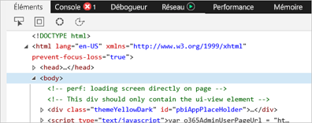
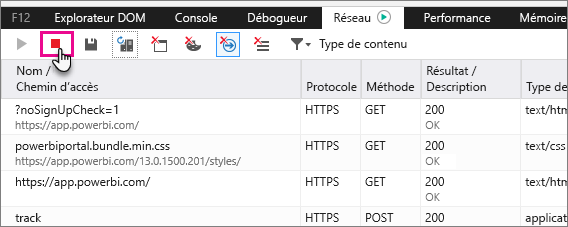
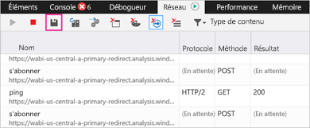

# Capture d’informations de diagnostic supplémentaires
## Capture d’informations de diagnostic supplémentaires pour Power BI
Ces instructions décrivent deux options qui permettent de collecter manuellement des informations de diagnostic supplémentaires à partir du client web Power BI.  Vous ne devez suivre qu’une seule de ces options.

## Capture réseau - Edge et Internet Explorer
1. Accédez à [Power BI](https://app.powerbi.com) avec Edge ou Internet Explorer.
2. Ouvrez les outils de développement Edge en appuyant sur F12.
3. La fenêtre Outils de développement s’affiche : 
   
   
4. Basculez vers l’onglet Réseau. Il répertorie le trafic capturé. 
   
   
5. Vous pouvez parcourir la fenêtre et reproduire les problèmes que vous pouvez rencontrer. Vous pouvez masquer ou afficher la fenêtre Outils de développement à tout moment pendant la session en appuyant sur F12.
6. Pour arrêter la capture, il vous suffit de sélectionner le carré rouge sous l’onglet Réseau de la zone d’outils de développement.
   
   
7. Sélectionnez l’icône en forme de disquette pour **Exporter en tant que HAR**
   
   
8. Entrez un nom de fichier, puis enregistrez le fichier HAR.
   
    Ce dernier contient toutes les informations sur les demandes réseau entre la fenêtre du navigateur et Power BI.  Sont inclus les ID d’activités pour chaque demande, l’horodatage précis de chaque demande et les éventuelles informations d’erreur retournées au client.  Ce suivi contient également les données utilisées pour renseigner les éléments visuels affichés à l’écran.
9. Vous pouvez fournir le fichier HAR à prendre en charge pour la révision.

D’autres questions ? [Essayez d’interroger la communauté Power BI](http://community.powerbi.com/)

