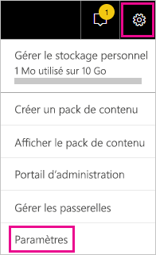
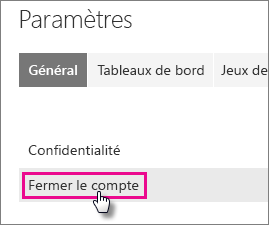
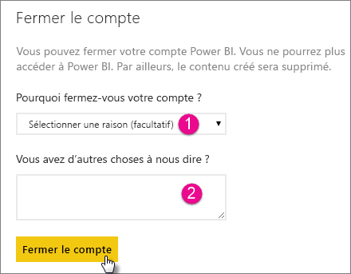
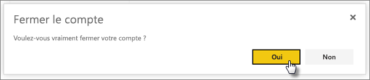

# Fermeture de votre compte Power BI

Si vous ne souhaitez plus utiliser Power BI, vous pouvez fermer votre compte Power BI.  Une fois votre compte fermé, vous ne pourrez plus vous connecter à Power BI. Toutes les données client que vous avez chargées ou créées dans Power BI sont supprimées, conformément à la stratégie de rétention des données qui figure dans les conditions d’utilisation de Power BI.

## Utilisateurs Power BI individuels

Si vous vous êtes inscrit à Power BI en tant que particulier, vous pouvez fermer votre compte à partir de l’écran **Paramètres**.

1. Dans Power BI, sélectionnez l’engrenage en haut à droite, puis **Paramètres**.

    

1. Dans l’onglet **Général**, sélectionnez **Fermer le compte**.

    

1. Sélectionnez un motif pour la fermeture du compte (1). Vous pouvez éventuellement fournir des informations supplémentaires (2). Sélectionnez ensuite **Fermer le compte**.

    

1. Confirmez que vous voulez fermer votre compte.

    

    Une confirmation de la fermeture de votre compte devrait s’afficher. Vous pouvez rouvrir votre compte à partir d’ici si nécessaire.

    

## Utilisateurs de client gérés

Si votre organisation vous a inscrit à Power BI, contactez votre administrateur client. Demandez-lui de supprimer la licence de votre compte.

D’autres questions ? [Essayez d’interroger la communauté Power BI](http://community.powerbi.com/)