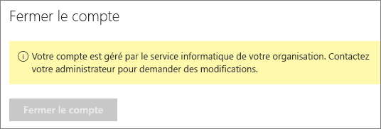

# Fermer votre compte Power BI

Si vous ne souhaitez plus utiliser Power BI, vous pouvez fermer votre compte Power BI.  Une fois que vous fermez votre compte, vous ne peut pas se connecter à Power BI. En outre, comme indiqué dans la stratégie de rétention de données dans les termes du contrat de Service Power BI, Power BI supprime toutes les données client vous avez chargé ou créé. Elle n’est pas conservée.

## Utilisateurs Power BI individuels

Si vous vous êtes inscrit à Power BI en tant que particulier, vous pouvez fermer votre compte à partir de l’écran **Paramètres**.

1. Dans Power BI, sélectionnez l’engrenage en haut à droite, puis **Paramètres**.

    

1. Dans l’onglet **Général**, sélectionnez **Fermer le compte**.

    

1. Sélectionnez un motif pour la fermeture du compte (1). Vous pouvez éventuellement fournir des informations supplémentaires (2). Sélectionnez ensuite **Fermer le compte**.

    

1. Confirmez que vous voulez fermer votre compte.

    

    Vous devez voir une confirmation que votre compte est clôturé par Power BI. Vous pouvez rouvrir votre compte à partir d’ici si nécessaire.

    

## Utilisateurs de client gérés

Si votre organisation vous a inscrit à Power BI, contactez votre administrateur client. Demandez-lui de supprimer la licence de votre compte.

D’autres questions ? [Essayez d’interroger la communauté Power BI](http://community.powerbi.com/)