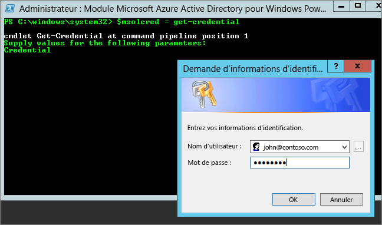

# <a name="administering-power-bi---frequently-asked-questions-faq"></a>Administration de Power BI - Forum Aux Questions (FAQ)

Cet article répond aux questions fréquemment posées concernant l’administration de Power BI. Pour une vue d’ensemble de l’administration de Power BI, consultez [Présentation de l’administration de Power BI](service-admin-administering-power-bi-in-your-organization.md).

## <a name="whats-in-this-article"></a>Que contient cet article ?

### <a name="sign-up-for-power-bi-section"></a>S’inscrire à la section Power BI

* [Avec PowerShell](#using-powershell)
* [Comment les utilisateurs peuvent-ils s’inscrire à Power BI ?](#how-do-users-sign-up-for-power-bi)
* [Comment les utilisateurs individuels de mon organisation peuvent-ils s’inscrire ?](#how-do-individual-users-in-my-organization-sign-up)
* [Comment empêcher les utilisateurs de rejoindre mon locataire Office 365 existant ?](#how-can-i-prevent-users-from-joining-my-existing-office-365-tenant)
* [Comment puis-je permettre aux utilisateurs de s’associer à mon locataire Office 365 existant ?](#how-can-i-allow-users-to-join-my-existing-office-365-tenant)
* [Comment vérifier que le blocage est activé dans le locataire ?](#how-do-i-verify-if-i-have-the-block-on-in-the-tenant)
* [Comment empêcher les utilisateurs existants d’utiliser Power BI ?](#how-can-i-prevent-my-existing-users-from-starting-to-use-power-bi)
* [Comment puis-je autoriser mes utilisateurs existants à s’inscrire à Power BI ?](#how-can-i-allow-my-existing-users-to-sign-up-for-power-bi)

### <a name="administration-of-power-bi-section"></a>Administration de la section Power BI

* [Quelles seront les conséquences sur ma méthode actuelle de gestion des identités pour les utilisateurs de mon organisation ?](#how-will-this-change-the-way-i-manage-identities-for-users-in-my-organization-today)
* [Comment faire pour gérer Power BI ?](#how-do-we-manage-power-bi)
* [Quelle est la procédure à suivre pour gérer un locataire créé par Microsoft pour mes utilisateurs ?](#what-is-the-process-to-manage-a-tenant-created-by-microsoft-for-my-users)
* [Si j’utilise plusieurs domaines, puis-je contrôler le locataire Office 365 auquel sont ajoutés les utilisateurs ?](#if-i-have-multiple-domains-can-i-control-the-office-365-tenant-that-users-are-added-to)
* [Comment supprimer Power BI pour les utilisateurs déjà inscrits ?](#how-do-i-remove-power-bi-for-users-that-already-signed-up)
* [Comment connaître la date à laquelle les nouveaux utilisateurs ont rejoint mon locataire ?](#how-do-i-know-when-new-users-have-joined-my-tenant)
* [Quels sont les éventuels autres aspects auxquels je dois être préparé ?](#are-there-any-additional-things-i-should-be-prepared-for)
* [Où est situé mon locataire Power BI ?](#where-is-my-power-bi-tenant-located)
* [Présentation du contrat SAL Power BI](#what-is-the-power-bi-sla)

### <a name="security-in-power-bi-section"></a>Sécurité dans la section Power BI

* [Power BI répond-il aux exigences de conformité nationales, régionales et sectorielles ?](#does-power-bi-meet-national-regional-and-industry-specific-compliance-requirements)
* [Comment fonctionne la sécurité dans Power BI ?](#how-does-security-work-in-power-bi)

## <a name="sign-up-for-power-bi"></a>S’inscrire à Power BI

### <a name="using-powershell"></a>Avec PowerShell

Certaines procédures de cette section nécessitent des scripts Windows PowerShell. Si vous n’êtes pas familiarisé avec PowerShell, nous vous recommandons le [guide de prise en main de PowerShell](http://go.microsoft.com/fwlink/p/?LinkID=286814). Pour exécuter les scripts, commencez par installer la dernière version 64 bits d’[Azure Active Directory PowerShell for Graph](/powershell/azure/active-directory/).

### <a name="how-do-users-sign-up-for-power-bi"></a>Comment les utilisateurs peuvent-ils s’inscrire à Power BI ?

En tant qu’administrateur, vous pouvez vous inscrire à Power BI sur le [site web de Power BI](https://powerbi.microsoft.com) ou à la page [Acheter des services](https://admin.microsoft.com/AdminPortal/Home#/catalog) du centre d’administration Office 365. Quand un administrateur s’inscrit à Power BI, il peut attribuer des licences aux utilisateurs autorisés.

En outre, les utilisateurs de votre organisation peuvent s’inscrire à Power BI sur le [site web de Power BI](https://powerbi.microsoft.com). Quand un utilisateur de votre organisation s’inscrit à Power BI, il reçoit automatiquement une licence Power BI. Pour plus d’informations, consultez [Inscription à Power BI en tant que particulier](service-self-service-signup-for-power-bi.md) et [Gestion des licences Power BI dans votre organisation](service-admin-licensing-organization.md).

### <a name="how-do-individual-users-in-my-organization-sign-up"></a>Comment les utilisateurs individuels de mon organisation peuvent-ils s’inscrire ?

Trois scénarios peuvent s’appliquer aux utilisateurs de votre organisation :

* **Scénario 1** : votre organisation possède déjà un environnement Office 365 et l’utilisateur qui s’inscrit à Power BI a déjà un compte Office 365.
    Dans ce scénario, si un utilisateur possède déjà un compte professionnel ou scolaire dans le client (par exemple, contoso.com) mais n’a pas encore Power BI, Microsoft active simplement l’offre pour ce compte et l’utilisateur est automatiquement informé sur la manière d’utiliser le service Power BI.

* **Scénario 2** : votre organisation possède un environnement Office 365, mais l’utilisateur qui s’inscrit à Power BI n’a pas de compte Office 365.
    Dans ce scénario, l’utilisateur possède une adresse de messagerie appartenant au domaine de votre organisation (par exemple, contoso.com), mais il ne possède pas encore de compte Office 365. Dans ce cas, l’utilisateur peut s’inscrire à Power BI et reçoit automatiquement un compte. Il peut ainsi accéder au service Power BI. Par exemple, si une employée nommée Nancy utilise son adresse e-mail professionnelle (par exemple, nancy@contoso.com) pour s’inscrire, Microsoft ajoute automatiquement Nancy en tant qu’utilisateur dans l’environnement Office 365 de Contoso et active Power BI pour son compte.

* **Scénario 3** : votre organisation n’a pas d’environnement Office 365 connecté à votre domaine de courrier.
    Il n’est pas nécessaire que votre organisation prenne une action administrative pour utiliser Power BI. Les utilisateurs sont ajoutés à un nouveau répertoire utilisateur situé dans le cloud et vous avez la possibilité de devenir l’administrateur client et de gérer les utilisateurs.

> [!IMPORTANT]
> Si votre organisation possède plusieurs domaines de messagerie et si vous préférez que toutes les extensions d’adresse de messagerie appartiennent au même client, ajoutez tous les domaines d’adresse de messagerie à un client Azure Active Directory avant que des utilisateurs ne s’inscrivent. Il n’existe aucun mécanisme automatique permettant de déplacer des utilisateurs d’un client à l’autre une fois ceux-ci créés. Pour plus d’informations sur ce processus, consultez [Si j’utilise plusieurs domaines, puis-je contrôler le client Office 365 auquel sont ajoutés les utilisateurs ?](#if-i-have-multiple-domains-can-i-control-the-office-365-tenant-that-users-are-added-to) plus loin dans cet article et [Ajouter un domaine à Office 365](/office365/admin/setup/add-domain/).

### <a name="how-can-i-prevent-users-from-joining-my-existing-office-365-tenant"></a>Comment empêcher les utilisateurs de rejoindre mon client Office 365 existant ?

En tant qu’administrateur, vous disposez de plusieurs moyens pour empêcher les utilisateurs de s’associer à votre client Office 365 existant. Si vous bloquez l’accès, les tentatives d’inscription des utilisateurs échouent et ils sont priés de contacter l’administrateur de leur entreprise. Il est inutile de répéter ce processus si vous avez déjà désactivé la distribution automatique des licences (par exemple, via Office 365 Éducation pour les étudiants, les enseignants et le personnel).

Utilisez le script PowerShell suivant pour empêcher les nouveaux utilisateurs de s’associer à un client géré. [En savoir plus sur PowerShell](#basic-powershell-information)

```powershell
$msolcred = get-credential
connect-msolservice -credential $msolcred

Set-MsolCompanySettings -AllowEmailVerifiedUsers $false
```

> [!NOTE]
> Le blocage de l’accès empêche les nouveaux utilisateurs de votre organisation de s’inscrire à Power BI. Les utilisateurs qui s’inscrivent à Power BI avant la désactivation des nouvelles inscriptions conservent leurs licences. Pour supprimer un utilisateur, consultez [Comment supprimer Power BI pour les utilisateurs déjà inscrits ?](#how-do-i-remove-power-bi-for-users-that-already-signed-up) plus loin dans cet article.

### <a name="how-can-i-allow-users-to-join-my-existing-office-365-tenant"></a>Comment puis-je permettre aux utilisateurs de s’associer à mon client Office 365 existant ?

Utilisez le script PowerShell suivant pour permettre aux nouveaux utilisateurs de s’associer à un client géré. [En savoir plus sur PowerShell](#basic-powershell-information)

```powershell
$msolcred = get-credential
connect-msolservice -credential $msolcred

Set-MsolCompanySettings -AllowEmailVerifiedUsers $true
```

### <a name="how-do-i-verify-if-i-have-the-block-on-in-the-tenant"></a>Comment vérifier que le blocage est activé dans le client ?

Utilisez le script PowerShell suivant pour vérifier les paramètres. *AllowEmailVerifiedUsers* doit avoir la valeur False. [En savoir plus sur PowerShell](#basic-powershell-information)

```powershell
$msolcred = get-credential
connect-msolservice -credential $msolcred

Get-MsolCompanyInformation | fl allow*
```

### <a name="how-can-i-prevent-my-existing-users-from-starting-to-use-power-bi"></a>Comment empêcher les utilisateurs existants d’utiliser Power BI ?

Le paramètre Azure AD qui contrôle cette option est **AllowAdHocSubscriptions**. Chez la plupart des clients, ce paramètre est configuré sur True. Cela signifie qu’il est activé. Si vous avez acquis Power BI via un partenaire, ce paramètre peut être configuré sur False, ce qui signifie qu’il est désactivé.

Utilisez le script PowerShell suivant pour désactiver les abonnements ad hoc. [En savoir plus sur PowerShell](#basic-powershell-information)

1. Connectez-vous à Azure Active Directory avec vos informations d’identification Office 365. La première ligne du script PowerShell suivant vous invite à entrer vos informations d’identification. La deuxième ligne établit la connexion à Azure Active Directory.

    ```powershell
     $msolcred = get-credential
     connect-msolservice -credential $msolcred
    ```

   

1. Une fois connecté, exécutez la commande suivante pour voir comment votre locataire est actuellement configuré.

    ```powershell
     Get-MsolCompanyInformation | fl AllowAdHocSubscriptions
    ```
1. Exécutez la commande suivante pour activer ($true) ou désactiver ($false) **AllowAdHocSubscriptions**.

    ```powershell
     Set-MsolCompanySettings -AllowAdHocSubscriptions $false
    ```

> [!NOTE]
> L’indicateur AllowAdHocSubscriptions permet de contrôler plusieurs fonctionnalités d’utilisateur dans votre organisation, notamment la possibilité pour les utilisateurs de s’inscrire au service Azure Rights Management. La modification de cet indicateur affecte toutes ces fonctionnalités.

### <a name="how-can-i-allow-my-existing-users-to-sign-up-for-power-bi"></a>Comment puis-je autoriser mes utilisateurs existants à s’inscrire à Power BI ?

Pour permettre aux utilisateurs existants de s’inscrire à Power BI, exécutez la commande indiquée dans la section précédente, mais passez la valeur True au lieu de la valeur False à la dernière étape.

## <a name="administration-of-power-bi"></a>Administration de Power BI

### <a name="how-will-this-change-the-way-i-manage-identities-for-users-in-my-organization-today"></a>Quelles seront les conséquences sur ma méthode actuelle de gestion des identités pour les utilisateurs de mon organisation ?

Trois scénarios peuvent s’appliquer aux utilisateurs de votre organisation :

* **Scénario 1** : si votre organisation possède déjà un environnement Office 365 et que tous les utilisateurs de votre organisation ont des comptes Office 365, la manière dont vous gérez les identités n’est pas modifiée.

* **Scénario 2** : si votre organisation possède déjà un environnement Office 365, mais que tous les utilisateurs n’ont pas de compte Office 365, Microsoft crée un utilisateur dans le client et attribue des licences en fonction de l’adresse e-mail professionnelle ou scolaire de l’utilisateur.

    Cela signifie que le nombre d’utilisateurs que vous gérez à un moment donné augmente à mesure que les utilisateurs de votre entreprise s’inscrivent au service.

* **Scénario 3** : si l’entreprise ne dispose pas d’un environnement Office 365 connecté à votre domaine de courrier, la manière dont vous gérez les identités n’est pas modifiée.

    Les utilisateurs sont ajoutés à un nouveau répertoire utilisateur situé dans le cloud et vous avez la possibilité de devenir l’administrateur client et de gérer les utilisateurs.

### <a name="how-do-we-manage-power-bi"></a>Comment faire pour gérer Power BI ?

Power BI fournit un portail d’administration qui permet d’afficher les statistiques d’utilisation. Il fournit également un lien vers le Centre d’administration Office 365 qui permet de gérer les utilisateurs et les groupes, ainsi que de contrôler les paramètres au niveau du client.

Pour accéder au portail d’administration Power BI, votre compte doit être un compte d’**Administrateur global** dans Office 365 ou Azure Active Directory, ou le rôle d’Administrateur de Service Power BI doit lui avoir été assigné. Pour plus d’informations, consultez [Présentation du rôle d’administrateur Power BI](service-admin-role.md) et [Portail d’administration Power BI](service-admin-portal.md).

### <a name="what-is-the-process-to-manage-a-tenant-created-by-microsoft-for-my-users"></a>Quel est la procédure à suivre pour gérer un client créé par Microsoft pour mes utilisateurs ?

Lorsqu’un utilisateur libre-service s’inscrit à un service cloud qui utilise Azure AD, il est ajouté à un annuaire Azure AD non managé basé sur son domaine de messagerie. Vous pouvez revendiquer et gérer le locataire qui a été créé à l’aide d’un processus appelé *prise de contrôle par l’administrateur*. Le type de prise de contrôle varie selon qu’il existe ou non un locataire managé associé à votre domaine :

* Utilisez une *prise de contrôle interne* afin de créer un nouveau client managé pour le domaine.

* Utilisez une *prise de contrôle externe* pour déplacer le domaine vers un locataire managé existant.

Pour plus d’informations, consultez [Prise de contrôle d’un annuaire non managé en tant qu’administrateur dans Azure Active Directory](/azure/active-directory/users-groups-roles/domains-admin-takeover).

Lorsque vous effectuez une prise de contrôle externe, le contenu Power BI qui a été créé avant la prise de contrôle est placé dans un [espace de travail archivé Power BI](service-admin-power-bi-archived-workspace.md). Vous devez migrer manuellement le contenu que vous souhaitez utiliser dans le nouveau locataire.

### <a name="if-i-have-multiple-domains-can-i-control-the-office-365-tenant-that-users-are-added-to"></a>Si j’utilise plusieurs domaines, puis-je contrôler le client Office 365 auquel sont ajoutés les utilisateurs ?

Si vous ne faites rien, un locataire est créé pour chaque domaine et sous-domaine de courrier de l’utilisateur. Si vous voulez que tous les utilisateurs se trouvent dans le même client indépendamment des extensions de leurs adresses e-mail, créez un client cible au préalable, ou utilisez un client existant, puis ajoutez tous les domaines et sous-domaines existants que vous voulez consolider au sein de ce client. Tous les utilisateurs dont les adresses e-mail se terminent par ces domaines et sous-domaines sont alors automatiquement associés au locataire cible lorsqu’ils se connectent.

> [!IMPORTANT]
> Il n’existe aucun mécanisme automatique permettant de déplacer des utilisateurs d’un client à l’autre une fois ceux-ci créés. Pour en savoir plus sur l’ajout de domaines à un seul client Office 365, consultez [Vérifier votre domaine dans Office 365, configurer des domaines](/office365/admin/setup/add-domain/).

### <a name="how-do-i-remove-power-bi-for-users-that-already-signed-up"></a>Comment supprimer Power BI pour les utilisateurs déjà inscrits ?

Si vous ne voulez pas qu’un utilisateur déjà inscrit à Power BI puisse accéder à ce service, vous pouvez supprimer sa licence Power BI.

1. Accédez au [Centre d’administration Office 365](https://admin.microsoft.com/AdminPortal/Home#/homepage).

1. Dans la barre de navigation de gauche, sélectionnez **Utilisateurs** > **Utilisateurs actifs**.

1. Recherchez l’utilisateur dont vous voulez supprimer la licence, puis sélectionnez son nom.

    Vous pouvez également effectuer une gestion en bloc des licences utilisateurs. Pour ce faire, sélectionnez plusieurs utilisateurs, puis sélectionnez **Modifier les licences de produits**.

1. À la page de détails de l’utilisateur, à côté de **Licences de produits** et sélectionnez **Modifier**.

1. Définissez la case **Power BI (gratuit)** ou **Power BI Pro** sur **Désactivé**, selon la licence appliquée à son compte.

1. Sélectionnez **Enregistrer**.

### <a name="how-do-i-know-when-new-users-have-joined-my-tenant"></a>Comment connaître la date à laquelle les nouveaux utilisateurs ont rejoint mon client ?

Les utilisateurs qui ont rejoint votre client dans le cadre de ce programme se voient attribuer une licence unique, que vous pouvez filtrer dans votre volet d’utilisateur actif dans le tableau de bord d’administration. Pour créer cette nouvelle vue, procédez comme suit.

1. Accédez au [Centre d’administration Office 365](https://admin.microsoft.com/AdminPortal/Home#/homepage).

1. Dans la barre de navigation de gauche, sélectionnez **Utilisateurs** > **Utilisateurs actifs**.

1. Dans le menu **Vues**, sélectionnez **Ajouter un affichage personnalisé**.

1. Nommez votre nouvelle vue, puis, sous **Licence produit attribuée**, sélectionnez **Power BI (gratuit)** ou **Power BI Pro**.

    Vous ne pouvez sélectionner qu’une seule licence par vue. Si votre organisation a à la fois des licences **Power BI (gratuit)** et des licences **Power BI Pro**, vous devrez créer deux vues.

1. Entrez d’autres conditions de votre choix, puis sélectionnez **Ajouter**.

1. Une fois la nouvelle vue créée, elle est disponible à partir du menu **Vues**.

### <a name="are-there-any-additional-things-i-should-be-prepared-for"></a>Quels sont les éventuels autres aspects auxquels je dois être préparé ?

Vous pouvez avoir à gérer une augmentation des demandes de réinitialisation de mot de passe. Pour plus d’informations sur ce processus, consultez [Réinitialiser le mot de passe d’un utilisateur dans Office 365](/office365/admin/add-users/reset-passwords).

Vous pouvez supprimer un utilisateur de votre client en suivant le processus standard dans le Centre d’administration Office 365. Cependant, si l’utilisateur a toujours une adresse e-mail active au sein de votre organisation, il peut s’associer au client, sauf si vous empêchez tous les utilisateurs de le faire.

### <a name="where-is-my-power-bi-tenant-located"></a>Où est situé mon client Power BI ?

Pour plus d’informations sur la région de données où se trouve votre client Power BI, consultez [Où est situé mon locataire Power BI ?](service-admin-where-is-my-tenant-located.md).

### <a name="what-is-the-power-bi-sla"></a>Présentation du contrat SLA Power BI

Pour plus d’informations sur le contrat de niveau de service Power BI, consultez les [termes du contrat de licence et la documentation](http://www.microsoftvolumelicensing.com/DocumentSearch.aspx?Mode=3&DocumentTypeId=37) dans la section **Gestion des licences** du site web Microsoft Licensing.

## <a name="security-in-power-bi"></a>Sécurité dans Power BI

### <a name="does-power-bi-meet-national-regional-and-industry-specific-compliance-requirements"></a>Power BI répond-il aux exigences de conformité nationales, régionales et sectorielles ?

Pour plus d’informations sur la conformité Power BI, consultez le [Centre de gestion de la confidentialité Microsoft](https://www.microsoft.com/en-us/TrustCenter/CloudServices/business-application-platform/default.aspx).

### <a name="how-does-security-work-in-power-bi"></a>Comment fonctionne la sécurité dans Power BI ?

Power BI repose sur les bases d’Office 365, qui lui-même repose sur des services Azure comme Azure Active Directory. Pour obtenir une vue d’ensemble de l’architecture de Power BI, consultez [Sécurité de Power BI](service-admin-power-bi-security.md).

## <a name="next-steps"></a>Étapes suivantes

[Portail d’administration Power BI](service-admin-portal.md)  
[Présentation du rôle d’administrateur Power BI](service-admin-role.md)  
[Inscription en libre-service à Power BI](service-self-service-signup-for-power-bi.md)  
[Achat de Power BI Pro](service-admin-purchasing-power-bi-pro.md)  
[Qu’est-ce que Power BI Premium ?](service-premium.md)  
[Acheter Power BI Premium](service-admin-premium-purchase.md)  
[Livre blanc sur Power BI Premium](https://aka.ms/pbipremiumwhitepaper)  
[Gérer votre groupe dans Power BI et Office 365](service-manage-app-workspace-in-power-bi-and-office-365.md)  
[Gestion des comptes utilisateur (Office 365)](/office365/servicedescriptions/office-365-platform-service-description/user-account-management/)  
[Gestion des groupes Office 365](/office365/admin/email/create-edit-or-delete-a-security-group/)  

D’autres questions ? [Essayez d’interroger la communauté Power BI](http://community.powerbi.com/)
